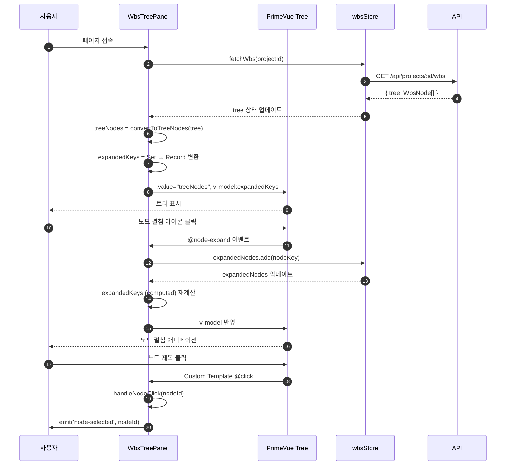
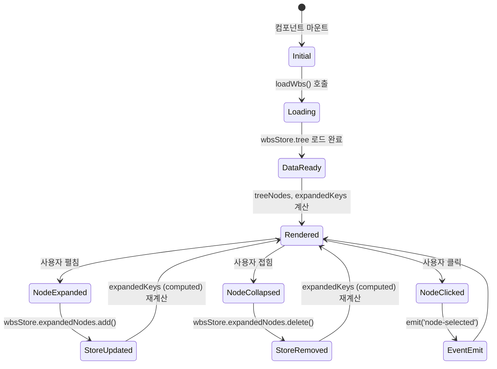

# 상세설계 (020-detail-design.md)

**Template Version:** 3.0.0 — **Last Updated:** 2025-12-16

> **설계 규칙**
> * 기능 중심 설계에 집중
> * 실제 소스코드 포함 금지
> * PRD/TRD/기본설계와 일관성 유지
>
> **분할 문서**
> * 요구사항 추적성: `025-traceability-matrix.md`
> * 테스트 명세: `026-test-specification.md`

---

## 0. 문서 메타데이터

| 항목 | 내용 |
|------|------|
| Task ID | TSK-08-01 |
| Task명 | WbsTreePanel PrimeVue Tree Migration |
| Category | development |
| 상태 | [dd] 상세설계 |
| 작성일 | 2025-12-16 |
| 작성자 | Claude Opus 4.5 |

### 상위 문서 참조

| 문서 유형 | 경로 | 참조 섹션 |
|----------|------|----------|
| PRD | `.orchay/orchay/prd.md` | 섹션 6.2 (WBS 트리 패널) |
| TRD | `.orchay/orchay/trd.md` | PrimeVue 4.x 통합 |
| 기본설계 | `010-basic-design.md` | 전체 |
| 화면설계 | `011-ui-design.md` | 전체 |
| 상위 Work Package | WP-08: PrimeVue 4.x Migration | - |

### 분할 문서 참조

| 문서 유형 | 파일명 | 목적 |
|----------|--------|------|
| 추적성 매트릭스 | `025-traceability-matrix.md` | 요구사항 ↔ 설계 ↔ 테스트 추적 |
| 테스트 명세 | `026-test-specification.md` | 테스트 시나리오, 데이터, data-testid |

---

## 1. 일관성 검증 결과

### 1.1 검증 요약

| 구분 | 통과 | 경고 | 실패 |
|------|------|------|------|
| PRD ↔ 기본설계 | 7개 | 0개 | 0개 |
| 기본설계 ↔ 상세설계 | 10개 | 0개 | 0개 |
| 화면설계 ↔ 상세설계 | 5개 | 0개 | 0개 |
| TRD ↔ 상세설계 | 5개 | 0개 | 0개 |

### 1.2 검증 상세

| 검증 ID | 검증 항목 | 결과 | 비고 |
|---------|----------|------|------|
| CHK-PRD-01 | 기능 요구사항 완전성 | ✅ PASS | FR-001~FR-007 모두 반영 |
| CHK-PRD-02 | 비즈니스 규칙 일치성 | ✅ PASS | 비즈니스 규칙 없음 |
| CHK-PRD-03 | 용어 일관성 | ✅ PASS | WbsNode, TreeNode 용어 일치 |
| CHK-BD-01 | 기능 요구사항 완전성 | ✅ PASS | 모든 FR 구현 방법 명시 |
| CHK-BD-02 | 데이터 모델 일치성 | ✅ PASS | WbsNode → TreeNode 매핑 정확 |
| CHK-BD-03 | 인터페이스 일치성 | ✅ PASS | PrimeVue Tree API 매핑 정확 |
| CHK-BD-04 | 화면 일치성 | ✅ PASS | 컴포넌트 구조 일치 |
| CHK-BD-05 | 수용 기준 구현 가능성 | ✅ PASS | AC-01~AC-10 테스트케이스 변환 완료 |
| CHK-UI-01 | 화면 레이아웃 일치성 | ✅ PASS | 기본설계 요구사항과 일치 |
| CHK-UI-02 | 컴포넌트 매핑 완전성 | ✅ PASS | NodeIcon, StatusBadge 매핑 완료 |
| CHK-UI-03 | 상태 정의 완전성 | ✅ PASS | 로딩/에러/빈 상태 모두 정의 |
| CHK-UI-04 | 스타일 일관성 | ✅ PASS | 다크 테마 색상 일치 |
| CHK-UI-05 | 접근성 요구사항 | ✅ PASS | ARIA 속성, 키보드 탐색 포함 |
| CHK-TRD-01 | 기술 스택 준수 | ✅ PASS | Vue 3, PrimeVue 4.x 사용 |
| CHK-TRD-02 | 아키텍처 패턴 준수 | ✅ PASS | Composition API, Pinia 패턴 |
| CHK-TRD-03 | 스타일링 규칙 준수 | ✅ PASS | TailwindCSS + Global CSS 사용 |
| CHK-TRD-04 | 컴포넌트 구조 준수 | ✅ PASS | app/components/wbs/ 경로 |

---

## 2. 목적 및 범위

### 2.1 목적

WbsTreePanel 컴포넌트의 커스텀 트리 렌더링을 PrimeVue Tree 컴포넌트로 교체하여:
- 표준화된 UI 컴포넌트 사용으로 유지보수성 향상
- PrimeVue 접근성 기능 활용 (ARIA, 키보드 탐색)
- 중복 코드 제거 및 코드 간소화
- PrimeVue 디자인 시스템과의 일관성 확보

### 2.2 범위

**포함 범위**:
- WbsNode[] → PrimeVue TreeNode[] 변환 함수 구현
- v-model:expandedKeys 기반 펼침/접힘 상태 동기화
- 커스텀 노드 템플릿 (NodeIcon + StatusBadge) 구현
- wbsStore.expandedNodes와 양방향 동기화 로직
- 기존 E2E 테스트 호환성 유지 (data-testid)
- 다크 테마 스타일 유지

**제외 범위**:
- NodeIcon 컴포넌트 최적화 → TSK-08-02
- AppLayout Splitter 마이그레이션 → TSK-08-03
- WbsTreeHeader 컴포넌트 수정 (현재 작업 범위 아님)
- 검색/필터링 기능 (기존 기능 유지)

---

## 3. 기술 스택

| 구분 | 기술 | 버전 | 용도 |
|------|------|------|------|
| Frontend | Vue 3 + Nuxt 3 | 3.5.x / 3.18.x | Composition API 기반 컴포넌트 |
| UI Framework | PrimeVue | 4.x | Tree 컴포넌트 제공 |
| Styling | TailwindCSS | 3.4.x | 유틸리티 CSS |
| State Management | Pinia | - | wbsStore 상태 관리 |
| Testing | Vitest + Playwright | 2.x / 1.49.x | 단위/E2E 테스트 |

---

## 4. 용어/가정/제약

### 4.1 용어 정의

| 용어 | 정의 |
|------|------|
| WbsNode | 애플리케이션 내부 WBS 노드 타입 (id, type, title, status, children) |
| TreeNode | PrimeVue Tree 컴포넌트 노드 타입 (key, label, data, children) |
| expandedKeys | PrimeVue Tree v-model용 확장 상태 객체 (Record<string, boolean>) |
| expandedNodes | wbsStore의 확장 상태 Set (Set<string>) |
| convertToTreeNodes | WbsNode[] → TreeNode[] 변환 함수 |

### 4.2 가정 (Assumptions)

- wbsStore.tree 데이터는 이미 계층 구조로 로드되어 있음
- wbsStore.expandedNodes는 Set<string> 타입 유지
- NodeIcon, StatusBadge 컴포넌트는 변경 없이 재사용 가능
- PrimeVue Tree 컴포넌트는 기본 ARIA 속성 자동 제공

### 4.3 제약 (Constraints)

- PrimeVue Tree selectionMode는 single만 지원 (현재 요구사항에 충분)
- expandedKeys는 반드시 Record<string, boolean> 타입
- 기존 E2E 테스트 호환을 위해 data-testid 속성 유지 필수
- 성능 기준: 100개 노드 렌더링 < 200ms

---

## 5. 시스템/모듈 구조

### 5.1 모듈 역할 및 책임

| 모듈 | 역할 | 책임 |
|------|------|------|
| WbsTreePanel.vue | 트리 패널 컨테이너 | 데이터 로드, 상태 관리, PrimeVue Tree 통합 |
| convertToTreeNodes() | 데이터 변환 함수 | WbsNode[] → TreeNode[] 재귀 변환 |
| expandedKeys (computed) | 상태 동기화 | Set<string> → Record<string, boolean> 변환 |
| updateExpandedKeys() | 이벤트 핸들러 | Tree 확장/축소 이벤트 → wbsStore 동기화 |
| handleNodeClick() | 이벤트 핸들러 | 노드 클릭 → 'node-selected' 이벤트 발생 |
| wbsStore | 상태 저장소 | tree, expandedNodes, expandAll/collapseAll |

### 5.2 컴포넌트 구조 (개념)

```
WbsTreePanel.vue
├── <script setup>
│   ├── wbsStore (Pinia)
│   ├── treeNodes (computed) ← convertToTreeNodes(tree)
│   ├── expandedKeys (computed) ← Set → Record 변환
│   ├── updateExpandedKeys(event) → wbsStore.expandedNodes 동기화
│   └── handleNodeClick(nodeId) → emit('node-selected')
│
└── <template>
    ├── Loading State (ProgressSpinner)
    ├── Error State (Message + Button)
    └── Content State
        ├── WbsTreeHeader (기존)
        └── PrimeVue Tree
            ├── v-model:expandedKeys
            ├── :value="treeNodes"
            ├── @node-expand="updateExpandedKeys"
            ├── @node-collapse="updateExpandedKeys"
            └── #default slot (Custom Template)
                ├── NodeIcon
                ├── Node Title
                ├── StatusBadge (Task만)
                └── Progress (WP/ACT)
```

### 5.3 외부 의존성

| 의존성 | 유형 | 용도 |
|--------|------|------|
| PrimeVue Tree | UI Library | 트리 구조 렌더링 및 접근성 |
| wbsStore | Pinia Store | WBS 데이터 및 상태 관리 |
| NodeIcon | Component | 노드 타입별 아이콘 표시 |
| StatusBadge | Component | Task 상태 배지 표시 |

---

## 6. 데이터 모델 (개념 수준)

### 6.1 데이터 구조 정의

#### WbsNode (애플리케이션 타입)

| 필드명 | 타입 | 필수 | 설명 | 제약조건 |
|--------|------|------|------|----------|
| id | string | Y | 노드 고유 식별자 | 예: "WP-01", "TSK-01-01" |
| type | 'wp' \| 'act' \| 'task' | Y | 노드 타입 | - |
| title | string | Y | 노드 제목 | - |
| status | string | N | Task 상태 | 예: "[ ]", "[bd]", "[xx]" |
| progress | number | N | 진행률 (0-100) | WP/ACT 전용 |
| children | WbsNode[] | N | 자식 노드 배열 | 재귀 구조 |

#### TreeNode (PrimeVue Tree 타입)

| 필드명 | 타입 | 필수 | 설명 | 제약조건 |
|--------|------|------|------|----------|
| key | string | Y | 노드 키 (= WbsNode.id) | 고유값 |
| label | string | Y | 노드 라벨 (= WbsNode.title) | - |
| data | { node: WbsNode } | Y | 원본 노드 데이터 | 템플릿에서 접근 |
| children | TreeNode[] | N | 자식 노드 배열 | 재귀 구조 |
| icon | string | N | PrimeVue 기본 아이콘 | 사용 안 함 (커스텀 템플릿) |
| style | object | N | 인라인 스타일 | 사용 안 함 (CSS 클래스) |

### 6.2 변환 로직 (개념)

**convertToTreeNodes 함수**:

| 입력 | 처리 | 출력 |
|------|------|------|
| WbsNode[] | 재귀 매핑: key=id, label=title, data={node} | TreeNode[] |
| - | children 존재 시 재귀 호출 | - |
| - | 빈 배열 처리: undefined 반환 | - |

**expandedKeys 변환 로직**:

| 입력 (wbsStore.expandedNodes) | 처리 | 출력 (PrimeVue expandedKeys) |
|------------------------------|------|------------------------------|
| Set<string> | Set을 순회하며 Object 생성 | Record<string, boolean> |
| Set(['WP-01', 'ACT-01-01']) | { 'WP-01': true, 'ACT-01-01': true } | - |

---

## 7. 인터페이스 계약

### 7.1 컴포넌트 Props/Emits

#### WbsTreePanel Props

| Props | 타입 | 필수 | 기본값 | 설명 |
|-------|------|------|--------|------|
| - | - | - | - | Props 없음 (route.query에서 projectId 추출) |

#### WbsTreePanel Emits

| Event | Payload | 설명 | 발생 조건 |
|-------|---------|------|----------|
| node-selected | nodeId: string | 노드 클릭 이벤트 | 커스텀 템플릿 내 @click 트리거 |

### 7.2 PrimeVue Tree Props

| Props | 타입 | 필수 | 값 | 설명 |
|-------|------|------|-----|------|
| :value | TreeNode[] | Y | treeNodes (computed) | 트리 노드 데이터 |
| v-model:expandedKeys | Record<string, boolean> | Y | expandedKeys (computed) | 펼침 상태 |
| selectionMode | string | N | - | 단일 선택 미사용 (커스텀 클릭) |
| :metaKeySelection | boolean | N | false | Ctrl/Cmd 없이 선택 |
| class | string | N | "wbs-tree" | 커스텀 스타일 클래스 |

### 7.3 PrimeVue Tree Events

| Event | Payload | 설명 | 핸들러 |
|-------|---------|------|--------|
| @node-expand | event: { originalEvent, node } | 노드 펼침 시 발생 | updateExpandedKeys() |
| @node-collapse | event: { originalEvent, node } | 노드 접힘 시 발생 | updateExpandedKeys() |

### 7.4 함수 시그니처 (개념)

**convertToTreeNodes**:

| 항목 | 내용 |
|------|------|
| 함수명 | convertToTreeNodes |
| 파라미터 | nodes: WbsNode[] |
| 반환값 | TreeNode[] |
| 책임 | WbsNode 배열을 PrimeVue TreeNode 형식으로 재귀 변환 |

**updateExpandedKeys**:

| 항목 | 내용 |
|------|------|
| 함수명 | updateExpandedKeys |
| 파라미터 | event: { node: TreeNode } |
| 반환값 | void |
| 책임 | PrimeVue Tree 이벤트를 받아 wbsStore.expandedNodes 업데이트 |

**handleNodeClick**:

| 항목 | 내용 |
|------|------|
| 함수명 | handleNodeClick |
| 파라미터 | nodeId: string |
| 반환값 | void |
| 책임 | 노드 클릭 시 'node-selected' 이벤트 발생 |

---

## 8. 프로세스 흐름

### 8.1 데이터 로드 및 초기화

1. **컴포넌트 마운트** [FR-001]: onMounted → loadWbs() 호출
2. **WBS 데이터 로드** [FR-001]: wbsStore.fetchWbs(projectId) 실행
3. **트리 변환** [FR-001]: treeNodes (computed) → convertToTreeNodes(tree) 자동 실행
4. **초기 확장 상태** [FR-002]: expandedKeys (computed) → wbsStore.expandedNodes → Record 변환
5. **PrimeVue Tree 렌더링** [FR-004]: :value="treeNodes", v-model:expandedKeys 바인딩

### 8.2 시퀀스 다이어그램



### 8.3 상태 동기화 흐름



---

## 9. UI 설계

### 9.1 화면 목록

| 화면 | 경로 | 목적 | 주요 기능 |
|------|------|------|----------|
| WBS 트리 패널 | /wbs (쿼리: ?project=xxx) | WBS 계층 구조 표시 | 노드 펼침/접힘, 클릭, 검색 |

### 9.2 WbsTreePanel 레이아웃

```
┌─────────────────────────────────────┐
│ WbsTreePanel (h-full, bg-[#0f0f23]) │
├─────────────────────────────────────┤
│ ┌─────────────────────────────────┐ │
│ │ WbsTreeHeader (고정)             │ │
│ │ - 검색, 펼치기/접기, 요약        │ │
│ └─────────────────────────────────┘ │
│ ┌─────────────────────────────────┐ │
│ │ PrimeVue Tree (flex-1, 스크롤)   │ │
│ │   ┌───────────────────────────┐ │ │
│ │   │ [▼] WP-01: Auth Module    │ │ │
│ │   │   ┌─────────────────────┐ │ │ │
│ │   │   │ [▶] ACT-01-01: ...  │ │ │ │
│ │   │   └─────────────────────┘ │ │ │
│ │   └───────────────────────────┘ │ │
│ └─────────────────────────────────┘ │
└─────────────────────────────────────┘
```

### 9.3 커스텀 노드 템플릿 레이아웃

```
┌───────────────────────────────────────────────────┐
│ [Icon] WP-01: Node Title               40% [Prog] │  ← WP 노드
└───────────────────────────────────────────────────┘

┌───────────────────────────────────────────────────┐
│   [Icon] ACT-01-01: Node Title         75% [Prog] │  ← ACT 노드
└───────────────────────────────────────────────────┘

┌───────────────────────────────────────────────────┐
│     [Icon] TSK-01-01-01: Node Title       [Badge] │  ← Task 노드
└───────────────────────────────────────────────────┘

구성 요소:
1. [Icon] - NodeIcon 컴포넌트 (24x24px)
2. Node Title - "ID: title" 형식 (text-sm)
3. [Badge] - StatusBadge 컴포넌트 (Task만)
4. [Prog] - 진행률 표시 (WP/ACT만)
```

### 9.4 컴포넌트 구조 (개념)

**PrimeVue Tree Props**:

| Prop | 타입 | 설명 |
|------|------|------|
| :value | TreeNode[] | treeNodes (computed) |
| v-model:expandedKeys | Record<string, boolean> | expandedKeys (computed) |
| class | string | "wbs-tree" |

**Custom Template Slot Props**:

| slotProps 필드 | 타입 | 설명 |
|---------------|------|------|
| slotProps.node | TreeNode | 현재 노드 데이터 |
| slotProps.node.key | string | 노드 키 (= id) |
| slotProps.node.label | string | 노드 라벨 (= title) |
| slotProps.node.data.node | WbsNode | 원본 노드 전체 데이터 |

**NodeIcon Props**:

| Prop | 타입 | 설명 |
|------|------|------|
| :type | 'wp' \| 'act' \| 'task' | 노드 타입 |

**StatusBadge Props**:

| Prop | 타입 | 설명 |
|------|------|------|
| :status | string | Task 상태 ("[ ]", "[bd]", ...) |

### 9.5 상태 관리 (개념)

**WbsTreePanel Local State**:

| 상태 | 타입 | 설명 |
|------|------|------|
| treeNodes | computed<TreeNode[]> | convertToTreeNodes(tree) 결과 |
| expandedKeys | computed<Record<string, boolean>> | Set → Record 변환 |

**wbsStore State (Pinia)**:

| 상태 | 타입 | 설명 |
|------|------|------|
| tree | WbsNode[] | 원본 트리 데이터 |
| expandedNodes | Set<string> | 확장된 노드 키 Set |
| loading | boolean | 로딩 상태 |
| error | string \| null | 에러 메시지 |

**wbsStore Actions**:

| Action | 설명 |
|--------|------|
| fetchWbs(projectId) | WBS 데이터 로드 |
| expandAll() | 모든 노드 확장 |
| collapseAll() | 모든 노드 축소 |

### 9.6 테마 변수 매핑 (PRD 10.1 일관성)

> **중요**: 모든 색상은 `main.css`에 정의된 CSS 변수를 참조하여 테마 일관성 유지

**배경 색상 매핑**:

| 용도 | CSS 변수 | HEX 값 | Tailwind 클래스 |
|------|----------|--------|-----------------|
| 패널 배경 | `--color-sidebar` | `#0f0f23` | `bg-bg-sidebar` |
| 카드 배경 | `--color-card` | `#1e1e38` | `bg-bg-card` |
| 호버 상태 | `--color-header` | `#16213e` | `bg-bg-header` |
| 선택 상태 | `--color-primary/20` | `#3b82f6/20%` | `bg-primary/20` |

**텍스트 색상 매핑**:

| 노드 타입 | CSS 변수 | HEX 값 | Tailwind 클래스 |
|----------|----------|--------|-----------------|
| WP (1단계) | `--color-text` | `#e8e8e8` | `text-text` |
| ACT (2단계) | `--color-text-secondary` | `#888888` | `text-text-secondary` |
| Task (3단계) | `--color-text-muted` | `#666666` | `text-text-muted` |

**계층 아이콘 색상 매핑 (PRD 10.1)**:

| 노드 타입 | CSS 변수 | HEX 값 | 용도 |
|----------|----------|--------|------|
| Project | `--color-level-project` | `#8b5cf6` | 프로젝트 아이콘 배경 |
| WP | `--color-level-wp` | `#3b82f6` | Work Package 아이콘 |
| ACT | `--color-level-act` | `#22c55e` | Activity 아이콘 |
| Task | `--color-level-task` | `#f59e0b` | Task 아이콘 |

**상태 색상 매핑**:

| 상태 | CSS 변수 | 배경 클래스 | 텍스트 클래스 |
|------|----------|------------|--------------|
| Todo | `--color-text-muted` | `bg-text-muted/20` | `text-text-secondary` |
| Design (bd/dd) | `--color-primary` | `bg-primary/20` | `text-primary` |
| Implement (im/fx) | `--color-warning` | `bg-warning/20` | `text-warning` |
| Verify | `--color-success` | `bg-success/20` | `text-success` |
| Done | `--color-success` | `bg-success` | `text-white` |

**보더/구분선 매핑**:

| 용도 | CSS 변수 | HEX 값 | Tailwind 클래스 |
|------|----------|--------|-----------------|
| 기본 보더 | `--color-border` | `#3d3d5c` | `border-border` |
| 밝은 보더 | `--color-border-light` | `#4d4d6c` | `border-border-light` |

### 9.7 CSS 클래스 중앙화 원칙

> **핵심 원칙**: 컴포넌트 내 인라인 스타일(`:style`) 및 HEX 하드코딩 금지. 모든 스타일은 `main.css`의 Tailwind 클래스로 중앙 관리.

#### 9.7.1 스타일 관리 전략

**Single Source of Truth**:
```
main.css (CSS 변수 + Tailwind 클래스)
    ↓
tailwind.config.ts (CSS 변수 참조)
    ↓
컴포넌트 (:class 바인딩만 사용)
```

**금지 패턴**:
```vue
<!-- ❌ 금지: 인라인 스타일 -->
:style="{ backgroundColor: '#3b82f6' }"
:style="{ color: getColor() }"

<!-- ❌ 금지: 컴포넌트 내 HEX 하드코딩 -->
const color = '#3b82f6'
```

**권장 패턴**:
```vue
<!-- ✅ 권장: CSS 클래스 바인딩 -->
:class="`node-icon-${type}`"
:class="{ 'workflow-completed': isCompleted }"
```

#### 9.7.2 노드 아이콘 클래스 (NodeIcon)

| 노드 타입 | CSS 클래스 | 스타일 정의 |
|----------|-----------|------------|
| project | `node-icon-project` | `@apply bg-level-project;` |
| wp | `node-icon-wp` | `@apply bg-level-wp;` |
| act | `node-icon-act` | `@apply bg-level-act;` |
| task | `node-icon-task` | `@apply bg-level-task;` |

**구현 방식**:
```vue
<!-- Before -->
:style="{ backgroundColor: iconColor }"

<!-- After -->
:class="`node-icon-${type}`"
```

#### 9.7.3 예외 허용 케이스

동적 계산이 필수적인 경우에만 `:style` 허용:

| 컴포넌트 | 용도 | 이유 |
|----------|------|------|
| WbsTreeNode | `paddingLeft` (들여쓰기) | depth × 단위로 동적 계산 |
| AppLayout | 패널 크기 | 드래그 리사이즈 |
| DocumentViewer | `maxHeight` | Props로 전달된 동적 값 |

#### 9.7.4 main.css 추가 클래스 명세

**노드 아이콘** (기존 `.level-badge-*` 패턴 활용):
```css
.node-icon-project { @apply bg-level-project; }
.node-icon-wp { @apply bg-level-wp; }
.node-icon-act { @apply bg-level-act; }
.node-icon-task { @apply bg-level-task; }
```

**PrimeVue Tree 커스텀 스타일**:
```css
.wbs-tree :deep(.p-tree-node-content) {
  @apply rounded-lg transition-colors duration-150;
}

.wbs-tree :deep(.p-tree-node-content:hover) {
  @apply bg-bg-header;
}

.wbs-tree :deep(.p-tree-node-content.p-highlight) {
  @apply bg-primary/20;
}
```

#### 9.7.5 themeConfig.ts 제거 계획

> **참고**: 프로젝트 전체 스타일 통합 시 `themeConfig.ts` 제거 예정

| 현재 상수 | 대체 방안 |
|----------|----------|
| `WORKFLOW_THEME` | CSS 클래스 `.workflow-completed`, `.workflow-current`, `.workflow-pending` |
| `HISTORY_THEME` | CSS 클래스 `.history-marker-transition`, `.history-marker-action`, 등 |
| `DOCUMENT_THEME` | CSS 클래스 `.doc-type-design`, `.doc-type-implementation`, 등 |

### 9.8 반응형/접근성 가이드

**반응형**:
- Desktop (≥ 1024px): 기본 레이아웃 유지
- Tablet (768px - 1024px): 기본 레이아웃 유지
- Mobile (< 768px): 아이콘 크기 축소 (20px), 패딩 축소, 진행률 숨김

**접근성**:
- ARIA 속성: role="region", aria-label="WBS Tree Panel", aria-busy (PrimeVue 자동 제공)
- 키보드 탐색: ↑↓ (노드 이동), ←→ (펼침/접힘), Enter (선택), Space (토글)
- 포커스 표시: `ring-2 ring-primary ring-offset-2` (var(--color-primary): #3b82f6)
- 색상 대비: WCAG AA 기준 4.5:1 이상 (모든 텍스트)

---

## 10. 비즈니스 규칙 구현 명세

> 이 Task는 UI 마이그레이션으로 비즈니스 규칙 없음

| 규칙 ID | 규칙 설명 | 구현 위치 | 구현 방식 | 검증 방법 |
|---------|----------|----------|----------|-----------|
| - | - | - | - | - |

---

## 11. 오류/예외 처리

### 11.1 예상 오류 상황

| 오류 상황 | 처리 위치 | 사용자 표시 | 복구 전략 |
|----------|----------|-----------|----------|
| WBS 데이터 로드 실패 | WbsTreePanel | Message (severity="error") + 다시 시도 버튼 | loadWbs() 재호출 |
| projectId 미존재 | WbsTreePanel | Console 에러 로그 | 페이지 이탈 방지 (로딩 상태 유지) |
| 빈 트리 데이터 | WbsTreePanel | Empty State UI (빈 상자 아이콘 + 안내 메시지) | 안내 메시지만 표시 |
| PrimeVue Tree 렌더링 실패 | Vue Error Boundary | 기본 Vue 에러 처리 | Fallback 없음 (Vue 기본 처리) |

### 11.2 경계 조건

| 조건 | 처리 방안 |
|------|----------|
| 빈 목록 (tree.length === 0) | Empty State UI 표시 (pi pi-inbox 아이콘) |
| 대량 데이터 (100+ 노드) | 성능 모니터링 (< 200ms 기준), 가상 스크롤링은 미구현 |
| expandedKeys 동기화 지연 | computed 자동 재계산으로 즉시 반영 |

---

## 12. 구현 체크리스트

### Frontend
- [ ] convertToTreeNodes 함수 구현
- [ ] expandedKeys computed 속성 구현
- [ ] updateExpandedKeys 이벤트 핸들러
- [ ] handleNodeClick 이벤트 핸들러
- [ ] PrimeVue Tree 통합 (template)
- [ ] 커스텀 노드 템플릿 (NodeIcon + StatusBadge)
- [ ] 로딩/에러/빈 상태 유지
- [ ] data-testid 속성 유지
- [ ] 다크 테마 스타일 (Global CSS)

### 스타일 중앙화 (섹션 9.7 준수)
- [ ] NodeIcon: `:style` → `:class` 변환 (HEX 제거)
- [ ] main.css에 `.node-icon-*` 클래스 추가
- [ ] main.css에 `.wbs-tree` PrimeVue 오버라이드 추가
- [ ] 컴포넌트 내 HEX 하드코딩 제거

### 품질
- [ ] 요구사항 추적성 검증 완료 (`025-traceability-matrix.md`)
- [ ] 테스트 명세 작성 완료 (`026-test-specification.md`)
- [ ] 기존 E2E 테스트 통과 (wbs-tree-panel, wbs-tree-node-*)
- [ ] 단위 테스트 (convertToTreeNodes, expandedKeys)
- [ ] 일관성 검증 통과 (PRD, TRD, 기본설계, 화면설계)

---

## 13. 다음 단계

- `/wf:review` 명령어로 설계리뷰 진행

---

## 관련 문서

- 기본설계: `010-basic-design.md`
- 화면설계: `011-ui-design.md`
- 추적성 매트릭스: `025-traceability-matrix.md`
- 테스트 명세: `026-test-specification.md`
- PRD: `.orchay/orchay/prd.md` (섹션 6.2)
- TRD: `.orchay/orchay/trd.md`

---

<!--
author: Claude Opus 4.5
Template Version: 3.0.0
Created: 2025-12-16
-->
