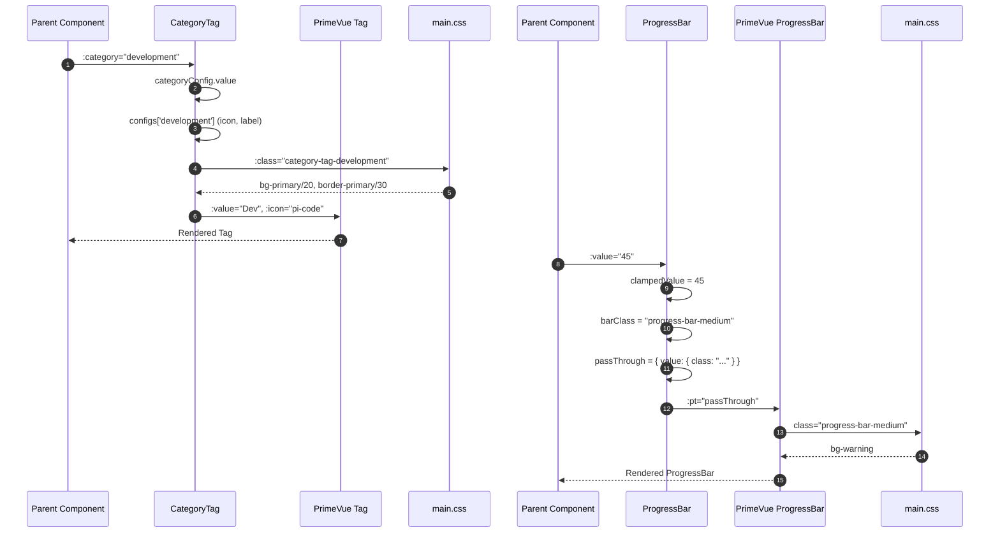

# 상세설계 (020-detail-design.md)

**Template Version:** 3.0.0 — **Last Updated:** 2025-12-16

> **설계 규칙**
> * 기능 중심 설계에 집중
> * 실제 소스코드 포함 금지
> * PRD/TRD/기본설계와 일관성 유지
>
> **분할 문서**
> * 요구사항 추적성: `025-traceability-matrix.md`
> * 테스트 명세: `026-test-specification.md`

---

## 0. 문서 메타데이터

| 항목 | 내용 |
|------|------|
| Task ID | TSK-08-02 |
| Task명 | WBS UI Components Migration |
| Category | development |
| 상태 | [dd] 상세설계 |
| 작성일 | 2025-12-16 |
| 작성자 | Claude Opus 4.5 |

### 상위 문서 참조

| 문서 유형 | 경로 | 참조 섹션 |
|----------|------|----------|
| PRD | `.orchay/orchay/prd.md` | 섹션 10.1 (UI 디자인 시스템) |
| TRD | `.orchay/orchay/trd.md` | 섹션 2.3.6 (CSS 클래스 중앙화) |
| 기본설계 | `010-basic-design.md` | 전체 |
| 화면설계 | `011-ui-design.md` | 전체 |
| 상위 Work Package | WP-08: PrimeVue Component Migration | - |
| 선행 Task | TSK-08-01: WbsTreePanel + NodeIcon Migration | NodeIcon 패턴 참조 |

### 분할 문서 참조

| 문서 유형 | 파일명 | 목적 |
|----------|--------|------|
| 추적성 매트릭스 | `025-traceability-matrix.md` | 요구사항 ↔ 설계 ↔ 테스트 추적 |
| 테스트 명세 | `026-test-specification.md` | 테스트 시나리오, 데이터, data-testid |

---

## 1. 일관성 검증 결과

### 1.1 검증 요약

| 구분 | 통과 | 경고 | 실패 |
|------|------|------|------|
| PRD ↔ 기본설계 | 7개 | 0개 | 0개 |
| 기본설계 ↔ 상세설계 | 8개 | 0개 | 0개 |
| 화면설계 ↔ 상세설계 | 5개 | 0개 | 0개 |
| TRD ↔ 상세설계 | 3개 | 0개 | 0개 |

### 1.2 검증 상세

| 검증 ID | 검증 항목 | 결과 | 비고 |
|---------|----------|------|------|
| CHK-PRD-01 | 기능 요구사항 완전성 | ✅ PASS | FR-001~FR-005 모두 반영 |
| CHK-PRD-02 | 비즈니스 규칙 일치성 | ✅ PASS | 비즈니스 규칙 없음 |
| CHK-PRD-03 | 용어 일관성 | ✅ PASS | CategoryTag, ProgressBar 용어 일치 |
| CHK-BD-01 | 기능 요구사항 완전성 | ✅ PASS | StatusBadge 마이그레이션 불필요 확인 |
| CHK-BD-02 | 데이터 모델 일치성 | ✅ PASS | CategoryConfig 구조 정확 |
| CHK-BD-03 | 인터페이스 일치성 | ✅ PASS | Pass Through API 매핑 정확 |
| CHK-BD-04 | 화면 일치성 | ✅ PASS | 컴포넌트 구조 일치 |
| CHK-BD-05 | 수용 기준 구현 가능성 | ✅ PASS | AC-01~AC-05 테스트케이스 변환 완료 |
| CHK-UI-01 | 화면 레이아웃 일치성 | ✅ PASS | 기본설계 요구사항과 일치 |
| CHK-UI-02 | 컴포넌트 매핑 완전성 | ✅ PASS | CategoryTag, ProgressBar 매핑 완료 |
| CHK-UI-03 | 스타일 일관성 | ✅ PASS | 다크 테마 색상 일치 |
| CHK-UI-04 | 접근성 요구사항 | ✅ PASS | data-testid, aria 속성 유지 |
| CHK-TRD-01 | 기술 스택 준수 | ✅ PASS | Vue 3, PrimeVue 4.x 사용 |
| CHK-TRD-02 | 스타일링 규칙 준수 | ✅ PASS | CSS 클래스 중앙화 원칙 준수 |
| CHK-TRD-03 | 컴포넌트 구조 준수 | ✅ PASS | app/components/wbs/ 경로 |

---

## 2. 목적 및 범위

### 2.1 목적

StatusBadge, CategoryTag, ProgressBar 컴포넌트의 HEX 하드코딩을 제거하고 CSS 클래스 중앙화 원칙을 적용하여:
- CSS 변수 기반 색상 관리로 유지보수성 향상
- TSK-08-01 NodeIcon 패턴과 일관성 유지
- 테마 변경 시 유연성 확보
- PrimeVue 디자인 시스템과의 통합성 강화

### 2.2 범위

**포함 범위**:
- StatusBadge: 마이그레이션 불필요 확인 (이미 PrimeVue severity 사용)
- CategoryTag: HEX 하드코딩 제거 → CSS 클래스 적용
- ProgressBar: HEX 하드코딩 제거 → CSS 클래스 적용
- main.css: `.category-tag-*`, `.progress-bar-*` 클래스 정의
- 시각적 일관성 유지 (Before/After 동일)

**제외 범위**:
- 컴포넌트 로직 변경 (기능은 100% 유지)
- 새로운 기능 추가
- E2E 테스트 수정 (data-testid 유지)
- PrimeVue ProgressBar 컴포넌트 교체 (Pass Through API로 색상만 제어)

---

## 3. 기술 스택

| 구분 | 기술 | 버전 | 용도 |
|------|------|------|------|
| Frontend | Vue 3 + Nuxt 3 | 3.5.x / 3.18.x | Composition API 기반 컴포넌트 |
| UI Framework | PrimeVue | 4.x | Tag, ProgressBar 컴포넌트 제공 |
| Styling | TailwindCSS | 3.4.x | 유틸리티 CSS |
| Global CSS | main.css | - | CSS 변수 및 클래스 정의 |
| Testing | Vitest + Playwright | 2.x / 1.49.x | 단위/E2E 테스트 |

---

## 4. 용어/가정/제약

### 4.1 용어 정의

| 용어 | 정의 |
|------|------|
| StatusBadge | Task 상태를 표시하는 배지 컴포넌트 (PrimeVue Tag 기반) |
| CategoryTag | Task 카테고리를 표시하는 태그 컴포넌트 (PrimeVue Tag + wrapper) |
| ProgressBar | 진행률을 표시하는 바 컴포넌트 (PrimeVue ProgressBar) |
| Pass Through API | PrimeVue 컴포넌트 내부 요소에 속성을 주입하는 API |
| CSS 클래스 중앙화 | 인라인 스타일 금지, main.css에서 색상 관리 원칙 |

### 4.2 가정 (Assumptions)

- main.css의 CSS 변수 (`--color-primary`, `--color-danger` 등)는 이미 정의되어 있음
- tailwind.config.ts에서 CSS 변수를 참조하는 구조 유지
- PrimeVue ProgressBar의 Pass Through API는 class 속성 지원
- 기존 E2E 테스트는 data-testid 속성에 의존

### 4.3 제약 (Constraints)

- StatusBadge는 마이그레이션 불필요 (이미 PrimeVue severity 사용)
- CategoryTag는 wrapper div의 배경색만 변경 필요
- ProgressBar는 Pass Through API로 class만 주입
- 시각적 결과는 마이그레이션 전후 완전히 동일해야 함

---

## 5. 시스템/모듈 구조

### 5.1 모듈 역할 및 책임

| 모듈 | 역할 | 책임 |
|------|------|------|
| StatusBadge.vue | Task 상태 배지 표시 | PrimeVue Tag severity prop 사용 (변경 없음) |
| CategoryTag.vue | Task 카테고리 표시 | HEX 제거, CSS 클래스 바인딩 |
| ProgressBar.vue | 진행률 바 표시 | HEX 제거, Pass Through API로 class 주입 |
| main.css | 중앙 스타일 정의 | `.category-tag-*`, `.progress-bar-*` 클래스 정의 |

### 5.2 컴포넌트 구조 (개념)

```
CategoryTag.vue
├── <script setup>
│   ├── props: { category }
│   ├── categoryConfig (computed) ← configs[category] (color 제거)
│   ├── categoryLabel (computed) ← config.label
│   ├── categoryIcon (computed) ← config.icon
│   └── ❌ categoryColor (삭제) ← HEX 하드코딩 제거
│
└── <template>
    └── <div :class="`category-tag-${category}`"> ← CSS 클래스 바인딩
        └── <Tag :value="categoryLabel" :icon="categoryIcon" />

ProgressBar.vue
├── <script setup>
│   ├── props: { value }
│   ├── clampedValue (computed) ← Math.min(100, Math.max(0, value))
│   ├── barClass (computed) ← 진행률 구간별 CSS 클래스 계산
│   ├── passThrough (computed) ← { value: { class: barClass } }
│   └── ❌ barColor (삭제) ← HEX 하드코딩 제거
│
└── <template>
    └── <ProgressBar :value="clampedValue" :pt="passThrough" />
```

### 5.3 외부 의존성

| 의존성 | 유형 | 용도 |
|--------|------|------|
| PrimeVue Tag | UI Library | StatusBadge, CategoryTag 기반 |
| PrimeVue ProgressBar | UI Library | 진행률 바 렌더링 |
| main.css | Global Styles | CSS 변수 및 클래스 정의 |
| tailwind.config.ts | Config | CSS 변수 → Tailwind 클래스 매핑 |

---

## 6. 데이터 모델 (개념 수준)

### 6.1 CategoryTag 데이터 구조

#### CategoryConfig (Before)

| 필드명 | 타입 | 필수 | 설명 | 제약조건 |
|--------|------|------|------|----------|
| icon | string | Y | PrimeIcon 클래스 | 예: 'pi-code' |
| color | string | Y | HEX 색상 | ❌ 제거 예정 |
| label | string | Y | 표시 라벨 | 예: 'Dev' |

#### CategoryConfig (After)

| 필드명 | 타입 | 필수 | 설명 | 제약조건 |
|--------|------|------|------|----------|
| icon | string | Y | PrimeIcon 클래스 | 예: 'pi-code' |
| label | string | Y | 표시 라벨 | 예: 'Dev' |

**변경 사항**: `color` 필드 제거

### 6.2 ProgressBar 데이터 구조

#### barClass (computed)

| 입력 (clampedValue) | 조건 | 출력 (CSS 클래스) |
|-------------------|------|------------------|
| 0-29 | value < 30 | 'progress-bar-low' |
| 30-69 | value < 70 | 'progress-bar-medium' |
| 70-100 | value >= 70 | 'progress-bar-high' |

#### passThrough (computed)

| 필드명 | 타입 | 값 | 설명 |
|--------|------|-----|------|
| value.class | string | barClass.value | Pass Through API로 class 주입 |

---

## 7. 인터페이스 계약

### 7.1 CategoryTag Props/Emits

#### CategoryTag Props

| Props | 타입 | 필수 | 기본값 | 설명 |
|-------|------|------|--------|------|
| category | 'development' \| 'defect' \| 'infrastructure' | Y | - | Task 카테고리 |

#### CategoryTag Emits

| Event | Payload | 설명 | 발생 조건 |
|-------|---------|------|----------|
| - | - | - | Emits 없음 (읽기 전용) |

### 7.2 ProgressBar Props/Emits

#### ProgressBar Props

| Props | 타입 | 필수 | 기본값 | 설명 |
|-------|------|------|--------|------|
| value | number | Y | - | 진행률 (0-100) |

#### ProgressBar Emits

| Event | Payload | 설명 | 발생 조건 |
|-------|---------|------|----------|
| - | - | - | Emits 없음 (읽기 전용) |

### 7.3 함수 시그니처 (개념)

#### CategoryTag

**categoryConfig (computed)**:

| 항목 | 내용 |
|------|------|
| 함수명 | categoryConfig |
| 파라미터 | - (props.category 사용) |
| 반환값 | Omit<CategoryConfig, 'color'> |
| 책임 | configs 객체에서 카테고리 설정 반환 (color 필드 제외, 유효하지 않은 category 시 기본값 반환) |

#### ProgressBar

**barClass (computed)**:

| 항목 | 내용 |
|------|------|
| 함수명 | barClass |
| 파라미터 | - (clampedValue 사용) |
| 반환값 | 'progress-bar-low' \| 'progress-bar-medium' \| 'progress-bar-high' |
| 책임 | 진행률 구간에 따라 CSS 클래스 문자열 반환 (임계값: LOW=30, MEDIUM=70) |

**passThrough (computed)**:

| 항목 | 내용 |
|------|------|
| 함수명 | passThrough |
| 파라미터 | - (barClass 사용) |
| 반환값 | ProgressBarPassThroughOptions |
| 책임 | PrimeVue ProgressBar의 Pass Through API 옵션 생성 |

---

## 8. 프로세스 흐름

### 8.1 CategoryTag 렌더링 흐름

1. **Props 전달** [FR-002]: `category` prop 전달 (예: 'development')
2. **설정 조회** [FR-002]: categoryConfig (computed) → configs['development'] 조회
3. **CSS 클래스 계산** [FR-004]: wrapper div에 `category-tag-development` 클래스 바인딩
4. **PrimeVue Tag 렌더링** [FR-002]: label, icon props 전달
5. **스타일 적용** [FR-004]: main.css의 `.category-tag-development` 스타일 자동 적용

### 8.2 ProgressBar 렌더링 흐름

1. **Props 전달** [FR-003]: `value` prop 전달 (예: 45)
2. **값 클램핑** [FR-003]: clampedValue (computed) → Math.min(100, Math.max(0, 45)) = 45
3. **클래스 계산** [FR-004]: barClass (computed) → 'progress-bar-medium' (45 < 70)
4. **Pass Through 생성** [FR-003]: passThrough (computed) → { value: { class: 'progress-bar-medium' } }
5. **PrimeVue 렌더링** [FR-003]: ProgressBar 컴포넌트에 pt prop 전달
6. **스타일 적용** [FR-004]: main.css의 `.progress-bar-medium` 스타일 자동 적용

### 8.3 시퀀스 다이어그램



---

## 9. UI 설계

### 9.1 화면 목록

| 화면 | 경로 | 목적 | 주요 기능 |
|------|------|------|----------|
| WBS 트리 패널 | /wbs | WBS 노드 표시 | CategoryTag, ProgressBar 사용 |
| Task 상세 패널 | /wbs (선택 시) | Task 정보 표시 | StatusBadge 사용 |

### 9.2 CategoryTag 레이아웃

```
┌────────────────────────────────┐
│ ┌─────┐ Dev                    │  ← wrapper div (.category-tag-development)
│ │ 📝 │                         │  ← PrimeVue Tag (icon + label)
│ └─────┘                        │
└────────────────────────────────┘
```

### 9.3 ProgressBar 레이아웃

```
┌────────────────────────────────┐
│ ████████░░░░░░░░░░░░  45%      │  ← PrimeVue ProgressBar
│ ▲                              │
│ └─ 진행 바 (.progress-bar-medium)
└────────────────────────────────┘
```

### 9.4 컴포넌트 구조 (개념)

#### CategoryTag 템플릿 구조

```vue
<div
  :class="`category-tag-${category}`"
  class="category-tag-wrapper"
>
  <Tag
    :value="categoryLabel"
    :icon="categoryIcon"
    rounded
  />
</div>
```

#### ProgressBar 템플릿 구조

```vue
<ProgressBar
  :value="clampedValue"
  :pt="passThrough"
/>
```

### 9.5 상태 관리 (개념)

#### CategoryTag Local State

| 상태 | 타입 | 설명 |
|------|------|------|
| categoryConfig | computed<Omit<CategoryConfig, 'color'>> | configs[category] 조회 (유효하지 않은 경우 기본값) |
| categoryLabel | computed<string> | config.label |
| categoryIcon | computed<string> | config.icon |

**categoryConfig 구현 로직**:
```typescript
const categoryConfig = computed(() => {
  const configs: Record<TaskCategory, Omit<CategoryConfig, 'color'>> = {
    development: { icon: 'pi-code', label: 'Dev' },
    defect: { icon: 'pi-exclamation-triangle', label: 'Defect' },
    infrastructure: { icon: 'pi-cog', label: 'Infra' }
  }

  const config = configs[props.category]
  if (!config) {
    console.warn(`Invalid category: ${props.category}`)
    return { icon: 'pi-code', label: 'Unknown' }
  }
  return config
})
```

#### ProgressBar Local State

| 상태 | 타입 | 설명 |
|------|------|------|
| clampedValue | computed<number> | Math.min(100, Math.max(0, value)) |
| barClass | computed<string> | 진행률 구간별 CSS 클래스 (임계값: 30%, 70%) |
| passThrough | computed<ProgressBarPassThroughOptions> | Pass Through API 옵션 |

**PROGRESS_THRESHOLDS 상수**:
```typescript
const PROGRESS_THRESHOLDS = { LOW: 30, MEDIUM: 70 } as const
```

### 9.6 테마 변수 매핑 (PRD 10.1 일관성)

> **중요**: 모든 색상은 `main.css`에 정의된 CSS 변수를 참조하여 테마 일관성 유지

**카테고리 색상 매핑**:

| Category | CSS 변수 | HEX 값 | Tailwind 클래스 |
|----------|----------|--------|-----------------|
| development | `--color-primary` | `#3b82f6` | `bg-primary` |
| defect | `--color-danger` | `#ef4444` | `bg-danger` |
| infrastructure | `--color-level-project` | `#8b5cf6` | `bg-level-project` |

**진행률 색상 매핑**:

| 구간 | CSS 변수 | HEX 값 | Tailwind 클래스 |
|------|----------|--------|-----------------|
| 0-30% (Low) | `--color-danger` | `#ef4444` | `bg-danger` |
| 30-70% (Medium) | `--color-warning` | `#f59e0b` | `bg-warning` |
| 70-100% (High) | `--color-success` | `#22c55e` | `bg-success` |

### 9.7 CSS 클래스 중앙화 원칙

> **핵심 원칙**: 컴포넌트 내 인라인 스타일(`:style`) 및 HEX 하드코딩 금지. 모든 스타일은 `main.css`의 Tailwind 클래스로 중앙 관리.

#### 9.7.1 스타일 관리 전략

**Single Source of Truth**:
```
main.css (CSS 변수 + Tailwind 클래스)
    ↓
tailwind.config.ts (CSS 변수 참조)
    ↓
컴포넌트 (:class 바인딩만 사용)
```

**금지 패턴**:
```vue
<!-- ❌ 금지: 인라인 스타일 -->
:style="{ backgroundColor: '#3b82f6' }"
:style="{ backgroundColor: categoryColor }"

<!-- ❌ 금지: 컴포넌트 내 HEX 하드코딩 -->
const categoryColor = computed(() => {
  return configs[props.category].color // '#3b82f6'
})
```

**권장 패턴**:
```vue
<!-- ✅ 권장: CSS 클래스 바인딩 -->
:class="`category-tag-${category}`"
:class="{ 'progress-bar-low': value < 30 }"
```

#### 9.7.2 CategoryTag 클래스

| Category | CSS 클래스 | 스타일 정의 |
|----------|-----------|------------|
| development | `category-tag-development` | `@apply bg-primary/20 border border-primary/30;` |
| defect | `category-tag-defect` | `@apply bg-danger/20 border border-danger/30;` |
| infrastructure | `category-tag-infrastructure` | `@apply bg-level-project/20 border border-level-project/30;` |

**구현 방식**:
```vue
<!-- Before -->
:style="{ backgroundColor: categoryColor }"

<!-- After -->
:class="`category-tag-${category}`"
```

#### 9.7.3 ProgressBar 클래스

| 진행률 구간 | CSS 클래스 | 스타일 정의 |
|-----------|-----------|------------|
| 0-29% | `progress-bar-low` | `@apply bg-danger;` |
| 30-69% | `progress-bar-medium` | `@apply bg-warning;` |
| 70-100% | `progress-bar-high` | `@apply bg-success;` |

**구현 방식**:
```typescript
// Before
const barColor = computed(() => {
  if (clampedValue.value < 30) return '#ef4444'
  if (clampedValue.value < 70) return '#f59e0b'
  return '#22c55e'
})

const passThrough = computed(() => ({
  value: { style: { backgroundColor: barColor.value } }
}))

// After
const PROGRESS_THRESHOLDS = { LOW: 30, MEDIUM: 70 } as const

const barClass = computed(() => {
  if (clampedValue.value < PROGRESS_THRESHOLDS.LOW) return 'progress-bar-low'
  if (clampedValue.value < PROGRESS_THRESHOLDS.MEDIUM) return 'progress-bar-medium'
  return 'progress-bar-high'
})

const passThrough = computed(() => ({
  value: { class: barClass.value }
}))
```

#### 9.7.4 main.css 추가 클래스 명세

**CategoryTag 스타일**:
```css
/* ============================================
 * CategoryTag 컴포넌트 스타일 (TSK-08-02)
 * CSS 클래스 중앙화 원칙 준수
 * ============================================ */

.category-tag-development {
  @apply bg-primary/20 border border-primary/30 rounded-xl px-2 py-1;
}

.category-tag-defect {
  @apply bg-danger/20 border border-danger/30 rounded-xl px-2 py-1;
}

.category-tag-infrastructure {
  @apply bg-level-project/20 border border-level-project/30 rounded-xl px-2 py-1;
}
```

**ProgressBar 스타일**:
```css
/* ============================================
 * ProgressBar 컴포넌트 스타일 (TSK-08-02)
 * CSS 클래스 중앙화 원칙 준수
 * ============================================ */

.progress-bar-low {
  @apply bg-danger;
}

.progress-bar-medium {
  @apply bg-warning;
}

.progress-bar-high {
  @apply bg-success;
}
```

### 9.8 반응형/접근성 가이드

**반응형**:
- Desktop (≥ 1024px): 기본 레이아웃 유지
- Tablet (768px - 1024px): 기본 레이아웃 유지
- Mobile (< 768px): CategoryTag 패딩 축소, ProgressBar 높이 축소

**접근성**:
- data-testid 속성: E2E 테스트 호환성 유지
- aria-label: 스크린 리더 지원 (CategoryTag, ProgressBar)
- 색상 대비: WCAG AA 기준 4.5:1 이상
- 키보드 탐색: 불필요 (읽기 전용 컴포넌트)

---

## 10. 비즈니스 규칙 구현 명세

> 이 Task는 UI 마이그레이션으로 비즈니스 규칙 없음

| 규칙 ID | 규칙 설명 | 구현 위치 | 구현 방식 | 검증 방법 |
|---------|----------|----------|----------|-----------|
| - | - | - | - | - |

---

## 11. 오류/예외 처리

### 11.1 예상 오류 상황

| 오류 상황 | 처리 위치 | 사용자 표시 | 복구 전략 |
|----------|----------|-----------|----------|
| 유효하지 않은 category | CategoryTag | Console Warning | 기본값 반환: { icon: 'pi-code', label: 'Unknown' } |
| value < 0 또는 > 100 | ProgressBar | 자동 클램핑 (0-100) | Math.min(100, Math.max(0, value)) |
| Pass Through API 미지원 | ProgressBar | PrimeVue 기본 렌더링 | Fallback 없음 (PrimeVue 기본 처리) |

### 11.2 경계 조건

| 조건 | 처리 방안 |
|------|----------|
| category = undefined | Console Warning + 기본값 { icon: 'pi-code', label: 'Unknown' } 반환 |
| value = 0 | progress-bar-low 클래스 적용 |
| value = 100 | progress-bar-high 클래스 적용 |
| value = 50.5 | 소수점 유지 (PrimeVue 자동 처리) |

---

## 12. 구현 체크리스트

### CategoryTag
- [ ] `categoryColor` computed 삭제
- [ ] `CategoryConfig` interface에서 `color` 필드 제거
- [ ] `configs` 객체에서 `color` 속성 제거
- [ ] `categoryConfig` computed에 유효하지 않은 category 처리 로직 추가
- [ ] wrapper div에 `:class="\`category-tag-${category}\`"` 추가
- [ ] wrapper div에서 `:style` 제거
- [ ] `data-testid` 유지 확인
- [ ] `aria-label` 유지 확인

### ProgressBar
- [ ] `barColor` computed 삭제
- [ ] `PROGRESS_THRESHOLDS` 상수 추가 (LOW: 30, MEDIUM: 70)
- [ ] `barClass` computed 추가 (상수 사용)
- [ ] `passThrough` computed에서 `style` → `class` 변경
- [ ] `data-testid` 유지 확인
- [ ] `aria-*` 속성 유지 확인

### main.css
- [ ] `.category-tag-development` 클래스 추가
- [ ] `.category-tag-defect` 클래스 추가
- [ ] `.category-tag-infrastructure` 클래스 추가
- [ ] `.progress-bar-low` 클래스 추가
- [ ] `.progress-bar-medium` 클래스 추가
- [ ] `.progress-bar-high` 클래스 추가
- [ ] TSK-08-02 주석 블록 추가

### 검증
- [ ] 로컬 개발 서버 실행 후 시각적 확인
- [ ] CategoryTag 3종 렌더링 테스트
- [ ] ProgressBar 3구간 렌더링 테스트
- [ ] E2E 테스트 통과 확인
- [ ] 색상 대비 WCAG AA 기준 충족 확인

### 품질
- [ ] 요구사항 추적성 검증 완료 (`025-traceability-matrix.md`)
- [ ] 테스트 명세 작성 완료 (`026-test-specification.md`)
- [ ] 일관성 검증 통과 (PRD, TRD, 기본설계, 화면설계)
- [ ] HEX 하드코딩 제거 확인 (Grep 검색 결과 0건)

---

## 13. 다음 단계

- `/wf:review` 명령어로 설계리뷰 진행

---

## 관련 문서

- 기본설계: `010-basic-design.md`
- 화면설계: `011-ui-design.md`
- 추적성 매트릭스: `025-traceability-matrix.md`
- 테스트 명세: `026-test-specification.md`
- PRD: `.orchay/orchay/prd.md` (섹션 10.1)
- TRD: `.orchay/orchay/trd.md` (섹션 2.3.6)
- 선행 Task: `.orchay/projects/orchay/tasks/TSK-08-01/020-detail-design.md`

---

<!--
author: Claude Opus 4.5
Template Version: 3.0.0
Created: 2025-12-16
-->
