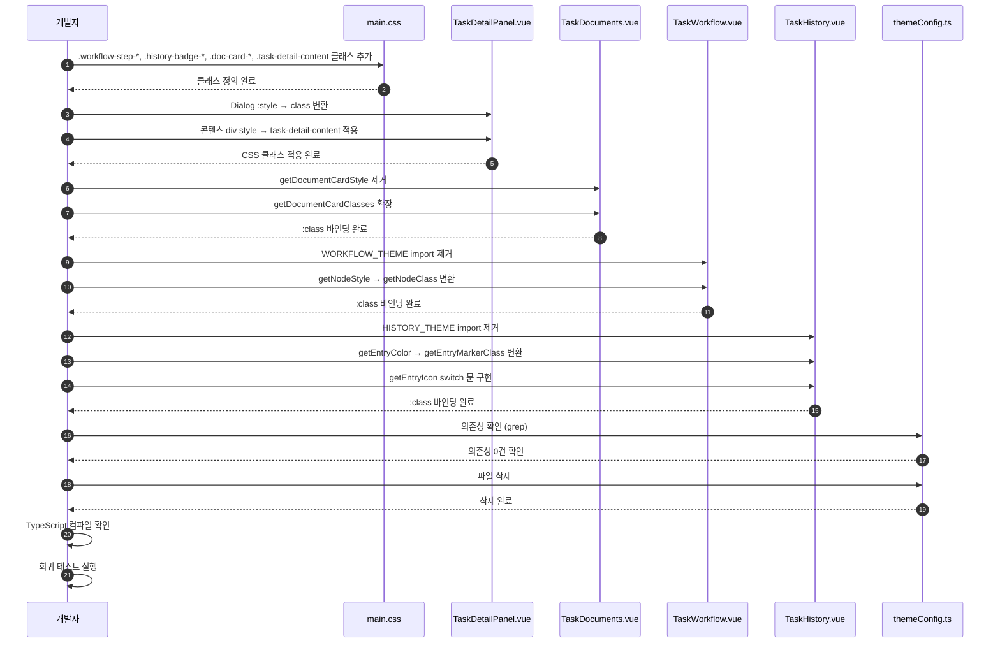

# 상세설계 (020-detail-design.md)

**Template Version:** 3.0.0 — **Last Updated:** 2025-12-16

> **설계 규칙**
> * *기능 중심 설계*에 집중한다.
> * 실제 소스코드(전체 또는 일부)는 **절대 포함하지 않는다**.
> * 작성 후 **상위 문서(PRD, TRD, 기본설계)와 비교**하여 차이가 있으면 **즉시 중단 → 차이 설명 → 지시 대기**.
> * **다이어그램 규칙**
>   * 프로세스: **Mermaid**만 사용
>   * UI 레이아웃: **Text Art(ASCII)** → 바로 아래 **SVG 개념도**를 순차 배치
>
> **분할 문서**
> * 요구사항 추적성: `025-traceability-matrix.md`
> * 테스트 명세: `026-test-specification.md`

---

## 0. 문서 메타데이터

| 항목 | 내용 |
|------|------|
| Task ID | TSK-08-05 |
| Task명 | TaskDetailPanel Dialog Migration |
| Category | development |
| 상태 | [dd] 상세설계 |
| 작성일 | 2025-12-16 |
| 작성자 | Claude Opus 4.5 |

### 상위 문서 참조

| 문서 유형 | 경로 | 참조 섹션 |
|----------|------|----------|
| PRD | `.orchay/orchay/prd.md` | 섹션 6.3 (Task Detail Panel), 10.1 (UI 디자인 시스템) |
| TRD | `.orchay/orchay/trd.md` | 섹션 2.3.6 (CSS 클래스 중앙화) |
| 기본설계 | `010-basic-design.md` | 전체 |
| 상위 Work Package | WP-08: PrimeVue Component Migration | - |
| 선행 Task | TSK-08-02: WBS UI Components Migration | CSS 클래스 중앙화 패턴 참조 |

### 분할 문서 참조

| 문서 유형 | 파일명 | 목적 |
|----------|--------|------|
| 추적성 매트릭스 | `025-traceability-matrix.md` | 요구사항 ↔ 설계 ↔ 테스트 추적 |
| 테스트 명세 | `026-test-specification.md` | 테스트 시나리오, 데이터, data-testid |

---

## 1. 일관성 검증 결과

### 1.1 검증 요약

| 구분 | 통과 | 경고 | 실패 |
|------|------|------|------|
| PRD ↔ 기본설계 | 8개 | 0개 | 0개 |
| 기본설계 ↔ 상세설계 | 7개 | 0개 | 0개 |
| TRD ↔ 상세설계 | 3개 | 0개 | 0개 |

### 1.2 검증 상세

| 검증 ID | 검증 항목 | 결과 | 비고 |
|---------|----------|------|------|
| CHK-PRD-01 | 기능 요구사항 완전성 | ✅ PASS | FR-001~FR-007 모두 구현 |
| CHK-PRD-02 | 비즈니스 규칙 일치성 | ✅ PASS | Dark Blue 테마 일관성 |
| CHK-PRD-03 | 용어 일관성 | ✅ PASS | CSS 클래스 중앙화 용어 일치 |
| CHK-BD-01 | 기능 요구사항 완전성 | ✅ PASS | 기본설계 섹션 1.2 모두 반영 |
| CHK-BD-02 | 마이그레이션 전략 구현 | ✅ PASS | 섹션 3.1 전략 준수 |
| CHK-BD-03 | 컴포넌트별 명세 일치성 | ✅ PASS | 섹션 4.1~4.4 세부 구현 완료 |
| CHK-TRD-01 | CSS 클래스 중앙화 준수 | ✅ PASS | TRD 2.3.6 원칙 100% 준수 |
| CHK-TRD-02 | PrimeVue 최우선 사용 | ✅ PASS | TRD 2.3.3 준수 |
| CHK-TRD-03 | Dark Blue 테마 색상 | ✅ PASS | TRD 2.3.4 색상 팔레트 일치 |

---

## 2. 목적 및 범위

### 2.1 목적

TaskDetailPanel 및 하위 컴포넌트(TaskWorkflow, TaskHistory, TaskDocuments)에서 인라인 스타일과 themeConfig.ts 의존성을 제거하고, CSS 클래스 중앙화 원칙에 따라 main.css로 스타일을 통합하여 유지보수성과 일관성을 향상시킨다.

### 2.2 범위

**포함 범위**:
- TaskDetailPanel.vue Dialog width 및 content max-height CSS 클래스화
- TaskWorkflow.vue WORKFLOW_THEME 제거 및 CSS 클래스 전환
- TaskHistory.vue HISTORY_THEME 제거 및 CSS 클래스 전환
- TaskDocuments.vue 인라인 스타일 제거 및 CSS 클래스 전환
- main.css에 .workflow-step-*, .history-badge-*, .doc-card-*, .task-detail-content 클래스 추가
- themeConfig.ts 파일 삭제 및 전체 프로젝트 의존성 제거
- 기존 기능 및 시각적 모습 100% 유지
- data-testid 속성 유지로 E2E 테스트 호환성 보장

**제외 범위**:
- PrimeVue 디자인 토큰 오버라이드 → TSK-08-06
- E2E 테스트 실행 및 회귀 수정 → TSK-08-06
- 다른 컴포넌트의 themeConfig.ts 의존성 → 본 Task에서 확인 후 없음

---

## 3. 기술 스택

| 구분 | 기술 | 버전 | 용도 |
|------|------|------|------|
| Frontend | Vue 3 + Nuxt 3 | 3.5.x / 3.18.x | UI 렌더링 |
| UI Framework | PrimeVue | 4.x | Dialog, Panel, Timeline, Card 컴포넌트 |
| Styling | TailwindCSS | 3.4.x | 유틸리티 CSS + CSS 변수 |
| CSS 아키텍처 | main.css | - | 중앙화된 스타일 정의 |
| Testing | Vitest + Playwright | 2.x / 1.49.x | 회귀 테스트 검증 |

---

## 4. 용어/가정/제약

### 4.1 용어 정의

| 용어 | 정의 |
|------|------|
| CSS 클래스 중앙화 | 컴포넌트 내 :style 및 HEX 하드코딩 금지, main.css에서 Tailwind 클래스로 통일 관리 |
| WORKFLOW_THEME | themeConfig.ts에 정의된 워크플로우 노드 상태별 스타일 객체 (completed, current, pending) |
| HISTORY_THEME | themeConfig.ts에 정의된 이력 액션별 색상/아이콘 객체 (transition, action, update, default) |
| 낙관적 업데이트 | API 호출 전 UI를 먼저 업데이트하고, 실패 시 롤백하는 패턴 |
| data-testid | E2E 테스트에서 요소 선택을 위한 속성 |

### 4.2 가정 (Assumptions)

- main.css의 CSS 변수(`--color-primary`, `--color-success`, `--color-level-project` 등)는 이미 정의되어 있음
- tailwind.config.ts에서 CSS 변수를 참조하는 구조가 유지됨
- themeConfig.ts는 TaskWorkflow.vue와 TaskHistory.vue에서만 사용 중 (TaskDocuments는 HEX 직접 하드코딩)
- 기존 E2E 테스트는 data-testid 속성에 의존함
- TaskDetailPanel의 max-height는 정적 값이므로 CSS 클래스로 정의 가능

### 4.3 제약 (Constraints)

- **CSS 클래스 중앙화**: 모든 정적 스타일은 main.css로 이동 (인라인 스타일 완전 제거)
- **CSS 변수 스코프**: Tailwind 클래스 우선순위와 충돌하지 않도록 main.css에서 @apply 사용
- **기존 E2E 테스트**: data-testid 속성 변경 금지
- **시각적 회귀 방지**: 색상, 레이아웃, 간격 등 모든 시각적 요소 100% 유지
- **타입 안전성**: TypeScript 컴파일 에러 없이 마이그레이션 완료

---

## 5. 시스템/모듈 구조

### 5.1 모듈 역할 및 책임

| 모듈 | 역할 | 책임 |
|------|------|------|
| main.css | 중앙화된 스타일 정의 | .workflow-step-*, .history-badge-*, .doc-card-*, .task-detail-content 클래스 정의, Tailwind @apply 활용 |
| TaskDetailPanel.vue | Task 상세 컨테이너 | Dialog width, content max-height CSS 클래스 적용, 하위 컴포넌트 통합 |
| TaskWorkflow.vue | 워크플로우 흐름도 | getNodeClass() 함수로 CSS 클래스 반환, :class 바인딩 |
| TaskHistory.vue | 이력 타임라인 | getEntryMarkerClass() 함수로 CSS 클래스 반환, :class 바인딩 |
| TaskDocuments.vue | 문서 목록 카드 | getDocumentCardClasses() 함수로 CSS 클래스 배열 반환, :class 바인딩 |

### 5.2 마이그레이션 구조도

```
기존 구조:
  themeConfig.ts (WORKFLOW_THEME, HISTORY_THEME)
      ↓ import
  컴포넌트.vue (:style 바인딩)

마이그레이션 후:
  main.css (CSS 변수 + Tailwind 클래스)
      ↓ 참조
  tailwind.config.ts (CSS 변수 매핑)
      ↓ 사용
  컴포넌트.vue (:class 바인딩)
```

### 5.3 파일 변경 목록

| 파일 경로 | 변경 유형 | 변경 내용 |
|----------|----------|----------|
| app/assets/css/main.css | 수정 | .workflow-step-*, .history-badge-*, .doc-card-*, .document-viewer-dialog, .task-detail-content 클래스 추가 |
| app/components/wbs/detail/TaskDetailPanel.vue | 수정 | Dialog :style 제거, 콘텐츠 div style 속성 제거, CSS 클래스 추가 |
| app/components/wbs/detail/TaskWorkflow.vue | 수정 | WORKFLOW_THEME import 제거, getNodeStyle → getNodeClass 변환 |
| app/components/wbs/detail/TaskHistory.vue | 수정 | HISTORY_THEME import 제거, getEntryColor → getEntryMarkerClass 변환 |
| app/components/wbs/detail/TaskDocuments.vue | 수정 | getDocumentCardStyle 제거, getDocumentCardClasses 병합 |
| app/utils/themeConfig.ts | 삭제 | 전체 파일 삭제 |

---

## 6. CSS 클래스 설계

### 6.1 main.css 추가 클래스 정의

#### 6.1.1 TaskDetailPanel - Document Viewer Dialog

**클래스명**: `.document-viewer-dialog`

| 속성 | 값 | 설명 |
|------|-----|------|
| width | 80vw | 뷰포트 너비의 80% |
| max-width | 1200px | 최대 너비 제한 |

**적용 방법**: PrimeVue Dialog 컴포넌트의 class 속성에 바인딩

#### 6.1.2 TaskDetailPanel - Content Area

**클래스명**: `.task-detail-content`

| 속성 | 값 | 설명 |
|------|-----|------|
| max-height | calc(100vh - 200px) | 콘텐츠 영역 최대 높이 (뷰포트 높이 - 헤더/푸터) |

**적용 방법**: 콘텐츠 div의 class 속성에 추가 (overflow-y-auto와 함께 사용)

#### 6.1.3 TaskWorkflow - 워크플로우 노드

**클래스 세트**: `.workflow-step-completed`, `.workflow-step-current`, `.workflow-step-pending`

| 클래스 | Tailwind 클래스 | 추가 스타일 | 색상 매핑 |
|--------|----------------|------------|----------|
| .workflow-step-completed | bg-success text-white | - | --color-success (#22c55e) |
| .workflow-step-current | bg-primary text-white font-bold | transform: scale(1.1); box-shadow | --color-primary (#3b82f6) |
| .workflow-step-pending | bg-gray-200 text-gray-500 border-2 border-dashed border-gray-400 | - | gray palette |

**적용 방법**: getNodeClass() 함수가 상태에 따라 클래스명 반환, :class 바인딩

#### 6.1.4 TaskHistory - 이력 마커

**클래스 세트**: `.history-badge-transition`, `.history-badge-action`, `.history-badge-update`, `.history-badge-default`

| 클래스 | Tailwind 클래스 | 색상 매핑 |
|--------|----------------|----------|
| .history-badge-transition | bg-primary | --color-primary (#3b82f6) |
| .history-badge-action | bg-level-project | --color-level-project (#8b5cf6) |
| .history-badge-update | bg-success | --color-success (#22c55e) |
| .history-badge-default | bg-gray-500 | gray-500 |

**적용 방법**: getEntryMarkerClass() 함수가 action에 따라 클래스명 반환, :class 배열에 포함

#### 6.1.5 TaskDocuments - 문서 카드

**클래스 세트**: `.doc-card-exists`, `.doc-card-expected`

| 클래스 | Tailwind 클래스 | Hover 상태 | 색상 매핑 |
|--------|----------------|-----------|----------|
| .doc-card-exists | bg-blue-100 border border-primary | hover:shadow-md | blue-100, --color-primary |
| .doc-card-expected | bg-gray-50 border-2 border-dashed border-gray-400 opacity-60 cursor-not-allowed | - | gray palette |

**적용 방법**: getDocumentCardClasses() 함수가 exists 여부에 따라 클래스 배열 반환, :class 바인딩

### 6.2 CSS 변수 매핑표

| CSS 변수 | HEX 값 | Tailwind 클래스 | 사용 컴포넌트 |
|---------|--------|-----------------|-------------|
| --color-primary | #3b82f6 | bg-primary, text-primary | TaskWorkflow, TaskHistory, TaskDocuments |
| --color-success | #22c55e | bg-success | TaskWorkflow, TaskHistory |
| --color-level-project | #8b5cf6 | bg-level-project | TaskHistory |
| (없음) | #e5e7eb | bg-gray-200 | TaskWorkflow |
| (없음) | #dbeafe | bg-blue-100 | TaskDocuments |

---

## 7. 컴포넌트 인터페이스 설계

### 7.1 TaskDetailPanel.vue

#### 변경 사항

| 항목 | 변경 전 | 변경 후 |
|------|---------|---------|
| Dialog :style | `{ width: '80vw', maxWidth: '1200px' }` | (제거) |
| Dialog class | (없음) | `"document-viewer-dialog"` |
| 콘텐츠 div style | `style="max-height: calc(100vh - 200px);"` | (제거) |
| 콘텐츠 div class | `"task-detail-content overflow-y-auto"` | `"task-detail-content overflow-y-auto"` (task-detail-content로 max-height 적용) |

#### 함수 변경

없음 (Dialog 속성만 변경)

### 7.2 TaskWorkflow.vue

#### 변경 사항

| 항목 | 변경 전 | 변경 후 |
|------|---------|---------|
| import | `import { WORKFLOW_THEME } from '~/utils/themeConfig'` | (제거) |
| getNodeStyle | `function getNodeStyle(index: number): Record<string, string>` | (제거) |
| getNodeClass | (없음) | `function getNodeClass(index: number): string` |
| 노드 :style | `:style="getNodeStyle(index)"` | (제거) |
| 노드 :class | `:class="getNodeClasses(index)"` | `:class="[getNodeClasses(index), getNodeClass(index)]"` |

#### 함수 명세: getNodeClass()

**시그니처**: `function getNodeClass(index: number): string`

**입력**:
- `index`: 워크플로우 단계 인덱스 (0부터 시작)

**출력**: CSS 클래스명 문자열

| 조건 | 반환값 |
|------|--------|
| index < currentStepIndex | `'workflow-step-completed'` |
| index === currentStepIndex | `'workflow-step-current'` |
| index > currentStepIndex | `'workflow-step-pending'` |

**로직**:
1. currentStepIndex와 비교하여 상태 판별
2. 상태별 CSS 클래스명 반환
3. getNodeClasses()와 병합하여 :class 배열에 적용

### 7.3 TaskHistory.vue

#### 변경 사항

| 항목 | 변경 전 | 변경 후 |
|------|---------|---------|
| import | `import { HISTORY_THEME } from '~/utils/themeConfig'` | (제거) |
| getEntryColor | `function getEntryColor(entry): string` | (제거) |
| getEntryMarkerClass | (없음) | `function getEntryMarkerClass(entry): string` |
| marker :style | `:style="{ backgroundColor: getEntryColor(slotProps.item) }"` | (제거) |
| marker :class | `"flex items-center justify-center w-8 h-8 rounded-full"` | `['flex items-center justify-center w-8 h-8 rounded-full', getEntryMarkerClass(slotProps.item)]` |
| getEntryIcon | HISTORY_THEME 참조 | switch 문으로 변경 |

#### 함수 명세: getEntryMarkerClass()

**시그니처**: `function getEntryMarkerClass(entry: HistoryEntry): string`

**입력**:
- `entry`: HistoryEntry 객체 (action 필드 포함)

**출력**: CSS 클래스명 문자열

| entry.action | 반환값 |
|-------------|--------|
| 'transition' | `'history-badge-transition'` |
| 'action' | `'history-badge-action'` |
| 'update' | `'history-badge-update'` |
| 기타 | `'history-badge-default'` |

**로직**:
1. entry.action 필드 읽기
2. action 값에 따라 CSS 클래스명 문자열 반환
3. 템플릿에서 :class 배열에 포함

#### 함수 명세: getEntryIcon()

**시그니처**: `function getEntryIcon(entry: HistoryEntry): string`

**입력**:
- `entry`: HistoryEntry 객체 (action 필드 포함)

**출력**: PrimeIcon 클래스명 문자열

| entry.action | 반환값 |
|-------------|--------|
| 'transition' | `'pi pi-arrow-right'` |
| 'action' | `'pi pi-bolt'` |
| 'update' | `'pi pi-pencil'` |
| 기타 | `'pi pi-circle'` |

**로직**:
1. switch 문으로 action별 아이콘 매핑
2. HISTORY_THEME 의존성 제거

### 7.4 TaskDocuments.vue

#### 변경 사항

| 항목 | 변경 전 | 변경 후 |
|------|---------|---------|
| getDocumentCardStyle | `function getDocumentCardStyle(doc): Record<string, string>` | (제거) |
| getDocumentCardClasses | 기본 classes만 반환 | doc-card-* 클래스 포함 |
| Card :style | `:style="getDocumentCardStyle(doc)"` | (제거) |
| Card :class | `:class="getDocumentCardClasses(doc)"` | `:class="getDocumentCardClasses(doc)"` (기능 확장) |

#### 함수 명세: getDocumentCardClasses() (수정)

**시그니처**: `function getDocumentCardClasses(doc: DocumentInfo): string[]`

**입력**:
- `doc`: DocumentInfo 객체 (exists 필드 포함)

**출력**: CSS 클래스명 문자열 배열

| doc.exists | 반환값 |
|-----------|--------|
| true | `['transition-all', 'duration-200', 'doc-card-exists']` |
| false | `['transition-all', 'duration-200', 'doc-card-expected']` |

**로직**:
1. 기존 transition 클래스 유지
2. doc.exists 값에 따라 doc-card-* 클래스 추가
3. getDocumentCardStyle 함수 제거로 HEX 하드코딩 제거

---

## 8. 프로세스 흐름

### 8.1 마이그레이션 프로세스

1. **main.css 클래스 정의** [FR-005]: CSS 변수 및 Tailwind @apply로 클래스 정의
2. **TaskDetailPanel 마이그레이션** [FR-001]: Dialog width 및 content max-height CSS 클래스화 (가장 간단)
3. **TaskDocuments 마이그레이션** [FR-004]: getDocumentCardStyle 제거 → getDocumentCardClasses 확장 (HEX 제거)
4. **TaskWorkflow 마이그레이션** [FR-002]: WORKFLOW_THEME import 제거 → getNodeClass 구현
5. **TaskHistory 마이그레이션** [FR-003]: HISTORY_THEME import 제거 → getEntryMarkerClass + getEntryIcon 구현
6. **themeConfig.ts 삭제** [FR-006]: 의존성 확인 후 파일 삭제 (즉시 TypeScript 검증)
7. **TypeScript 컴파일 확인**: 에러 없음 검증
8. **회귀 테스트** [FR-007]: 시각적 일치 및 E2E 테스트 실행

### 8.2 시퀀스 다이어그램



### 8.3 롤백 전략

마이그레이션 각 단계별 Git commit 생성:

1. Commit 1: main.css 클래스 추가
2. Commit 2: TaskDetailPanel 마이그레이션
3. Commit 3: TaskDocuments 마이그레이션
4. Commit 4: TaskWorkflow 마이그레이션
5. Commit 5: TaskHistory 마이그레이션
6. Commit 6: themeConfig.ts 삭제

문제 발생 시: `git revert <commit-hash>` 또는 `git reset --hard <commit-hash>`로 롤백

---

## 9. 비즈니스 규칙 구현 명세

### 9.1 CSS 클래스 중앙화 원칙 (TRD 2.3.6)

| 규칙 ID | 규칙 설명 | 구현 위치 | 구현 방식 | 검증 방법 |
|---------|----------|----------|----------|----------|
| BR-CSS-01 | 인라인 스타일 완전 제거 | 모든 컴포넌트 | :style, style 속성 제거, :class 바인딩 | Grep 검색: `:style=`, `style=` (0건) |
| BR-CSS-02 | HEX 하드코딩 금지 | TaskDocuments, themeConfig.ts | CSS 변수 참조 | Grep 검색: `#[0-9a-f]{6}` (0건) |
| BR-CSS-03 | main.css 중앙 관리 | main.css | @apply Tailwind 클래스 | 파일 확인 |

### 9.2 시각적 일관성 유지 (NFR-002)

| 규칙 ID | 규칙 설명 | 구현 방식 | 검증 방법 |
|---------|----------|----------|----------|
| BR-VIS-01 | 색상 100% 일치 | CSS 변수 매핑 정확성 | 브라우저 개발자 도구 Computed Style |
| BR-VIS-02 | 레이아웃 100% 일치 | Tailwind 클래스 조합 | Before/After 스크린샷 비교 |
| BR-VIS-03 | 애니메이션 유지 | transform, box-shadow 유지 | 시각적 확인 |

---

## 10. 오류/예외 처리

### 10.1 예상 오류 상황

| 오류 상황 | 오류 코드 | 발생 원인 | 복구 전략 |
|----------|----------|----------|----------|
| TypeScript 컴파일 에러 | TS2304 | themeConfig.ts import 미제거 | import 문 검색 및 제거 |
| CSS 클래스 미정의 | (없음) | main.css 클래스 누락 | main.css 재확인 및 추가 |
| 색상 불일치 | (없음) | CSS 변수 매핑 오류 | HEX 값 비교 수정 |
| data-testid 누락 | E2E 테스트 실패 | 속성 실수 제거 | data-testid 복구 |

### 10.2 경계 조건

| 조건 | 처리 방안 |
|------|----------|
| entry.action이 null/undefined | `'history-badge-default'` 클래스 반환 |
| currentStepIndex가 -1 (상태 없음) | 모든 노드 pending 처리 (workflow-step-pending) |
| doc.exists가 undefined | false로 간주하여 expected 클래스 적용 (doc-card-expected) |

---

## 11. 구현 체크리스트

### CSS
- [ ] main.css에 .document-viewer-dialog 클래스 추가
- [ ] main.css에 .task-detail-content 클래스 추가 (max-height 정의)
- [ ] main.css에 .workflow-step-* 클래스 추가 (3개)
- [ ] main.css에 .history-badge-* 클래스 추가 (4개)
- [ ] main.css에 .doc-card-* 클래스 추가 (2개)
- [ ] CSS 변수 매핑 정확성 검증

### TaskDetailPanel.vue
- [ ] Dialog :style 제거
- [ ] Dialog class="document-viewer-dialog" 추가
- [ ] 콘텐츠 div style 속성 제거
- [ ] 콘텐츠 div에 task-detail-content 클래스 유지 확인

### TaskWorkflow.vue
- [ ] WORKFLOW_THEME import 제거
- [ ] getNodeStyle 함수 제거
- [ ] getNodeClass 함수 구현
- [ ] :class 바인딩 수정

### TaskHistory.vue
- [ ] HISTORY_THEME import 제거
- [ ] getEntryColor 함수 제거
- [ ] getEntryMarkerClass 함수 구현
- [ ] getEntryIcon switch 문 구현
- [ ] :class 바인딩 수정

### TaskDocuments.vue
- [ ] getDocumentCardStyle 함수 제거
- [ ] getDocumentCardClasses 함수 확장
- [ ] :style 바인딩 제거

### themeConfig.ts
- [ ] 전체 프로젝트 의존성 검색 (grep)
- [ ] 의존성 0건 확인
- [ ] 파일 삭제

### 품질
- [ ] TypeScript 컴파일 에러 없음
- [ ] data-testid 속성 유지 확인
- [ ] Before/After 스크린샷 비교
- [ ] 색상 일치 검증 (개발자 도구)
- [ ] 요구사항 추적성 검증 완료 (`025-traceability-matrix.md`)
- [ ] 테스트 명세 작성 완료 (`026-test-specification.md`)

---

## 12. 다음 단계

- `/wf:build` 명령어로 구현 진행
- 구현 완료 후 `030-implementation.md` 작성
- E2E 테스트 실행 및 회귀 확인
- 통합 테스트 완료 후 `080-user-manual.md` 작성

---

## 관련 문서

- 기본설계: `010-basic-design.md`
- 추적성 매트릭스: `025-traceability-matrix.md`
- 테스트 명세: `026-test-specification.md`
- PRD: `.orchay/orchay/prd.md`
- TRD: `.orchay/orchay/trd.md`
- 참조 Task: TSK-08-01, TSK-08-02 (CSS 클래스 중앙화 패턴)

---

<!--
author: Claude Opus 4.5
Template Version: 3.0.0
Created: 2025-12-16
-->
