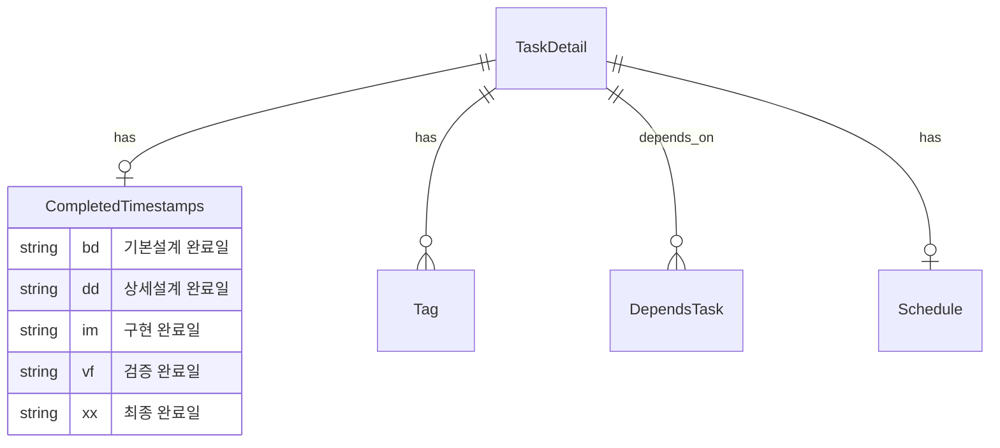
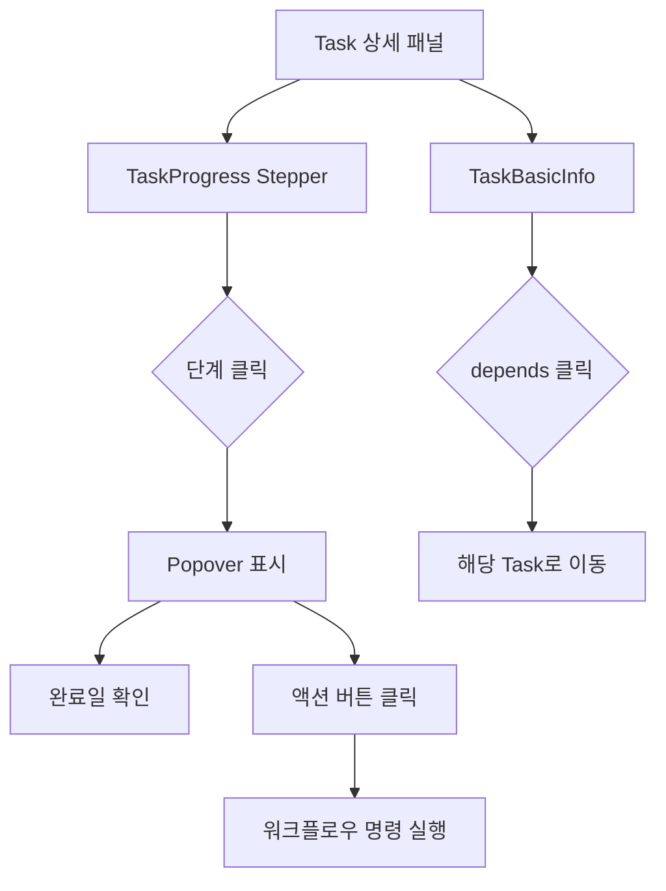

# 기본설계: Task Panel Enhancement - Stepper & Missing Info

## 문서 정보
| 항목 | 내용 |
|------|------|
| Task ID | TSK-08-07 |
| Category | development |
| 상태 | [bd] 기본설계 |
| 상위 Work Package | WP-08: Theme Migration & UI Polish |
| PRD 참조 | PRD 8.3.1, 8.3.2, 8.3.3 |
| 작성일 | 2025-12-16 |

---

## 1. 개요

### 1.1 목적
Task 상세 패널의 사용성 개선을 위해 워크플로우 진행 상황을 직관적인 Stepper UI로 시각화하고, 각 단계에서 실행 가능한 액션을 Popover로 제공합니다. 또한 WBS에 정의된 Task 정보 중 현재 패널에서 표시되지 않는 정보(schedule, tags, depends, ref, completed)를 추가합니다.

### 1.2 구현 범위
> WBS Task 설명에서 추출

- TaskDetail 타입에 completed 필드 추가
- getTaskDetail() API에서 completed 반환
- TaskProgress를 클릭 가능한 Stepper로 변경
- Stepper 단계 클릭 시 Popover 표시 (완료일 + 액션 버튼)
- Auto 버튼 추가 (wf:auto 명령어 연결)
- 상태 전이 액션 (start, draft, build, verify, done, fix, skip)
- 상태 내 액션 (ui, review, apply, test, audit, patch)
- TaskBasicInfo에 누락 정보 추가 (schedule, tags, depends, ref)
- depends 클릭 시 해당 Task로 이동
- 접근성 준수 (WCAG 2.1)

### 1.3 제외 범위
> 동일 PRD 섹션이지만 다른 Task에서 구현

- 롤백 액션 UI (향후 별도 Task에서 구현)
- wf:auto 명령어 자체 구현 (슬래시 명령어 영역)

---

## 2. 사용자 시나리오

### 2.1 주요 사용자
- **개발자**: Task 상세 화면에서 워크플로우 진행 상황 확인 및 액션 실행
- **프로젝트 관리자**: Task의 일정, 의존성, 진행 상태 파악

### 2.2 사용 시나리오

**시나리오 1: 워크플로우 단계 클릭으로 액션 실행**
1. 사용자가 Task 상세 패널에서 워크플로우 Stepper의 현재 단계를 클릭
2. Popover가 표시되며 맨 위에 해당 단계 완료일(또는 "미완료") 표시
3. 사용자가 실행 가능한 액션 버튼(예: build, ui, review) 클릭
4. 해당 워크플로우 명령어가 실행됨

**시나리오 2: Auto 버튼으로 자동 워크플로우 실행**
1. 사용자가 Stepper의 현재 단계 Popover에서 Auto 버튼 클릭
2. wf:auto 명령어가 실행되어 현재 상태에서 완료까지 자동 전이
3. 각 단계별 문서가 자동 생성됨

**시나리오 3: 의존성 Task로 이동**
1. 사용자가 TaskBasicInfo의 depends 영역에서 의존 Task ID 클릭
2. 해당 Task의 상세 패널로 전환됨

**시나리오 4: Task 메타정보 확인**
1. 사용자가 Task 상세 패널에서 일정(schedule), 태그(tags), 참조문서(ref) 확인
2. 각 정보가 적절한 UI 컴포넌트로 시각화됨

---

## 3. 기능 요구사항
> PRD 8.3에서 범위 내 항목만 추출

### 3.1 백엔드 - TaskDetail 타입 확장
**설명**: Task 상세 조회 시 completed(단계별 완료일) 정보 반환
**입력**: Task ID
**출력**: TaskDetail (completed 필드 포함)
**제약조건**: 기존 API 호환성 유지

### 3.2 TaskProgress Stepper 변환
**설명**: 기존 원형 노드 기반 워크플로우를 클릭 가능한 Stepper로 변경
**입력**: TaskDetail (category, status, completed, availableActions)
**출력**: 인터랙티브 Stepper UI
**제약조건**:
- 카테고리별(development, defect, infrastructure) 워크플로우 지원
- 현재 단계 강조, 완료 단계 체크 표시, 미완료 단계 비활성화

### 3.3 Stepper Popover
**설명**: 단계 클릭 시 완료일 및 액션 버튼을 보여주는 Popover
**입력**: 선택된 단계 인덱스, Task 정보
**출력**: Popover UI (완료일, Auto 버튼, 액션 버튼들)
**제약조건**:
- 완료일이 맨 위에 표시
- Auto 버튼은 현재 단계에서만 활성화
- 액션 버튼은 현재 단계에서만 활성화

### 3.4 TaskBasicInfo 확장
**설명**: 누락된 Task 메타정보 표시
**입력**: TaskDetail (schedule, tags, depends, ref)
**출력**: 추가 필드 UI
**제약조건**:
- schedule: 시작일 ~ 종료일 텍스트
- tags: Tag 컴포넌트 (복수)
- depends: 클릭 가능한 링크 버튼
- ref: 텍스트

---

## 4. 비즈니스 규칙
> PRD에서 추출한 범위 내 규칙만

| 규칙 ID | 규칙 설명 | 적용 시점 |
|---------|----------|----------|
| BR-001 | 현재 단계의 액션 버튼만 활성화 | Popover 렌더링 |
| BR-002 | 완료된 단계는 체크 아이콘 표시 | Stepper 렌더링 |
| BR-003 | 미완료 단계는 비활성화 스타일 적용 | Stepper 렌더링 |
| BR-004 | Auto 버튼은 현재 단계 Popover에서만 표시 | Popover 렌더링 |
| BR-005 | depends 클릭 시 해당 Task 상세로 이동 | TaskBasicInfo |

---

## 5. 데이터 요구사항 (개념)
> 비즈니스 관점의 데이터 정의

### 5.1 주요 데이터
| 데이터 | 설명 | 비즈니스 의미 |
|--------|------|--------------|
| completed | 단계별 완료 타임스탬프 | 각 워크플로우 단계 완료 시점 추적 |
| schedule | 시작일/종료일 | Task 일정 관리 |
| tags | 태그 목록 | Task 분류 및 검색 |
| depends | 의존 Task ID 목록 | Task 간 선후행 관계 |
| ref | 참조 문서 | PRD, TRD 등 관련 문서 참조 |

### 5.2 데이터 관계


---

## 6. 화면 요구사항 (개념)
> 사용자 관점의 화면 정의

### 6.1 화면 목록
| 화면 | 목적 | 주요 기능 |
|------|------|----------|
| TaskProgress (Stepper) | 워크플로우 진행 상황 시각화 | 단계 표시, 클릭으로 Popover 열기 |
| Step Popover | 단계별 상세 정보 및 액션 제공 | 완료일 표시, 액션 버튼 |
| TaskBasicInfo (확장) | Task 메타정보 표시 | 일정, 태그, 의존성, 참조 표시 |

### 6.2 화면 흐름


### 6.3 화면 와이어프레임 (개념)

**TaskProgress Stepper**
```
┌─────────────────────────────────────────────────────────┐
│ 진행 상태                                                │
├─────────────────────────────────────────────────────────┤
│  [✓ Todo] ─── [✓ 기본설계] ─── [● 상세설계] ─── [○ 구현] ─── [○ 완료] │
│                                    ↓ (클릭)                        │
│                          ┌─────────────────┐                       │
│                          │ 📅 2025-12-16   │ ← 완료일              │
│                          │ ─────────────── │                       │
│                          │ [⚡ Auto]       │ ← 자동실행             │
│                          │ ─────────────── │                       │
│                          │ [build] [ui]    │ ← 상태전이/내액션      │
│                          │ [review][apply] │                       │
│                          └─────────────────┘                       │
│                                                                    │
│  진행률: ████████████░░░░░░ 60%                                    │
└────────────────────────────────────────────────────────────────────┘
```

**TaskBasicInfo 확장**
```
┌─────────────────────────────────────────────────────────┐
│ 기본 정보                                                │
├─────────────────────────────────────────────────────────┤
│ Task ID: [development] TSK-08-07                        │
│ 제목: Task Panel Enhancement                            │
│ ─────────────────────────────────────────               │
│ 우선순위: [높음 ▼]     담당자: [hong ▼]                 │
│ ─────────────────────────────────────────               │
│ 📅 일정: 2025-12-16 ~ 2025-12-20                        │
│ 🏷️ 태그: [stepper] [popover] [taskpanel] [ui]           │
│ 🔗 의존성: [TSK-08-06]  ← 클릭 가능                     │
│ 📄 참조: PRD 6.3, TRD 2.3.6                             │
└─────────────────────────────────────────────────────────┘
```

---

## 7. 인터페이스 요구사항 (개념)
> 비즈니스 관점의 API 정의

| 기능 | 설명 | 입력 | 출력 |
|------|------|------|------|
| Task 상세 조회 | completed 포함한 Task 정보 반환 | Task ID | TaskDetail (completed 포함) |
| Task 선택 | 의존 Task 클릭 시 해당 Task로 전환 | Task ID | 선택된 Task 상세 |

---

## 8. 수용 기준
> 비즈니스 관점의 완료 조건

- [ ] TaskDetail API에서 completed 필드 반환
- [ ] TaskProgress가 Stepper 형태로 렌더링
- [ ] Stepper 단계 클릭 시 Popover 표시
- [ ] Popover 맨 위에 완료일 표시
- [ ] Popover에 Auto 버튼 표시 및 동작
- [ ] Popover에 해당 단계 액션 버튼 표시
- [ ] 현재 단계만 액션 버튼 활성화
- [ ] TaskBasicInfo에 schedule 표시
- [ ] TaskBasicInfo에 tags 표시 (Tag 컴포넌트)
- [ ] TaskBasicInfo에 depends 표시 (클릭 시 이동)
- [ ] TaskBasicInfo에 ref 표시
- [ ] 키보드 접근성 지원 (Tab, Enter, Escape)
- [ ] 다크 테마 호환

---

## 9. 다음 단계
- `/wf:ui` 명령어로 화면설계 진행
- `/wf:draft` 명령어로 상세설계 진행

---

## 관련 문서
- PRD: `.orchay/docs/orchay/orchay-prd.md` (섹션 8.3)
- 승인된 계획: `C:\Users\sviso\.claude\plans\rippling-coalescing-lemur.md`
- 기존 컴포넌트: `app/components/wbs/detail/TaskProgress.vue`
- 기존 컴포넌트: `app/components/wbs/detail/TaskBasicInfo.vue`
