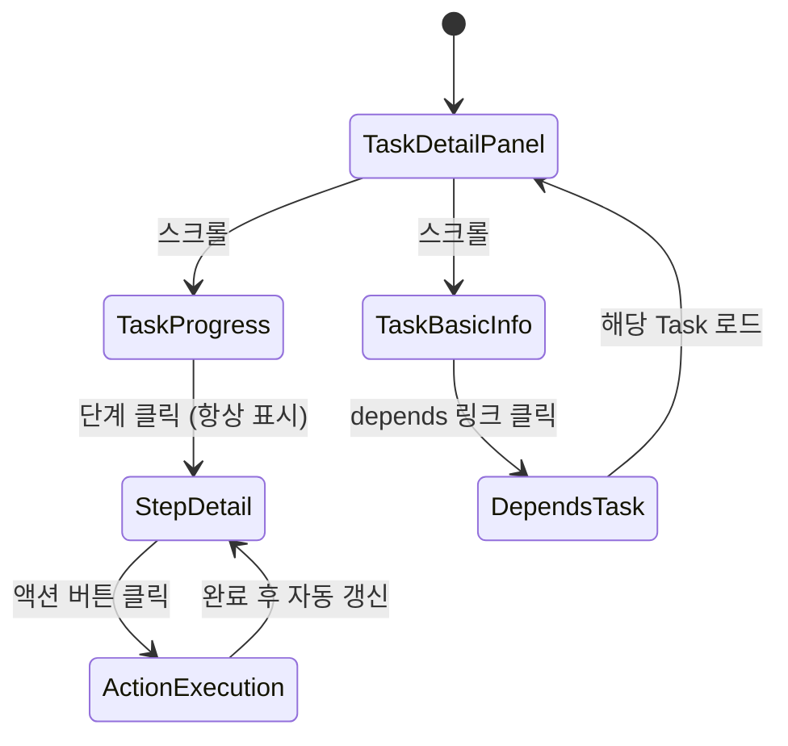
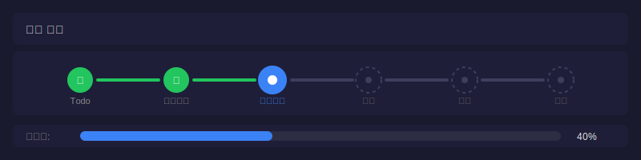
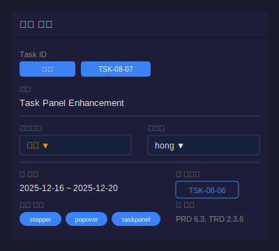

# 화면설계: Task Panel Enhancement - Stepper & Missing Info

## 문서 정보
| 항목 | 내용 |
|------|------|
| Task ID | TSK-08-07 |
| Category | development |
| 상태 | [xx] 완료 |
| 기본설계 참조 | 010-basic-design.md |
| 작성일 | 2025-12-16 |
| 수정일 | 2025-12-16 |

## 변경 이력
| 버전 | 날짜 | 변경 내용 |
|------|------|----------|
| 1.0 | 2025-12-16 | 초기 작성 |
| 1.1 | 2025-12-16 | **Popover→고정영역 변경** (SCR-02 업데이트) |

---

## 1. 화면 목록

| 화면 ID | 화면명 | 목적 | SVG 파일 |
|---------|--------|------|----------|
| SCR-01 | TaskProgress Stepper | 워크플로우 진행 상황 시각화 | screen-01-stepper.svg |
| SCR-02 | Step Detail Area | 단계별 완료일 및 액션 버튼 제공 (고정 영역) | screen-02-detail.svg |
| SCR-03 | TaskBasicInfo 확장 | 누락 정보(schedule, tags, depends, ref) 표시 | screen-03-basicinfo.svg |

---

## 2. 화면 전환 흐름

### 2.1 전체 흐름도 (v1.1 업데이트)



### 2.2 액션-화면 매트릭스 (v1.1 업데이트)

| 현재 화면 | 사용자 액션 | 결과 | 조건 |
|----------|------------|------|------|
| TaskProgress | 단계 클릭 | 해당 단계 정보 표시 (하단 고정 영역) | 항상 표시, 토글 없음 |
| StepDetail | Auto 버튼 클릭 | wf:auto 실행 | 현재 단계만 표시 |
| StepDetail | 액션 버튼 클릭 | 워크플로우 명령 실행 | 현재 단계만 enabled |
| TaskBasicInfo | depends 클릭 | 해당 Task로 이동 | - |

---

## 3. 화면별 상세 설계

### 3.1 SCR-01: TaskProgress Stepper

#### 3.1.1 화면 목적
워크플로우 진행 상황을 수평 Stepper 형태로 시각화하고, 각 단계를 클릭하여 Popover를 열 수 있게 함

#### 3.1.2 레이아웃 구조
```
┌─────────────────────────────────────────────────────────────────┐
│ 진행 상태                                              [Panel] │
├─────────────────────────────────────────────────────────────────┤
│                                                                 │
│  [✓]──────[✓]──────[●]──────[○]──────[○]                       │
│  Todo    기본설계   상세설계   구현     완료                     │
│                      ↑                                          │
│                   (클릭 가능)                                   │
│                                                                 │
│  진행률: ████████████░░░░░░░░░░ 40%                             │
│                                                                 │
└─────────────────────────────────────────────────────────────────┘
```

#### 3.1.3 SVG 참조
- 기본 상태: 
- 호버 상태: 

#### 3.1.4 컴포넌트 목록

| 컴포넌트 | 타입 | 위치 | 동작 |
|----------|------|------|------|
| Panel | PrimeVue Panel | Container | 진행 상태 섹션 |
| StepNode | Custom | 수평 배열 | 클릭 시 Popover 열기 |
| StepConnector | Custom | 노드 사이 | 진행 상태 표시 |
| ProgressBar | PrimeVue ProgressBar | 하단 | 진행률 표시 |

#### 3.1.5 단계 노드 스타일

| 상태 | 아이콘 | 배경색 | 테두리 | 크기 |
|------|--------|--------|--------|------|
| 완료 | pi-check | #22c55e (green) | 없음 | 32x32px |
| 현재 | pi-circle-fill | #3b82f6 (blue) | shadow | 36x36px (강조) |
| 미완료 | pi-circle | #1e1e38 (card) | dashed #3d3d5c | 32x32px |

#### 3.1.6 상태별 화면 변화

| 상태 | 표시 내용 | 사용 가능 액션 |
|------|----------|---------------|
| 초기 | 카테고리별 워크플로우 단계 | 모든 단계 클릭 가능 |
| 호버 | 해당 단계 확대 + 커서 변경 | 클릭 |
| 포커스 | 파란색 링 표시 | Enter로 Popover 열기 |

---

### 3.2 SCR-02: Step Popover

#### 3.2.1 화면 목적
선택한 단계의 완료일과 실행 가능한 액션 버튼을 제공

#### 3.2.2 레이아웃 구조
```
┌───────────────────────────┐
│ 📅 2025-12-16 14:30       │ ← 완료일 (맨 위)
├───────────────────────────┤
│ [⚡ Auto]                 │ ← 자동 실행 버튼
├───────────────────────────┤
│ [build] [ui]              │ ← 상태 전이/내 액션
│ [review] [apply]          │
└───────────────────────────┘
```

#### 3.2.3 SVG 참조
- 현재 단계 Popover: 
- 완료 단계 Popover: 
- 미완료 단계 Popover: 

#### 3.2.4 컴포넌트 목록

| 컴포넌트 | 타입 | 위치 | 동작 |
|----------|------|------|------|
| Popover | PrimeVue Popover | 단계 노드 아래 | 토글 |
| CompletedDate | 텍스트 + 아이콘 | 상단 | 완료일 표시 |
| AutoButton | PrimeVue Button | 완료일 아래 | wf:auto 실행 |
| ActionButtons | PrimeVue Button[] | 하단 | 워크플로우 명령 실행 |

#### 3.2.5 버튼 스타일

| 버튼 | severity | 아이콘 | 활성화 조건 |
|------|----------|--------|------------|
| Auto | help (보라) | pi-bolt | 현재 단계 |
| start | primary | pi-play | 현재 단계 |
| draft | info | pi-pencil | 현재 단계 |
| build | success | pi-cog | 현재 단계 |
| ui | info | pi-palette | 현재 단계 |
| review | info | pi-eye | 현재 단계 |
| apply | success | pi-check | 현재 단계 |
| test | warn | pi-bolt | 현재 단계 |
| audit | info | pi-search | 현재 단계 |
| patch | success | pi-wrench | 현재 단계 |
| verify | warn | pi-check-circle | 현재 단계 |
| done | success | pi-flag | 현재 단계 |

#### 3.2.6 상태별 화면 변화

| 단계 상태 | 완료일 표시 | Auto 버튼 | 액션 버튼 |
|----------|------------|----------|----------|
| 현재 | 표시 (있으면) | 활성화 | 활성화 |
| 완료 | 완료 타임스탬프 | 비활성화 | 비활성화 |
| 미완료 | "미완료" | 비활성화 | 비활성화 |

---

### 3.3 SCR-03: TaskBasicInfo 확장

#### 3.3.1 화면 목적
WBS에 정의된 Task 정보 중 현재 표시되지 않는 정보를 추가 표시

#### 3.3.2 레이아웃 구조
```
┌─────────────────────────────────────────────────────────────────┐
│ 기본 정보                                              [Panel] │
├─────────────────────────────────────────────────────────────────┤
│ Task ID: [development] TSK-08-07                                │
│ 제목: [편집 가능 텍스트]                                        │
│ ─────────────────────────────────────────                       │
│ [작업 버튼들]                                                   │
│ ─────────────────────────────────────────                       │
│ 우선순위: [높음 ▼]          담당자: [hong ▼]                    │
│ ─────────────────────────────────────────                       │
│ 📅 일정: 2025-12-16 ~ 2025-12-20                    ← 추가     │
│ 🏷️ 태그: [stepper] [popover] [taskpanel]            ← 추가     │
│ 🔗 의존성: [TSK-08-06]                              ← 추가     │
│ 📄 참조: PRD 6.3, TRD 2.3.6                         ← 추가     │
└─────────────────────────────────────────────────────────────────┘
```

#### 3.3.3 SVG 참조
- 전체 정보 표시: 
- 최소 정보 (schedule/tags 없음): 

#### 3.3.4 추가 필드 컴포넌트

| 필드 | 컴포넌트 | 아이콘 | 동작 |
|------|----------|--------|------|
| schedule | 텍스트 | pi-calendar | 읽기 전용 |
| tags | Tag[] | - | 읽기 전용, 복수 |
| depends | Button (text) | pi-link | 클릭 시 해당 Task로 이동 |
| ref | 텍스트 | pi-file | 읽기 전용 |

#### 3.3.5 depends 클릭 동작

```typescript
function navigateToTask(taskId: string) {
  selectionStore.selectNode(taskId)
}
```

---

## 4. 공통 컴포넌트

### 4.1 알림/토스트

| 알림 타입 | 메시지 | 표시 조건 |
|----------|--------|----------|
| 성공 | "{액션명} 명령이 실행되었습니다" | 액션 성공 시 |
| 에러 | "명령 실행에 실패했습니다" | API 에러 시 |

---

## 5. 접근성 고려사항

| 항목 | 적용 내용 |
|------|----------|
| 키보드 네비게이션 | Tab으로 단계 이동, Enter로 Popover 열기, Escape로 닫기 |
| 스크린 리더 | role="button", aria-label="단계명 단계", aria-current="step" |
| 포커스 표시 | focus:ring-2 focus:ring-primary |
| 색상 대비 | WCAG 2.1 AA 기준 충족 |

---

## 6. SVG 파일 목록

| 파일명 | 화면 | 상태 |
|--------|------|------|
| screen-01-stepper.svg | TaskProgress | 기본 |
| screen-01-stepper-hover.svg | TaskProgress | 호버 |
| screen-02-popover.svg | Popover | 현재 단계 |
| screen-02-popover-completed.svg | Popover | 완료 단계 |
| screen-02-popover-disabled.svg | Popover | 미완료 단계 |
| screen-03-basicinfo.svg | TaskBasicInfo | 전체 정보 |
| screen-03-basicinfo-minimal.svg | TaskBasicInfo | 최소 정보 |

---

## 7. 다음 단계
- `/wf:draft` 명령어로 상세설계 진행
- 화면설계 내용을 상세설계 UI/UX 섹션에 반영

---

## 관련 문서
- 기본설계: `010-basic-design.md`
- PRD: `.orchay/docs/orchay/orchay-prd.md`
