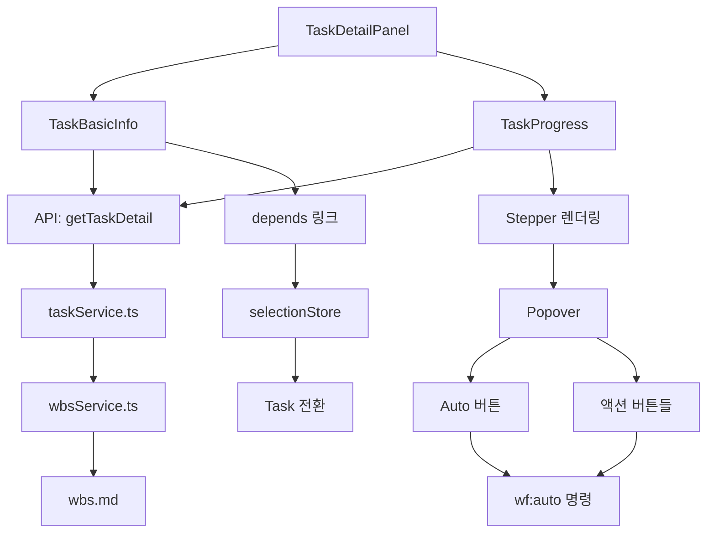
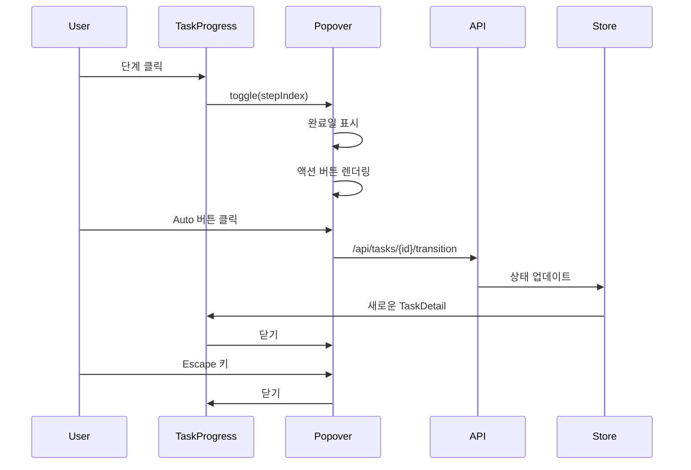

# 상세설계: Task Panel Enhancement - Stepper & Missing Info

## 문서 정보
| 항목 | 내용 |
|------|------|
| Task ID | TSK-08-07 |
| Category | development |
| 상태 | [im] 구현 |
| 기본설계 참조 | 010-basic-design.md |
| UI설계 참조 | 011-ui-design.md |
| 작성일 | 2025-12-16 |
| 수정일 | 2025-12-16 |

## 변경 이력

| 버전 | 날짜 | 변경 내용 |
|------|------|----------|
| 1.0 | 2025-12-16 | 초기 작성 |
| 1.1 | 2025-12-16 | Popover 액션 버튼 표시 로직 변경 |
| 1.2 | 2025-12-16 | **Popover→고정영역, test 구현 이후 상태 허용** |

### v1.2 변경 사항 (2025-12-16)

**UI 변경:**
- **기존**: Stepper 클릭 시 Popover(툴팁) 표시
- **변경**: Stepper 하단에 고정 영역으로 표시

**동작 변경:**
1. Popover 제거 → `.workflow-step-detail` 고정 영역
2. 토글 없음: 같은 단계 클릭해도 닫히지 않음
3. 항상 표시: 마운트 시 현재 단계 자동 선택
4. 선택 하이라이트: ring-2 ring-primary 표시

**test 액션 확장:**
- 구현([im]) 이후 모든 상태에서 test 실행 가능
- [vf], [xx] 상태에도 test 버튼 표시

### v1.1 변경 사항 (2025-12-16)

**요구사항 변경:**
- **기존**: 현재 단계만 액션 버튼 표시
- **변경**: 모든 단계에서 해당 단계의 액션 버튼 표시, 현재 단계가 아니면 disabled 처리

**상세 내용:**
1. 각 단계에서 해당 단계의 모든 액션 버튼을 표시
2. 현재 단계: 액션 버튼 활성화 (enabled)
3. 완료/미완료 단계: 액션 버튼 비활성화 (disabled)
4. Auto 버튼은 현재 단계에서만 표시 (기존 유지)

**상태별 액션 매핑 (v1.2 업데이트):**

| Category | 상태 | 액션 목록 |
|----------|------|----------|
| development | [ ] | start |
| development | [bd] | draft, ui |
| development | [dd] | build, review, apply |
| development | [im] | verify, test, audit, patch |
| development | [vf] | done, **test** |
| development | [xx] | **test** |
| defect | [ ] | start |
| defect | [an] | fix |
| defect | [fx] | verify, test, audit, patch |
| defect | [vf] | done, **test** |
| defect | [xx] | **test** |
| infrastructure | [ ] | start, skip |
| infrastructure | [ds] | build |
| infrastructure | [im] | done, **test**, audit, patch |
| infrastructure | [xx] | **test** |

---

## 1. 개요

### 1.1 목적
Task 상세 패널의 워크플로우 진행 상황을 직관적인 Stepper UI로 시각화하고, 각 단계에서 실행 가능한 액션을 Popover로 제공하여 사용성을 개선합니다. 또한 WBS에 정의된 누락 정보(schedule, tags, depends, ref, completed)를 Task 상세 화면에 추가합니다.

### 1.2 설계 범위
- **타입 정의**: TaskDetail 인터페이스 확장
- **백엔드 API**: getTaskDetail() 함수 수정
- **프론트엔드 컴포넌트**: TaskProgress, TaskBasicInfo 개선
- **CSS 스타일**: main.css에 새로운 클래스 추가
- **접근성**: WCAG 2.1 AA 준수

### 1.3 참조 문서
- 기본설계: `010-basic-design.md`
- UI설계: `011-ui-design.md`
- PRD: `.orchay/docs/orchay/orchay-prd.md` (섹션 8.3)
- 기존 컴포넌트: `app/components/wbs/detail/TaskProgress.vue`, `TaskBasicInfo.vue`

---

## 2. 아키텍처 설계

### 2.1 시스템 구조


### 2.2 컴포넌트 계층
```
TaskDetailPanel.vue
├── TaskBasicInfo.vue (확장)
│   ├── ID, 제목, 카테고리
│   ├── 우선순위, 담당자
│   ├── schedule (추가)
│   ├── tags (추가)
│   ├── depends (추가, 클릭 가능)
│   └── ref (추가)
├── TaskProgress.vue (Stepper 변환)
│   ├── 현재 상태 Badge
│   ├── 워크플로우 Stepper (클릭 가능)
│   │   └── Popover (PrimeVue)
│   │       ├── 완료일 (completed)
│   │       ├── Auto 버튼
│   │       └── 액션 버튼들
│   └── 진행률 Bar
└── (기타 컴포넌트)
```

### 2.3 데이터 흐름


---

## 3. 데이터베이스 설계 (파일 구조)

### 3.1 데이터 모델

**wbs.md 확장 (TaskDetail)**
```yaml
#### TSK-08-07: Task Panel Enhancement
- category: development
- status: [bd]
- priority: high
- assignee: hong
- schedule: 2025-12-16 ~ 2025-12-20          # 추가: 일정
- tags: stepper, popover, taskpanel, ui      # 추가: 태그
- depends: TSK-08-06                         # 추가: 의존성
- ref: PRD 8.3.1, 8.3.2, 8.3.3               # 추가: 참조
- requirements: [...]
- completed:                                  # 추가: 단계별 완료일
    bd: 2025-12-16 14:30
    dd: 2025-12-16 18:45
```

### 3.2 타입 정의 수정

**파일**: `types/index.ts`

```typescript
// 기존 CompletedTimestamps (라인 28)
export type CompletedTimestamps = Record<string, string>;

// 기존 WbsNode 인터페이스 (라인 31-50)
export interface WbsNode {
  id: string;
  type: WbsNodeType;
  title: string;
  status?: string;
  category?: TaskCategory;
  priority?: Priority;
  assignee?: string;
  schedule?: ScheduleRange;
  tags?: string[];
  depends?: string;         // 이미 존재
  requirements?: string[];
  ref?: string;             // 이미 존재
  progress?: number;
  taskCount?: number;
  children: WbsNode[];
  expanded?: boolean;
  attributes?: Record<string, string>;
  completed?: CompletedTimestamps;  // 이미 존재 (라인 49)
}

// 기존 TaskDetail 인터페이스 수정 (라인 74-94)
export interface TaskDetail {
  id: string;
  title: string;
  category: TaskCategory;
  status: TaskStatus;
  priority: Priority;
  assignee?: TeamMember;
  parentWp: string;
  parentAct?: string;
  schedule?: {
    start: string;
    end: string;
  };
  requirements: string[];
  tags: string[];
  depends?: string[];       // 이미 존재 (라인 89)
  ref?: string;             // 이미 존재 (라인 90)
  documents: DocumentInfo[];
  history: HistoryEntry[];
  availableActions: string[];
  completed?: CompletedTimestamps;  // 추가 (신규)
}
```

**변경 사항**:
- `TaskDetail.completed` 필드 추가 (라인 94 이후)
- 기존 필드(`depends`, `ref`, `schedule`, `tags`)는 이미 존재하므로 수정 불필요

---

## 4. API 설계

### 4.1 Task 상세 조회 API (수정)

**엔드포인트**: `GET /api/tasks/:taskId`

**파일**: `server/api/tasks/[taskId].get.ts` (기존)

**응답 변경**:
```typescript
// 기존 응답에 completed 필드 추가
{
  "id": "TSK-08-07",
  "title": "Task Panel Enhancement",
  "category": "development",
  "status": "[bd]",
  "priority": "high",
  "assignee": { "id": "hong", "name": "Hong" },
  "parentWp": "WP-08",
  "schedule": {
    "start": "2025-12-16",
    "end": "2025-12-20"
  },
  "tags": ["stepper", "popover", "taskpanel", "ui"],
  "depends": ["TSK-08-06"],
  "ref": "PRD 8.3.1, 8.3.2, 8.3.3",
  "documents": [...],
  "history": [...],
  "availableActions": ["draft"],
  "completed": {                   // 추가
    "bd": "2025-12-16 14:30",
    "dd": "2025-12-16 18:45"
  }
}
```

### 4.2 백엔드 서비스 수정

**파일**: `server/utils/wbs/taskService.ts`

**함수**: `getTaskDetail()` (라인 280-326)

**수정 내용**:
```typescript
// 라인 308-325: return 문 수정
export async function getTaskDetail(taskId: string): Promise<TaskDetail> {
  const searchResult = await findTaskById(taskId);
  if (!searchResult) {
    throw createNotFoundError(`Task를 찾을 수 없습니다: ${taskId}`);
  }

  const { task, projectId, parentWp, parentAct } = searchResult;

  // 팀원 정보 조회
  const teamJsonPath = getTeamJsonPath(projectId);
  const teamData = await readJsonFile<{ members: TeamMember[] }>(teamJsonPath);
  const assignee = teamData?.members?.find((m) => m.id === task.assignee) || null;

  // 문서 목록 조회
  const documents = await buildDocumentInfoList(projectId, taskId);

  // 이력 조회
  const historyPath = join(getTaskFolderPath(projectId, taskId), 'history.json');
  const historyData = await readJsonFile<HistoryEntry[]>(historyPath);
  const history = historyData || [];

  // 가능한 액션 조회
  const availableActions = getAvailableActions(
    task.category as TaskCategory,
    task.status || '[ ]'
  );

  return {
    id: task.id,
    title: task.title,
    category: task.category as TaskCategory,
    status: (task.status || '[ ]') as TaskStatus,
    priority: (task.priority || 'medium') as any,
    assignee: assignee || undefined,
    parentWp,
    parentAct,
    schedule: task.schedule,
    requirements: task.requirements || [],
    tags: task.tags || [],
    depends: task.depends ? [task.depends] : [],
    ref: task.ref,
    documents,
    history,
    availableActions,
    completed: task.completed,  // 추가 (신규 라인)
  };
}
```

**변경 라인**: 라인 325 이후 `completed: task.completed` 추가

---

## 5. 프론트엔드 설계

### 5.1 TaskProgress.vue Stepper 변환

**파일**: `app/components/wbs/detail/TaskProgress.vue`

#### 5.1.1 컴포넌트 구조 변경

**현재 구조** (라인 17-67):
- 읽기 전용 워크플로우 노드 (원형 + 연결선)
- 클릭 불가능

**신규 구조**:
- 클릭 가능한 Stepper 노드
- PrimeVue Popover 통합
- 단계별 Popover 토글

#### 5.1.2 템플릿 변경

```vue
<template>
  <Panel header="진행 상태" data-testid="task-progress-panel" class="task-progress">
    <div class="space-y-4">
      <!-- 현재 상태 Badge (기존 유지) -->
      <div class="field">
        <label class="font-semibold text-sm text-gray-600">현재 상태</label>
        <div class="mt-1">
          <Badge
            :value="statusLabel"
            :severity="statusSeverity"
            data-testid="task-status-badge"
            class="text-sm"
          />
        </div>
      </div>

      <!-- 워크플로우 Stepper (변경) -->
      <div class="field">
        <label class="font-semibold text-sm text-gray-600">워크플로우 진행</label>
        <div class="mt-2 workflow-container" data-testid="workflow-steps-container">
          <template v-for="(step, index) in workflowSteps" :key="step.code">
            <!-- 단계 노드 (클릭 가능) -->
            <div class="workflow-step-item">
              <button
                :id="`step-${index}`"
                class="workflow-step-circle workflow-step-clickable"
                :class="{
                  'workflow-step-current': index === currentStepIndex,
                  'workflow-step-completed': index < currentStepIndex,
                  'workflow-step-pending': index > currentStepIndex,
                }"
                :aria-label="`${step.label} 단계`"
                :aria-current="index === currentStepIndex ? 'step' : undefined"
                role="button"
                tabindex="0"
                :data-testid="index === currentStepIndex ? 'workflow-step-current' : `workflow-step-${index}`"
                @click="togglePopover(index, $event)"
                @keydown.enter="togglePopover(index, $event)"
                @keydown.space.prevent="togglePopover(index, $event)"
              >
                <i
                  v-if="index < currentStepIndex"
                  class="pi pi-check text-white"
                />
                <i
                  v-else-if="index === currentStepIndex"
                  class="pi pi-circle-fill text-white"
                />
                <i
                  v-else
                  class="pi pi-circle text-gray-400"
                />
              </button>

              <!-- Popover (PrimeVue) -->
              <Popover
                :ref="el => popoverRefs[index] = el"
                class="step-popover"
              >
                <div class="step-popover-content">
                  <!-- 완료일 (맨 위) -->
                  <div class="step-completed-date">
                    <i class="pi pi-calendar text-sm"></i>
                    <span class="ml-2 text-sm">{{ getCompletedDate(step.code) }}</span>
                  </div>

                  <!-- Auto 버튼 (현재 단계만) -->
                  <div v-if="index === currentStepIndex" class="step-actions-divider"></div>
                  <Button
                    v-if="index === currentStepIndex"
                    label="Auto"
                    icon="pi pi-bolt"
                    severity="help"
                    size="small"
                    :loading="executingCommand === 'auto'"
                    :disabled="executingCommand !== null"
                    class="w-full"
                    @click="executeAutoCommand"
                  />

                  <!-- 액션 버튼들 (현재 단계만) -->
                  <div v-if="index === currentStepIndex && stepActions.length > 0" class="step-actions-divider"></div>
                  <div v-if="index === currentStepIndex" class="step-actions">
                    <Button
                      v-for="action in stepActions"
                      :key="action"
                      :label="getActionLabel(action)"
                      :icon="getActionIcon(action)"
                      :severity="getActionSeverity(action)"
                      size="small"
                      :loading="executingCommand === action"
                      :disabled="executingCommand !== null"
                      @click="executeAction(action)"
                    />
                  </div>
                </div>
              </Popover>

              <!-- 단계 라벨 -->
              <div
                class="workflow-step-label"
                :class="{
                  'font-semibold text-blue-600': index === currentStepIndex,
                  'text-gray-600': index !== currentStepIndex,
                }"
              >
                {{ step.label }}
              </div>
            </div>

            <!-- 연결선 (기존 유지) -->
            <div
              v-if="index < workflowSteps.length - 1"
              class="workflow-connector"
              :class="{
                'workflow-connector-completed': index < currentStepIndex,
                'workflow-connector-pending': index >= currentStepIndex,
              }"
            />
          </template>
        </div>
      </div>

      <!-- 진행률 (기존 유지) -->
      <div class="field">
        <label class="font-semibold text-sm text-gray-600">진행률</label>
        <div class="mt-1">
          <ProgressBar
            :value="progressPercentage"
            :show-value="true"
            class="progress-bar-thick"
          />
        </div>
      </div>
    </div>
  </Panel>
</template>
```

#### 5.1.3 스크립트 변경

```typescript
<script setup lang="ts">
import type { TaskDetail } from '~/types'

// Props
interface Props {
  task: TaskDetail
}

const props = defineProps<Props>()

// Stores & Composables
const selectionStore = useSelectionStore()
const notification = useNotification()
const errorHandler = useErrorHandler()

// State
const popoverRefs = ref<any[]>([])
const executingCommand = ref<string | null>(null)

// Computed (기존 유지 + 확장)
const statusLabel = computed(() => {
  const labels: Record<string, string> = {
    '[ ]': '시작 전',
    '[bd]': '기본설계',
    '[dd]': '상세설계',
    '[an]': '분석',
    '[ds]': '설계',
    '[im]': '구현',
    '[fx]': '수정',
    '[vf]': '검증',
    '[xx]': '완료',
  }
  return labels[props.task.status] || props.task.status
})

const statusSeverity = computed(() => {
  const severities: Record<string, 'info' | 'success' | 'warning' | 'danger'> = {
    '[ ]': 'info',
    '[bd]': 'warning',
    '[dd]': 'warning',
    '[an]': 'warning',
    '[ds]': 'warning',
    '[im]': 'info',
    '[fx]': 'danger',
    '[vf]': 'warning',
    '[xx]': 'success',
  }
  return severities[props.task.status] || 'info'
})

const workflowSteps = computed(() => {
  interface WorkflowStep {
    code: string
    label: string
  }

  const workflows: Record<string, WorkflowStep[]> = {
    development: [
      { code: '[ ]', label: '시작 전' },
      { code: '[bd]', label: '기본설계' },
      { code: '[dd]', label: '상세설계' },
      { code: '[im]', label: '구현' },
      { code: '[vf]', label: '검증' },
      { code: '[xx]', label: '완료' },
    ],
    defect: [
      { code: '[ ]', label: '시작 전' },
      { code: '[an]', label: '분석' },
      { code: '[fx]', label: '수정' },
      { code: '[vf]', label: '검증' },
      { code: '[xx]', label: '완료' },
    ],
    infrastructure: [
      { code: '[ ]', label: '시작 전' },
      { code: '[ds]', label: '설계' },
      { code: '[im]', label: '구현' },
      { code: '[xx]', label: '완료' },
    ],
  }

  return workflows[props.task.category] || workflows.development
})

const currentStepIndex = computed(() => {
  const index = workflowSteps.value.findIndex(step => step.code === props.task.status)
  return index !== -1 ? index : 0
})

const progressPercentage = computed(() => {
  const total = workflowSteps.value.length - 1
  if (total === 0) return 0
  return Math.round((currentStepIndex.value / total) * 100)
})

const stepActions = computed(() => {
  return props.task.availableActions || []
})

// Methods
function togglePopover(index: number, event: Event) {
  const popover = popoverRefs.value[index]
  if (popover) {
    popover.toggle(event)
  }
}

function getCompletedDate(stepCode: string): string {
  if (!props.task.completed || !props.task.completed[stepCode.replace(/[\[\]]/g, '')]) {
    return '미완료'
  }
  return props.task.completed[stepCode.replace(/[\[\]]/g, '')]
}

async function executeAutoCommand() {
  executingCommand.value = 'auto'
  try {
    await $fetch(`/api/tasks/${props.task.id}/transition`, {
      method: 'POST',
      body: { command: 'auto' },
    })
    await selectionStore.refreshTaskDetail()
    notification.success('Auto 명령이 실행되었습니다.')
    closeAllPopovers()
  } catch (error) {
    errorHandler.handle(error, 'TaskProgress.executeAutoCommand')
  } finally {
    executingCommand.value = null
  }
}

async function executeAction(action: string) {
  executingCommand.value = action
  try {
    await $fetch(`/api/tasks/${props.task.id}/transition`, {
      method: 'POST',
      body: { command: action },
    })
    await selectionStore.refreshTaskDetail()
    notification.success(`'${getActionLabel(action)}' 명령이 실행되었습니다.`)
    closeAllPopovers()
  } catch (error) {
    errorHandler.handle(error, 'TaskProgress.executeAction')
  } finally {
    executingCommand.value = null
  }
}

function closeAllPopovers() {
  popoverRefs.value.forEach(popover => {
    if (popover && popover.visible) {
      popover.hide()
    }
  })
}

function getActionLabel(action: string): string {
  const labels: Record<string, string> = {
    start: '시작',
    draft: '초안',
    build: '구현',
    verify: '검증',
    done: '완료',
    ui: 'UI',
    review: '리뷰',
    apply: '적용',
    test: '테스트',
    audit: '감사',
    patch: '패치',
    skip: '건너뛰기',
    fix: '수정',
  }
  return labels[action] || action
}

function getActionIcon(action: string): string {
  const icons: Record<string, string> = {
    start: 'pi-play',
    draft: 'pi-pencil',
    build: 'pi-cog',
    verify: 'pi-check-circle',
    done: 'pi-flag',
    ui: 'pi-palette',
    review: 'pi-eye',
    apply: 'pi-check',
    test: 'pi-bolt',
    audit: 'pi-search',
    patch: 'pi-wrench',
    skip: 'pi-forward',
    fix: 'pi-wrench',
  }
  return `pi ${icons[action] || 'pi-arrow-right'}`
}

function getActionSeverity(action: string): string {
  const severities: Record<string, string> = {
    start: 'primary',
    draft: 'info',
    build: 'success',
    verify: 'warn',
    done: 'success',
    ui: 'info',
    review: 'info',
    apply: 'success',
    test: 'warn',
    audit: 'info',
    patch: 'success',
    skip: 'secondary',
    fix: 'warn',
  }
  return severities[action] || 'secondary'
}
</script>
```

#### 5.1.4 스타일 변경

```vue
<style scoped>
/* 기존 스타일 유지 */
.task-progress .field {
  margin-bottom: 1rem;
}

.task-progress .field:last-child {
  margin-bottom: 0;
}

.workflow-container {
  display: flex;
  align-items: flex-start;
  justify-content: flex-start;
}

.workflow-step-item {
  display: flex;
  flex-direction: column;
  align-items: center;
  flex-shrink: 0;
}

/* 워크플로우 단계 원형 (버튼으로 변경) */
.workflow-step-circle {
  width: 28px;
  height: 28px;
  border-radius: 50%;
  display: flex;
  align-items: center;
  justify-content: center;
  transition: all 0.3s ease-in-out;
  font-size: 0.7rem;
  flex-shrink: 0;
  border: none;
  padding: 0;
  outline: none;
}

/* 클릭 가능 스타일 */
.workflow-step-clickable {
  cursor: pointer;
}

.workflow-step-clickable:hover {
  transform: scale(1.15);
}

.workflow-step-clickable:focus-visible {
  @apply ring-2 ring-primary ring-offset-2 ring-offset-bg;
}

.workflow-step-label {
  margin-top: 0.25rem;
  font-size: 0.65rem;
  text-align: center;
  white-space: nowrap;
}

.workflow-connector {
  width: 24px;
  height: 3px;
  flex-shrink: 0;
  margin-top: 12px;
  transition: background-color 0.5s ease-in-out;
}

.workflow-connector-completed {
  @apply bg-success;
}

.workflow-connector-pending {
  @apply bg-gray-500;
}

/* workflow-step-current, workflow-step-completed, workflow-step-pending
   클래스는 main.css에서 전역으로 정의됨 (CSS 중앙화 원칙) */

.progress-bar-thick {
  --p-progressbar-height: 1.25rem;
  --p-progressbar-border-radius: 0.625rem;
  --p-progressbar-label-font-size: 0.8rem;
}

/* Popover 커스텀 스타일 */
.step-popover-content {
  @apply p-3 min-w-[200px];
}

.step-completed-date {
  @apply flex items-center text-text-secondary pb-2;
}

.step-actions-divider {
  @apply border-t border-border my-2;
}

.step-actions {
  @apply flex flex-wrap gap-2;
}
</style>
```

---

### 5.2 TaskBasicInfo.vue 확장

**파일**: `app/components/wbs/detail/TaskBasicInfo.vue`

#### 5.2.1 템플릿 확장

**추가 위치**: 라인 162 이후 (우선순위/담당자 필드 아래)

```vue
      <!-- 일정 (추가) -->
      <div v-if="task.schedule" class="field">
        <label class="font-semibold text-sm text-gray-600">일정</label>
        <div class="mt-1 flex items-center gap-2">
          <i class="pi pi-calendar text-primary text-sm"></i>
          <span class="text-sm text-text">
            {{ formatSchedule(task.schedule) }}
          </span>
        </div>
      </div>

      <!-- 태그 (추가) -->
      <div v-if="task.tags && task.tags.length > 0" class="field">
        <label class="font-semibold text-sm text-gray-600">태그</label>
        <div class="mt-1 flex flex-wrap gap-2">
          <Tag
            v-for="tag in task.tags"
            :key="tag"
            :value="tag"
            severity="secondary"
            class="text-xs"
          />
        </div>
      </div>

      <!-- 의존성 (추가) -->
      <div v-if="task.depends && task.depends.length > 0" class="field">
        <label class="font-semibold text-sm text-gray-600">의존성</label>
        <div class="mt-1 flex flex-wrap gap-2">
          <Button
            v-for="depId in task.depends"
            :key="depId"
            :label="depId"
            icon="pi pi-link"
            size="small"
            text
            severity="secondary"
            :data-testid="`depends-${depId}-btn`"
            @click="navigateToTask(depId)"
          />
        </div>
      </div>

      <!-- 참조 (추가) -->
      <div v-if="task.ref" class="field">
        <label class="font-semibold text-sm text-gray-600">참조</label>
        <div class="mt-1 flex items-center gap-2">
          <i class="pi pi-file text-text-secondary text-sm"></i>
          <span class="text-sm text-text">{{ task.ref }}</span>
        </div>
      </div>
```

#### 5.2.2 스크립트 확장

**추가 위치**: 라인 446 이후 (기존 메서드 아래)

```typescript
// ============================================================
// Additional Methods (TSK-08-07)
// ============================================================

/**
 * 일정 포맷팅
 */
function formatSchedule(schedule: { start: string; end: string }): string {
  return `${schedule.start} ~ ${schedule.end}`
}

/**
 * depends Task로 이동
 */
function navigateToTask(taskId: string) {
  selectionStore.selectNode(taskId)
  notification.info(`${taskId} Task로 이동합니다.`)
}
```

---

## 6. CSS 설계

### 6.1 main.css 추가 클래스

**파일**: `app/assets/css/main.css`

**추가 위치**: 라인 715 이후 (기존 workflow-step 클래스 아래)

```css
/* ============================================
 * TaskProgress Stepper 스타일 (TSK-08-07)
 * ============================================ */

/* 클릭 가능한 Stepper 노드 */
.workflow-step-clickable {
  cursor: pointer;
  transition: transform 0.2s ease-in-out, box-shadow 0.2s ease-in-out;
}

.workflow-step-clickable:hover {
  transform: scale(1.15);
  box-shadow: 0 0 8px rgba(59, 130, 246, 0.5);
}

.workflow-step-clickable:active {
  transform: scale(1.05);
}

/* Popover 콘텐츠 스타일 */
.step-popover-content {
  @apply p-3 min-w-[200px];
}

/* 완료일 스타일 */
.step-completed-date {
  @apply flex items-center text-text-secondary text-sm pb-2;
}

/* 액션 버튼 그룹 */
.step-actions {
  @apply flex flex-wrap gap-2 pt-2;
}

/* 액션 구분선 */
.step-actions-divider {
  @apply border-t border-border my-2;
}

/* ============================================
 * TaskBasicInfo 확장 스타일 (TSK-08-07)
 * ============================================ */

/* 일정 필드 아이콘 */
.field .pi-calendar {
  @apply text-primary;
}

/* 참조 필드 아이콘 */
.field .pi-file {
  @apply text-text-secondary;
}

/* depends 버튼 호버 */
.field .p-button.p-button-text:hover {
  @apply bg-primary/10;
}
```

---

## 7. 테스트 설계

### 7.1 단위 테스트 시나리오

| 테스트 ID | 테스트 케이스 | 입력 | 기대 출력 | 우선순위 |
|----------|------------|------|----------|---------|
| UT-001 | Stepper 노드 렌더링 | task.category='development' | 6개 노드 렌더링 | P0 |
| UT-002 | Popover 토글 | 단계 클릭 | Popover visible=true | P0 |
| UT-003 | 완료일 표시 | completed.bd='2025-12-16' | '2025-12-16' 표시 | P1 |
| UT-004 | 미완료 표시 | completed=null | '미완료' 표시 | P1 |
| UT-005 | schedule 렌더링 | schedule={start, end} | '날짜 ~ 날짜' 표시 | P1 |
| UT-006 | tags 렌더링 | tags=['a','b'] | Tag 컴포넌트 2개 | P1 |
| UT-007 | depends 네비게이션 | depends 클릭 | selectNode() 호출 | P0 |

### 7.2 통합 테스트 시나리오

| 테스트 ID | 테스트 케이스 | 전제 조건 | 실행 단계 | 기대 결과 |
|----------|------------|----------|----------|----------|
| IT-001 | Auto 명령 실행 | Task 상태 [bd] | Auto 버튼 클릭 | API 호출 성공 + Toast 표시 |
| IT-002 | 액션 버튼 실행 | Task 상태 [bd] | draft 버튼 클릭 | 상태 [dd]로 전이 |
| IT-003 | Popover 닫기 (Escape) | Popover 열림 | Escape 키 | Popover 닫힘 |
| IT-004 | depends Task 이동 | TSK-08-06 존재 | depends 링크 클릭 | TSK-08-06 상세 패널 열림 |

### 7.3 E2E 테스트 시나리오

| 테스트 ID | 시나리오 | 사용자 액션 | 기대 화면 |
|----------|---------|-----------|----------|
| E2E-001 | 워크플로우 진행 | Task 선택 → 단계 클릭 → Auto 실행 | Stepper 진행, Toast 표시 |
| E2E-002 | 의존성 네비게이션 | Task 선택 → depends 클릭 | 의존 Task 패널 열림 |
| E2E-003 | 키보드 접근성 | Tab → Enter → Escape | Popover 토글 성공 |

---

## 8. 배포 계획

### 8.1 변경 파일 목록

| 파일 경로 | 변경 유형 | 변경 내용 |
|---------|---------|----------|
| types/index.ts | 수정 | TaskDetail.completed 추가 |
| server/utils/wbs/taskService.ts | 수정 | getTaskDetail() return에 completed 추가 |
| app/components/wbs/detail/TaskProgress.vue | 수정 | Stepper 변환, Popover 추가 |
| app/components/wbs/detail/TaskBasicInfo.vue | 수정 | 필드 4개 추가 |
| app/assets/css/main.css | 수정 | CSS 클래스 추가 |
| .orchay/projects/orchay/wbs.md | 수정 | TSK-08-07 상태 [bd]→[dd] |

### 8.2 배포 체크리스트

- [ ] 타입 정의 수정 (`types/index.ts`)
- [ ] 백엔드 API 수정 (`taskService.ts`)
- [ ] TaskBasicInfo 템플릿 확장
- [ ] TaskProgress Stepper 변환
- [ ] CSS 클래스 추가 (`main.css`)
- [ ] ARIA 속성 적용
- [ ] 단위 테스트 작성 및 통과 (80% 이상)
- [ ] E2E 테스트 작성 및 통과
- [ ] 접근성 테스트 (WCAG AA)
- [ ] 코드 리뷰 완료
- [ ] 문서화 완료 (주석, README)
- [ ] wbs.md 상태 업데이트 ([bd] → [dd])

---

## 9. 위험 관리

### 9.1 기술적 위험

| 위험 | 영향 | 확률 | 완화 전략 |
|-----|------|------|----------|
| Popover 성능 저하 | 높음 | 낮음 | 지연 렌더링 적용 |
| completed 필드 없음 | 중간 | 중간 | Fallback "미완료" 표시 |
| depends Task 순환 참조 | 중간 | 낮음 | Task ID 유효성 검증 |
| Auto 명령 미구현 | 낮음 | 높음 | 향후 구현 예정 메시지 |

### 9.2 비즈니스 위험

| 위험 | 영향 | 확률 | 완화 전략 |
|-----|------|------|----------|
| 사용자 혼란 (새로운 UI) | 중간 | 중간 | 인터랙티브 가이드 제공 |
| 접근성 미준수 | 높음 | 낮음 | WCAG 테스트 자동화 |

---

## 10. 성능 목표

| 메트릭 | 목표 | 측정 방법 |
|-------|------|----------|
| Popover 토글 지연 | < 100ms | Chrome DevTools Performance |
| TaskDetail API 응답 | < 200ms | Network 패널 |
| Lighthouse 점수 | > 90 | Lighthouse CI |
| 단위 테스트 커버리지 | > 80% | Vitest Coverage |

---

## 11. 승인 및 검토

| 역할 | 이름 | 일자 | 서명 |
|-----|------|------|------|
| 작성자 | Hong | 2025-12-16 | |
| 검토자 | | | |
| 승인자 | | | |

---

**문서 버전**: 1.0
**최종 수정일**: 2025-12-16
**다음 단계**: `/wf:build` 명령어로 구현 진행
