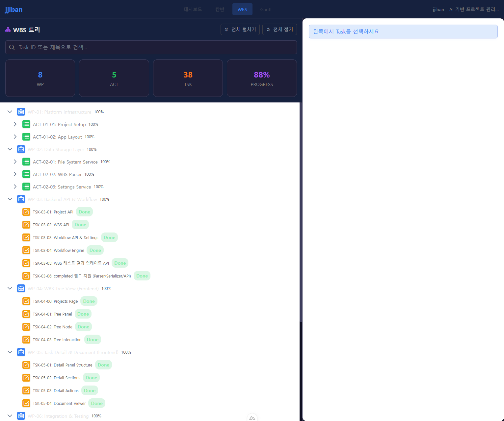
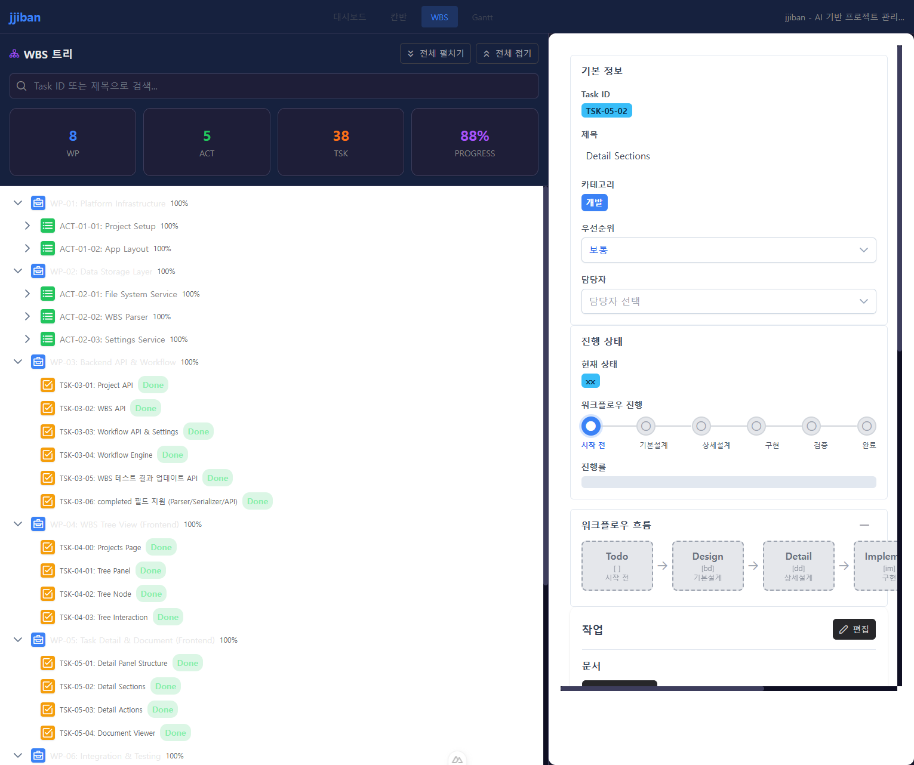
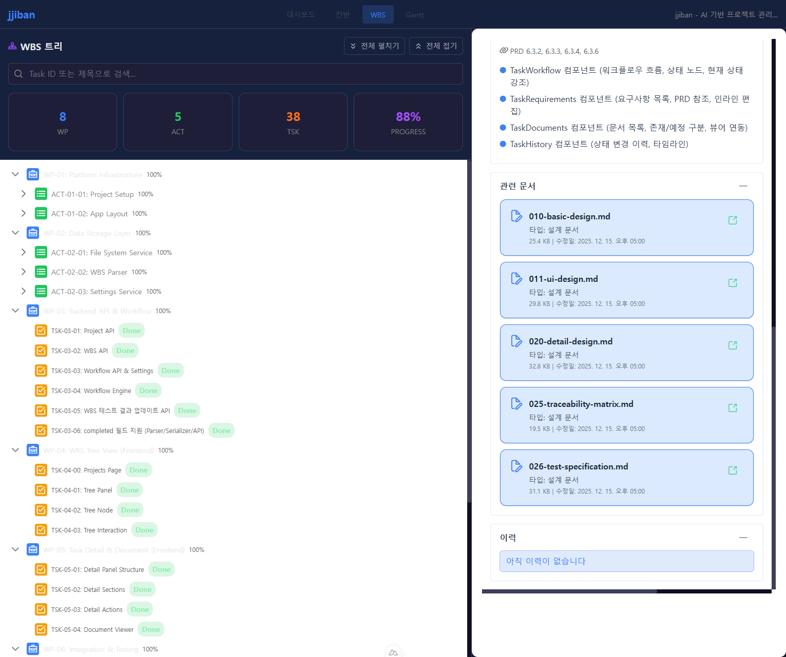
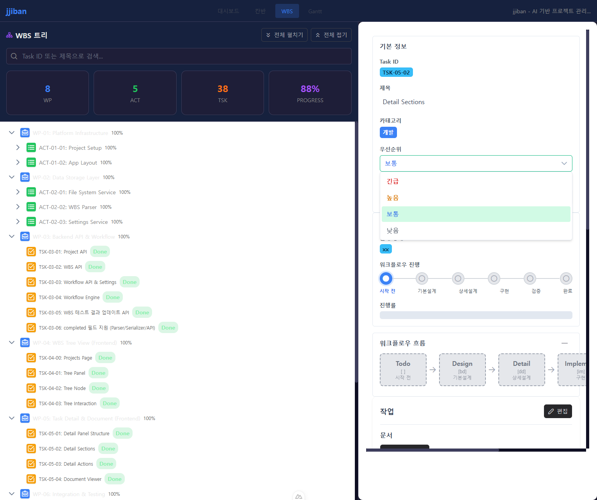

# 사용자 매뉴얼: Detail 섹션 & 액션

**버전:** 1.0.0 — **최종 수정일:** 2025-12-16

---

## 1. 개요

Task Detail Panel의 확장 섹션(워크플로우, 요구사항, 문서, 히스토리)과 액션 기능을 안내합니다.

### 1.1 섹션 구성

```
TaskDetailPanel
├── TaskBasicInfo (기본 정보)
├── TaskWorkflow (워크플로우 시각화)
├── TaskRequirements (요구사항/인수조건)
├── TaskDocuments (관련 문서 목록)
├── TaskHistory (변경 이력)
└── TaskActions (액션 버튼)
```

### 1.2 주요 기능 요약

| 섹션 | 기능 |
|------|------|
| Workflow | 현재 단계 시각화, 진행률 표시 |
| Requirements | 인수조건 체크리스트, 완료율 |
| Documents | 문서 목록, 존재/예정 상태 구분 |
| History | 상태 변경 타임라인 |
| Actions | 상태 전이, 편집 모드 전환 |

---

## 2. 시나리오별 사용 가이드

### 시나리오 1: 워크플로우 진행 상태 확인

**목표**: Task의 현재 워크플로우 단계와 전체 진행률을 확인합니다.

#### 단계별 안내

**Step 1.** WBS 트리에서 Task를 선택합니다.



**Step 2.** Detail Panel의 **워크플로우** 섹션을 확인합니다.



```
워크플로우 시각화 (development 카테고리):

  [✓]━━━━[✓]━━━━[●]━━━━[ ]━━━━[ ]━━━━[ ]
  Todo  Design Detail  Impl  Verify Done
              ▲
           현재 단계

진행률: ████░░░░░░ 33%
```

#### 상태 표시

| 표시 | 의미 |
|------|------|
| [✓] (녹색) | 완료된 단계 |
| [●] (파란색) | 현재 단계 |
| [ ] (회색) | 대기 중 단계 |

#### 카테고리별 워크플로우

| 카테고리 | 단계 수 | 흐름 |
|----------|---------|------|
| development | 6단계 | Todo → Design → Detail → Implement → Verify → Done |
| defect | 5단계 | Todo → Analyze → Fix → Verify → Done |
| infrastructure | 4단계 | Todo → Design(선택) → Implement → Done |

---

### 시나리오 2: 인수조건 확인하기

**목표**: Task의 인수조건(Acceptance Criteria)과 완료 상태를 확인합니다.

#### 단계별 안내

**Step 1.** **요구사항** 섹션을 펼칩니다 (기본 접힘 상태).


**Step 2.** 인수조건 목록을 확인합니다:

```
요구사항 / 인수조건
─────────────────────────────────
☑ AC-01: 로그인 폼이 표시된다
☑ AC-02: 이메일 유효성 검사가 동작한다
☐ AC-03: 비밀번호 강도 표시가 나타난다
☐ AC-04: 로그인 성공 시 대시보드로 이동한다

완료율: 2/4 (50%)
```

#### 체크박스 상태

| 표시 | 의미 |
|------|------|
| ☑ | 완료된 조건 |
| ☐ | 미완료 조건 |

> **참고**: 인수조건은 기본설계 문서(010-basic-design.md)에서 정의됩니다.

---

### 시나리오 3: 관련 문서 확인하기

**목표**: Task와 연관된 설계/구현 문서 목록을 확인하고 접근합니다.

#### 단계별 안내

**Step 1.** **문서** 섹션을 펼칩니다.

**Step 2.** 문서 목록을 확인합니다:



```
관련 문서
─────────────────────────────────
📄 010-basic-design.md      [존재]
📄 011-ui-design.md         [존재]
📄 020-detail-design.md     [예정]
📄 030-implementation.md    [예정]
```

#### 문서 상태

| 상태 | 배지 색상 | 의미 |
|------|----------|------|
| 존재 | 녹색 | 파일이 생성되어 있음 |
| 예정 | 회색 | 해당 단계에서 생성 예정 |

**Step 3.** 문서명을 클릭하여 Document Viewer에서 열람합니다.

> **Tip**: 존재하는 문서만 클릭 가능합니다. 예정 문서는 비활성화됩니다.

---

### 시나리오 4: 변경 이력 확인하기

**목표**: Task의 상태 변경 히스토리를 타임라인으로 확인합니다.

#### 단계별 안내

**Step 1.** **히스토리** 섹션을 펼칩니다.

**Step 2.** 변경 이력 타임라인을 확인합니다:

```
변경 이력
─────────────────────────────────
● 2025-12-16 14:30
  상태 변경: Detail → Implement
  작업자: user1

● 2025-12-15 10:00
  상태 변경: Design → Detail
  작업자: user1

● 2025-12-14 09:00
  Task 생성
  작업자: system
```

#### 타임라인 표시 정보

| 정보 | 설명 |
|------|------|
| 날짜/시간 | 변경 발생 시점 |
| 변경 내용 | 이전 상태 → 이후 상태 |
| 작업자 | 변경을 수행한 사용자 |

> **참고**: PrimeVue Timeline 컴포넌트로 시각화됩니다.

---

### 시나리오 5: 상태 전이 액션 실행하기

**목표**: Task 상태를 다음 단계로 전환합니다.

#### 단계별 안내

**Step 1.** **액션** 섹션에서 사용 가능한 전이 버튼을 확인합니다.

```
액션
─────────────────────────────────
현재 상태: Detail [dd]

[다음 단계로] [이전으로 되돌리기]
```

**Step 2.** **[다음 단계로]** 버튼을 클릭합니다.

**Step 3.** 확인 다이얼로그에서 **[확인]**을 클릭합니다.

**Step 4.** 상태가 즉시 업데이트됩니다 (낙관적 업데이트).

#### 상태 전이 규칙

| 현재 상태 | 다음 가능 상태 |
|----------|---------------|
| Todo [ ] | Design [bd] / Analyze [an] |
| Design [bd] | Detail [dd] |
| Detail [dd] | Implement [im] |
| Implement [im] | Verify [vf] |
| Verify [vf] | Done [xx] |
| Analyze [an] | Fix [fx] |
| Fix [fx] | Verify [vf] |

> **주의**: Done [xx] 상태에서는 전이 버튼이 비활성화됩니다.

---

### 시나리오 6: 편집 모드 전환하기

**목표**: Task 정보를 일괄 편집하는 편집 모드로 전환합니다.

#### 단계별 안내

**Step 1.** **액션** 섹션에서 **[편집 모드]** 버튼을 클릭합니다.



**Step 2.** 편집 가능한 필드가 활성화됩니다:
- 제목
- 카테고리
- 우선순위
- 담당자
- 인수조건 (체크박스)

**Step 3.** 변경사항을 입력합니다.

**Step 4.** **[저장]** 또는 **[취소]** 버튼을 클릭합니다.

#### 낙관적 업데이트

| 동작 | UI 반응 | 서버 동기화 |
|------|---------|------------|
| 저장 클릭 | 즉시 반영 | 백그라운드 API 호출 |
| API 성공 | 상태 유지 | 완료 |
| API 실패 | 자동 롤백 | 에러 메시지 표시 |

---

## 3. API 연동

### 3.1 상태 전이 API

```
POST /api/tasks/:id/transition
Body: { "action": "next" | "prev" }
```

### 3.2 Task 업데이트 API

```
PUT /api/tasks/:id
Body: { "title": "...", "priority": "...", ... }
```

---

## 4. 섹션 펼침/접힘

### 4.1 기본 상태

| 섹션 | 기본 상태 |
|------|----------|
| Workflow | 펼침 |
| Requirements | 접힘 |
| Documents | 접힘 |
| History | 접힘 |
| Actions | 펼침 |

### 4.2 펼침/접힘 조작

- 섹션 헤더 클릭으로 토글
- 아이콘: `>` (접힘) / `v` (펼침)

---

## 5. FAQ / 트러블슈팅

### Q1. 상태 전이 버튼이 비활성화되어 있어요.
- 현재 상태가 Done이면 더 이상 전이할 수 없습니다.
- 권한이 없는 경우 비활성화됩니다.

### Q2. 문서를 클릭해도 열리지 않아요.
- "예정" 상태의 문서는 아직 생성되지 않았습니다.
- "존재" 상태인 문서만 클릭 가능합니다.

### Q3. 저장했는데 변경사항이 사라졌어요.
- API 호출 실패로 롤백되었을 수 있습니다.
- 네트워크 연결을 확인하고 다시 시도하세요.

### Q4. 히스토리가 비어있어요.
- 새로 생성된 Task는 생성 기록만 있습니다.
- 상태 전이를 수행하면 기록이 추가됩니다.

---

## 6. 접근성

### 6.1 키보드 지원
- Tab: 섹션 간 이동
- Enter/Space: 섹션 펼침/접힘 토글
- 버튼: Enter로 실행

### 6.2 스크린 리더
- `aria-expanded`: 섹션 펼침 상태
- `aria-label`: 버튼 설명
- `role="region"`: 섹션 영역 구분

---

## 7. 관련 문서

| 문서 | 경로 |
|------|------|
| Detail Sections 설계 | `tasks/TSK-05-02/010-basic-design.md` |
| Detail Actions 설계 | `tasks/TSK-05-03/010-basic-design.md` |
| Detail Panel 매뉴얼 | `tasks/TSK-05-01/080-manual.md` |

---

## 8. 변경 이력

| 버전 | 날짜 | 변경 내용 |
|------|------|----------|
| 1.0.0 | 2025-12-16 | 초기 작성 |

---

<!--
Author: Claude
Template Version: 1.0.0
Created: 2025-12-16
Based on: TSK-05-02 (Detail Sections), TSK-05-03 (Detail Actions)
-->
