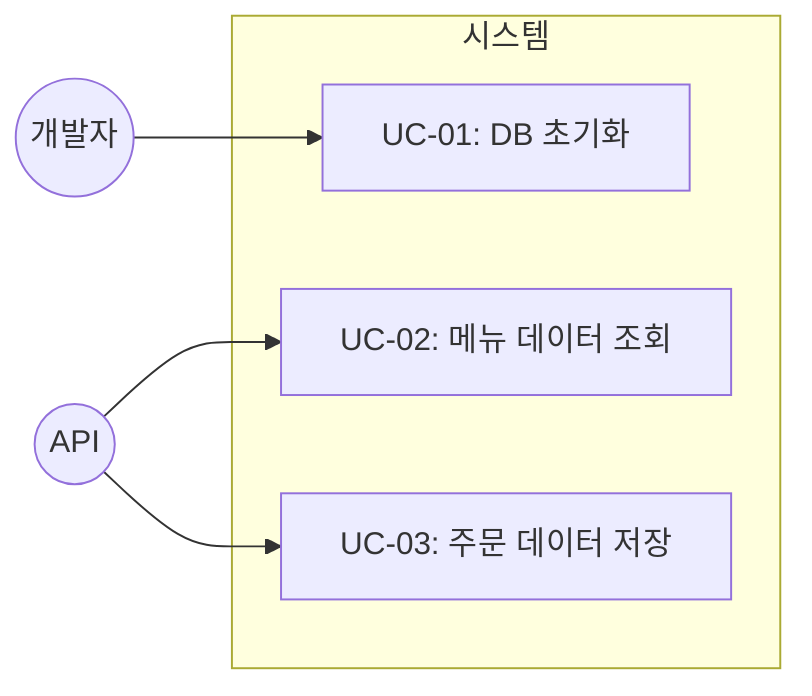
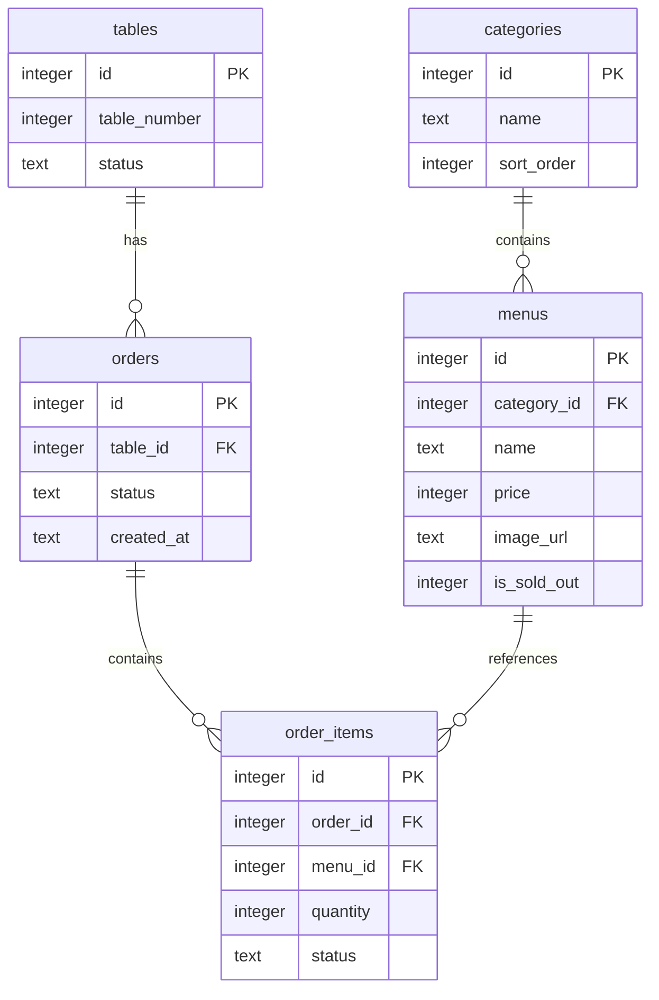

# TSK-01-01 - SQLite 데이터베이스 설정 및 스키마 생성 설계 문서

## 문서 정보

| 항목 | 내용 |
|------|------|
| Task ID | TSK-01-01 |
| 문서 버전 | 1.0 |
| 작성일 | 2026-01-02 |
| 상태 | 작성중 |
| 카테고리 | development |

---

## 1. 개요

### 1.1 배경 및 문제 정의

**현재 상황:**
- Next.js 프로젝트 구조와 타입 정의만 존재
- 데이터 영속화 레이어가 없음
- 메뉴, 주문, 테이블 데이터를 저장할 수 없음

**해결하려는 문제:**
- 메뉴, 카테고리, 테이블, 주문 데이터를 저장하고 조회할 수 있는 데이터베이스 필요
- MVP 특성상 복잡한 설정 없이 빠르게 구축 가능한 솔루션 필요

### 1.2 목적 및 기대 효과

**목적:**
- SQLite 데이터베이스 연결 및 초기화
- PRD 섹션 4에 정의된 데이터 모델 스키마 생성
- 개발/테스트용 시드 데이터 삽입

**기대 효과:**
- API에서 데이터 CRUD 가능
- 파일 기반 DB로 별도 서버 없이 동작
- 시드 데이터로 즉시 테스트 가능

### 1.3 범위

**포함:**
- `lib/db.ts` - better-sqlite3 연결 설정
- 5개 테이블 스키마 생성 (tables, categories, menus, orders, order_items)
- 초기 시드 데이터 (테이블 5개, 카테고리 3개, 메뉴 10개)
- DB 초기화 함수

**제외:**
- API 엔드포인트 구현 (TSK-01-02, TSK-01-03)
- ORM 사용 (TRD 권장사항 준수)
- 마이그레이션 시스템

### 1.4 참조 문서

| 문서 | 경로 | 관련 섹션 |
|------|------|----------|
| PRD | `.orchay/projects/table-order/prd.md` | 섹션 4 (데이터 모델) |
| TRD | `.orchay/projects/table-order/trd.md` | 섹션 4 (데이터베이스) |

---

## 2. 사용자 분석

### 2.1 대상 사용자

| 사용자 유형 | 특성 | 주요 니즈 |
|------------|------|----------|
| 개발자 | 백엔드/API 구현 담당 | 신뢰할 수 있는 DB 연결, 간단한 쿼리 인터페이스 |
| 테스트 담당 | 기능 검증 담당 | 일관된 시드 데이터, 쉬운 초기화 |

---

## 3. 유즈케이스

### 3.1 유즈케이스 다이어그램



### 3.2 유즈케이스 상세

#### UC-01: DB 초기화

| 항목 | 내용 |
|------|------|
| 액터 | 개발자/시스템 |
| 목적 | 데이터베이스 스키마 생성 및 시드 데이터 삽입 |
| 사전 조건 | `./data/` 디렉토리 존재 |
| 사후 조건 | 모든 테이블 생성, 시드 데이터 삽입 완료 |
| 트리거 | 서버 시작 시 또는 수동 실행 |

**기본 흐름:**
1. DB 파일 존재 여부 확인
2. 테이블 존재 여부 확인
3. 없으면 스키마 생성
4. 시드 데이터 삽입 (테이블이 비어있을 경우)

#### UC-02: 메뉴 데이터 조회

| 항목 | 내용 |
|------|------|
| 액터 | API |
| 목적 | 메뉴 목록 조회 |
| 사전 조건 | DB 초기화 완료 |
| 사후 조건 | 메뉴 데이터 반환 |

#### UC-03: 주문 데이터 저장

| 항목 | 내용 |
|------|------|
| 액터 | API |
| 목적 | 새 주문 생성 |
| 사전 조건 | DB 초기화 완료, 유효한 테이블/메뉴 ID |
| 사후 조건 | orders, order_items 테이블에 데이터 삽입 |

---

## 4. 데이터 설계

### 4.1 ER 다이어그램



### 4.2 테이블 스키마 상세

#### tables

| 컬럼 | 타입 | 제약 | 설명 |
|------|------|------|------|
| id | INTEGER | PK, AUTO | 테이블 ID |
| table_number | INTEGER | NOT NULL | 테이블 번호 (1, 2, 3...) |
| status | TEXT | DEFAULT 'available' | 상태: available, occupied |

#### categories

| 컬럼 | 타입 | 제약 | 설명 |
|------|------|------|------|
| id | INTEGER | PK, AUTO | 카테고리 ID |
| name | TEXT | NOT NULL | 카테고리명 |
| sort_order | INTEGER | DEFAULT 0 | 정렬 순서 |

#### menus

| 컬럼 | 타입 | 제약 | 설명 |
|------|------|------|------|
| id | INTEGER | PK, AUTO | 메뉴 ID |
| category_id | INTEGER | FK | 카테고리 참조 |
| name | TEXT | NOT NULL | 메뉴명 |
| price | INTEGER | NOT NULL | 가격 (원) |
| image_url | TEXT | NULL | 이미지 URL |
| is_sold_out | INTEGER | DEFAULT 0 | 품절 여부 (0/1) |

#### orders

| 컬럼 | 타입 | 제약 | 설명 |
|------|------|------|------|
| id | INTEGER | PK, AUTO | 주문 ID |
| table_id | INTEGER | FK | 테이블 참조 |
| status | TEXT | DEFAULT 'pending' | 상태: pending, cooking, completed |
| created_at | TEXT | DEFAULT CURRENT_TIMESTAMP | 생성 시간 |

#### order_items

| 컬럼 | 타입 | 제약 | 설명 |
|------|------|------|------|
| id | INTEGER | PK, AUTO | 주문 항목 ID |
| order_id | INTEGER | FK | 주문 참조 |
| menu_id | INTEGER | FK | 메뉴 참조 |
| quantity | INTEGER | DEFAULT 1 | 수량 |
| status | TEXT | DEFAULT 'pending' | 항목 상태: pending, cooking, completed |

### 4.3 상태 값 정의

**테이블 상태 (tables.status):**
| 값 | 설명 |
|-----|------|
| available | 이용 가능 |
| occupied | 사용 중 |

**주문 상태 (orders.status, order_items.status):**
| 값 | 설명 |
|-----|------|
| pending | 접수됨 (대기) |
| cooking | 조리중 |
| completed | 완료 |

---

## 5. 구현 설계

### 5.1 파일 구조

```
mvp/src/
├── lib/
│   └── db.ts          # DB 연결 및 초기화
├── data/
│   └── database.db    # SQLite DB 파일 (자동 생성)
```

### 5.2 db.ts 모듈 구조

```typescript
// lib/db.ts
import Database from 'better-sqlite3';
import path from 'path';

// 1. DB 인스턴스 생성
const dbPath = path.join(process.cwd(), 'data', 'database.db');
const db = new Database(dbPath);

// 2. 스키마 초기화 함수
function initSchema() {
  // 테이블 생성 SQL 실행
}

// 3. 시드 데이터 삽입 함수
function seedData() {
  // 테이블: 1~5번
  // 카테고리: 메인메뉴, 사이드메뉴, 음료
  // 메뉴: 10개 예시
}

// 4. 초기화 실행
initSchema();
seedData();

// 5. DB 인스턴스 export
export default db;
```

### 5.3 스키마 생성 SQL

```sql
-- 테이블 생성
CREATE TABLE IF NOT EXISTS tables (
  id INTEGER PRIMARY KEY AUTOINCREMENT,
  table_number INTEGER NOT NULL,
  status TEXT DEFAULT 'available'
);

CREATE TABLE IF NOT EXISTS categories (
  id INTEGER PRIMARY KEY AUTOINCREMENT,
  name TEXT NOT NULL,
  sort_order INTEGER DEFAULT 0
);

CREATE TABLE IF NOT EXISTS menus (
  id INTEGER PRIMARY KEY AUTOINCREMENT,
  category_id INTEGER,
  name TEXT NOT NULL,
  price INTEGER NOT NULL,
  image_url TEXT,
  is_sold_out INTEGER DEFAULT 0,
  FOREIGN KEY (category_id) REFERENCES categories(id)
);

CREATE TABLE IF NOT EXISTS orders (
  id INTEGER PRIMARY KEY AUTOINCREMENT,
  table_id INTEGER,
  status TEXT DEFAULT 'pending',
  created_at TEXT DEFAULT CURRENT_TIMESTAMP,
  FOREIGN KEY (table_id) REFERENCES tables(id)
);

CREATE TABLE IF NOT EXISTS order_items (
  id INTEGER PRIMARY KEY AUTOINCREMENT,
  order_id INTEGER,
  menu_id INTEGER,
  quantity INTEGER DEFAULT 1,
  status TEXT DEFAULT 'pending',
  FOREIGN KEY (order_id) REFERENCES orders(id),
  FOREIGN KEY (menu_id) REFERENCES menus(id)
);
```

### 5.4 시드 데이터

**테이블 (5개):**
| id | table_number | status |
|-----|--------------|--------|
| 1 | 1 | available |
| 2 | 2 | available |
| 3 | 3 | available |
| 4 | 4 | available |
| 5 | 5 | available |

**카테고리 (3개):**
| id | name | sort_order |
|-----|------|------------|
| 1 | 메인메뉴 | 1 |
| 2 | 사이드메뉴 | 2 |
| 3 | 음료 | 3 |

**메뉴 (10개):**
| id | category_id | name | price | is_sold_out |
|-----|-------------|------|-------|-------------|
| 1 | 1 | 김치찌개 | 8000 | 0 |
| 2 | 1 | 된장찌개 | 8000 | 0 |
| 3 | 1 | 비빔밥 | 9000 | 0 |
| 4 | 1 | 제육볶음 | 10000 | 0 |
| 5 | 1 | 불고기정식 | 12000 | 0 |
| 6 | 2 | 공기밥 | 1000 | 0 |
| 7 | 2 | 계란찜 | 3000 | 0 |
| 8 | 2 | 김치 추가 | 2000 | 0 |
| 9 | 3 | 콜라 | 2000 | 0 |
| 10 | 3 | 사이다 | 2000 | 0 |

---

## 6. 인터페이스 설계

### 6.1 Export 함수

```typescript
// db.ts에서 export할 인터페이스

// DB 인스턴스 (직접 쿼리용)
export default db;

// 초기화 확인
export function ensureInitialized(): boolean;

// 시드 데이터 재삽입 (개발용)
export function reseedData(): void;
```

### 6.2 사용 예시

```typescript
import db from '@/lib/db';

// 메뉴 조회
const menus = db.prepare('SELECT * FROM menus WHERE is_sold_out = 0').all();

// 주문 생성
const stmt = db.prepare('INSERT INTO orders (table_id, status) VALUES (?, ?)');
const result = stmt.run(tableId, 'pending');
const orderId = result.lastInsertRowid;
```

---

## 7. 에러 처리

### 7.1 예상 에러 상황

| 상황 | 원인 | 처리 |
|------|------|------|
| DB 파일 생성 실패 | 디렉토리 권한 | data/ 디렉토리 자동 생성 |
| 스키마 생성 실패 | SQL 문법 오류 | 에러 로그 출력 후 종료 |
| FK 제약 위반 | 잘못된 참조 ID | SQLite FK 검사 비활성화 (MVP) |

### 7.2 에러 로깅

```typescript
try {
  initSchema();
} catch (error) {
  console.error('[DB] Schema initialization failed:', error);
  throw error;
}
```

---

## 8. 수용 기준

| 기준 | 검증 방법 |
|------|----------|
| DB 파일 생성 | `./data/database.db` 파일 존재 확인 |
| 테이블 생성 | `.tables` 명령으로 5개 테이블 확인 |
| 시드 데이터 | 각 테이블 SELECT 쿼리로 데이터 확인 |
| API에서 사용 가능 | `import db from '@/lib/db'` 정상 동작 |

---

## 9. 체크리스트

### 9.1 설계 완료 확인

- [x] 문제 정의 및 목적 명확화
- [x] 데이터 모델 설계 (ER 다이어그램)
- [x] 테이블 스키마 정의
- [x] 시드 데이터 정의
- [x] 인터페이스 설계
- [x] 에러 처리 정의

### 9.2 구현 준비

- [x] 의존성 확인 (better-sqlite3)
- [x] 파일 경로 결정 (`lib/db.ts`, `data/database.db`)
- [x] TRD 가이드라인 준수 (ORM 미사용)

---

## 변경 이력

| 버전 | 일자 | 작성자 | 변경 내용 |
|------|------|--------|----------|
| 1.0 | 2026-01-02 | Claude | 최초 작성 |
