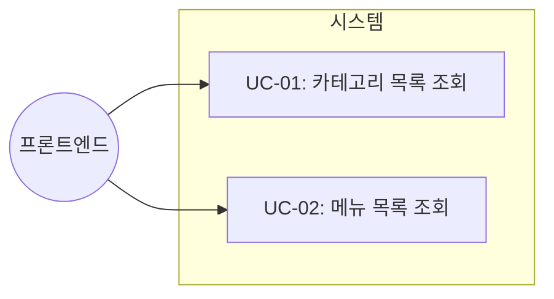
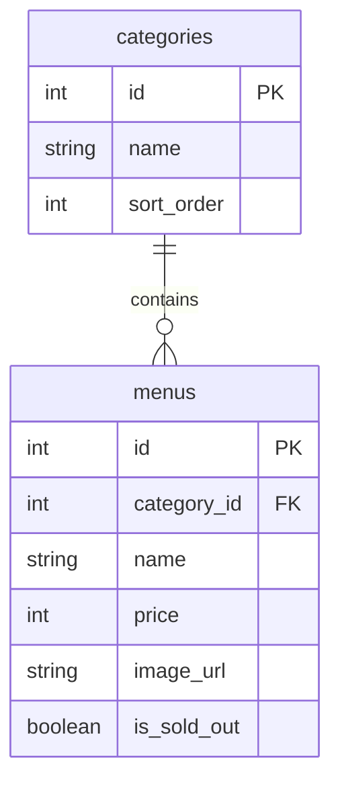

# TSK-01-02 - 카테고리/메뉴 조회 API 구현 설계 문서

## 문서 정보

| 항목 | 내용 |
|------|------|
| Task ID | TSK-01-02 |
| 문서 버전 | 1.0 |
| 작성일 | 2026-01-02 |
| 상태 | 작성중 |
| 카테고리 | development |

---

## 1. 개요

### 1.1 배경 및 문제 정의

**현재 상황:**
- TSK-01-01에서 SQLite 데이터베이스와 스키마가 생성됨
- 테이블(categories, menus)에 초기 시드 데이터가 삽입됨
- 고객 화면에서 메뉴를 조회하기 위한 API 엔드포인트가 필요함

**해결하려는 문제:**
- 고객이 메뉴를 조회할 수 있는 REST API가 없음
- 카테고리별 메뉴 분류 및 필터링 기능이 없음

### 1.2 목적 및 기대 효과

**목적:**
- 고객 화면에서 카테고리 목록과 메뉴 목록을 조회할 수 있는 API 제공
- 품절 메뉴 필터링 옵션 제공

**기대 효과:**
- 고객이 카테고리별로 메뉴를 탐색할 수 있음
- 품절 메뉴를 제외한 주문 가능 메뉴만 표시 가능

### 1.3 범위

**포함:**
- GET /api/categories - 카테고리 목록 API
- GET /api/menus - 메뉴 목록 API (품절 필터링 옵션)

**제외:**
- 메뉴 생성/수정/삭제 API (관리자 기능 - MVP 제외)
- 메뉴 상세 조회 API (MVP에서는 목록에 모든 정보 포함)

### 1.4 참조 문서

| 문서 | 경로 | 관련 섹션 |
|------|------|----------|
| PRD | `.orchay/projects/table-order/prd.md` | 섹션 5 고객용 API |
| TRD | `.orchay/projects/table-order/trd.md` | 섹션 4 데이터베이스 |

---

## 2. 사용자 분석

### 2.1 대상 사용자

| 사용자 유형 | 특성 | 주요 니즈 |
|------------|------|----------|
| 고객 (프론트엔드) | 테이블에서 QR 스캔 후 메뉴 조회 | 카테고리별 메뉴 목록, 품절 정보 |
| 개발자 | API 통합 | 일관된 응답 형식, 명확한 에러 처리 |

### 2.2 사용자 페르소나

**페르소나 1: 고객 화면 컴포넌트**
- 역할: 메뉴 목록 UI 렌더링
- 목표: 카테고리별로 정렬된 메뉴 목록 표시
- 불만: 품절 메뉴가 섞여 있으면 사용자 혼란
- 시나리오: 페이지 로드 시 API 호출 → 데이터 수신 → UI 렌더링

---

## 3. 유즈케이스

### 3.1 유즈케이스 다이어그램



### 3.2 유즈케이스 상세

#### UC-01: 카테고리 목록 조회

| 항목 | 내용 |
|------|------|
| 액터 | 프론트엔드 클라이언트 |
| 목적 | 카테고리 목록을 정렬 순서대로 가져오기 |
| 사전 조건 | 데이터베이스에 카테고리 데이터 존재 |
| 사후 조건 | 카테고리 배열 반환 |
| 트리거 | GET /api/categories 요청 |

**기본 흐름:**
1. 클라이언트가 GET /api/categories 요청을 보낸다
2. 서버가 categories 테이블에서 sort_order 순으로 조회한다
3. 서버가 JSON 형식으로 카테고리 배열을 반환한다

**예외 흐름:**
- 2a. 데이터베이스 오류 발생 시:
  - 서버가 500 에러와 에러 메시지를 반환한다

#### UC-02: 메뉴 목록 조회

| 항목 | 내용 |
|------|------|
| 액터 | 프론트엔드 클라이언트 |
| 목적 | 메뉴 목록을 카테고리 정보와 함께 가져오기 |
| 사전 조건 | 데이터베이스에 메뉴 데이터 존재 |
| 사후 조건 | 메뉴 배열 반환 (카테고리 정보 포함) |
| 트리거 | GET /api/menus 요청 |

**기본 흐름:**
1. 클라이언트가 GET /api/menus 요청을 보낸다
2. 서버가 menus 테이블에서 품절 메뉴를 제외하고 조회한다
3. 각 메뉴에 카테고리 정보를 포함한다
4. 서버가 JSON 형식으로 메뉴 배열을 반환한다

**대안 흐름:**
- 1a. includeSoldOut=true 쿼리 파라미터 포함 시:
  - 품절 메뉴도 포함하여 조회한다

**예외 흐름:**
- 2a. 데이터베이스 오류 발생 시:
  - 서버가 500 에러와 에러 메시지를 반환한다

---

## 4. API 설계

### 4.1 GET /api/categories

**엔드포인트**: `GET /api/categories`

**요청 파라미터**: 없음

**응답 형식**:
```typescript
interface CategoriesResponse {
  categories: Category[];
}

interface Category {
  id: number;
  name: string;
  sortOrder: number;
}
```

**응답 예시**:
```json
{
  "categories": [
    { "id": 1, "name": "메인 메뉴", "sortOrder": 1 },
    { "id": 2, "name": "사이드 메뉴", "sortOrder": 2 },
    { "id": 3, "name": "음료", "sortOrder": 3 }
  ]
}
```

**에러 응답**:
| 상태 코드 | 설명 |
|----------|------|
| 500 | 서버 내부 오류 |

### 4.2 GET /api/menus

**엔드포인트**: `GET /api/menus`

**요청 파라미터**:
| 파라미터 | 타입 | 필수 | 기본값 | 설명 |
|----------|------|------|--------|------|
| includeSoldOut | boolean | N | false | true면 품절 메뉴 포함 |

**응답 형식**:
```typescript
interface MenusResponse {
  menus: Menu[];
}

interface Menu {
  id: number;
  categoryId: number;
  categoryName: string;
  name: string;
  price: number;
  imageUrl: string | null;
  isSoldOut: boolean;
}
```

**응답 예시**:
```json
{
  "menus": [
    {
      "id": 1,
      "categoryId": 1,
      "categoryName": "메인 메뉴",
      "name": "김치찌개",
      "price": 9000,
      "imageUrl": "/images/kimchi-jjigae.jpg",
      "isSoldOut": false
    },
    {
      "id": 2,
      "categoryId": 1,
      "categoryName": "메인 메뉴",
      "name": "된장찌개",
      "price": 8000,
      "imageUrl": "/images/doenjang-jjigae.jpg",
      "isSoldOut": false
    }
  ]
}
```

**에러 응답**:
| 상태 코드 | 설명 |
|----------|------|
| 500 | 서버 내부 오류 |

---

## 5. 데이터 요구사항

### 5.1 필요한 데이터

| 데이터 | 설명 | 출처 | 용도 |
|--------|------|------|------|
| categories | 카테고리 목록 | SQLite DB | 카테고리별 메뉴 분류 |
| menus | 메뉴 목록 | SQLite DB | 메뉴 정보 표시 |

### 5.2 데이터 관계



### 5.3 SQL 쿼리

**카테고리 조회**:
```sql
SELECT id, name, sort_order
FROM categories
ORDER BY sort_order ASC;
```

**메뉴 조회 (품절 제외)**:
```sql
SELECT
  m.id,
  m.category_id,
  c.name AS category_name,
  m.name,
  m.price,
  m.image_url,
  m.is_sold_out
FROM menus m
JOIN categories c ON m.category_id = c.id
WHERE m.is_sold_out = 0
ORDER BY c.sort_order, m.id;
```

**메뉴 조회 (품절 포함)**:
```sql
SELECT
  m.id,
  m.category_id,
  c.name AS category_name,
  m.name,
  m.price,
  m.image_url,
  m.is_sold_out
FROM menus m
JOIN categories c ON m.category_id = c.id
ORDER BY c.sort_order, m.id;
```

---

## 6. 구현 설계

### 6.1 파일 구조

```
mvp/src/
├── app/
│   └── api/
│       ├── categories/
│       │   └── route.ts       # GET /api/categories
│       └── menus/
│           └── route.ts       # GET /api/menus
└── lib/
    └── db.ts                  # getCategories(), getMenus() 추가
```

### 6.2 lib/db.ts 함수 추가

```typescript
// 카테고리 조회
export function getCategories(): Category[] {
  const stmt = db.prepare(`
    SELECT id, name, sort_order as sortOrder
    FROM categories
    ORDER BY sort_order ASC
  `);
  return stmt.all() as Category[];
}

// 메뉴 조회
export function getMenus(includeSoldOut: boolean = false): Menu[] {
  const whereClause = includeSoldOut ? '' : 'WHERE m.is_sold_out = 0';
  const stmt = db.prepare(`
    SELECT
      m.id,
      m.category_id as categoryId,
      c.name AS categoryName,
      m.name,
      m.price,
      m.image_url as imageUrl,
      m.is_sold_out as isSoldOut
    FROM menus m
    JOIN categories c ON m.category_id = c.id
    ${whereClause}
    ORDER BY c.sort_order, m.id
  `);
  return stmt.all() as Menu[];
}
```

### 6.3 API Route 핸들러

**app/api/categories/route.ts**:
```typescript
import { NextResponse } from 'next/server';
import { getCategories } from '@/lib/db';

export async function GET() {
  try {
    const categories = getCategories();
    return NextResponse.json({ categories });
  } catch (error) {
    console.error('Failed to fetch categories:', error);
    return NextResponse.json(
      { error: 'Failed to fetch categories' },
      { status: 500 }
    );
  }
}
```

**app/api/menus/route.ts**:
```typescript
import { NextRequest, NextResponse } from 'next/server';
import { getMenus } from '@/lib/db';

export async function GET(request: NextRequest) {
  try {
    const { searchParams } = new URL(request.url);
    const includeSoldOut = searchParams.get('includeSoldOut') === 'true';

    const menus = getMenus(includeSoldOut);
    return NextResponse.json({ menus });
  } catch (error) {
    console.error('Failed to fetch menus:', error);
    return NextResponse.json(
      { error: 'Failed to fetch menus' },
      { status: 500 }
    );
  }
}
```

---

## 7. 에러 처리

### 7.1 예상 에러 상황

| 상황 | 원인 | 응답 코드 | 응답 메시지 |
|------|------|----------|-------------|
| DB 연결 실패 | SQLite 파일 접근 불가 | 500 | "Failed to fetch categories/menus" |
| 쿼리 오류 | SQL 문법 오류 | 500 | "Failed to fetch categories/menus" |

### 7.2 에러 로깅

- 모든 에러는 `console.error`로 로깅
- 클라이언트에는 일반적인 에러 메시지만 반환 (보안)

---

## 8. 테스트 케이스

### 8.1 단위 테스트

| 테스트 ID | 설명 | 입력 | 기대 결과 |
|-----------|------|------|----------|
| UT-01 | 카테고리 목록 조회 | GET /api/categories | 200, categories 배열 |
| UT-02 | 메뉴 목록 조회 (기본) | GET /api/menus | 200, 품절 제외 menus 배열 |
| UT-03 | 메뉴 목록 조회 (품절 포함) | GET /api/menus?includeSoldOut=true | 200, 전체 menus 배열 |

### 8.2 수동 테스트

1. `curl http://localhost:3000/api/categories` 실행
   - 기대: 정렬된 카테고리 목록 반환

2. `curl http://localhost:3000/api/menus` 실행
   - 기대: 품절 제외 메뉴 목록 반환
   - 각 메뉴에 categoryName 포함 확인

3. `curl http://localhost:3000/api/menus?includeSoldOut=true` 실행
   - 기대: 품절 포함 전체 메뉴 목록 반환

---

## 9. 수용 기준 체크리스트

- [ ] GET /api/categories가 정렬된 카테고리 목록 반환
- [ ] GET /api/menus가 품절 제외 메뉴 목록 반환
- [ ] GET /api/menus?includeSoldOut=true가 품절 포함 메뉴 목록 반환
- [ ] 각 메뉴에 categoryName이 포함됨
- [ ] 에러 발생 시 500 상태 코드와 에러 메시지 반환

---

## 10. 의존성

| 의존 항목 | 이유 | 상태 |
|----------|------|------|
| TSK-01-01 | DB 스키마 및 시드 데이터 필요 | 완료 대기 |

---

## 변경 이력

| 버전 | 일자 | 작성자 | 변경 내용 |
|------|------|--------|----------|
| 1.0 | 2026-01-02 | Claude | 최초 작성 |
