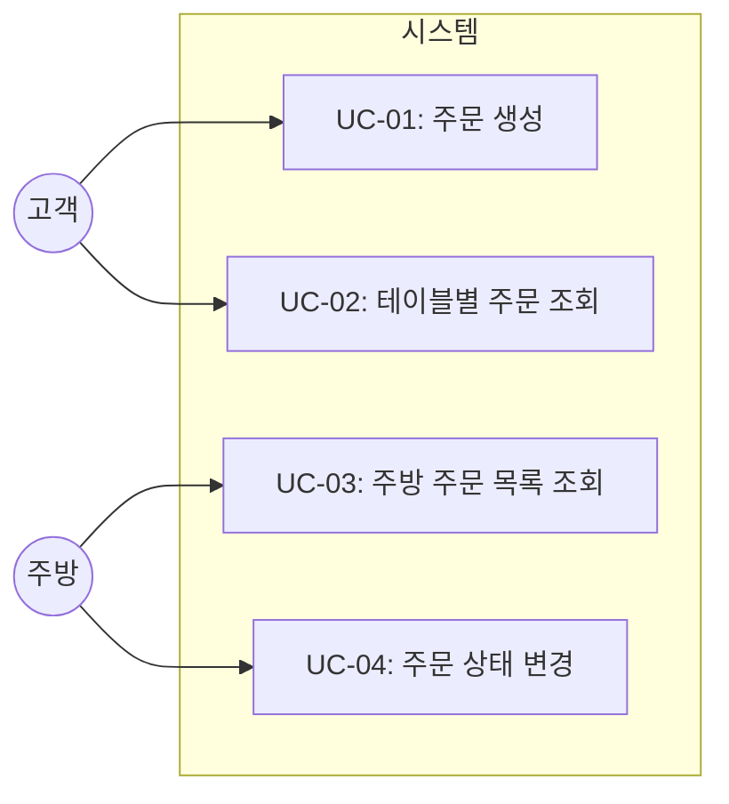
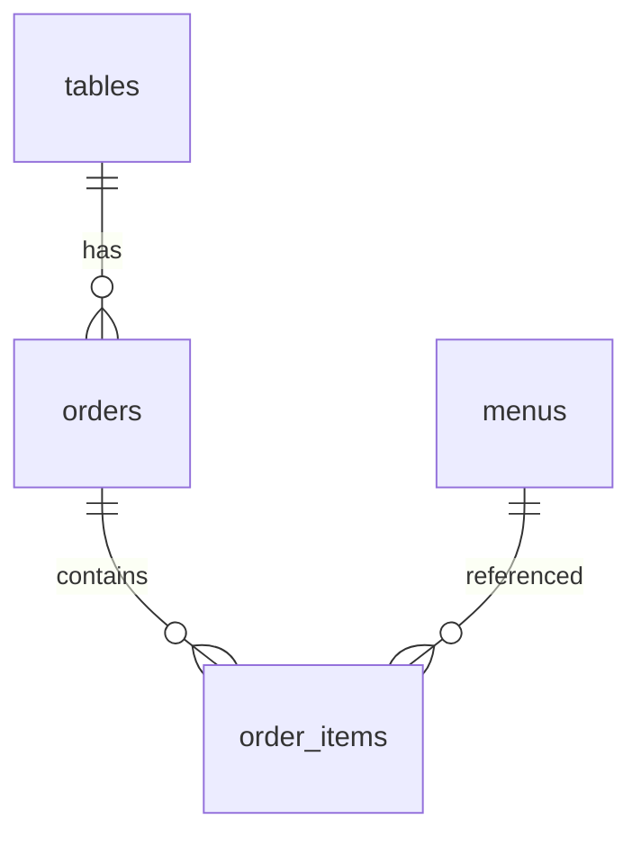

# TSK-01-03 - 주문 생성/조회 API 구현 설계 문서

## 문서 정보

| 항목 | 내용 |
|------|------|
| Task ID | TSK-01-03 |
| 문서 버전 | 1.0 |
| 작성일 | 2026-01-02 |
| 상태 | 작성중 |
| 카테고리 | development |

---

## 1. 개요

### 1.1 배경 및 문제 정의

**현재 상황:**
- TSK-01-01에서 SQLite 데이터베이스 스키마가 설정됨 (orders, order_items 테이블)
- TSK-01-02에서 카테고리/메뉴 조회 API가 구현됨
- 고객이 메뉴를 선택하고 주문을 생성할 수 있는 API가 없음
- 주방에서 대기/조리중 주문을 조회할 방법이 없음

**해결하려는 문제:**
- 고객이 장바구니에 담은 메뉴를 서버로 전송하여 주문을 생성해야 함
- 고객이 자신의 테이블 주문 내역을 확인할 수 있어야 함
- 주방이 대기/조리중 주문 목록을 실시간으로 확인해야 함
- 주방이 주문 상태를 변경(조리시작, 완료)할 수 있어야 함

### 1.2 목적 및 기대 효과

**목적:**
- 주문 생성, 조회, 상태 변경을 위한 REST API 구현
- 고객 화면과 주방 화면에서 주문 데이터 연동 가능하게 함

**기대 효과:**
- 고객: 메뉴를 담고 주문 버튼 클릭 시 주문 접수
- 고객: 자신의 주문 상태를 실시간 확인
- 주방: 새 주문을 즉시 확인하고 상태 관리

### 1.3 범위

**포함:**
- POST /api/orders - 주문 생성
- GET /api/orders?table={id} - 테이블별 주문 조회
- GET /api/kitchen/orders - 주방 주문 목록 (pending, cooking)
- PATCH /api/orders/{id}/status - 주문 상태 변경

**제외:**
- WebSocket 실시간 이벤트 (TSK-02-01, TSK-02-02에서 구현)
- 주문 취소 기능 (MVP 범위 외)
- 결제 기능 (MVP 범위 외)

### 1.4 참조 문서

| 문서 | 경로 | 관련 섹션 |
|------|------|----------|
| PRD | `.orchay/projects/table-order/prd.md` | 섹션 5 API 명세 |
| TRD | `.orchay/projects/table-order/trd.md` | 섹션 4 데이터베이스 |

---

## 2. 사용자 분석

### 2.1 대상 사용자

| 사용자 유형 | 특성 | 주요 니즈 |
|------------|------|----------|
| 고객 (Customer) | 테이블에서 QR 스캔 후 접속 | 메뉴 주문, 주문 상태 확인 |
| 주방 (Kitchen) | 주방 화면(KDS) 담당자 | 주문 목록 확인, 상태 변경 |

### 2.2 사용자 페르소나

**페르소나 1: 식당 고객**
- 역할: 테이블에서 식사하는 손님
- 목표: 빠르게 메뉴를 주문하고 조리 상태 확인
- 불만: 직원 호출 없이 편하게 주문하고 싶음
- 시나리오: QR 스캔 → 메뉴 선택 → 주문 → 상태 확인

**페르소나 2: 주방 조리사**
- 역할: 주문을 받아 조리하는 담당자
- 목표: 새 주문을 빠르게 확인하고 순서대로 처리
- 불만: 종이 주문서 분실, 순서 혼동
- 시나리오: 주문 목록 확인 → 조리 시작 → 조리 완료 표시

---

## 3. 유즈케이스

### 3.1 유즈케이스 다이어그램



### 3.2 유즈케이스 상세

#### UC-01: 주문 생성

| 항목 | 내용 |
|------|------|
| 액터 | 고객 |
| 목적 | 장바구니에 담은 메뉴를 주문 |
| 사전 조건 | 테이블 번호 식별됨, 장바구니에 메뉴 있음 |
| 사후 조건 | 주문이 DB에 저장됨, 상태는 pending |
| 트리거 | 주문하기 버튼 클릭 |

**기본 흐름:**
1. 고객이 장바구니 확인 후 주문하기 버튼 클릭
2. 프론트엔드가 POST /api/orders 호출 (tableId, items)
3. 서버가 orders 테이블에 주문 생성 (status: pending)
4. 서버가 order_items 테이블에 주문 항목 생성
5. 서버가 생성된 orderId 반환
6. 고객 화면이 주문 상태 페이지로 이동

**예외 흐름:**
- 3a. 유효하지 않은 tableId:
  - 에러 응답 400 Bad Request
- 3b. items가 비어있음:
  - 에러 응답 400 Bad Request
- 3c. 존재하지 않는 menuId:
  - 에러 응답 400 Bad Request

#### UC-02: 테이블별 주문 조회

| 항목 | 내용 |
|------|------|
| 액터 | 고객 |
| 목적 | 현재 테이블의 주문 내역 확인 |
| 사전 조건 | 테이블 번호 식별됨 |
| 사후 조건 | 없음 (조회만) |
| 트리거 | 주문 상태 페이지 진입 |

**기본 흐름:**
1. 고객이 주문 상태 페이지 진입
2. 프론트엔드가 GET /api/orders?table={tableId} 호출
3. 서버가 해당 테이블의 주문 목록 조회 (최신순)
4. 각 주문에 포함된 order_items와 메뉴 정보 포함하여 반환
5. 화면에 주문 목록과 상태 표시

#### UC-03: 주방 주문 목록 조회

| 항목 | 내용 |
|------|------|
| 액터 | 주방 |
| 목적 | 대기/조리중 주문 확인 |
| 사전 조건 | 주방 화면 접속 |
| 사후 조건 | 없음 (조회만) |
| 트리거 | 주방 화면 진입, 자동 새로고침 |

**기본 흐름:**
1. 주방이 /kitchen 페이지 진입
2. 프론트엔드가 GET /api/kitchen/orders 호출
3. 서버가 pending, cooking 상태인 주문만 조회
4. 주문 시간순 정렬 (오래된 것 먼저)
5. 주문 카드 그리드로 표시

#### UC-04: 주문 상태 변경

| 항목 | 내용 |
|------|------|
| 액터 | 주방 |
| 목적 | 조리 시작/완료 상태 변경 |
| 사전 조건 | 주문이 pending 또는 cooking 상태 |
| 사후 조건 | 주문 상태 업데이트됨 |
| 트리거 | 조리시작/조리완료 버튼 클릭 |

**기본 흐름:**
1. 주방이 주문 카드의 상태 변경 버튼 클릭
2. 프론트엔드가 PATCH /api/orders/{id}/status 호출
3. 서버가 상태 전이 유효성 검사
4. 주문 상태 업데이트
5. 성공 응답 반환
6. 화면 업데이트

**대안 흐름:**
- 3a. 유효하지 않은 상태 전이 (예: completed → cooking):
  - 에러 응답 400 Bad Request
  - "유효하지 않은 상태 변경입니다"

---

## 4. 사용자 시나리오

### 4.1 시나리오 1: 고객 주문

**상황 설명:**
고객이 테이블 5번에서 김치찌개 2개, 공기밥 2개를 주문

**단계별 진행:**

| 단계 | 사용자 행동 | 시스템 반응 | 사용자 기대 |
|------|-----------|------------|------------|
| 1 | 장바구니에서 주문하기 클릭 | POST /api/orders 호출 | 로딩 표시 |
| 2 | 대기 | { orderId: 1 } 반환 | 주문 접수됨 |
| 3 | 자동으로 주문상태 페이지 이동 | 주문 목록 표시 | 내 주문 확인 |

**성공 조건:**
- orderId가 반환됨
- DB에 주문 및 항목 저장됨
- 주문 상태가 pending

### 4.2 시나리오 2: 주방 조리 완료

**상황 설명:**
주방에서 테이블 5번 주문 조리 완료 처리

**단계별 진행:**

| 단계 | 사용자 행동 | 시스템 반응 | 사용자 기대 |
|------|-----------|------------|------------|
| 1 | 조리시작 버튼 클릭 | status → cooking | 카드 색상 변경 |
| 2 | 조리완료 버튼 클릭 | status → completed | 목록에서 제거 |

---

## 5. API 설계

### 5.1 POST /api/orders - 주문 생성

**Request:**
```typescript
{
  tableId: number;
  items: Array<{
    menuId: number;
    quantity: number;
  }>;
}
```

**Response (201 Created):**
```typescript
{
  orderId: number;
}
```

**Error Response (400 Bad Request):**
```typescript
{
  error: string;
  message: string;
}
```

### 5.2 GET /api/orders?table={tableId} - 테이블별 주문 조회

**Response (200 OK):**
```typescript
{
  orders: Array<{
    id: number;
    tableId: number;
    status: 'pending' | 'cooking' | 'completed';
    createdAt: string;
    items: Array<{
      id: number;
      menuId: number;
      menuName: string;
      quantity: number;
      price: number;
      status: 'pending' | 'cooking' | 'completed';
    }>;
  }>;
}
```

### 5.3 GET /api/kitchen/orders - 주방 주문 목록

**Response (200 OK):**
```typescript
{
  orders: Array<{
    id: number;
    tableId: number;
    tableNumber: number;
    status: 'pending' | 'cooking';
    createdAt: string;
    items: Array<{
      id: number;
      menuId: number;
      menuName: string;
      quantity: number;
      status: 'pending' | 'cooking' | 'completed';
    }>;
  }>;
}
```

### 5.4 PATCH /api/orders/{id}/status - 주문 상태 변경

**Request:**
```typescript
{
  status: 'cooking' | 'completed';
}
```

**Response (200 OK):**
```typescript
{
  success: true;
}
```

**Error Response (400 Bad Request):**
```typescript
{
  error: 'INVALID_TRANSITION';
  message: string;
}
```

---

## 6. 데이터 요구사항

### 6.1 필요한 데이터

| 데이터 | 설명 | 출처 | 용도 |
|--------|------|------|------|
| orders | 주문 정보 | DB orders 테이블 | 주문 생성/조회 |
| order_items | 주문 항목 | DB order_items 테이블 | 주문에 포함된 메뉴 |
| menus | 메뉴 정보 | DB menus 테이블 | 메뉴명, 가격 조회 |
| tables | 테이블 정보 | DB tables 테이블 | 테이블 번호 조회 |

### 6.2 데이터 관계



### 6.3 데이터 유효성 규칙

| 데이터 필드 | 규칙 | 위반 시 메시지 |
|------------|------|---------------|
| tableId | 필수, tables에 존재 | "유효하지 않은 테이블입니다" |
| items | 필수, 1개 이상 | "주문 항목이 없습니다" |
| items[].menuId | menus에 존재 | "존재하지 않는 메뉴입니다" |
| items[].quantity | 1 이상 | "수량은 1 이상이어야 합니다" |
| status | pending→cooking→completed | "유효하지 않은 상태 변경입니다" |

---

## 7. 비즈니스 규칙

### 7.1 핵심 규칙

| 규칙 ID | 규칙 설명 | 적용 상황 | 예외 |
|---------|----------|----------|------|
| BR-01 | 주문 상태 전이는 순차적 | 상태 변경 시 | 없음 |
| BR-02 | 주문 생성 시 order_items도 함께 생성 | 주문 생성 시 | 없음 |
| BR-03 | 주방 목록은 pending, cooking만 | 주방 조회 시 | 없음 |

### 7.2 규칙 상세 설명

**BR-01: 주문 상태 전이**

허용되는 상태 전이:
- pending → cooking (조리 시작)
- cooking → completed (조리 완료)

허용되지 않는 상태 전이:
- pending → completed (직접 완료 불가)
- cooking → pending (되돌리기 불가)
- completed → * (완료 후 변경 불가)

**BR-02: 트랜잭션 처리**

주문 생성 시 orders와 order_items 삽입은 단일 트랜잭션으로 처리.
하나라도 실패하면 전체 롤백.

---

## 8. 에러 처리

### 8.1 예상 에러 상황

| 상황 | HTTP 코드 | error | message |
|------|----------|-------|---------|
| tableId 누락 | 400 | MISSING_TABLE_ID | 테이블 ID가 필요합니다 |
| items 비어있음 | 400 | EMPTY_ITEMS | 주문 항목이 없습니다 |
| 유효하지 않은 menuId | 400 | INVALID_MENU | 존재하지 않는 메뉴입니다 |
| 유효하지 않은 상태 전이 | 400 | INVALID_TRANSITION | 유효하지 않은 상태 변경입니다 |
| 주문 없음 | 404 | ORDER_NOT_FOUND | 주문을 찾을 수 없습니다 |
| DB 에러 | 500 | INTERNAL_ERROR | 서버 오류가 발생했습니다 |

---

## 9. 구현 범위

### 9.1 영향받는 영역

| 영역 | 변경 내용 | 영향도 |
|------|----------|--------|
| /api/orders | 새 라우트 추가 | 높음 |
| /api/orders/[id]/status | 새 라우트 추가 | 높음 |
| /api/kitchen/orders | 새 라우트 추가 | 높음 |
| lib/db.ts | 쿼리 함수 추가 | 중간 |

### 9.2 의존성

| 의존 항목 | 이유 | 상태 |
|----------|------|------|
| TSK-01-01 | DB 스키마 필요 | 진행중 |
| TSK-01-02 | 메뉴 조회 API 참조 | 진행중 |

### 9.3 제약 사항

| 제약 | 설명 | 대응 방안 |
|------|------|----------|
| ORM 미사용 | TRD 규칙 | better-sqlite3 직접 쿼리 |
| 동기 API | better-sqlite3 특성 | 동기 함수 사용 |

---

## 10. 구현 상세

### 10.1 파일 구조

```
mvp/src/
├── app/api/
│   ├── orders/
│   │   ├── route.ts              # POST (생성), GET (테이블별 조회)
│   │   └── [id]/
│   │       └── status/
│   │           └── route.ts      # PATCH (상태 변경)
│   └── kitchen/
│       └── orders/
│           └── route.ts          # GET (주방 목록)
└── lib/
    └── db.ts                     # 쿼리 함수 추가
```

### 10.2 DB 함수

```typescript
// lib/db.ts에 추가할 함수
export function createOrder(tableId: number, items: { menuId: number; quantity: number }[]): number
export function getOrdersByTable(tableId: number): Order[]
export function getKitchenOrders(): Order[]
export function updateOrderStatus(orderId: number, status: string): boolean
```

---

## 11. 체크리스트

### 11.1 설계 완료 확인

- [x] 문제 정의 및 목적 명확화
- [x] 사용자 분석 완료
- [x] 유즈케이스 정의 완료
- [x] 사용자 시나리오 작성 완료
- [x] API 설계 완료
- [x] 데이터 요구사항 정의 완료
- [x] 비즈니스 규칙 정의 완료
- [x] 에러 처리 정의 완료

### 11.2 구현 준비

- [x] 파일 구조 설계 완료
- [x] DB 함수 인터페이스 정의
- [x] 의존성 확인 완료

---

## 변경 이력

| 버전 | 일자 | 작성자 | 변경 내용 |
|------|------|--------|----------|
| 1.0 | 2026-01-02 | Claude | 최초 작성 |
