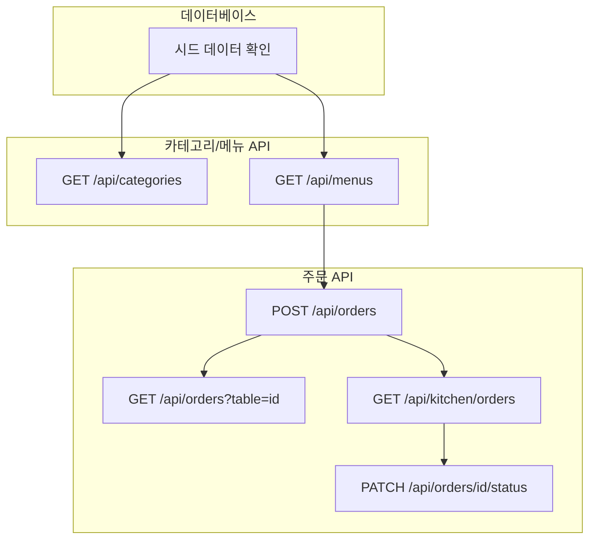

# TSK-01-04 - WP-01 통합 확인: 데이터베이스 및 API 검증 설계 문서

## 문서 정보

| 항목 | 내용 |
|------|------|
| Task ID | TSK-01-04 |
| 문서 버전 | 1.0 |
| 작성일 | 2026-01-02 |
| 상태 | 작성중 |
| 카테고리 | development |

---

## 1. 개요

### 1.1 배경 및 문제 정의

**현재 상황:**
- WP-01에서 데이터베이스(TSK-01-01), 카테고리/메뉴 API(TSK-01-02), 주문 API(TSK-01-03)가 개별적으로 구현됨
- 각 Task는 단위 수준에서 구현되었으나 전체적인 통합 동작 검증이 필요

**해결하려는 문제:**
- API 엔드포인트 간 연동 동작 검증 필요
- DB CRUD 작업의 정합성 확인 필요
- 에러 케이스 처리 검증 필요

### 1.2 목적 및 기대 효과

**목적:**
- WP-01의 모든 API 엔드포인트가 정상적으로 동작하는지 수동 테스트로 검증
- DB 데이터 정합성 확인
- 에러 케이스에 대한 적절한 응답 확인

**기대 효과:**
- WP-01 완료 기준 달성 확인
- 다음 단계(WP-02 실시간 통신)로 안전하게 진행 가능
- 잠재적 버그 조기 발견

### 1.3 범위

**포함:**
- GET /api/categories API 테스트
- GET /api/menus API 테스트
- POST /api/orders API 테스트
- GET /api/orders?table={id} API 테스트
- GET /api/kitchen/orders API 테스트
- PATCH /api/orders/{id}/status API 테스트
- DB 시드 데이터 확인
- 에러 케이스 검증

**제외:**
- WebSocket 실시간 통신 (WP-02에서 검증)
- 프론트엔드 화면 테스트 (WP-03, WP-04에서 검증)
- E2E 전체 플로우 테스트 (WP-05에서 검증)

### 1.4 참조 문서

| 문서 | 경로 | 관련 섹션 |
|------|------|----------|
| PRD | `.orchay/projects/table-order/prd.md` | 섹션 5 API 명세 |
| TRD | `.orchay/projects/table-order/trd.md` | 섹션 4 데이터베이스 |
| TSK-01-01 설계 | `tasks/TSK-01-01/010-design.md` | 전체 |
| TSK-01-02 설계 | `tasks/TSK-01-02/010-design.md` | 전체 |
| TSK-01-03 설계 | `tasks/TSK-01-03/010-design.md` | 전체 |

---

## 2. 사용자 분석

### 2.1 대상 사용자

| 사용자 유형 | 특성 | 주요 니즈 |
|------------|------|----------|
| 개발자/QA | 시스템 검증 담당 | API가 명세대로 동작하는지 확인 |

### 2.2 사용자 페르소나

**페르소나 1: 개발자**
- 역할: 백엔드 API 개발자
- 목표: 구현한 API가 정상 동작하는지 검증
- 불만: 통합 테스트 없이 다음 단계 진행 시 버그 발생
- 시나리오: curl 또는 API 클라이언트로 각 엔드포인트 테스트

---

## 3. 테스트 케이스

### 3.1 테스트 개요



### 3.2 테스트 케이스 상세

#### TC-01: 데이터베이스 시드 데이터 확인

| 항목 | 내용 |
|------|------|
| 전제 조건 | 개발 서버 실행, DB 초기화 완료 |
| 확인 항목 | 테이블 5개, 카테고리 3개, 메뉴 10개 이상 |
| 성공 기준 | 모든 시드 데이터 정상 조회 |

#### TC-02: GET /api/categories 테스트

| 항목 | 내용 |
|------|------|
| 요청 | `GET /api/categories` |
| 기대 응답 | `{ categories: Category[] }` |
| 성공 기준 | - 200 응답, - sort_order 순 정렬, - 카테고리 3개 이상 |

#### TC-03: GET /api/menus 테스트

| 항목 | 내용 |
|------|------|
| 요청 | `GET /api/menus` |
| 기대 응답 | `{ menus: Menu[] }` |
| 성공 기준 | - 200 응답, - 카테고리 정보 포함, - 품절 메뉴 제외 (기본) |

**추가 테스트:**
| 요청 | 기대 동작 |
|------|----------|
| `GET /api/menus?includeSoldOut=true` | 품절 메뉴도 포함하여 반환 |

#### TC-04: POST /api/orders 테스트

| 항목 | 내용 |
|------|------|
| 요청 | `POST /api/orders` |
| Body | `{ tableId: 1, items: [{ menuId: 1, quantity: 2 }] }` |
| 기대 응답 | `{ orderId: number }` |
| 성공 기준 | - 201 응답, - orderId 반환, - order_items 생성 확인 |

**에러 케이스:**
| 요청 | 기대 응답 |
|------|----------|
| items 빈 배열 | 400 Bad Request |
| 존재하지 않는 menuId | 400 Bad Request |
| 품절 메뉴 주문 시도 | 400 Bad Request |

#### TC-05: GET /api/orders?table={id} 테스트

| 항목 | 내용 |
|------|------|
| 요청 | `GET /api/orders?table=1` |
| 기대 응답 | `{ orders: Order[] }` |
| 성공 기준 | - 200 응답, - 최신 순 정렬, - 해당 테이블 주문만 조회 |

#### TC-06: GET /api/kitchen/orders 테스트

| 항목 | 내용 |
|------|------|
| 요청 | `GET /api/kitchen/orders` |
| 기대 응답 | `{ orders: Order[] }` |
| 성공 기준 | - 200 응답, - pending/cooking 상태만 조회, - completed 제외 |

#### TC-07: PATCH /api/orders/{id}/status 테스트

| 항목 | 내용 |
|------|------|
| 요청 | `PATCH /api/orders/1/status` |
| Body | `{ status: 'cooking' }` |
| 기대 응답 | `{ success: true }` |
| 성공 기준 | - 200 응답, - 상태 변경 확인 |

**상태 전이 규칙:**
| 현재 상태 | 허용 상태 | 비허용 상태 |
|----------|----------|-----------|
| pending | cooking | completed |
| cooking | completed | pending |
| completed | - | pending, cooking |

**에러 케이스:**
| 요청 | 기대 응답 |
|------|----------|
| 존재하지 않는 orderId | 404 Not Found |
| 잘못된 status 값 | 400 Bad Request |
| 허용되지 않는 상태 전이 | 400 Bad Request |

---

## 4. 테스트 시나리오

### 4.1 시나리오 1: 정상 주문 플로우

**상황 설명:**
개발자가 고객 주문 → 주방 조회 → 상태 변경 전체 플로우를 검증

**단계별 진행:**

| 단계 | 액션 | 기대 결과 |
|------|------|----------|
| 1 | GET /api/categories | 카테고리 목록 반환 |
| 2 | GET /api/menus | 메뉴 목록 반환 |
| 3 | POST /api/orders (table=1, menu=1, qty=2) | orderId 반환 |
| 4 | GET /api/orders?table=1 | 방금 생성한 주문 포함 |
| 5 | GET /api/kitchen/orders | 방금 생성한 주문 표시 |
| 6 | PATCH /api/orders/{id}/status (cooking) | 성공 응답 |
| 7 | PATCH /api/orders/{id}/status (completed) | 성공 응답 |
| 8 | GET /api/kitchen/orders | 완료된 주문 제외 확인 |

**성공 조건:**
- 모든 단계에서 기대한 응답 반환
- 상태 전이가 정상적으로 반영

### 4.2 시나리오 2: 에러 케이스 검증

**상황 설명:**
잘못된 요청에 대한 적절한 에러 응답 확인

**단계별 진행:**

| 단계 | 액션 | 기대 결과 |
|------|------|----------|
| 1 | POST /api/orders (빈 items) | 400 Bad Request |
| 2 | POST /api/orders (존재하지 않는 menuId) | 400 Bad Request |
| 3 | PATCH /api/orders/9999/status | 404 Not Found |
| 4 | PATCH /api/orders/1/status (invalid status) | 400 Bad Request |

---

## 5. 테스트 도구 및 방법

### 5.1 테스트 도구

| 도구 | 용도 |
|------|------|
| curl | CLI에서 빠른 API 테스트 |
| Postman / Insomnia | GUI 기반 API 테스트 |
| 브라우저 DevTools | 네트워크 탭에서 응답 확인 |

### 5.2 테스트 명령어 예시

```bash
# 카테고리 조회
curl http://localhost:3000/api/categories

# 메뉴 조회
curl http://localhost:3000/api/menus

# 메뉴 조회 (품절 포함)
curl "http://localhost:3000/api/menus?includeSoldOut=true"

# 주문 생성
curl -X POST http://localhost:3000/api/orders \
  -H "Content-Type: application/json" \
  -d '{"tableId": 1, "items": [{"menuId": 1, "quantity": 2}]}'

# 테이블별 주문 조회
curl "http://localhost:3000/api/orders?table=1"

# 주방 주문 조회
curl http://localhost:3000/api/kitchen/orders

# 주문 상태 변경
curl -X PATCH http://localhost:3000/api/orders/1/status \
  -H "Content-Type: application/json" \
  -d '{"status": "cooking"}'
```

---

## 6. 수용 기준

### 6.1 필수 조건

- [ ] GET /api/categories 정상 응답 (200, 카테고리 목록)
- [ ] GET /api/menus 정상 응답 (200, 메뉴 목록)
- [ ] POST /api/orders 주문 생성 성공 (201, orderId 반환)
- [ ] GET /api/orders?table={id} 조회 성공 (200, 주문 목록)
- [ ] GET /api/kitchen/orders 조회 성공 (200, pending/cooking만)
- [ ] PATCH /api/orders/{id}/status 상태 변경 성공 (200)
- [ ] 잘못된 요청 시 적절한 에러 반환 (400, 404)

### 6.2 추가 조건

- [ ] 카테고리 sort_order 순 정렬 확인
- [ ] 메뉴에 카테고리 정보 포함 확인
- [ ] 주문 최신 순 정렬 확인
- [ ] 상태 전이 규칙 준수 확인

---

## 7. 에러 처리

### 7.1 예상 에러 상황

| 상황 | 원인 | HTTP 코드 | 응답 메시지 |
|------|------|----------|------------|
| 빈 items | 주문 항목 없음 | 400 | "주문 항목이 필요합니다" |
| 잘못된 menuId | 존재하지 않는 메뉴 | 400 | "존재하지 않는 메뉴입니다" |
| 품절 메뉴 | 품절된 메뉴 주문 | 400 | "품절된 메뉴입니다" |
| 잘못된 orderId | 존재하지 않는 주문 | 404 | "주문을 찾을 수 없습니다" |
| 잘못된 status | 유효하지 않은 상태값 | 400 | "유효하지 않은 상태입니다" |
| 잘못된 상태 전이 | 허용되지 않는 전이 | 400 | "상태 변경이 허용되지 않습니다" |

---

## 8. 연관 문서

| 문서 | 경로 | 용도 |
|------|------|------|
| 요구사항 추적 매트릭스 | `025-traceability-matrix.md` | PRD → 설계 → 테스트 추적 |
| 테스트 명세서 | `026-test-specification.md` | 상세 테스트 케이스 |

---

## 9. 구현 범위

### 9.1 영향받는 영역

| 영역 | 변경 내용 | 영향도 |
|------|----------|--------|
| API 엔드포인트 | 테스트 검증 대상 | 높음 |
| 데이터베이스 | 시드 데이터 확인 | 중간 |

### 9.2 의존성

| 의존 항목 | 이유 | 상태 |
|----------|------|------|
| TSK-01-01 | DB 설정 필요 | 진행중 |
| TSK-01-02 | 카테고리/메뉴 API 필요 | 진행중 |
| TSK-01-03 | 주문 API 필요 | 진행중 |

### 9.3 제약 사항

| 제약 | 설명 | 대응 방안 |
|------|------|----------|
| 수동 테스트 | 자동화된 테스트 없음 | curl/Postman으로 수동 검증 |
| WebSocket 제외 | 실시간 통신 미검증 | WP-02에서 별도 검증 |

---

## 10. 체크리스트

### 10.1 설계 완료 확인

- [x] 테스트 케이스 정의 완료
- [x] 테스트 시나리오 작성 완료
- [x] 에러 케이스 정의 완료
- [x] 수용 기준 명확화

### 10.2 테스트 준비

- [ ] 개발 서버 실행 확인
- [ ] DB 시드 데이터 확인
- [ ] 테스트 도구 준비 (curl/Postman)

---

## 변경 이력

| 버전 | 일자 | 작성자 | 변경 내용 |
|------|------|--------|----------|
| 1.0 | 2026-01-02 | Claude | 최초 작성 |
