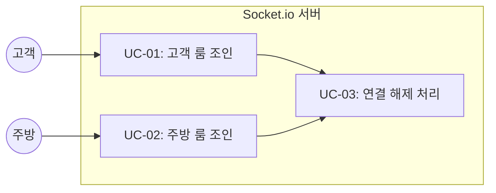
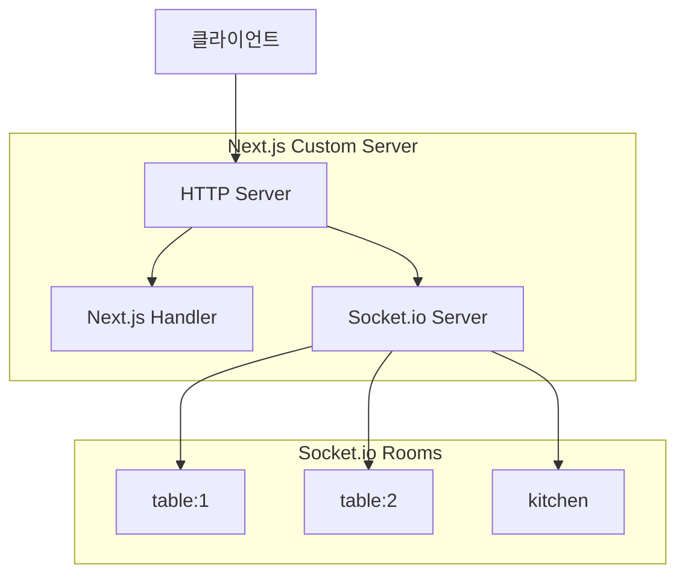

# TSK-02-01 - Socket.io 서버 설정 및 Custom Server 구성 설계 문서

## 문서 정보

| 항목 | 내용 |
|------|------|
| Task ID | TSK-02-01 |
| 문서 버전 | 1.0 |
| 작성일 | 2026-01-02 |
| 상태 | 작성중 |
| 카테고리 | development |

---

## 1. 개요

### 1.1 배경 및 문제 정의

**현재 상황:**
- Next.js 기본 서버는 WebSocket을 네이티브로 지원하지 않음
- 고객 주문과 주방 화면 간 실시간 통신 필요

**해결하려는 문제:**
- 고객이 주문하면 주방 화면에 즉시 표시되어야 함
- 주방에서 조리 상태 변경 시 고객에게 실시간 반영되어야 함
- WebSocket 기반 양방향 통신 인프라 구축 필요

### 1.2 목적 및 기대 효과

**목적:**
- Socket.io를 사용한 실시간 통신 서버 구축
- Next.js와 Socket.io 통합을 위한 Custom Server 설정
- 룸 기반 메시지 라우팅 구현

**기대 효과:**
- 주문 생성 시 주방 화면에 1초 이내 표시
- 조리 상태 변경 시 고객 화면에 즉시 반영
- 테이블/주방별 독립적인 이벤트 채널 운영

### 1.3 범위

**포함:**
- Next.js Custom Server 설정 (server.ts)
- Socket.io 서버 인스턴스 생성 및 설정
- 룸 기반 이벤트 핸들러 (join:table, join:kitchen)
- 클라이언트 연결/해제 로깅

**제외:**
- 실제 주문 이벤트 송수신 (TSK-02-02에서 구현)
- 클라이언트 사이드 Socket.io 유틸리티 (TSK-02-02에서 구현)
- 재연결 로직 (TSK-02-02에서 구현)

### 1.4 참조 문서

| 문서 | 경로 | 관련 섹션 |
|------|------|----------|
| PRD | `.orchay/projects/table-order/prd.md` | 섹션 5 WebSocket 이벤트 |
| TRD | `.orchay/projects/table-order/trd.md` | 섹션 5 실시간 통신 |

---

## 2. 사용자 분석

### 2.1 대상 사용자

| 사용자 유형 | 특성 | 주요 니즈 |
|------------|------|----------|
| 시스템 (백엔드) | Socket.io 서버 | 안정적인 WebSocket 연결 관리 |
| 고객 클라이언트 | 주문 화면 | 테이블별 룸에 조인하여 상태 수신 |
| 주방 클라이언트 | KDS 화면 | kitchen 룸에 조인하여 주문 수신 |

### 2.2 시스템 페르소나

**페르소나 1: 고객 클라이언트**
- 역할: 테이블에서 주문하는 사용자
- 목표: 주문 상태 실시간 확인
- 시나리오: `/order?table=5` 접속 → `table:5` 룸 조인 → 상태 변경 이벤트 수신

**페르소나 2: 주방 클라이언트**
- 역할: 주문을 처리하는 주방 직원
- 목표: 새 주문 실시간 수신
- 시나리오: `/kitchen` 접속 → `kitchen` 룸 조인 → 새 주문 이벤트 수신

---

## 3. 유즈케이스

### 3.1 유즈케이스 다이어그램



### 3.2 유즈케이스 상세

#### UC-01: 고객 룸 조인

| 항목 | 내용 |
|------|------|
| 액터 | 고객 클라이언트 |
| 목적 | 테이블별 룸에 조인하여 주문 상태 수신 준비 |
| 사전 조건 | WebSocket 연결 수립 |
| 사후 조건 | `table:{tableId}` 룸에 조인됨 |
| 트리거 | 클라이언트에서 `join:table` 이벤트 전송 |

**기본 흐름:**
1. 클라이언트가 WebSocket 연결을 수립한다
2. 클라이언트가 `join:table` 이벤트와 함께 `tableId`를 전송한다
3. 서버가 해당 소켓을 `table:{tableId}` 룸에 조인시킨다
4. 서버가 연결 로그를 출력한다

#### UC-02: 주방 룸 조인

| 항목 | 내용 |
|------|------|
| 액터 | 주방 클라이언트 |
| 목적 | kitchen 룸에 조인하여 새 주문 수신 준비 |
| 사전 조건 | WebSocket 연결 수립 |
| 사후 조건 | `kitchen` 룸에 조인됨 |
| 트리거 | 클라이언트에서 `join:kitchen` 이벤트 전송 |

**기본 흐름:**
1. 클라이언트가 WebSocket 연결을 수립한다
2. 클라이언트가 `join:kitchen` 이벤트를 전송한다
3. 서버가 해당 소켓을 `kitchen` 룸에 조인시킨다
4. 서버가 연결 로그를 출력한다

#### UC-03: 연결 해제 처리

| 항목 | 내용 |
|------|------|
| 액터 | 클라이언트 (고객/주방) |
| 목적 | 연결 해제 시 정리 |
| 사전 조건 | WebSocket 연결 수립됨 |
| 사후 조건 | 소켓 리소스 정리됨 |
| 트리거 | 클라이언트 연결 종료 또는 네트워크 단절 |

**기본 흐름:**
1. 클라이언트 연결이 종료된다
2. 서버가 disconnect 이벤트를 수신한다
3. 서버가 해제 로그를 출력한다
4. Socket.io가 자동으로 룸에서 제거한다

---

## 4. 사용자 시나리오

### 4.1 시나리오 1: 고객 테이블 연결

**상황 설명:**
고객이 테이블 5번에서 QR 코드를 스캔하고 주문 페이지에 접속한다.

**단계별 진행:**

| 단계 | 사용자 행동 | 시스템 반응 | 사용자 기대 |
|------|-----------|------------|------------|
| 1 | QR 스캔으로 `/order?table=5` 접속 | 페이지 로드 + WebSocket 연결 | 페이지 정상 표시 |
| 2 | (자동) join:table 이벤트 전송 | `table:5` 룸에 조인 | - |
| 3 | 주문 진행 | 상태 변경 이벤트 수신 가능 | 실시간 알림 |

**성공 조건:**
- WebSocket 연결 수립됨
- `table:5` 룸에 조인됨
- 서버 로그에 연결 정보 출력됨

### 4.2 시나리오 2: 주방 연결

**상황 설명:**
주방 직원이 태블릿에서 `/kitchen` 페이지에 접속한다.

**단계별 진행:**

| 단계 | 사용자 행동 | 시스템 반응 | 사용자 기대 |
|------|-----------|------------|------------|
| 1 | `/kitchen` 페이지 접속 | 페이지 로드 + WebSocket 연결 | 주문 현황 화면 |
| 2 | (자동) join:kitchen 이벤트 전송 | `kitchen` 룸에 조인 | - |
| 3 | 대기 | 새 주문 이벤트 수신 가능 | 실시간 주문 수신 |

**성공 조건:**
- WebSocket 연결 수립됨
- `kitchen` 룸에 조인됨
- 서버 로그에 연결 정보 출력됨

---

## 5. 아키텍처 설계

### 5.1 서버 구조



### 5.2 파일 구조

```
mvp/src/
├── server.ts              # Custom Server 진입점
├── lib/
│   └── socket.ts          # Socket.io 서버 설정 (서버 사이드)
└── package.json           # dev 스크립트 수정
```

### 5.3 이벤트 정의

| 이벤트 | 방향 | 데이터 | 설명 |
|--------|------|--------|------|
| `connection` | Client → Server | - | 연결 수립 |
| `join:table` | Client → Server | `tableId: number` | 테이블 룸 조인 |
| `join:kitchen` | Client → Server | - | 주방 룸 조인 |
| `disconnect` | Client → Server | - | 연결 해제 |

---

## 6. 기술 명세

### 6.1 server.ts 구현

```typescript
// mvp/src/server.ts
import { createServer } from 'http';
import { parse } from 'url';
import next from 'next';
import { Server } from 'socket.io';

const dev = process.env.NODE_ENV !== 'production';
const hostname = 'localhost';
const port = parseInt(process.env.PORT || '3000', 10);

const app = next({ dev, hostname, port });
const handle = app.getRequestHandler();

app.prepare().then(() => {
  const httpServer = createServer((req, res) => {
    const parsedUrl = parse(req.url!, true);
    handle(req, res, parsedUrl);
  });

  const io = new Server(httpServer, {
    cors: {
      origin: '*',
      methods: ['GET', 'POST'],
    },
  });

  io.on('connection', (socket) => {
    console.log(`[Socket.io] 연결됨: ${socket.id}`);

    socket.on('join:table', (tableId: number) => {
      const room = `table:${tableId}`;
      socket.join(room);
      console.log(`[Socket.io] ${socket.id} → ${room} 조인`);
    });

    socket.on('join:kitchen', () => {
      socket.join('kitchen');
      console.log(`[Socket.io] ${socket.id} → kitchen 조인`);
    });

    socket.on('disconnect', () => {
      console.log(`[Socket.io] 연결 해제: ${socket.id}`);
    });
  });

  // io 인스턴스를 전역으로 저장 (API 라우트에서 사용)
  (global as any).io = io;

  httpServer.listen(port, () => {
    console.log(`> Ready on http://${hostname}:${port}`);
  });
});
```

### 6.2 package.json 스크립트 수정

```json
{
  "scripts": {
    "dev": "tsx watch src/server.ts",
    "build": "next build",
    "start": "NODE_ENV=production tsx src/server.ts"
  }
}
```

### 6.3 의존성 추가

```bash
npm install tsx --save-dev
```

> **tsx**: TypeScript 파일을 직접 실행하기 위한 런타임

---

## 7. 테스트 요구사항

### 7.1 수용 기준

| ID | 기준 | 검증 방법 |
|----|------|----------|
| AC-01 | `npm run dev`로 Custom Server 실행 | 터미널에서 명령 실행 |
| AC-02 | 클라이언트 연결 시 로그 출력 | 브라우저 DevTools 확인 |
| AC-03 | `join:table` 이벤트로 룸 조인 | 서버 로그 확인 |
| AC-04 | `join:kitchen` 이벤트로 룸 조인 | 서버 로그 확인 |

### 7.2 테스트 시나리오

**테스트 1: 서버 시작**
```bash
npm run dev
# 예상 출력: > Ready on http://localhost:3000
```

**테스트 2: 클라이언트 연결**
```javascript
// 브라우저 콘솔에서
const socket = io('http://localhost:3000');
socket.emit('join:table', 5);
// 서버 로그: [Socket.io] {id} → table:5 조인
```

---

## 8. 연관 문서

| 문서 | 경로 | 용도 |
|------|------|------|
| 요구사항 추적 매트릭스 | `025-traceability-matrix.md` | PRD → 설계 → 테스트 추적 |
| 테스트 명세서 | `026-test-specification.md` | 상세 테스트 케이스 |

---

## 9. 구현 범위

### 9.1 영향받는 영역

| 영역 | 변경 내용 | 영향도 |
|------|----------|--------|
| server.ts | 신규 생성 - Custom Server | 높음 |
| package.json | dev/start 스크립트 수정 | 중간 |
| 전역 io 인스턴스 | API 라우트에서 접근 가능 | 높음 |

### 9.2 의존성

| 의존 항목 | 이유 | 상태 |
|----------|------|------|
| TSK-01-03 (주문 API) | API 라우트에서 io 인스턴스 사용 | 선행 필요 |

### 9.3 제약 사항

| 제약 | 설명 | 대응 방안 |
|------|------|----------|
| Custom Server 사용 | Vercel 배포 시 제한 | Railway 또는 자체 서버 사용 |
| 전역 io 인스턴스 | TypeScript 타입 문제 | global 타입 확장 |

---

## 10. 체크리스트

### 10.1 설계 완료 확인

- [x] 문제 정의 및 목적 명확화
- [x] 사용자 분석 완료
- [x] 유즈케이스 정의 완료
- [x] 시나리오 작성 완료
- [x] 아키텍처 설계 완료
- [x] 기술 명세 작성 완료
- [x] 테스트 요구사항 정의 완료

### 10.2 구현 준비

- [x] 구현 우선순위 결정
- [x] 의존성 확인 완료 (TSK-01-03 선행 필요)
- [x] 제약 사항 검토 완료

---

## 변경 이력

| 버전 | 일자 | 작성자 | 변경 내용 |
|------|------|--------|----------|
| 1.0 | 2026-01-02 | Claude | 최초 작성 |
