# TSK-02-02 - 실시간 이벤트 송수신 구현 설계 문서

## 문서 정보

| 항목 | 내용 |
|------|------|
| Task ID | TSK-02-02 |
| 문서 버전 | 1.0 |
| 작성일 | 2026-01-02 |
| 상태 | 작성중 |
| 카테고리 | development |

---

## 1. 개요

### 1.1 배경 및 문제 정의

**현재 상황:**
- TSK-02-01에서 Socket.io 서버 및 Custom Server 구성 완료
- 클라이언트와 서버 간 WebSocket 연결 인프라 준비됨
- 룸 기반 이벤트 처리 구조 (table:{id}, kitchen) 구축됨

**해결하려는 문제:**
- 새 주문 생성 시 주방 화면에 실시간 알림이 전달되지 않음
- 주방에서 주문 상태 변경 시 고객 화면에 즉시 반영되지 않음
- 클라이언트 측 Socket.io 연결 및 이벤트 핸들링 미구현

### 1.2 목적 및 기대 효과

**목적:**
- 주문 생성 시 `order:new` 이벤트로 주방에 실시간 알림 전송
- 주문 상태 변경 시 `order:status` 이벤트로 고객에 실시간 알림 전송
- 클라이언트 측 Socket.io 훅/유틸 구현

**기대 효과:**
- 고객: 주문 상태를 새로고침 없이 실시간으로 확인 가능
- 주방: 새 주문 즉시 수신으로 빠른 대응 가능
- 비즈니스: 주문-조리 프로세스 효율화, 고객 만족도 향상

### 1.3 범위

**포함:**
- `order:new` 이벤트 구현 (서버 → 주방)
- `order:status` 이벤트 구현 (서버 → 고객)
- 클라이언트 Socket.io 유틸/훅 (`lib/socket.ts`)
- 연결 끊김 시 재연결 처리

**제외:**
- 주문 생성 API 수정 (이벤트 발송 로직 추가만)
- 주문 상태 변경 API 수정 (이벤트 발송 로직 추가만)
- UI 컴포넌트 구현 (별도 Task)

### 1.4 참조 문서

| 문서 | 경로 | 관련 섹션 |
|------|------|----------|
| PRD | `.orchay/projects/table-order/prd.md` | 섹션 5 WebSocket 이벤트 |
| TRD | `.orchay/projects/table-order/trd.md` | 섹션 5 실시간 통신 |
| TSK-02-01 설계 | `tasks/TSK-02-01/010-design.md` | Socket.io 서버 설정 |

---

## 2. 사용자 분석

### 2.1 대상 사용자

| 사용자 유형 | 특성 | 주요 니즈 |
|------------|------|----------|
| 고객 | 테이블에서 모바일로 주문, 기술 수준 다양 | 주문 상태를 즉시 알고 싶음 |
| 주방 | KDS 화면 사용, 빠른 주문 확인 필요 | 새 주문 놓치지 않고 바로 확인 |

### 2.2 사용자 페르소나

**페르소나 1: 고객 김민수**
- 역할: 식당 고객
- 목표: 주문 후 조리 상태를 실시간으로 알고 싶음
- 불만: 주문이 잘 들어갔는지, 언제 나오는지 알 수 없음
- 시나리오: 주문 후 상태 페이지에서 "조리중" 표시 확인

**페르소나 2: 주방 직원 박조리**
- 역할: 주방 조리사
- 목표: 새 주문을 빠르게 확인하고 조리 시작
- 불만: 새 주문이 왔는지 모르고 놓치는 경우 발생
- 시나리오: 새 주문 알림음과 함께 KDS에 주문 카드 표시

---

## 3. 유즈케이스

### 3.1 유즈케이스 다이어그램

```mermaid
flowchart LR
    subgraph 시스템
        UC01[UC-01: 새 주문 실시간 수신]
        UC02[UC-02: 주문 상태 실시간 수신]
        UC03[UC-03: 연결 복원]
    end

    주방((주방)) --> UC01
    고객((고객)) --> UC02
    고객 --> UC03
    주방 --> UC03
```

### 3.2 유즈케이스 상세

#### UC-01: 새 주문 실시간 수신

| 항목 | 내용 |
|------|------|
| 액터 | 주방 |
| 목적 | 고객이 주문하면 주방에서 즉시 확인 |
| 사전 조건 | 주방 화면이 kitchen 룸에 조인됨 |
| 사후 조건 | 주방 화면에 새 주문 카드 추가, 알림음 재생 |
| 트리거 | 고객이 POST /api/orders 호출 |

**기본 흐름:**
1. 고객이 주문하기 버튼을 클릭한다
2. 서버가 주문을 DB에 저장한다
3. 서버가 `order:new` 이벤트를 kitchen 룸에 발송한다
4. 주방 클라이언트가 이벤트를 수신한다
5. 주방 화면에 새 주문 카드가 표시되고 알림음이 재생된다

**예외 흐름:**
- 3a. WebSocket 연결 끊김:
  - 주방이 재연결되면 GET /api/kitchen/orders로 최신 목록 조회
  - 누락된 주문 없이 전체 동기화

#### UC-02: 주문 상태 실시간 수신

| 항목 | 내용 |
|------|------|
| 액터 | 고객 |
| 목적 | 주방에서 상태 변경 시 고객이 즉시 확인 |
| 사전 조건 | 고객 화면이 table:{id} 룸에 조인됨 |
| 사후 조건 | 고객 화면에 변경된 상태 표시 |
| 트리거 | 주방이 PATCH /api/orders/{id}/status 호출 |

**기본 흐름:**
1. 주방이 조리 시작/완료 버튼을 클릭한다
2. 서버가 주문 상태를 업데이트한다
3. 서버가 `order:status` 이벤트를 해당 table:{id} 룸에 발송한다
4. 고객 클라이언트가 이벤트를 수신한다
5. 고객 화면의 주문 상태 배지가 업데이트된다

**예외 흐름:**
- 3a. WebSocket 연결 끊김:
  - 고객이 재연결되면 GET /api/orders?table={id}로 최신 상태 조회

#### UC-03: 연결 복원

| 항목 | 내용 |
|------|------|
| 액터 | 고객, 주방 |
| 목적 | 연결 끊김 후 자동 재연결 및 데이터 동기화 |
| 사전 조건 | WebSocket 연결이 끊어진 상태 |
| 사후 조건 | 연결 복원, 기존 룸 재조인, 최신 데이터 조회 |
| 트리거 | 네트워크 복원 또는 페이지 포커스 |

**기본 흐름:**
1. Socket.io 클라이언트가 자동 재연결 시도
2. 연결 성공 시 기존 룸에 다시 조인
3. 해당 화면의 최신 데이터 API 조회
4. UI 상태 동기화

---

## 4. 사용자 시나리오

### 4.1 시나리오 1: 고객 주문 → 주방 수신

**상황 설명:**
고객이 5번 테이블에서 김치찌개 2개를 주문합니다. 주방에서는 KDS 화면을 보고 있습니다.

**단계별 진행:**

| 단계 | 사용자 행동 | 시스템 반응 | 사용자 기대 |
|------|-----------|------------|------------|
| 1 | 고객이 주문하기 버튼 클릭 | POST /api/orders 호출 | 주문 전송됨 |
| 2 | - | 서버가 order:new 이벤트 발송 | - |
| 3 | 주방이 KDS 화면 확인 | 알림음 재생, 새 주문 카드 표시 | 새 주문 즉시 확인 |

**성공 조건:**
- 주문 생성 후 1초 이내 주방 화면에 표시
- 알림음 재생됨

### 4.2 시나리오 2: 주방 상태 변경 → 고객 수신

**상황 설명:**
주방에서 5번 테이블 주문의 조리를 시작합니다. 고객은 상태 확인 페이지를 보고 있습니다.

**단계별 진행:**

| 단계 | 사용자 행동 | 시스템 반응 | 사용자 기대 |
|------|-----------|------------|------------|
| 1 | 주방이 조리시작 버튼 클릭 | PATCH /api/orders/{id}/status 호출 | 상태 변경됨 |
| 2 | - | 서버가 order:status 이벤트 발송 | - |
| 3 | 고객이 상태 페이지 확인 | StatusBadge가 "조리중"으로 변경 | 상태 즉시 확인 |

**성공 조건:**
- 상태 변경 후 1초 이내 고객 화면에 반영
- 새로고침 없이 자동 업데이트

### 4.3 시나리오 3: 연결 끊김 복구

**상황 설명:**
고객이 상태 페이지를 보다가 일시적으로 네트워크가 끊겼다가 복원됩니다.

**단계별 진행:**

| 단계 | 사용자 행동 | 시스템 반응 | 복구 방법 |
|------|-----------|------------|----------|
| 1 | 네트워크 끊김 | 연결 끊김 상태 표시 (선택) | 자동 재연결 시도 |
| 2 | 네트워크 복원 | 재연결 성공, 룸 재조인 | 최신 데이터 API 조회 |
| 3 | - | UI 상태 동기화 | 놓친 이벤트 없이 최신 상태 표시 |

---

## 5. 화면 설계

> 이 Task는 클라이언트 유틸/훅 구현이 주요 범위입니다.
> 화면 UI는 TSK-03-03 (고객 상태 페이지), TSK-04-01 (주방 KDS)에서 구현합니다.
> 연결 상태 표시는 이 Task에서 `isConnected` 상태를 제공하며, UI 구현 Task에서 인디케이터로 활용합니다.

### 5.1 클라이언트 연결 상태 표시 (선택)

**연결 상태 인디케이터:**
```
┌─────────────────────────────────────┐
│  🟢 실시간 연결됨    (연결 시)       │
│  🟡 연결 중...      (재연결 시도)    │
│  🔴 연결 끊김       (오프라인)       │
└─────────────────────────────────────┘
```

> 연결 상태 표시는 선택 사항이며, UI 구현 Task에서 추가 가능합니다.

---

## 6. 인터랙션 설계

### 6.1 이벤트 플로우

```mermaid
sequenceDiagram
    participant C as 고객
    participant S as 서버
    participant K as 주방

    Note over C,K: 새 주문 플로우
    C->>S: POST /api/orders
    S->>S: DB 저장
    S->>K: order:new (kitchen 룸)
    K->>K: 주문 카드 추가 + 알림음

    Note over C,K: 상태 변경 플로우
    K->>S: PATCH /api/orders/{id}/status
    S->>S: DB 업데이트
    S->>C: order:status (table:{id} 룸)
    C->>C: StatusBadge 업데이트
```



### 6.2 이벤트 페이로드

#### order:new 이벤트

```typescript
interface OrderNewEvent {
  orderId: number;
  tableNumber: number;
  items: {
    menuId: number;
    menuName: string;
    quantity: number;
  }[];
  createdAt: string; // ISO 8601
}
```

#### order:status 이벤트

```typescript
interface OrderStatusEvent {
  orderId: number;
  status: 'pending' | 'cooking' | 'completed';
  updatedAt: string; // ISO 8601
}
```

### 6.3 재연결 처리

| 상태 | 처리 | API 호출 |
|------|------|----------|
| 주방 재연결 | kitchen 룸 재조인 | GET /api/kitchen/orders |
| 고객 재연결 | table:{id} 룸 재조인 | GET /api/orders?table={id} |

#### 재연결 순서 (경쟁 조건 방지)

```
1. 연결 복원 감지 (connect 이벤트)
2. 룸 재조인 요청 (join:table 또는 join:kitchen)
3. 룸 조인 완료 대기 (서버 응답)
4. API 호출하여 최신 데이터 조회
5. UI 상태 업데이트
```

> **주의**: 룸 조인이 완료되기 전에 API를 호출하면, API 응답 후 ~ 룸 조인 사이에 발생한 이벤트가 누락될 수 있습니다.

---

## 7. 데이터 요구사항

### 7.1 필요한 데이터

| 데이터 | 설명 | 출처 | 용도 |
|--------|------|------|------|
| orderId | 주문 ID | 주문 생성 API 응답 | 이벤트 식별 |
| tableNumber | 테이블 번호 | orders.table_id → tables.table_number | 주문 표시 |
| items | 주문 항목 | order_items + menus | 주문 상세 표시 |
| status | 주문 상태 | orders.status | 상태 배지 표시 |

### 7.2 클라이언트 상태 관리

```typescript
// 주방 화면 상태
interface KitchenState {
  orders: Order[];
  isConnected: boolean;
}

// 고객 상태 화면 상태
interface CustomerStatusState {
  orders: Order[];
  tableId: number;
  isConnected: boolean;
}
```

---

## 8. 비즈니스 규칙

### 8.1 핵심 규칙

| 규칙 ID | 규칙 설명 | 적용 상황 | 예외 |
|---------|----------|----------|------|
| BR-01 | 주문 생성 시 즉시 주방에 알림 | POST /api/orders 성공 시 | 없음 |
| BR-02 | 상태 변경 시 해당 테이블에만 알림 | PATCH /api/orders/{id}/status 성공 시 | 없음 |
| BR-03 | 완료된 주문도 상태 이벤트 발송 | completed 상태 변경 시 | 없음 |

### 8.2 규칙 상세 설명

**BR-01: 주문 생성 즉시 알림**

설명: 고객이 주문하면 주방이 즉시 확인할 수 있어야 합니다. 주문 API 성공 후 반드시 `order:new` 이벤트를 발송해야 합니다.

**BR-02: 테이블별 알림**

설명: 상태 변경 알림은 해당 주문의 테이블 룸에만 발송합니다. 다른 테이블 고객에게는 전달되지 않습니다.

---

## 9. 에러 처리

### 9.1 예상 에러 상황

| 상황 | 원인 | 사용자 메시지 | 복구 방법 |
|------|------|--------------|----------|
| 연결 실패 | 서버 다운, 네트워크 문제 | "서버 연결 중..." | 자동 재연결 시도 |
| 이벤트 수신 실패 | 연결 끊김 중 이벤트 발생 | - | 재연결 시 API 재조회 |
| 룸 조인 실패 | 잘못된 tableId | 콘솔 경고 | 페이지 새로고침 |

### 9.2 에러 표시 방식

| 에러 유형 | 표시 위치 | 표시 방법 |
|----------|----------|----------|
| 연결 끊김 | 화면 상단 (선택) | 연결 상태 인디케이터 |
| 재연결 시도 | 화면 상단 (선택) | "연결 중..." 표시 |

---

## 10. 연관 문서

| 문서 | 경로 | 용도 |
|------|------|------|
| 요구사항 추적 매트릭스 | `025-traceability-matrix.md` | PRD → 설계 → 테스트 추적 |
| 테스트 명세서 | `026-test-specification.md` | 단위/E2E/매뉴얼 테스트 정의 |

---

## 11. 구현 범위

### 11.1 영향받는 영역

| 영역 | 변경 내용 | 영향도 |
|------|----------|--------|
| lib/socket.ts | Socket.io 클라이언트 유틸 생성 | 높음 |
| lib/validators.ts | 이벤트 페이로드 검증 함수 | 중간 |
| types/index.ts | OrderNewEvent, OrderStatusEvent 타입 export | 중간 |
| api/orders/route.ts | order:new 이벤트 발송 추가 | 중간 |
| api/orders/[id]/status/route.ts | order:status 이벤트 발송 추가 | 중간 |
| server.ts | io 인스턴스 export 추가 | 낮음 |

### 11.2 의존성

| 의존 항목 | 이유 | 상태 |
|----------|------|------|
| TSK-02-01 | Socket.io 서버 설정 | 완료 대기 |
| TSK-01-03 | 주문 API | 완료 대기 |

### 11.3 제약 사항

| 제약 | 설명 | 대응 방안 |
|------|------|----------|
| Socket.io 인스턴스 공유 | API 라우트에서 io 인스턴스 접근 필요 | 전역 싱글톤 또는 context 활용 |
| Next.js API Routes 제한 | WebSocket 직접 사용 불가 | Custom Server 활용 |

---

## 12. 기술 상세

### 12.1 클라이언트 Socket.io 유틸

```typescript
// lib/socket.ts
import { io, Socket } from 'socket.io-client';

let socket: Socket | null = null;

export function getSocket(): Socket {
  if (!socket) {
    socket = io({
      path: '/socket.io',
      autoConnect: true,
      reconnection: true,
      reconnectionAttempts: Infinity,
      reconnectionDelay: 1000,
      reconnectionDelayMax: 5000,
    });
  }
  return socket;
}

export function joinTable(tableId: number): void {
  const socket = getSocket();
  socket.emit('join:table', tableId);
}

export function joinKitchen(): void {
  const socket = getSocket();
  socket.emit('join:kitchen');
}

export function onOrderNew(callback: (data: OrderNewEvent) => void): () => void {
  const socket = getSocket();
  socket.on('order:new', callback);
  return () => socket.off('order:new', callback);
}

export function onOrderStatus(callback: (data: OrderStatusEvent) => void): () => void {
  const socket = getSocket();
  socket.on('order:status', callback);
  return () => socket.off('order:status', callback);
}

export function onConnect(callback: () => void): () => void {
  const socket = getSocket();
  socket.on('connect', callback);
  return () => socket.off('connect', callback);
}

export function onDisconnect(callback: () => void): () => void {
  const socket = getSocket();
  socket.on('disconnect', callback);
  return () => socket.off('disconnect', callback);
}
```

### 12.2 서버 이벤트 발송

#### 페이로드 검증 함수

```typescript
// lib/validators.ts
import type { OrderNewEvent, OrderStatusEvent } from '@/types';

export function validateOrderNewPayload(payload: unknown): payload is OrderNewEvent {
  if (!payload || typeof payload !== 'object') return false;
  const p = payload as Record<string, unknown>;

  return (
    typeof p.orderId === 'number' &&
    typeof p.tableNumber === 'number' &&
    Array.isArray(p.items) &&
    p.items.length > 0 &&
    p.items.every((item: unknown) => {
      if (!item || typeof item !== 'object') return false;
      const i = item as Record<string, unknown>;
      return (
        typeof i.menuId === 'number' &&
        typeof i.menuName === 'string' &&
        typeof i.quantity === 'number' && i.quantity > 0
      );
    }) &&
    typeof p.createdAt === 'string'
  );
}

export function validateOrderStatusPayload(payload: unknown): payload is OrderStatusEvent {
  if (!payload || typeof payload !== 'object') return false;
  const p = payload as Record<string, unknown>;

  return (
    typeof p.orderId === 'number' &&
    ['pending', 'cooking', 'completed'].includes(p.status as string) &&
    typeof p.updatedAt === 'string'
  );
}
```

#### 이벤트 발송 코드

```typescript
// server.ts 수정 - io 인스턴스 export
import { Server as SocketIOServer } from 'socket.io';

export let io: SocketIOServer | null = null;

// 서버 초기화 시
io = new Server(server);

// api/orders/route.ts에서 사용
import { io } from '@/server';
import { validateOrderNewPayload } from '@/lib/validators';

// POST /api/orders 핸들러 내부
if (io) {
  const payload = {
    orderId: result.lastInsertRowid,
    tableNumber,
    items,
    createdAt: new Date().toISOString(),
  };

  if (validateOrderNewPayload(payload)) {
    io.to('kitchen').emit('order:new', payload);
  } else {
    console.error('Invalid order:new payload', payload);
  }
}

// api/orders/[id]/status/route.ts에서 사용
import { validateOrderStatusPayload } from '@/lib/validators';

// PATCH 핸들러 내부
if (io) {
  const payload = {
    orderId: id,
    status,
    updatedAt: new Date().toISOString(),
  };

  if (validateOrderStatusPayload(payload)) {
    io.to(`table:${tableId}`).emit('order:status', payload);
  } else {
    console.error('Invalid order:status payload', payload);
  }
}
```

### 12.3 React 훅 (선택)

```typescript
// hooks/useSocket.ts
import { useEffect, useState, useCallback } from 'react';
import { getSocket, joinTable, joinKitchen, onOrderNew, onOrderStatus, onConnect, onDisconnect } from '@/lib/socket';
import type { OrderNewEvent, OrderStatusEvent } from '@/types';

export function useKitchenSocket(onNewOrder: (data: OrderNewEvent) => void) {
  const [isConnected, setIsConnected] = useState(false);

  useEffect(() => {
    joinKitchen();

    const unsubConnect = onConnect(() => setIsConnected(true));
    const unsubDisconnect = onDisconnect(() => setIsConnected(false));
    const unsubNewOrder = onOrderNew(onNewOrder);

    return () => {
      unsubConnect();
      unsubDisconnect();
      unsubNewOrder();
    };
  }, [onNewOrder]);

  return { isConnected };
}

export function useCustomerSocket(tableId: number, onStatusChange: (data: OrderStatusEvent) => void) {
  const [isConnected, setIsConnected] = useState(false);

  useEffect(() => {
    joinTable(tableId);

    const unsubConnect = onConnect(() => setIsConnected(true));
    const unsubDisconnect = onDisconnect(() => setIsConnected(false));
    const unsubStatus = onOrderStatus(onStatusChange);

    return () => {
      unsubConnect();
      unsubDisconnect();
      unsubStatus();
    };
  }, [tableId, onStatusChange]);

  return { isConnected };
}
```

---

## 13. 체크리스트

### 13.1 설계 완료 확인

- [x] 문제 정의 및 목적 명확화
- [x] 사용자 분석 완료
- [x] 유즈케이스 정의 완료
- [x] 사용자 시나리오 작성 완료
- [x] 인터랙션 설계 완료
- [x] 데이터 요구사항 정의 완료
- [x] 비즈니스 규칙 정의 완료
- [x] 에러 처리 정의 완료
- [x] 기술 상세 정의 완료

### 13.2 연관 문서 작성

- [x] 요구사항 추적 매트릭스 작성 (→ `025-traceability-matrix.md`)
- [x] 테스트 명세서 작성 (→ `026-test-specification.md`)

### 13.3 구현 준비

- [x] 구현 우선순위 결정
- [x] 의존성 확인 완료
- [x] 제약 사항 검토 완료

---

## 변경 이력

| 버전 | 일자 | 작성자 | 변경 내용 |
|------|------|--------|----------|
| 1.0 | 2026-01-02 | Claude | 최초 작성 |
| 1.1 | 2026-01-02 | Claude | 설계 리뷰 반영 (페이로드 검증, 재연결 순서, 타입 export) |
