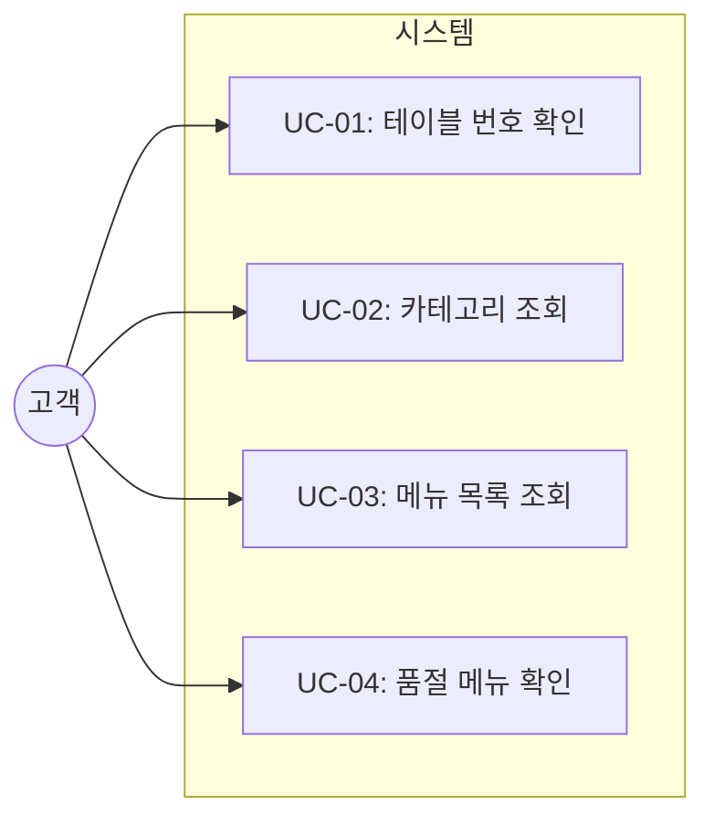
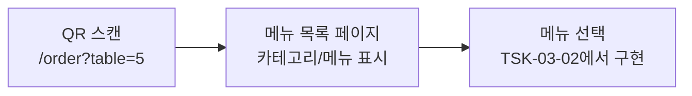

# TSK-03-01 - 메뉴 목록 페이지 구현 설계 문서

## 문서 정보

| 항목 | 내용 |
|------|------|
| Task ID | TSK-03-01 |
| 문서 버전 | 1.0 |
| 작성일 | 2026-01-02 |
| 상태 | 작성중 |
| 카테고리 | development |

---

## 1. 개요

### 1.1 배경 및 문제 정의

**현재 상황:**
- TSK-01-02에서 카테고리/메뉴 조회 API가 구현됨
- 고객이 테이블에서 QR 스캔 후 메뉴를 볼 수 있는 화면이 필요함
- 글래스모피즘 디자인 시스템이 TRD에 정의되어 있음

**해결하려는 문제:**
- 고객이 메뉴를 조회할 수 있는 화면이 없음
- 테이블 번호 표시 및 카테고리별 메뉴 분류 기능이 필요함
- 품절 메뉴에 대한 시각적 피드백이 필요함

### 1.2 목적 및 기대 효과

**목적:**
- 고객이 QR 코드로 접속하여 테이블 번호를 확인하고 메뉴를 조회할 수 있는 화면 제공
- 카테고리별로 메뉴를 분류하여 탐색 편의성 제공
- 품절 메뉴를 시각적으로 구분하여 혼란 방지

**기대 효과:**
- 고객이 직관적으로 메뉴를 탐색할 수 있음
- 글래스모피즘 디자인으로 모던한 사용자 경험 제공
- 품절 메뉴 클릭 방지로 주문 오류 예방

### 1.3 범위

**포함:**
- `/order?table={id}` 페이지 구현
- URL 파라미터에서 테이블 번호 추출 및 표시
- 카테고리별 메뉴 목록 표시
- MenuCard 컴포넌트 - 메뉴명, 가격, 이미지
- 품절 메뉴 비활성화 표시

**제외:**
- 장바구니 기능 (TSK-03-02에서 구현)
- 주문 전송 기능 (TSK-03-02에서 구현)
- 주문 상태 추적 (TSK-03-03에서 구현)

### 1.4 참조 문서

| 문서 | 경로 | 관련 섹션 |
|------|------|----------|
| PRD | `.orchay/projects/table-order/prd.md` | C-001, C-002, C-010, C-011, C-012 |
| TRD | `.orchay/projects/table-order/trd.md` | 섹션 1.3 글래스모피즘 디자인 |
| API 설계 | `.orchay/projects/table-order/tasks/TSK-01-02/010-design.md` | API 명세 |

---

## 2. 사용자 분석

### 2.1 대상 사용자

| 사용자 유형 | 특성 | 주요 니즈 |
|------------|------|----------|
| 고객 | 테이블에서 QR 스캔 후 주문하는 사람 | 빠르고 직관적인 메뉴 탐색, 테이블 번호 확인 |
| 외국인 고객 | 한국어에 익숙하지 않을 수 있음 | 이미지 기반 메뉴 선택, 명확한 가격 표시 |

### 2.2 사용자 페르소나

**페르소나 1: 점심 시간 직장인**
- 역할: 식당 고객
- 목표: 빠르게 메뉴를 확인하고 주문
- 불만: 메뉴판을 기다리거나 직원을 부르는 시간 소비
- 시나리오: QR 스캔 → 메뉴 확인 → 카테고리 선택 → 원하는 메뉴 탐색

**페르소나 2: 가족 고객**
- 역할: 가족 단위 방문 고객
- 목표: 다양한 메뉴를 여유롭게 탐색
- 불만: 작은 메뉴판, 가격 확인 어려움
- 시나리오: QR 스캔 → 카테고리별 탐색 → 이미지로 메뉴 확인 → 가격 비교

---

## 3. 유즈케이스

### 3.1 유즈케이스 다이어그램



### 3.2 유즈케이스 상세

#### UC-01: 테이블 번호 확인

| 항목 | 내용 |
|------|------|
| 액터 | 고객 |
| 목적 | 자신이 앉은 테이블 번호 확인 |
| 사전 조건 | QR 코드 스캔 완료, URL에 테이블 번호 포함 |
| 사후 조건 | 화면 상단에 테이블 번호 표시 |
| 트리거 | 페이지 로드 |

**기본 흐름:**
1. 고객이 테이블의 QR 코드를 스캔한다
2. 브라우저가 `/order?table=5` URL로 이동한다
3. 시스템이 URL에서 테이블 번호를 추출한다
4. 화면 상단에 "테이블 5" 형태로 표시한다

**예외 흐름:**
- 3a. 테이블 번호가 URL에 없는 경우:
  - 시스템이 에러 메시지를 표시한다: "테이블 정보를 찾을 수 없습니다"

#### UC-02: 카테고리 조회

| 항목 | 내용 |
|------|------|
| 액터 | 고객 |
| 목적 | 메뉴 카테고리 목록 확인 |
| 사전 조건 | 페이지 로드 완료 |
| 사후 조건 | 카테고리 탭/섹션 표시 |
| 트리거 | 페이지 로드 |

**기본 흐름:**
1. 페이지가 로드되면 GET /api/categories API를 호출한다
2. 시스템이 카테고리 목록을 탭 또는 섹션 형태로 표시한다
3. 고객이 카테고리를 선택하면 해당 카테고리의 메뉴가 표시된다

#### UC-03: 메뉴 목록 조회

| 항목 | 내용 |
|------|------|
| 액터 | 고객 |
| 목적 | 메뉴 정보(이름, 가격, 이미지) 확인 |
| 사전 조건 | 카테고리 조회 완료 |
| 사후 조건 | 메뉴 카드 그리드 표시 |
| 트리거 | 페이지 로드 또는 카테고리 선택 |

**기본 흐름:**
1. 페이지가 로드되면 GET /api/menus API를 호출한다
2. 시스템이 메뉴를 카테고리별로 그룹화한다
3. 각 메뉴를 MenuCard 형태로 표시한다 (이미지, 이름, 가격)
4. 고객이 카테고리를 선택하면 해당 섹션으로 스크롤하거나 필터링한다

#### UC-04: 품절 메뉴 확인

| 항목 | 내용 |
|------|------|
| 액터 | 고객 |
| 목적 | 품절 메뉴 식별 |
| 사전 조건 | 메뉴 목록 표시 완료 |
| 사후 조건 | 품절 메뉴 시각적 구분 |
| 트리거 | 메뉴 목록 렌더링 |

**기본 흐름:**
1. 시스템이 isSoldOut=true인 메뉴를 식별한다
2. 품절 메뉴를 회색 처리하고 "품절" 라벨을 표시한다
3. 품절 메뉴 카드의 클릭 이벤트를 비활성화한다

---

## 4. 사용자 시나리오

### 4.1 시나리오 1: 기본 메뉴 탐색

**상황 설명:**
점심 시간에 직장인 김씨가 식당에 도착하여 테이블 5에 앉았다. 테이블에 있는 QR 코드를 스마트폰으로 스캔한다.

**단계별 진행:**

| 단계 | 사용자 행동 | 시스템 반응 | 사용자 기대 |
|------|-----------|------------|------------|
| 1 | QR 코드 스캔 | 메뉴 화면 로드 | 빠른 페이지 로딩 |
| 2 | 화면 확인 | "테이블 5" 상단 표시 | 올바른 테이블 확인 |
| 3 | 카테고리 탭 확인 | 메인 메뉴, 사이드 메뉴, 음료 탭 표시 | 카테고리별 분류 |
| 4 | "메인 메뉴" 탭 선택 | 메인 메뉴 목록 표시 | 원하는 카테고리 메뉴 |
| 5 | 메뉴 카드 확인 | 이미지, 이름, 가격 표시 | 메뉴 정보 확인 |

**성공 조건:**
- 3초 이내 페이지 로드 완료
- 테이블 번호 정확히 표시
- 모든 카테고리와 메뉴 표시

### 4.2 시나리오 2: 품절 메뉴 시도

**상황 설명:**
고객이 원하는 메뉴가 품절 상태인 경우.

**단계별 진행:**

| 단계 | 사용자 행동 | 시스템 반응 | 복구 방법 |
|------|-----------|------------|----------|
| 1 | 품절 메뉴 카드 클릭 시도 | 클릭 이벤트 무반응 | 다른 메뉴 선택 |
| 2 | 품절 표시 확인 | 회색 처리 + "품절" 라벨 | 명확한 상태 인지 |

---

## 5. 화면 설계

### 5.1 화면 흐름도



### 5.2 화면별 상세

#### 화면: 메뉴 목록 페이지 (/order)

**화면 목적:**
고객이 테이블 번호를 확인하고 카테고리별 메뉴를 탐색하는 메인 화면

**진입 경로:**
- QR 코드 스캔을 통해 `/order?table={id}` URL로 접속

**와이어프레임:**
```
┌─────────────────────────────────────────────────────────┐
│  ┌─────────────────────────────────────────────────┐   │
│  │                   테이블 5                       │   │
│  │            글래스모피즘 헤더 영역                 │   │
│  └─────────────────────────────────────────────────┘   │
│                                                         │
│  ┌─────────────────────────────────────────────────┐   │
│  │  [ 메인 메뉴 ]  [ 사이드 메뉴 ]  [ 음료 ]        │   │
│  │            카테고리 탭 (스크롤 가능)              │   │
│  └─────────────────────────────────────────────────┘   │
│                                                         │
│  ┌───────────┐  ┌───────────┐  ┌───────────┐          │
│  │  [이미지]  │  │  [이미지]  │  │  [이미지]  │          │
│  │  김치찌개  │  │  된장찌개  │  │  비빔밥    │          │
│  │  ₩9,000   │  │  ₩8,000   │  │  ₩8,500   │          │
│  └───────────┘  └───────────┘  └───────────┘          │
│                                                         │
│  ┌───────────┐  ┌───────────┐  ┌───────────┐          │
│  │  [이미지]  │  │  [이미지]  │  │  [이미지]  │          │
│  │  불고기    │  │  공기밥    │  │  품절      │          │
│  │  ₩12,000  │  │  ₩1,000   │  │  (회색)    │          │
│  └───────────┘  └───────────┘  └───────────┘          │
│                                                         │
└─────────────────────────────────────────────────────────┘
```

**화면 요소 설명:**

| 영역 | 설명 | 사용자 인터랙션 |
|------|------|----------------|
| 헤더 | 테이블 번호 표시, 글래스모피즘 배경 | 정보 표시만 |
| 카테고리 탭 | 가로 스크롤 가능한 카테고리 버튼 목록 | 탭 클릭 시 해당 카테고리 섹션으로 스크롤 |
| 메뉴 카드 그리드 | 2열 그리드, 각 카드에 이미지/이름/가격 | 클릭 시 장바구니 추가 (TSK-03-02) |
| 품절 메뉴 카드 | 회색 처리, "품절" 라벨, 클릭 불가 | 클릭 무반응 |

**사용자 행동 시나리오:**
1. 사용자가 화면에 진입하면 테이블 번호와 메뉴 목록을 본다
2. 카테고리 탭을 클릭하면 해당 섹션으로 스크롤한다
3. 메뉴 카드를 클릭하면 장바구니에 추가된다 (TSK-03-02에서 구현)
4. 품절 메뉴는 클릭해도 반응하지 않는다

### 5.3 반응형 동작

| 화면 크기 | 레이아웃 변화 | 사용자 경험 |
|----------|--------------|------------|
| 모바일 (375px+) | 2열 그리드, 헤더 고정 | 한 손 조작에 최적화 |
| 태블릿 (768px+) | 3열 그리드 | 더 많은 메뉴 한눈에 보기 |
| 데스크톱 (1024px+) | 4열 그리드, 중앙 정렬 | 넓은 화면 활용 |

---

## 6. 컴포넌트 설계

### 6.1 컴포넌트 구조

```
app/order/page.tsx          # 메인 페이지
├── components/
│   ├── MenuHeader.tsx      # 테이블 번호 헤더
│   ├── CategoryTabs.tsx    # 카테고리 탭 목록
│   └── MenuCard.tsx        # 개별 메뉴 카드
```

### 6.2 컴포넌트 상세

#### MenuHeader

**Props:**
```typescript
interface MenuHeaderProps {
  tableNumber: number;
}
```

**스타일:**
```tsx
<header className="sticky top-0 z-10 backdrop-blur-[16px] bg-white/25 border-b border-white/30 px-4 py-4">
  <div className="text-center">
    <span className="text-sm text-gray-600">테이블</span>
    <h1 className="text-2xl font-bold text-gray-800">{tableNumber}</h1>
  </div>
</header>
```

#### CategoryTabs

**Props:**
```typescript
interface CategoryTabsProps {
  categories: Category[];
  activeCategory: number | null;
  onCategoryChange: (categoryId: number) => void;
}
```

**스타일:**
```tsx
<div className="sticky top-[72px] z-10 backdrop-blur-[8px] bg-white/20 border-b border-white/20 overflow-x-auto">
  <div className="flex gap-2 px-4 py-3">
    {categories.map((category) => (
      <button
        key={category.id}
        onClick={() => onCategoryChange(category.id)}
        className={cn(
          "px-4 py-2 rounded-xl text-sm font-medium whitespace-nowrap transition-all",
          activeCategory === category.id
            ? "bg-gradient-to-r from-primary-500 to-primary-600 text-white shadow-[0_4px_16px_rgba(139,92,246,0.30)]"
            : "backdrop-blur-[8px] bg-white/20 text-gray-700 hover:bg-white/30"
        )}
      >
        {category.name}
      </button>
    ))}
  </div>
</div>
```

#### MenuCard

**Props:**
```typescript
interface MenuCardProps {
  menu: Menu;
  onClick?: () => void;
}

interface Menu {
  id: number;
  categoryId: number;
  categoryName: string;
  name: string;
  price: number;
  imageUrl: string | null;
  isSoldOut: boolean;
}
```

**스타일:**
```tsx
<div
  onClick={menu.isSoldOut ? undefined : onClick}
  className={cn(
    "backdrop-blur-[16px] bg-white/25 border border-white/30 rounded-[1.25rem] overflow-hidden shadow-[0_8px_32px_rgba(139,92,246,0.15)] transition-all",
    menu.isSoldOut
      ? "opacity-60 cursor-not-allowed grayscale"
      : "cursor-pointer hover:shadow-[0_12px_40px_rgba(139,92,246,0.25)] hover:scale-[1.02]"
  )}
>
  {/* 이미지 영역 */}
  <div className="aspect-square relative bg-gray-100">
    {menu.imageUrl ? (
      
    ) : (
      <div className="w-full h-full flex items-center justify-center text-gray-400">
        <span>이미지 없음</span>
      </div>
    )}
    {menu.isSoldOut && (
      <div className="absolute inset-0 bg-black/40 flex items-center justify-center">
        <span className="bg-red-500 text-white px-3 py-1 rounded-full text-sm font-medium">
          품절
        </span>
      </div>
    )}
  </div>

  {/* 정보 영역 */}
  <div className="p-3">
    <h3 className="font-medium text-gray-800 truncate">{menu.name}</h3>
    <p className="text-primary-600 font-bold mt-1">
      ₩{menu.price.toLocaleString()}
    </p>
  </div>
</div>
```

---

## 7. 데이터 요구사항

### 7.1 필요한 데이터

| 데이터 | 설명 | 출처 | 용도 |
|--------|------|------|------|
| tableNumber | 테이블 번호 | URL query parameter | 헤더 표시 |
| categories | 카테고리 목록 | GET /api/categories | 카테고리 탭 |
| menus | 메뉴 목록 | GET /api/menus?includeSoldOut=true | 메뉴 카드 그리드 |

### 7.2 API 호출

**페이지 로드 시:**
```typescript
// 병렬 API 호출
const [categoriesRes, menusRes] = await Promise.all([
  fetch('/api/categories'),
  fetch('/api/menus?includeSoldOut=true')
]);

const { categories } = await categoriesRes.json();
const { menus } = await menusRes.json();
```

**메뉴 그룹화:**
```typescript
// 카테고리별 메뉴 그룹화
const menusByCategory = categories.map(category => ({
  ...category,
  menus: menus.filter(menu => menu.categoryId === category.id)
}));
```

### 7.3 상태 관리

```typescript
// 클라이언트 상태 (useState)
const [categories, setCategories] = useState<Category[]>([]);
const [menus, setMenus] = useState<Menu[]>([]);
const [activeCategory, setActiveCategory] = useState<number | null>(null);
const [isLoading, setIsLoading] = useState(true);
const [error, setError] = useState<string | null>(null);
```

---

## 8. 인터랙션 설계

### 8.1 사용자 액션과 피드백

| 사용자 액션 | 즉각 피드백 | 결과 피드백 | 에러 피드백 |
|------------|-----------|------------|------------|
| 페이지 로드 | 로딩 스피너 | 메뉴 목록 표시 | 에러 메시지 |
| 카테고리 탭 클릭 | 탭 활성화 스타일 | 해당 섹션 스크롤 | - |
| 메뉴 카드 클릭 | 카드 scale 효과 | 장바구니 추가 (TSK-03-02) | - |
| 품절 메뉴 클릭 | 무반응 | - | - |

### 8.2 상태별 화면 변화

| 상태 | 화면 표시 | 사용자 안내 |
|------|----------|------------|
| 초기 로딩 | 중앙 로딩 스피너 | - |
| 데이터 없음 | 빈 상태 이미지 | "메뉴가 없습니다" |
| 에러 발생 | 에러 메시지 박스 | "메뉴를 불러오지 못했습니다. 다시 시도해주세요" |
| 테이블 정보 없음 | 에러 메시지 | "테이블 정보를 찾을 수 없습니다" |

### 8.3 애니메이션

| 요소 | 애니메이션 | 지속 시간 |
|------|----------|----------|
| 메뉴 카드 호버 | scale(1.02), shadow 증가 | 200ms |
| 카테고리 탭 전환 | 배경색 전환 | 150ms |
| 스크롤 | smooth scroll | 300ms |

---

## 9. 에러 처리

### 9.1 예상 에러 상황

| 상황 | 원인 | 사용자 메시지 | 복구 방법 |
|------|------|--------------|----------|
| 테이블 파라미터 없음 | URL에 table 파라미터 누락 | "테이블 정보를 찾을 수 없습니다" | QR 코드 재스캔 안내 |
| API 호출 실패 | 네트워크 오류, 서버 오류 | "메뉴를 불러오지 못했습니다" | 새로고침 버튼 |
| 메뉴 없음 | DB에 메뉴 데이터 없음 | "등록된 메뉴가 없습니다" | 관리자 문의 |

### 9.2 에러 표시 방식

```tsx
// 에러 상태 UI
<div className="flex flex-col items-center justify-center min-h-[50vh] p-4">
  <div className="backdrop-blur-[16px] bg-white/25 border border-white/30 rounded-[1.25rem] p-6 text-center">
    <p className="text-gray-700 mb-4">{error}</p>
    <button
      onClick={() => window.location.reload()}
      className="bg-gradient-to-r from-primary-500 to-primary-600 text-white px-4 py-2 rounded-xl"
    >
      다시 시도
    </button>
  </div>
</div>
```

---

## 10. 구현 설계

### 10.1 파일 구조

```
mvp/src/
├── app/
│   └── order/
│       └── page.tsx              # 메뉴 목록 페이지
├── components/
│   ├── MenuHeader.tsx            # 테이블 번호 헤더
│   ├── CategoryTabs.tsx          # 카테고리 탭
│   └── MenuCard.tsx              # 메뉴 카드
└── types/
    └── index.ts                  # Category, Menu 타입 (기존)
```

### 10.2 페이지 구현

**app/order/page.tsx:**
```typescript
'use client';

import { useSearchParams } from 'next/navigation';
import { useEffect, useState, Suspense } from 'react';
import MenuHeader from '@/components/MenuHeader';
import CategoryTabs from '@/components/CategoryTabs';
import MenuCard from '@/components/MenuCard';
import { Category, Menu } from '@/types';

function OrderPageContent() {
  const searchParams = useSearchParams();
  const tableNumber = searchParams.get('table');

  const [categories, setCategories] = useState<Category[]>([]);
  const [menus, setMenus] = useState<Menu[]>([]);
  const [activeCategory, setActiveCategory] = useState<number | null>(null);
  const [isLoading, setIsLoading] = useState(true);
  const [error, setError] = useState<string | null>(null);

  useEffect(() => {
    if (!tableNumber) {
      setError('테이블 정보를 찾을 수 없습니다');
      setIsLoading(false);
      return;
    }

    async function fetchData() {
      try {
        const [categoriesRes, menusRes] = await Promise.all([
          fetch('/api/categories'),
          fetch('/api/menus?includeSoldOut=true')
        ]);

        if (!categoriesRes.ok || !menusRes.ok) {
          throw new Error('Failed to fetch data');
        }

        const { categories } = await categoriesRes.json();
        const { menus } = await menusRes.json();

        setCategories(categories);
        setMenus(menus);
        if (categories.length > 0) {
          setActiveCategory(categories[0].id);
        }
      } catch (err) {
        setError('메뉴를 불러오지 못했습니다');
      } finally {
        setIsLoading(false);
      }
    }

    fetchData();
  }, [tableNumber]);

  // 로딩/에러 처리 및 메뉴 렌더링
  // ...
}

export default function OrderPage() {
  return (
    <Suspense fallback={<div>Loading...</div>}>
      <OrderPageContent />
    </Suspense>
  );
}
```

---

## 11. 수용 기준 체크리스트

### PRD 요구사항 매핑

| PRD ID | 요구사항 | 구현 체크 |
|--------|----------|----------|
| C-001 | QR 스캔 접속 (/order?table={id}) | [ ] URL 파라미터 처리 |
| C-002 | 테이블 번호 상단 표시 | [ ] MenuHeader 컴포넌트 |
| C-010 | 카테고리별 메뉴 목록 표시 | [ ] CategoryTabs + 그룹화 |
| C-011 | 메뉴명, 가격, 이미지 표시 | [ ] MenuCard 컴포넌트 |
| C-012 | 품절 메뉴 비활성화 | [ ] 회색 처리 + 클릭 불가 |

### WBS 수용 기준

- [ ] 테이블 번호 상단에 표시
- [ ] 카테고리 탭/섹션으로 메뉴 분류
- [ ] 품절 메뉴는 회색 처리 + 클릭 불가

### UI 스펙

- [ ] 글래스모피즘 카드 디자인 적용
- [ ] backdrop-blur-[16px] bg-white/25 적용
- [ ] 그라데이션 배경 from-[#E8DFFF] via-[#F3E8FF] to-[#FFE4F3] 적용

---

## 12. 의존성

| 의존 항목 | 이유 | 상태 |
|----------|------|------|
| TSK-01-02 | 카테고리/메뉴 조회 API 필요 | 완료 대기 |
| TSK-00-02 | 프로젝트 구조 및 타입 정의 | 완료 대기 |

---

## 13. 제약 사항

| 제약 | 설명 | 대응 방안 |
|------|------|----------|
| UI 라이브러리 미사용 | TRD 명시 - TailwindCSS만 사용 | 직접 컴포넌트 구현 |
| 상태관리 라이브러리 미사용 | TRD 명시 - useState/useContext만 | 컴포넌트 로컬 상태 |

---

## 변경 이력

| 버전 | 일자 | 작성자 | 변경 내용 |
|------|------|--------|----------|
| 1.0 | 2026-01-02 | Claude | 최초 작성 |
