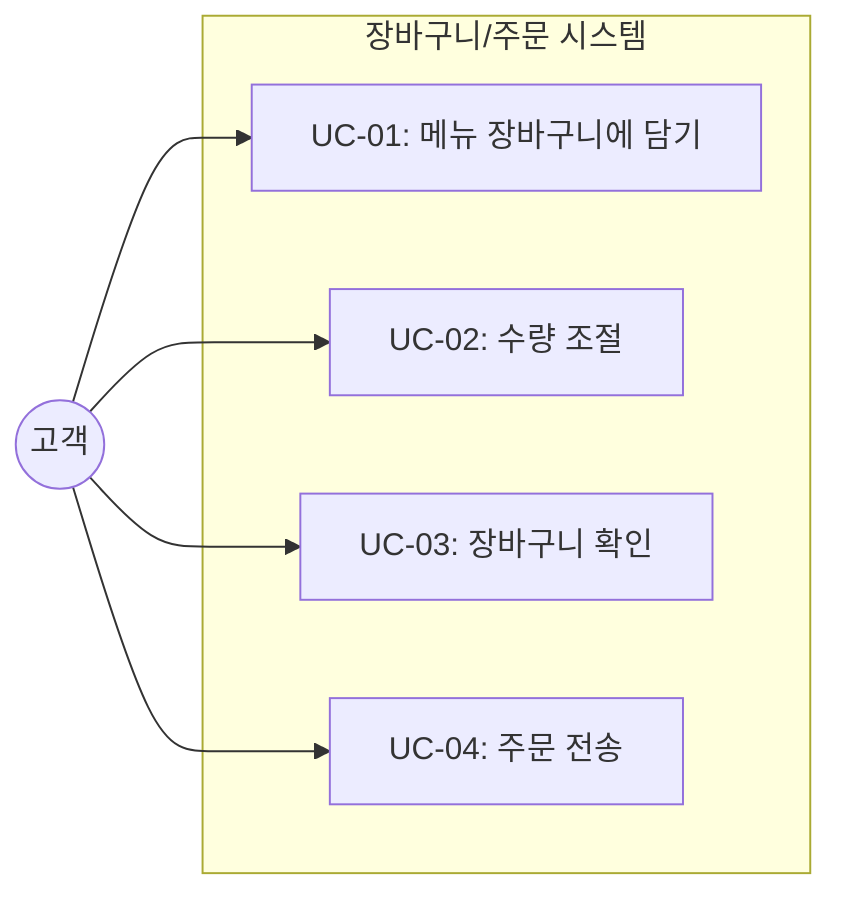
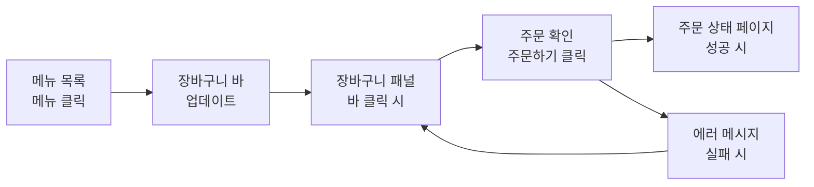

# TSK-03-02 - 장바구니 및 주문 기능 구현 설계 문서

## 문서 정보

| 항목 | 내용 |
|------|------|
| Task ID | TSK-03-02 |
| 문서 버전 | 1.0 |
| 작성일 | 2026-01-02 |
| 상태 | 작성중 |
| 카테고리 | development |
| 도메인 | frontend |

---

## 1. 개요

### 1.1 배경 및 문제 정의

**현재 상황:**
- TSK-03-01에서 메뉴 목록 페이지 기본 구조 구현 중
- 고객이 메뉴를 보는 것은 가능하지만, 장바구니에 담거나 주문을 전송하는 기능이 없음

**해결하려는 문제:**
- 고객이 원하는 메뉴를 선택하고 장바구니에 담을 수 있어야 함
- 수량 조절이 가능해야 함
- 장바구니 내용을 확인하고 주문을 전송할 수 있어야 함

### 1.2 목적 및 기대 효과

**목적:**
- 고객이 메뉴 선택 → 장바구니 담기 → 주문 전송까지의 플로우 완성

**기대 효과:**
- 사용자: 직관적인 UI로 쉽게 메뉴를 담고 주문 가능
- 비즈니스: 주문 → 주방 연결 핵심 플로우의 프론트엔드 측 완성

### 1.3 범위

**포함 (WBS Task 설명 기준):**
- C-020: 메뉴 선택 시 장바구니에 추가
- C-021: +/- 버튼으로 수량 조절
- C-022: 장바구니 패널/모달 - 담은 메뉴, 수량, 총 금액
- C-023: 주문하기 버튼 - POST /api/orders 호출

**제외:**
- 메뉴 목록 화면 (TSK-03-01)
- 주문 상태 추적 페이지 (TSK-03-03)
- 결제 기능 (MVP 이후)

### 1.4 참조 문서

| 문서 | 경로 | 관련 섹션 |
|------|------|----------|
| PRD | `.orchay/projects/table-order/prd.md` | C-020 ~ C-023 |
| TRD | `.orchay/projects/table-order/trd.md` | 섹션 1.3, 3 |
| 타입 정의 | `mvp/src/types/index.ts` | CreateOrderRequest |

---

## 2. 사용자 분석

### 2.1 대상 사용자

| 사용자 유형 | 특성 | 주요 니즈 |
|------------|------|----------|
| 고객 | 식당 방문객, 스마트폰 사용자 | 빠르고 쉬운 메뉴 주문 |

### 2.2 사용자 페르소나

**페르소나 1: 김민지 (30대 직장인)**
- 역할: 점심 식사하러 온 고객
- 목표: 빠르게 메뉴 선택 후 주문
- 불만: 종업원 호출 대기 시간
- 시나리오: 테이블 QR 스캔 → 메뉴 확인 → 장바구니 담기 → 주문

---

## 3. 유즈케이스

### 3.1 유즈케이스 다이어그램



### 3.2 유즈케이스 상세

#### UC-01: 메뉴 장바구니에 담기

| 항목 | 내용 |
|------|------|
| 액터 | 고객 |
| 목적 | 원하는 메뉴를 장바구니에 추가 |
| 사전 조건 | 메뉴 목록 페이지 접속 상태 |
| 사후 조건 | 장바구니에 메뉴 추가됨 |
| 트리거 | 메뉴 카드 클릭/탭 |

**기본 흐름:**
1. 고객이 메뉴 카드를 클릭한다
2. 시스템이 해당 메뉴를 장바구니에 추가한다 (수량 1)
3. 하단 장바구니 바에 아이템 수/총액 업데이트
4. 이미 담긴 메뉴 클릭 시 수량 +1

**예외 흐름:**
- 1a. 품절 메뉴 클릭 시:
  - 클릭 불가 (비활성화 상태)

#### UC-02: 수량 조절

| 항목 | 내용 |
|------|------|
| 액터 | 고객 |
| 목적 | 장바구니 내 메뉴 수량 변경 |
| 사전 조건 | 장바구니에 1개 이상 메뉴 존재 |
| 사후 조건 | 수량 변경 또는 삭제됨 |
| 트리거 | +/- 버튼 클릭 |

**기본 흐름:**
1. 고객이 장바구니 패널에서 + 버튼 클릭
2. 수량이 1 증가
3. 총 금액 자동 재계산

**대안 흐름:**
- 1a. - 버튼 클릭 시:
  - 수량이 1 감소
  - 수량이 0이 되면 장바구니에서 자동 제거

#### UC-03: 장바구니 확인

| 항목 | 내용 |
|------|------|
| 액터 | 고객 |
| 목적 | 담은 메뉴 목록과 총 금액 확인 |
| 사전 조건 | 장바구니 바 표시 상태 |
| 사후 조건 | 장바구니 패널 표시 |
| 트리거 | 장바구니 바 클릭 |

**기본 흐름:**
1. 고객이 하단 장바구니 바를 클릭/위로 스와이프
2. 장바구니 패널(바텀시트)이 올라옴
3. 담은 메뉴명, 수량, 개별 금액, 총 금액 표시

#### UC-04: 주문 전송

| 항목 | 내용 |
|------|------|
| 액터 | 고객 |
| 목적 | 장바구니 내용을 주방으로 전송 |
| 사전 조건 | 장바구니에 1개 이상 메뉴 존재 |
| 사후 조건 | 주문 생성됨, 주문 상태 페이지로 이동 |
| 트리거 | 주문하기 버튼 클릭 |

**기본 흐름:**
1. 고객이 "주문하기" 버튼 클릭
2. 시스템이 POST /api/orders 호출
3. 성공 응답 시 장바구니 초기화
4. /status?table={id} 페이지로 이동

**예외 흐름:**
- 2a. 네트워크 오류 발생 시:
  - "주문에 실패했습니다. 다시 시도해주세요." 메시지 표시
  - 장바구니 유지

---

## 4. 사용자 시나리오

### 4.1 시나리오 1: 첫 주문 완료

**상황 설명:**
김민지가 점심 식사를 위해 식당에 방문하여 QR 코드로 메뉴 화면에 접속했다.

**단계별 진행:**

| 단계 | 사용자 행동 | 시스템 반응 | 사용자 기대 |
|------|-----------|------------|------------|
| 1 | "김치찌개" 메뉴 클릭 | 장바구니에 추가, 하단 바에 "1개 · 8,000원" 표시 | 담겼다는 피드백 |
| 2 | "공기밥" 메뉴 2회 클릭 | 장바구니에 추가, "2개 · 10,000원"으로 업데이트 | 수량 증가 확인 |
| 3 | 하단 장바구니 바 클릭 | 바텀시트 올라옴, 상세 목록 표시 | 담은 내용 확인 |
| 4 | 공기밥 - 버튼 클릭 | 수량 2→1, 총액 9,000원으로 변경 | 수량 조절 동작 |
| 5 | "주문하기" 버튼 클릭 | 로딩 표시 → 주문 성공 → 상태 페이지 이동 | 주문 완료 확인 |

**성공 조건:**
- 주문이 정상 생성되어 주방에 전달됨
- 주문 상태 페이지에서 방금 주문 확인 가능

### 4.2 시나리오 2: 네트워크 오류

**상황 설명:**
주문 전송 중 네트워크 연결이 끊김

**단계별 진행:**

| 단계 | 사용자 행동 | 시스템 반응 | 복구 방법 |
|------|-----------|------------|----------|
| 1 | "주문하기" 버튼 클릭 | 로딩 표시 → 에러 발생 | 에러 메시지 표시 |
| 2 | 에러 메시지 확인 | "주문에 실패했습니다. 다시 시도해주세요." | 재시도 버튼 제공 |
| 3 | 재시도 버튼 클릭 | 다시 주문 시도 | 장바구니 유지됨 |

---

## 5. 화면 설계

### 5.1 화면 흐름도



### 5.2 화면별 상세

#### 컴포넌트 1: 장바구니 바 (CartBar)

**컴포넌트 목적:**
화면 하단에 고정되어 현재 장바구니 상태(아이템 수, 총 금액)를 표시하고, 클릭 시 장바구니 패널을 여는 역할

**위치:**
- 화면 하단 고정 (fixed bottom)
- 장바구니에 아이템이 있을 때만 표시

**와이어프레임:**
```
┌───────────────────────────────────────────────────┐
│                                                   │
│  (메뉴 목록 영역)                                  │
│                                                   │
├───────────────────────────────────────────────────┤
│  🛒 3개  ·  총 25,000원                    [▲]   │
└───────────────────────────────────────────────────┘
```

**요소 설명:**

| 영역 | 설명 | 인터랙션 |
|------|------|----------|
| 장바구니 아이콘 | 카트 아이콘 | - |
| 아이템 수 | 담긴 메뉴 종류 수 | - |
| 총 금액 | 전체 합계 (수량 * 가격) | - |
| 펼침 버튼 | 위 화살표 | 클릭 시 패널 열기 |

#### 컴포넌트 2: 장바구니 패널 (CartPanel)

**컴포넌트 목적:**
담은 메뉴 상세 목록, 수량 조절, 주문하기 버튼 제공

**와이어프레임:**
```
┌───────────────────────────────────────────────────┐
│  ───────────────────  (핸들)                      │
│                                                   │
│  장바구니                               [X] 닫기  │
│  ─────────────────────────────────────────────── │
│                                                   │
│  ┌───────────────────────────────────────────┐   │
│  │ 김치찌개                                   │   │
│  │ 8,000원           [-]  1  [+]    8,000원  │   │
│  └───────────────────────────────────────────┘   │
│                                                   │
│  ┌───────────────────────────────────────────┐   │
│  │ 공기밥                                     │   │
│  │ 1,000원           [-]  2  [+]    2,000원  │   │
│  └───────────────────────────────────────────┘   │
│                                                   │
│  ─────────────────────────────────────────────── │
│                                                   │
│           총 금액                     10,000원   │
│                                                   │
│  ┌───────────────────────────────────────────┐   │
│  │              주문하기                      │   │
│  └───────────────────────────────────────────┘   │
│                                                   │
└───────────────────────────────────────────────────┘
```

**요소 설명:**

| 영역 | 설명 | 인터랙션 |
|------|------|----------|
| 핸들 | 드래그 가능한 핸들 바 | 아래로 드래그 시 닫기 |
| 닫기 버튼 | X 아이콘 | 클릭 시 패널 닫기 |
| CartItem | 메뉴명, 단가, 수량 조절, 소계 | +/- 버튼으로 수량 조절 |
| 총 금액 | 전체 합계 | - |
| 주문하기 버튼 | Primary 버튼 | 클릭 시 주문 API 호출 |

#### 컴포넌트 3: CartItem

**컴포넌트 목적:**
장바구니 내 개별 메뉴 아이템 표시 및 수량 조절

**Props:**
```typescript
interface CartItemProps {
  menuId: number;
  name: string;
  price: number;
  quantity: number;
  onIncrease: () => void;
  onDecrease: () => void;
}
```

**와이어프레임:**
```
┌───────────────────────────────────────────────────┐
│ 메뉴명                                            │
│ 8,000원             [-]  2  [+]         16,000원 │
└───────────────────────────────────────────────────┘
```

### 5.3 반응형 동작

| 화면 크기 | 레이아웃 변화 | 사용자 경험 |
|----------|--------------|------------|
| 모바일 (기본) | 장바구니 바 + 바텀시트 패널 | 터치 친화적 |
| 태블릿/데스크톱 | 동일 (MVP는 모바일 우선) | 터치/클릭 모두 지원 |

---

## 6. 인터랙션 설계

### 6.1 사용자 액션과 피드백

| 사용자 액션 | 즉각 피드백 | 결과 피드백 |
|------------|-----------|------------|
| 메뉴 클릭 | 카드 눌림 효과, 장바구니 바 업데이트 | 수량 증가 표시 |
| +/- 버튼 클릭 | 버튼 눌림 효과 | 수량/금액 즉시 변경 |
| 주문하기 클릭 | 버튼 비활성화 + 로딩 스피너 | 성공: 페이지 이동 / 실패: 에러 메시지 |

### 6.2 상태별 화면 변화

| 상태 | 화면 표시 |
|------|----------|
| 장바구니 비어있음 | 장바구니 바 숨김 |
| 장바구니에 아이템 있음 | 장바구니 바 표시 |
| 주문 전송 중 | 주문하기 버튼 로딩 상태 |
| 주문 성공 | /status 페이지로 이동 |
| 주문 실패 | 에러 토스트 메시지 |

### 6.3 장바구니 상태 관리

**로컬 상태 (useState/useContext):**
```typescript
interface CartItem {
  menuId: number;
  name: string;
  price: number;
  quantity: number;
}

interface CartState {
  items: CartItem[];
  tableId: number;
}
```

**상태 관리 방식:**
- TRD 권장에 따라 별도 상태관리 라이브러리 미사용
- React Context + useState로 장바구니 상태 공유
- 페이지 새로고침 시 초기화 (MVP 단순화)

---

## 7. 데이터 요구사항

### 7.1 필요한 데이터

| 데이터 | 설명 | 출처 | 용도 |
|--------|------|------|------|
| 메뉴 정보 | id, name, price | TSK-03-01 props 또는 API | 장바구니 표시 |
| 테이블 ID | URL 파라미터 | URL query | 주문 생성 시 필요 |

### 7.2 API 연동

**POST /api/orders (TSK-01-03 구현)**

요청:
```typescript
interface CreateOrderRequest {
  tableId: number;
  items: {
    menuId: number;
    quantity: number;
  }[];
}
```

응답 (성공):
```json
{ "orderId": 123 }
```

응답 (실패):
```json
{ "error": "주문 생성에 실패했습니다" }
```

---

## 8. 비즈니스 규칙

### 8.1 핵심 규칙

| 규칙 ID | 규칙 설명 | 적용 상황 |
|---------|----------|----------|
| BR-01 | 수량이 0이 되면 장바구니에서 자동 제거 | - 버튼으로 수량 0 도달 시 |
| BR-02 | 품절 메뉴는 장바구니에 추가 불가 | 메뉴 클릭 시 |
| BR-03 | 빈 장바구니로 주문 불가 | 주문하기 버튼 비활성화 |
| BR-04 | 총 금액 = Σ(단가 × 수량) | 실시간 계산 |

---

## 9. 에러 처리

### 9.1 예상 에러 상황

| 상황 | 원인 | 사용자 메시지 | 복구 방법 |
|------|------|--------------|----------|
| 주문 전송 실패 | 네트워크 오류 | "주문에 실패했습니다. 다시 시도해주세요." | 재시도 버튼 |
| 테이블 ID 없음 | URL 파라미터 누락 | "테이블 정보가 없습니다." | 테이블 입력 또는 QR 재스캔 안내 |

### 9.2 에러 표시 방식

| 에러 유형 | 표시 위치 | 표시 방법 |
|----------|----------|----------|
| 주문 실패 | 화면 상단 | 토스트 알림 (글래스모피즘) |

---

## 10. 연관 문서

| 문서 | 경로 | 용도 |
|------|------|------|
| 요구사항 추적 매트릭스 | `025-traceability-matrix.md` | PRD → 설계 → 테스트 추적 |
| 테스트 명세서 | `026-test-specification.md` | 테스트 케이스 정의 |

---

## 11. 구현 범위

### 11.1 영향받는 영역

| 영역 | 변경 내용 | 영향도 |
|------|----------|--------|
| CartItem 컴포넌트 | 신규 구현 | 높음 |
| CartBar 컴포넌트 | 신규 구현 | 높음 |
| CartPanel 컴포넌트 | 신규 구현 | 높음 |
| CartContext | 신규 구현 (상태 관리) | 높음 |
| /order 페이지 | 장바구니 기능 통합 | 중간 |

### 11.2 파일 구조

```
mvp/src/
├── components/
│   ├── CartItem.tsx      # 장바구니 아이템 (수정)
│   ├── CartBar.tsx       # 하단 장바구니 바 (신규)
│   └── CartPanel.tsx     # 장바구니 패널/바텀시트 (신규)
├── contexts/
│   └── CartContext.tsx   # 장바구니 상태 관리 (신규)
└── app/order/page.tsx    # 장바구니 통합 (수정)
```

### 11.3 의존성

| 의존 항목 | 이유 | 상태 |
|----------|------|------|
| TSK-03-01 (메뉴 목록 페이지) | 메뉴 카드 클릭 이벤트 연동 | 진행중 |
| TSK-01-03 (주문 API) | POST /api/orders 호출 | 구현 예정 |

### 11.4 제약 사항

| 제약 | 설명 | 대응 방안 |
|------|------|----------|
| 상태관리 라이브러리 미사용 | TRD 권장 | React Context + useState |
| UI 라이브러리 미사용 | TRD 권장 | TailwindCSS만으로 구현 |

---

## 12. UI 스타일 가이드

### 12.1 글래스모피즘 적용 (TRD 참조)

**장바구니 바:**
```tsx
<div className="fixed bottom-0 left-0 right-0 backdrop-blur-[16px] bg-white/25 border-t border-white/30 px-4 py-3">
  {/* 내용 */}
</div>
```

**장바구니 패널:**
```tsx
<div className="backdrop-blur-[16px] bg-white/30 rounded-t-[1.25rem] border border-white/30">
  {/* 내용 */}
</div>
```

**주문하기 버튼:**
```tsx
<button className="w-full bg-gradient-to-r from-primary-500 to-primary-600 text-white rounded-xl px-6 py-3 font-medium shadow-[0_4px_16px_rgba(139,92,246,0.30)] hover:shadow-[0_6px_24px_rgba(139,92,246,0.40)] transition-all disabled:opacity-50">
  주문하기
</button>
```

### 12.2 색상

| 용도 | 클래스/HEX |
|------|----------|
| Primary | `from-primary-500 to-primary-600` (#8B5CF6 → #7C3AED) |
| 배경 | `backdrop-blur-[16px] bg-white/25` |
| 테두리 | `border-white/30` |
| 그림자 | `shadow-[0_8px_32px_rgba(139,92,246,0.15)]` |

---

## 13. 체크리스트

### 13.1 설계 완료 확인

- [x] 문제 정의 및 목적 명확화
- [x] 사용자 분석 완료
- [x] 유즈케이스 정의 완료
- [x] 사용자 시나리오 작성 완료
- [x] 화면 설계 완료 (와이어프레임)
- [x] 인터랙션 설계 완료
- [x] 데이터 요구사항 정의 완료
- [x] 비즈니스 규칙 정의 완료
- [x] 에러 처리 정의 완료

### 13.2 구현 준비

- [x] 구현 우선순위 결정
- [x] 의존성 확인 완료
- [x] 제약 사항 검토 완료

---

## 변경 이력

| 버전 | 일자 | 작성자 | 변경 내용 |
|------|------|--------|----------|
| 1.0 | 2026-01-02 | Claude | 최초 작성 |
