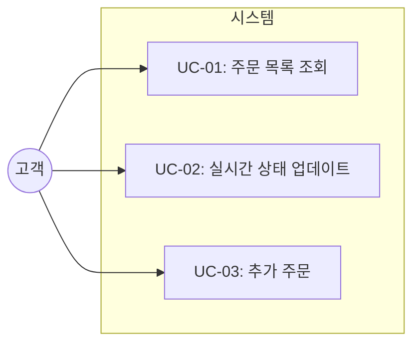
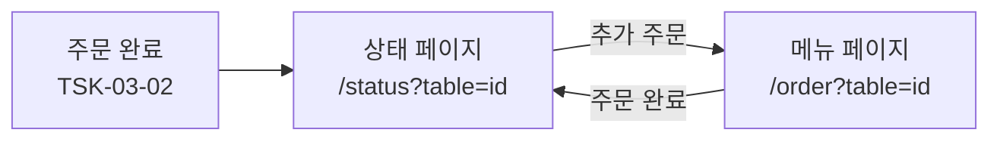
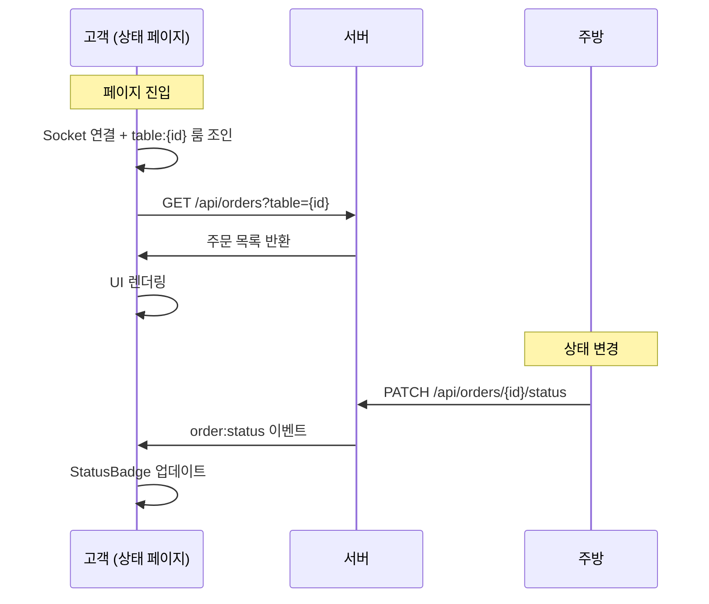

# TSK-03-03 - 주문 상태 추적 페이지 구현 설계 문서

## 문서 정보

| 항목 | 내용 |
|------|------|
| Task ID | TSK-03-03 |
| 문서 버전 | 1.0 |
| 작성일 | 2026-01-02 |
| 상태 | 작성중 |
| 카테고리 | development |

---

## 1. 개요

### 1.1 배경 및 문제 정의

**현재 상황:**
- 고객이 주문 후 주문 상태를 확인할 수 있는 화면이 없음
- TSK-03-02에서 장바구니/주문 기능 구현 후 주문 완료 시 이동할 화면 필요
- TSK-02-02에서 WebSocket 실시간 이벤트 송수신 인프라 구현됨

**해결하려는 문제:**
- 고객이 주문 후 조리 상태를 알 수 없음
- 주방에서 상태 변경 시 고객이 새로고침 없이 확인 불가
- 추가 주문을 위한 메뉴 화면 복귀 경로 부재

### 1.2 목적 및 기대 효과

**목적:**
- `/status?table={id}` 페이지 구현
- 현재 테이블의 주문 목록 표시
- WebSocket으로 상태 변경 실시간 수신
- StatusBadge 컴포넌트로 상태 시각화

**기대 효과:**
- 고객: 주문 상태를 실시간으로 확인하여 대기 불안감 해소
- 비즈니스: 고객 경험 향상, 추가 주문 유도

### 1.3 범위

**포함:**
- `/status?table={id}` 페이지 (`app/status/page.tsx`)
- StatusBadge 컴포넌트 (`components/StatusBadge.tsx`)
- 주문 목록 표시 (최신 순)
- WebSocket `order:status` 이벤트 수신 및 UI 업데이트
- 추가 주문 버튼 (메뉴 화면 이동)

**제외:**
- 주문 API (TSK-01-03에서 구현)
- WebSocket 클라이언트 유틸 (TSK-02-02에서 구현)
- 장바구니/주문 기능 (TSK-03-02에서 구현)

### 1.4 참조 문서

| 문서 | 경로 | 관련 섹션 |
|------|------|----------|
| PRD | `.orchay/projects/table-order/prd.md` | C-030, C-031 |
| TRD | `.orchay/projects/table-order/trd.md` | 글래스모피즘 디자인 |
| TSK-02-02 설계 | `tasks/TSK-02-02/010-design.md` | Socket.io 훅/유틸 |

---

## 2. 사용자 분석

### 2.1 대상 사용자

| 사용자 유형 | 특성 | 주요 니즈 |
|------------|------|----------|
| 고객 | 테이블에서 모바일로 주문, 기술 수준 다양 | 주문 상태를 즉시 알고 싶음 |

### 2.2 사용자 페르소나

**페르소나 1: 고객 김민수**
- 역할: 식당 고객
- 목표: 주문 후 조리 상태를 실시간으로 알고 싶음
- 불만: 주문이 잘 들어갔는지, 언제 나오는지 알 수 없음
- 시나리오: 주문 후 상태 페이지에서 "조리중" 표시 확인 → 안심하고 대기

---

## 3. 유즈케이스

### 3.1 유즈케이스 다이어그램



### 3.2 유즈케이스 상세

#### UC-01: 주문 목록 조회

| 항목 | 내용 |
|------|------|
| 액터 | 고객 |
| 목적 | 현재 테이블의 주문 내역 확인 |
| 사전 조건 | 주문 완료 후 상태 페이지 진입 |
| 사후 조건 | 주문 목록이 화면에 표시됨 |
| 트리거 | `/status?table={id}` 페이지 접속 |

**기본 흐름:**
1. 고객이 주문 완료 후 상태 페이지로 이동한다
2. 시스템이 URL에서 테이블 ID를 추출한다
3. 시스템이 GET `/api/orders?table={id}` API를 호출한다
4. 주문 목록이 최신 순으로 표시된다
5. 각 주문에 StatusBadge로 상태가 표시된다

**예외 흐름:**
- 3a. 테이블 ID가 없으면:
  - "테이블 정보를 찾을 수 없습니다" 메시지 표시
- 4a. 주문이 없으면:
  - "주문 내역이 없습니다" 빈 상태 표시
  - 추가 주문 버튼 제공

#### UC-02: 실시간 상태 업데이트

| 항목 | 내용 |
|------|------|
| 액터 | 고객 |
| 목적 | 주방 상태 변경을 즉시 확인 |
| 사전 조건 | 상태 페이지에서 WebSocket 연결됨 |
| 사후 조건 | StatusBadge가 새 상태로 업데이트됨 |
| 트리거 | 주방에서 주문 상태 변경 (PATCH API) |

**기본 흐름:**
1. 고객이 상태 페이지에 머무른다
2. 주방에서 조리 시작/완료 버튼을 클릭한다
3. 서버가 `order:status` 이벤트를 발송한다
4. 클라이언트가 이벤트를 수신한다
5. 해당 주문의 StatusBadge가 즉시 업데이트된다

**예외 흐름:**
- 4a. WebSocket 연결 끊김:
  - 재연결 시 GET `/api/orders?table={id}`로 최신 상태 조회

#### UC-03: 추가 주문

| 항목 | 내용 |
|------|------|
| 액터 | 고객 |
| 목적 | 메뉴 화면으로 돌아가 추가 주문 |
| 사전 조건 | 상태 페이지에서 추가 주문 원함 |
| 사후 조건 | 메뉴 페이지로 이동 |
| 트리거 | 추가 주문 버튼 클릭 |

**기본 흐름:**
1. 고객이 추가 주문 버튼을 클릭한다
2. `/order?table={id}` 페이지로 이동한다

---

## 4. 사용자 시나리오

### 4.1 시나리오 1: 주문 상태 실시간 확인

**상황 설명:**
고객 김민수가 5번 테이블에서 김치찌개 2개를 주문했습니다. 주문 완료 후 상태 페이지에서 대기합니다.

**단계별 진행:**

| 단계 | 사용자 행동 | 시스템 반응 | 사용자 기대 |
|------|-----------|------------|------------|
| 1 | 상태 페이지 진입 | 주문 목록 표시, "접수됨" 배지 | 주문 확인됨 |
| 2 | 화면 대기 | 주방에서 조리 시작 → "조리중" 배지로 변경 | 곧 나오겠구나 |
| 3 | 화면 대기 | 주방에서 조리 완료 → "완료" 배지로 변경 | 음식 나올 준비 됨 |

**성공 조건:**
- 상태 변경 1초 이내 화면 반영
- 새로고침 없이 자동 업데이트

### 4.2 시나리오 2: 추가 주문

**상황 설명:**
고객이 상태 페이지에서 대기하다가 추가로 음료를 주문하고 싶습니다.

**단계별 진행:**

| 단계 | 사용자 행동 | 시스템 반응 | 사용자 기대 |
|------|-----------|------------|------------|
| 1 | 추가 주문 버튼 클릭 | /order?table=5로 이동 | 메뉴 화면 표시 |
| 2 | 음료 메뉴 선택/주문 | 주문 처리 | 추가 주문 완료 |
| 3 | 상태 페이지 복귀 | 기존 주문 + 추가 주문 표시 | 전체 주문 확인 |

### 4.3 시나리오 3: 주문 없음 상태

**상황 설명:**
고객이 직접 URL을 입력하여 상태 페이지에 접속했지만 주문 내역이 없습니다.

**단계별 진행:**

| 단계 | 사용자 행동 | 시스템 반응 | 복구 방법 |
|------|-----------|------------|----------|
| 1 | /status?table=5 접속 | "주문 내역이 없습니다" 표시 | 메뉴 주문 버튼 클릭 |

---

## 5. 화면 설계

### 5.1 화면 흐름도



### 5.2 화면별 상세

#### 화면 1: 주문 상태 페이지

**화면 목적:**
고객이 주문한 메뉴의 조리 상태를 실시간으로 확인

**진입 경로:**
- 주문 완료 후 자동 이동
- 직접 URL 입력: `/status?table={id}`

**와이어프레임:**
```
┌─────────────────────────────────────────────────────────┐
│  ┌─────────────────────────────────────────────────┐   │
│  │               테이블 5번 주문 현황                │   │
│  └─────────────────────────────────────────────────┘   │
│                                                         │
│  ┌───────────────────────────────────────────────────┐ │
│  │  ┌─────────────────────────────────────────────┐ │ │
│  │  │  주문 #1                          [조리중]  │ │ │
│  │  │  ──────────────────────────────────────── │ │ │
│  │  │  김치찌개 x2                      ₩16,000  │ │ │
│  │  │  공기밥 x2                        ₩2,000   │ │ │
│  │  │  ──────────────────────────────────────── │ │ │
│  │  │  주문 시간: 5분 전                          │ │ │
│  │  └─────────────────────────────────────────────┘ │ │
│  │                                                   │ │
│  │  ┌─────────────────────────────────────────────┐ │ │
│  │  │  주문 #2                          [접수됨]  │ │ │
│  │  │  ──────────────────────────────────────── │ │ │
│  │  │  콜라 x2                          ₩4,000   │ │ │
│  │  │  ──────────────────────────────────────── │ │ │
│  │  │  주문 시간: 1분 전                          │ │ │
│  │  └─────────────────────────────────────────────┘ │ │
│  └───────────────────────────────────────────────────┘ │
│                                                         │
│  ┌─────────────────────────────────────────────────┐   │
│  │              [  추가 주문하기  ]                  │   │
│  └─────────────────────────────────────────────────┘   │
│                                                         │
└─────────────────────────────────────────────────────────┘
```

**화면 요소 설명:**

| 영역 | 설명 | 사용자 인터랙션 |
|------|------|----------------|
| 헤더 | 테이블 번호 표시 | 읽기 전용 |
| 주문 카드 | 주문별 메뉴 목록, 금액, 시간 | 읽기 전용 |
| StatusBadge | 접수됨/조리중/완료 상태 | 실시간 업데이트 |
| 추가 주문 버튼 | 메뉴 화면으로 이동 | 클릭 시 이동 |

**상태별 배지 디자인:**

| 상태 | 텍스트 | 배경색 | 텍스트색 |
|------|--------|--------|---------|
| pending | 접수됨 | `bg-gray-100` | `text-gray-700` |
| cooking | 조리중 | `bg-amber-100` | `text-amber-700` |
| completed | 완료 | `bg-green-100` | `text-green-700` |

**글래스모피즘 적용:**
```tsx
// 주문 카드
<div className="backdrop-blur-[16px] bg-white/25 border border-white/30 rounded-[1.25rem] p-6 shadow-[0_8px_32px_rgba(139,92,246,0.15)]">
  ...
</div>

// 추가 주문 버튼
<button className="w-full bg-gradient-to-r from-primary-500 to-primary-600 text-white rounded-xl px-6 py-3 font-medium shadow-[0_4px_16px_rgba(139,92,246,0.30)] hover:shadow-[0_6px_24px_rgba(139,92,246,0.40)] transition-all">
  추가 주문하기
</button>
```

**빈 상태 화면:**
```
┌─────────────────────────────────────────────────────────┐
│                                                         │
│                      📋                                 │
│                                                         │
│              주문 내역이 없습니다                        │
│                                                         │
│        [  메뉴 보러가기  ]                              │
│                                                         │
└─────────────────────────────────────────────────────────┘
```

### 5.3 반응형 동작

| 화면 크기 | 레이아웃 변화 | 사용자 경험 |
|----------|--------------|------------|
| 모바일 (767px-) | 세로 스택, 터치 최적화 | QR 스캔 후 기본 사용 환경 |
| 태블릿 (768-1023px) | 약간 넓은 카드 | 가독성 향상 |
| 데스크톱 (1024px+) | 중앙 정렬, 최대 너비 제한 | 과도한 확장 방지 |

---

## 6. 인터랙션 설계

### 6.1 사용자 액션과 피드백

| 사용자 액션 | 즉각 피드백 | 결과 피드백 | 에러 피드백 |
|------------|-----------|------------|------------|
| 페이지 진입 | 로딩 스피너 | 주문 목록 표시 | 에러 메시지 |
| 상태 이벤트 수신 | - | StatusBadge 색상 변경 | - |
| 추가 주문 버튼 클릭 | 버튼 눌림 효과 | 메뉴 페이지 이동 | - |

### 6.2 상태별 화면 변화

| 상태 | 화면 표시 | 사용자 안내 |
|------|----------|------------|
| 초기 로딩 | 스켈레톤 또는 스피너 | "주문 내역을 불러오는 중..." |
| 데이터 없음 | 빈 상태 이미지 | "주문 내역이 없습니다" + 메뉴 버튼 |
| 에러 발생 | 에러 메시지 박스 | "주문 정보를 불러올 수 없습니다" |
| 실시간 업데이트 | StatusBadge 애니메이션 | 배지 색상 전환 |

### 6.3 실시간 업데이트 플로우



---

## 7. 데이터 요구사항

### 7.1 필요한 데이터

| 데이터 | 설명 | 출처 | 용도 |
|--------|------|------|------|
| tableId | 테이블 ID | URL 쿼리 파라미터 | API 조회 필터 |
| orders | 주문 목록 | GET /api/orders?table={id} | 주문 카드 렌더링 |
| orderId | 주문 ID | 주문 데이터 | 상태 업데이트 매칭 |
| status | 주문 상태 | order:status 이벤트 | StatusBadge 표시 |

### 7.2 API 응답 타입

```typescript
// GET /api/orders?table={id} 응답
interface OrdersResponse {
  orders: {
    id: number;
    table_id: number;
    table_number: number;
    status: 'pending' | 'cooking' | 'completed';
    created_at: string;
    items: {
      id: number;
      menu_id: number;
      menu_name: string;
      menu_price: number;
      quantity: number;
      status: string;
    }[];
  }[];
}

// order:status 이벤트 페이로드
interface OrderStatusEvent {
  orderId: number;
  status: 'pending' | 'cooking' | 'completed';
  updatedAt: string;
}
```

### 7.3 컴포넌트 상태 관리

```typescript
// 상태 페이지 상태
interface StatusPageState {
  orders: OrderWithItems[];
  tableId: number;
  isLoading: boolean;
  error: string | null;
  isConnected: boolean;
}
```

---

## 8. 비즈니스 규칙

### 8.1 핵심 규칙

| 규칙 ID | 규칙 설명 | 적용 상황 | 예외 |
|---------|----------|----------|------|
| BR-01 | 주문은 최신 순으로 표시 | 주문 목록 렌더링 시 | 없음 |
| BR-02 | 완료된 주문도 표시 | 모든 주문 상태 | 없음 |
| BR-03 | 테이블 ID 필수 | 페이지 진입 시 | ID 없으면 에러 표시 |

### 8.2 규칙 상세 설명

**BR-01: 주문 최신 순 표시**

설명: 가장 최근 주문이 상단에 표시되어야 합니다. 고객이 방금 한 주문을 가장 먼저 확인할 수 있습니다.

**BR-02: 완료된 주문 표시**

설명: 완료된 주문도 목록에 표시하여 전체 주문 내역을 확인할 수 있습니다. MVP에서는 숨김 처리 없이 모두 표시합니다.

---

## 9. 에러 처리

### 9.1 예상 에러 상황

| 상황 | 원인 | 사용자 메시지 | 복구 방법 |
|------|------|--------------|----------|
| 테이블 ID 없음 | URL 파라미터 누락 | "테이블 정보를 찾을 수 없습니다" | 메뉴 페이지 이동 버튼 |
| API 조회 실패 | 서버 오류, 네트워크 | "주문 정보를 불러올 수 없습니다" | 새로고침 버튼 |
| WebSocket 연결 끊김 | 네트워크 불안정 | (표시 선택) | 자동 재연결 + API 재조회 |

### 9.2 에러 표시 방식

| 에러 유형 | 표시 위치 | 표시 방법 |
|----------|----------|----------|
| 테이블 ID 오류 | 화면 중앙 | 에러 메시지 + 메뉴 이동 버튼 |
| API 오류 | 화면 중앙 | 에러 메시지 + 새로고침 버튼 |
| 연결 끊김 | 화면 상단 (선택) | 연결 상태 인디케이터 |

---

## 10. 연관 문서

| 문서 | 경로 | 용도 |
|------|------|------|
| 요구사항 추적 매트릭스 | `025-traceability-matrix.md` | PRD → 설계 → 테스트 추적 |
| 테스트 명세서 | `026-test-specification.md` | 단위/E2E/매뉴얼 테스트 정의 |

---

## 11. 구현 범위

### 11.1 영향받는 영역

| 영역 | 변경 내용 | 영향도 |
|------|----------|--------|
| app/status/page.tsx | 상태 페이지 전체 구현 | 높음 |
| components/StatusBadge.tsx | 상태 배지 컴포넌트 구현 | 높음 |

### 11.2 의존성

| 의존 항목 | 이유 | 상태 |
|----------|------|------|
| TSK-03-02 | 장바구니/주문 기능 (주문 완료 후 이동) | 완료 대기 |
| TSK-02-02 | Socket.io 클라이언트 유틸 | 완료 대기 |
| TSK-01-03 | 주문 조회 API (GET /api/orders) | 완료 대기 |

### 11.3 제약 사항

| 제약 | 설명 | 대응 방안 |
|------|------|----------|
| 의존 Task 완료 필요 | Socket 유틸/API 미완성 시 실시간 기능 불가 | 선행 Task 완료 후 구현 |

---

## 12. 기술 상세

### 12.1 StatusBadge 컴포넌트

```typescript
// components/StatusBadge.tsx
import type { OrderStatus } from '@/types';

interface StatusBadgeProps {
  status: OrderStatus;
}

const statusConfig = {
  pending: {
    label: '접수됨',
    className: 'bg-gray-100 text-gray-700',
  },
  cooking: {
    label: '조리중',
    className: 'bg-amber-100 text-amber-700',
  },
  completed: {
    label: '완료',
    className: 'bg-green-100 text-green-700',
  },
};

export function StatusBadge({ status }: StatusBadgeProps) {
  const config = statusConfig[status];

  return (
    <span className={`px-3 py-1 rounded-full text-sm font-medium ${config.className}`}>
      {config.label}
    </span>
  );
}
```

### 12.2 상태 페이지 구조

```typescript
// app/status/page.tsx
'use client';

import { useEffect, useState, useCallback } from 'react';
import { useSearchParams } from 'next/navigation';
import Link from 'next/link';
import { StatusBadge } from '@/components/StatusBadge';
import { joinTable, onOrderStatus, onConnect, onDisconnect } from '@/lib/socket';
import type { OrderWithItems, OrderStatusEvent } from '@/types';

export default function StatusPage() {
  const searchParams = useSearchParams();
  const tableId = searchParams.get('table');

  const [orders, setOrders] = useState<OrderWithItems[]>([]);
  const [isLoading, setIsLoading] = useState(true);
  const [error, setError] = useState<string | null>(null);
  const [isConnected, setIsConnected] = useState(false);

  // 주문 목록 조회
  const fetchOrders = useCallback(async () => {
    if (!tableId) return;
    try {
      const res = await fetch(`/api/orders?table=${tableId}`);
      if (!res.ok) throw new Error('Failed to fetch orders');
      const data = await res.json();
      setOrders(data.orders);
    } catch (err) {
      setError('주문 정보를 불러올 수 없습니다');
    } finally {
      setIsLoading(false);
    }
  }, [tableId]);

  // 상태 업데이트 핸들러
  const handleStatusUpdate = useCallback((event: OrderStatusEvent) => {
    setOrders(prev =>
      prev.map(order =>
        order.id === event.orderId
          ? { ...order, status: event.status }
          : order
      )
    );
  }, []);

  useEffect(() => {
    if (!tableId) {
      setError('테이블 정보를 찾을 수 없습니다');
      setIsLoading(false);
      return;
    }

    fetchOrders();
    joinTable(Number(tableId));

    const unsubConnect = onConnect(() => {
      setIsConnected(true);
      fetchOrders(); // 재연결 시 최신 데이터 조회
    });
    const unsubDisconnect = onDisconnect(() => setIsConnected(false));
    const unsubStatus = onOrderStatus(handleStatusUpdate);

    return () => {
      unsubConnect();
      unsubDisconnect();
      unsubStatus();
    };
  }, [tableId, fetchOrders, handleStatusUpdate]);

  // ... 렌더링 로직
}
```

### 12.3 주문 카드 렌더링

```typescript
// 주문 카드 컴포넌트
function OrderCard({ order }: { order: OrderWithItems }) {
  const totalAmount = order.items.reduce(
    (sum, item) => sum + item.menu_price * item.quantity,
    0
  );

  const timeAgo = formatTimeAgo(order.created_at);

  return (
    <div className="backdrop-blur-[16px] bg-white/25 border border-white/30 rounded-[1.25rem] p-6 shadow-[0_8px_32px_rgba(139,92,246,0.15)]">
      <div className="flex justify-between items-center mb-4">
        <h3 className="text-lg font-semibold">주문 #{order.id}</h3>
        <StatusBadge status={order.status} />
      </div>

      <div className="space-y-2 mb-4">
        {order.items.map(item => (
          <div key={item.id} className="flex justify-between">
            <span>{item.menu_name} x{item.quantity}</span>
            <span>₩{(item.menu_price * item.quantity).toLocaleString()}</span>
          </div>
        ))}
      </div>

      <div className="border-t border-white/20 pt-4 flex justify-between text-sm text-gray-600">
        <span>주문 시간: {timeAgo}</span>
        <span className="font-medium">총 ₩{totalAmount.toLocaleString()}</span>
      </div>
    </div>
  );
}
```

### 12.4 시간 포맷 유틸

```typescript
// lib/utils.ts (또는 inline)
function formatTimeAgo(dateString: string): string {
  const date = new Date(dateString);
  const now = new Date();
  const diffMs = now.getTime() - date.getTime();
  const diffMin = Math.floor(diffMs / 60000);

  if (diffMin < 1) return '방금 전';
  if (diffMin < 60) return `${diffMin}분 전`;
  const diffHour = Math.floor(diffMin / 60);
  return `${diffHour}시간 전`;
}
```

---

## 13. 체크리스트

### 13.1 설계 완료 확인

- [x] 문제 정의 및 목적 명확화
- [x] 사용자 분석 완료
- [x] 유즈케이스 정의 완료
- [x] 사용자 시나리오 작성 완료
- [x] 화면 설계 완료 (와이어프레임)
- [x] 인터랙션 설계 완료
- [x] 데이터 요구사항 정의 완료
- [x] 비즈니스 규칙 정의 완료
- [x] 에러 처리 정의 완료
- [x] 기술 상세 정의 완료

### 13.2 연관 문서 작성

- [ ] 요구사항 추적 매트릭스 작성 (→ `025-traceability-matrix.md`)
- [ ] 테스트 명세서 작성 (→ `026-test-specification.md`)

### 13.3 구현 준비

- [x] 구현 우선순위 결정
- [x] 의존성 확인 완료
- [x] 제약 사항 검토 완료

---

## 변경 이력

| 버전 | 일자 | 작성자 | 변경 내용 |
|------|------|--------|----------|
| 1.0 | 2026-01-02 | Claude | 최초 작성 |
