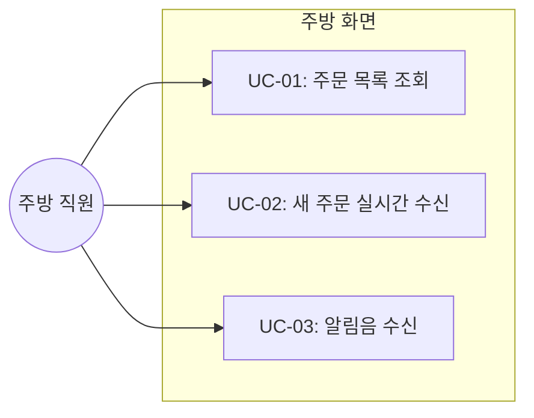

# TSK-04-01 - 주방 주문 현황 페이지 구현 설계 문서

## 문서 정보

| 항목 | 내용 |
|------|------|
| Task ID | TSK-04-01 |
| 문서 버전 | 1.0 |
| 작성일 | 2026-01-02 |
| 상태 | 작성중 |
| 카테고리 | development |

---

## 1. 개요

### 1.1 배경 및 문제 정의

**현재 상황:**
- 테이블 오더 MVP 시스템에서 고객이 주문을 생성하면 주방에서 확인할 방법이 없음
- 주문 API와 WebSocket 통신 기반이 구현되어 있음 (TSK-01-03, TSK-02-02)

**해결하려는 문제:**
- 주방 직원이 실시간으로 들어오는 주문을 확인할 수 있어야 함
- 새 주문 발생 시 알림을 통해 즉각 인지할 수 있어야 함
- 주문 정보(테이블 번호, 메뉴, 수량, 경과 시간)를 한눈에 파악할 수 있어야 함

### 1.2 목적 및 기대 효과

**목적:**
- 주방 직원이 대기/조리중 주문을 실시간으로 확인하는 KDS(Kitchen Display System) 화면 구현

**기대 효과:**
- 주문 접수 즉시 주방에서 확인 가능
- 알림음으로 새 주문 놓치지 않음
- 주문 경과 시간 표시로 우선순위 판단 용이

### 1.3 범위

**포함:**
- /kitchen 페이지 구현
- OrderCard 컴포넌트 (테이블 번호, 메뉴, 수량, 경과 시간)
- 대기/조리중 주문 그리드 레이아웃
- WebSocket으로 새 주문 실시간 수신
- 새 주문 시 알림음 재생

**제외:**
- 주문 상태 변경 기능 (TSK-04-02에서 구현)
- 완료 주문 숨김/별도 표시 (TSK-04-02에서 구현)
- 조리시작/조리완료 버튼 (TSK-04-02에서 구현)

### 1.4 참조 문서

| 문서 | 경로 | 관련 섹션 |
|------|------|----------|
| PRD | `.orchay/projects/table-order/prd.md` | 섹션 3.2 주방 화면 (K-001, K-002, K-003) |
| TRD | `.orchay/projects/table-order/trd.md` | 섹션 5 실시간 통신, 섹션 1.3 글래스모피즘 |

---

## 2. 사용자 분석

### 2.1 대상 사용자

| 사용자 유형 | 특성 | 주요 니즈 |
|------------|------|----------|
| 주방 직원 | 조리 담당, 바쁜 환경에서 작업 | 빠른 주문 확인, 명확한 정보 표시 |

### 2.2 사용자 페르소나

**페르소나 1: 주방장 김씨**
- 역할: 주방 책임자, 조리 및 주문 관리
- 목표: 들어오는 주문을 놓치지 않고 효율적으로 처리
- 불만: 기존 종이 주문서는 놓치기 쉽고 정리가 어려움
- 시나리오: 조리 중에도 새 주문이 들어오면 알림음으로 인지하고, 잠시 손을 멈추고 화면에서 주문 내용 확인

---

## 3. 유즈케이스

### 3.1 유즈케이스 다이어그램



### 3.2 유즈케이스 상세

#### UC-01: 주문 목록 조회

| 항목 | 내용 |
|------|------|
| 액터 | 주방 직원 |
| 목적 | 현재 대기/조리중인 주문 확인 |
| 사전 조건 | /kitchen 페이지 접속 |
| 사후 조건 | 주문 목록이 화면에 표시됨 |
| 트리거 | 페이지 로드 |

**기본 흐름:**
1. 주방 직원이 /kitchen 페이지에 접속한다
2. 시스템이 GET /api/kitchen/orders API를 호출한다
3. 대기(pending)/조리중(cooking) 주문 목록을 그리드 형태로 표시한다
4. 각 주문 카드에 테이블 번호, 메뉴, 수량, 주문 경과 시간을 표시한다

**예외 흐름:**
- 2a. API 호출 실패 시:
  - 에러 메시지 "주문을 불러올 수 없습니다. 새로고침 해주세요." 표시
  - 재시도 버튼 제공

#### UC-02: 새 주문 실시간 수신

| 항목 | 내용 |
|------|------|
| 액터 | 주방 직원 (수동) |
| 목적 | 새 주문 즉시 확인 |
| 사전 조건 | /kitchen 페이지 접속, WebSocket 연결됨 |
| 사후 조건 | 새 주문이 목록에 추가됨 |
| 트리거 | 고객이 주문 생성 |

**기본 흐름:**
1. 페이지 로드 시 WebSocket에 연결하고 kitchen 룸에 조인한다
2. 고객이 주문을 생성하면 서버가 order:new 이벤트를 kitchen 룸에 브로드캐스트한다
3. 주방 화면에서 order:new 이벤트를 수신한다
4. 새 주문 카드가 목록에 즉시 추가된다

#### UC-03: 알림음 수신

| 항목 | 내용 |
|------|------|
| 액터 | 주방 직원 (수동) |
| 목적 | 새 주문 인지 |
| 사전 조건 | 새 주문 수신 |
| 사후 조건 | 알림음 재생됨 |
| 트리거 | order:new 이벤트 수신 |

**기본 흐름:**
1. order:new 이벤트 수신 시 알림음을 재생한다
2. 브라우저 오디오 정책에 따라 첫 사용자 인터랙션 후 소리 재생

---

## 4. 사용자 시나리오

### 4.1 시나리오 1: 주방 화면 접속 및 주문 확인

**상황 설명:**
주방장이 영업 시작 전 주방 모니터에서 /kitchen 페이지를 열어 대기 중인 주문을 확인한다.

**단계별 진행:**

| 단계 | 사용자 행동 | 시스템 반응 | 사용자 기대 |
|------|-----------|------------|------------|
| 1 | /kitchen URL 접속 | 페이지 로딩, API 호출 | 빠른 로딩 |
| 2 | 화면 확인 | 대기/조리중 주문 카드 그리드 표시 | 한눈에 주문 파악 |
| 3 | 주문 카드 확인 | 테이블 번호, 메뉴, 수량, 경과 시간 표시 | 명확한 정보 |

**성공 조건:**
- 주문 목록이 3초 이내 로딩
- 카드에 필요한 모든 정보 표시

### 4.2 시나리오 2: 새 주문 실시간 수신

**상황 설명:**
조리 중인 주방장에게 새로운 주문이 들어온다.

**단계별 진행:**

| 단계 | 사용자 행동 | 시스템 반응 | 사용자 기대 |
|------|-----------|------------|------------|
| 1 | (조리 중) | 고객이 5번 테이블에서 주문 | - |
| 2 | - | 알림음 재생 | 새 주문 인지 |
| 3 | 화면 확인 | 새 주문 카드가 목록에 추가 | 즉시 확인 |
| 4 | 주문 내용 확인 | 테이블 5, 김치찌개 1, 공기밥 2 | 정확한 정보 |

**성공 조건:**
- 주문 생성 후 1초 이내 화면에 표시
- 알림음이 정상 재생

### 4.3 시나리오 3: 연결 오류 상황

**상황 설명:**
네트워크 문제로 WebSocket 연결이 끊어진다.

**단계별 진행:**

| 단계 | 사용자 행동 | 시스템 반응 | 복구 방법 |
|------|-----------|------------|----------|
| 1 | (화면 확인 중) | 연결 끊김 | - |
| 2 | - | 자동 재연결 시도 | 대기 |
| 3 | - | 연결 복원 시 kitchen 룸 재조인 | 정상 동작 |

---

## 5. 화면 설계

### 5.1 화면 흐름도

```mermaid
flowchart LR
    A[/kitchen 접속] --> B[주문 목록 로딩]
    B --> C[주문 그리드 표시]
    C --> D[새 주문 수신]
    D --> C
```

### 5.2 화면별 상세

#### 화면 1: 주방 주문 현황 (/kitchen)

**화면 목적:**
주방 직원이 대기/조리중인 주문을 한눈에 확인하고 관리하는 KDS 화면

**진입 경로:**
- 직접 URL 접속: /kitchen
- 주방 전용 모니터에서 상시 표시

**와이어프레임:**
```
┌─────────────────────────────────────────────────────────────────────┐
│  주방 주문 현황                                              [연결됨] │
├─────────────────────────────────────────────────────────────────────┤
│                                                                     │
│  ┌─────────────┐  ┌─────────────┐  ┌─────────────┐  ┌─────────────┐│
│  │  테이블 3    │  │  테이블 5    │  │  테이블 1    │  │  테이블 7    ││
│  │ ─────────── │  │ ─────────── │  │ ─────────── │  │ ─────────── ││
│  │ 김치찌개 x1 │  │ 된장찌개 x2 │  │ 비빔밥   x1 │  │ 불고기   x2 ││
│  │ 공기밥   x2 │  │ 공기밥   x2 │  │            │  │ 공기밥   x3 ││
│  │ ─────────── │  │ ─────────── │  │ ─────────── │  │ ─────────── ││
│  │   5분 전    │  │   3분 전    │  │   1분 전    │  │   방금 전   ││
│  │            │  │            │  │            │  │            ││
│  └─────────────┘  └─────────────┘  └─────────────┘  └─────────────┘│
│                                                                     │
│  ┌─────────────┐                                                   │
│  │  테이블 2    │                                                   │
│  │ ─────────── │                                                   │
│  │ 제육볶음 x1 │                                                   │
│  │ ─────────── │                                                   │
│  │   방금 전   │                                                   │
│  │            │                                                   │
│  └─────────────┘                                                   │
│                                                                     │
└─────────────────────────────────────────────────────────────────────┘
```

**화면 요소 설명:**

| 영역 | 설명 | 사용자 인터랙션 |
|------|------|----------------|
| 헤더 | "주방 주문 현황" 타이틀 + 연결 상태 표시 | 읽기 전용 |
| 주문 카드 그리드 | 대기/조리중 주문 카드 3-4열 반응형 배치 | 조회 (TSK-04-02에서 클릭 추가) |
| 주문 카드 | 테이블 번호, 메뉴 목록, 경과 시간 | 읽기 전용 |

**사용자 행동 시나리오:**
1. 사용자가 화면에 진입하면 현재 대기/조리중 주문 목록을 본다
2. 새 주문이 들어오면 알림음과 함께 카드가 추가된다
3. 경과 시간이 실시간으로 업데이트된다

#### 5.3 OrderCard 컴포넌트

**와이어프레임:**
```
┌─────────────────────┐
│      테이블 3       │  ← 테이블 번호 (강조)
│ ─────────────────── │
│ 김치찌개        x1  │  ← 메뉴명 + 수량
│ 공기밥          x2  │
│ ─────────────────── │
│      5분 전         │  ← 주문 경과 시간
│                     │
│  (상태 버튼 영역)    │  ← TSK-04-02에서 구현
└─────────────────────┘
```

**스타일 적용 (TRD 글래스모피즘):**
- 배경: `backdrop-blur-[16px] bg-white/25`
- 테두리: `border border-white/30`
- 둥근 모서리: `rounded-[1.25rem]`
- 그림자: `shadow-[0_8px_32px_rgba(139,92,246,0.15)]`

### 5.4 반응형 동작

| 화면 크기 | 레이아웃 변화 | 사용자 경험 |
|----------|--------------|------------|
| 데스크톱 (1024px+) | 4열 그리드 | 많은 주문 동시 확인 |
| 태블릿 (768-1023px) | 3열 그리드 | 적당한 카드 크기 |
| 모바일 (767px-) | 2열 그리드 | 작은 화면 대응 |

---

## 6. 인터랙션 설계

### 6.1 사용자 액션과 피드백

| 사용자 액션 | 즉각 피드백 | 결과 피드백 | 에러 피드백 |
|------------|-----------|------------|------------|
| 페이지 접속 | 로딩 스피너 | 주문 목록 표시 | 에러 메시지 + 재시도 |
| 새 주문 수신 | 알림음 | 카드 추가 | - |

### 6.2 상태별 화면 변화

| 상태 | 화면 표시 | 사용자 안내 |
|------|----------|------------|
| 초기 로딩 | 로딩 스피너 | "주문을 불러오는 중..." |
| 주문 없음 | 빈 상태 이미지 | "현재 대기 중인 주문이 없습니다" |
| 연결 끊김 | 헤더에 "연결 끊김" 표시 | 자동 재연결 시도 |
| 새 주문 | 카드 추가 + 알림음 | - |

### 6.3 경과 시간 표시

| 경과 시간 | 표시 형식 |
|----------|----------|
| 1분 미만 | "방금 전" |
| 1-59분 | "N분 전" |
| 1시간 이상 | "N시간 전" |

경과 시간은 1분마다 자동 업데이트

---

## 7. 데이터 요구사항

### 7.1 필요한 데이터

| 데이터 | 설명 | 출처 | 용도 |
|--------|------|------|------|
| 주문 목록 | pending/cooking 상태 주문 | GET /api/kitchen/orders | 초기 로딩 |
| 새 주문 | 실시간 새 주문 정보 | WebSocket order:new | 목록 추가 |
| 주문 항목 | 메뉴명, 수량 | orders.items | 카드 표시 |

### 7.2 데이터 구조

```typescript
// 주문 카드에 필요한 데이터
interface KitchenOrder {
  id: number;
  tableNumber: number;
  status: 'pending' | 'cooking';
  createdAt: string;
  items: {
    menuName: string;
    quantity: number;
  }[];
}
```

### 7.3 API 응답

```typescript
// GET /api/kitchen/orders 응답
{
  orders: KitchenOrder[]
}

// WebSocket order:new 이벤트 데이터
{
  orderId: number;
  tableNumber: number;
  items: { menuId: number; menuName: string; quantity: number; }[];
  createdAt: string;
}
```

---

## 8. 비즈니스 규칙

### 8.1 핵심 규칙

| 규칙 ID | 규칙 설명 | 적용 상황 | 예외 |
|---------|----------|----------|------|
| BR-01 | pending/cooking 상태 주문만 표시 | 목록 조회 | 없음 |
| BR-02 | 새 주문 시 알림음 재생 | order:new 수신 | 브라우저 오디오 정책 |
| BR-03 | 최신 주문이 먼저 표시 (역순) | 목록 정렬 | 없음 |

### 8.2 규칙 상세 설명

**BR-01: 표시 대상 주문**
- completed 상태 주문은 목록에서 제외
- 주문 상태가 변경되면 실시간으로 목록 갱신 (TSK-04-02 연계)

**BR-02: 알림음 재생**
- 브라우저 오디오 정책에 따라 첫 사용자 인터랙션 후 소리 재생 가능
- 화면 첫 클릭 후 알림음 활성화

**BR-03: 정렬 순서**
- 주문 생성 시간 기준 최신 순 정렬
- 새 주문은 목록 맨 앞에 추가

---

## 9. 에러 처리

### 9.1 예상 에러 상황

| 상황 | 원인 | 사용자 메시지 | 복구 방법 |
|------|------|--------------|----------|
| API 호출 실패 | 서버/네트워크 오류 | "주문을 불러올 수 없습니다" | 재시도 버튼 |
| WebSocket 연결 실패 | 서버/네트워크 오류 | "연결 끊김" (헤더 표시) | 자동 재연결 |
| 알림음 재생 실패 | 브라우저 정책 | (무시) | 사용자 인터랙션 후 활성화 |

### 9.2 에러 표시 방식

| 에러 유형 | 표시 위치 | 표시 방법 |
|----------|----------|----------|
| 초기 로딩 실패 | 화면 중앙 | 에러 메시지 + 재시도 버튼 |
| 연결 끊김 | 헤더 우측 | "연결 끊김" 배지 (빨간색) |

---

## 10. 기술 구현 상세

### 10.1 컴포넌트 구조

```
app/kitchen/
├── page.tsx           # 주방 페이지 메인
└── components/
    └── OrderCard.tsx  # 주문 카드 컴포넌트
```

### 10.2 WebSocket 연결

```typescript
// 페이지 로드 시
useEffect(() => {
  const socket = io();

  // kitchen 룸 조인
  socket.emit('join:kitchen');

  // 새 주문 수신
  socket.on('order:new', (order) => {
    setOrders(prev => [order, ...prev]);
    playNotificationSound();
  });

  return () => socket.disconnect();
}, []);
```

### 10.3 알림음 구현

```typescript
// 알림음 재생 함수
function playNotificationSound() {
  const audio = new Audio('/sounds/notification.mp3');
  audio.play().catch(() => {
    // 브라우저 정책으로 재생 실패 시 무시
  });
}
```

### 10.4 경과 시간 계산

```typescript
// 경과 시간 포맷
function formatElapsedTime(createdAt: string): string {
  const diff = Date.now() - new Date(createdAt).getTime();
  const minutes = Math.floor(diff / 60000);

  if (minutes < 1) return '방금 전';
  if (minutes < 60) return `${minutes}분 전`;
  return `${Math.floor(minutes / 60)}시간 전`;
}
```

---

## 11. 연관 문서

> 상세 테스트 명세 및 요구사항 추적은 별도 문서에서 관리합니다.

| 문서 | 경로 | 용도 |
|------|------|------|
| 요구사항 추적 매트릭스 | `025-traceability-matrix.md` | PRD → 설계 → 테스트 양방향 추적 |
| 테스트 명세서 | `026-test-specification.md` | 단위/E2E/매뉴얼 테스트 상세 정의 |

---

## 12. 구현 범위

### 12.1 영향받는 영역

| 영역 | 변경 내용 | 영향도 |
|------|----------|--------|
| app/kitchen/ | 새 페이지 생성 | 신규 |
| components/OrderCard.tsx | 새 컴포넌트 생성 | 신규 |
| public/sounds/ | 알림음 파일 추가 | 신규 |

### 12.2 의존성

| 의존 항목 | 이유 | 상태 |
|----------|------|------|
| TSK-01-03 | 주문 API (GET /api/kitchen/orders) | 완료 필요 |
| TSK-02-02 | WebSocket 이벤트 (order:new) | 완료 필요 |

### 12.3 제약 사항

| 제약 | 설명 | 대응 방안 |
|------|------|----------|
| 브라우저 오디오 정책 | 사용자 인터랙션 없이 소리 재생 불가 | 첫 클릭 후 활성화 안내 |

---

## 13. 체크리스트

### 13.1 설계 완료 확인

- [x] 문제 정의 및 목적 명확화
- [x] 사용자 분석 완료
- [x] 유즈케이스 정의 완료
- [x] 사용자 시나리오 작성 완료
- [x] 화면 설계 완료 (와이어프레임)
- [x] 인터랙션 설계 완료
- [x] 데이터 요구사항 정의 완료
- [x] 비즈니스 규칙 정의 완료
- [x] 에러 처리 정의 완료

### 13.2 연관 문서 작성

- [ ] 요구사항 추적 매트릭스 작성 (→ `025-traceability-matrix.md`)
- [ ] 테스트 명세서 작성 (→ `026-test-specification.md`)

### 13.3 구현 준비

- [x] 구현 우선순위 결정
- [x] 의존성 확인 완료 (TSK-01-03, TSK-02-02)
- [x] 제약 사항 검토 완료

---

## 변경 이력

| 버전 | 일자 | 작성자 | 변경 내용 |
|------|------|--------|----------|
| 1.0 | 2026-01-02 | Claude | 최초 작성 |
