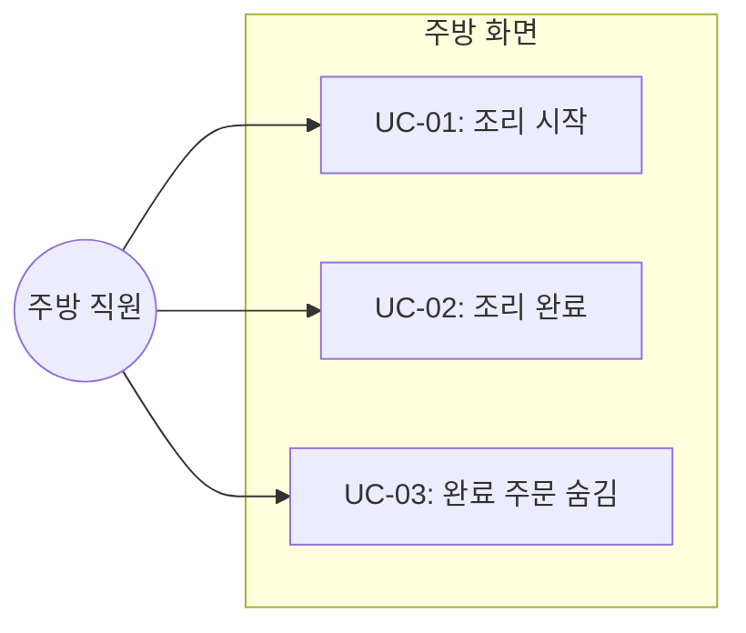
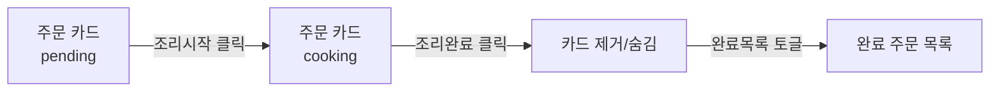

# TSK-04-02 - 주문 상태 관리 기능 구현 설계 문서

## 문서 정보

| 항목 | 내용 |
|------|------|
| Task ID | TSK-04-02 |
| 문서 버전 | 1.0 |
| 작성일 | 2026-01-02 |
| 상태 | 작성중 |
| 카테고리 | development |
| 도메인 | frontend |

---

## 1. 개요

### 1.1 배경 및 문제 정의

**현재 상황:**
- TSK-04-01에서 주방 주문 현황 페이지(/kitchen)가 구현됨
- 주문 카드에 테이블 번호, 메뉴명, 수량, 주문 시간이 표시됨
- 새 주문 실시간 수신 및 알림음 재생 기능 구현됨

**해결하려는 문제:**
- 주방 직원이 주문 상태를 변경할 수 있는 UI가 없음
- pending → cooking → completed 상태 전이를 위한 버튼이 없음
- 완료된 주문을 화면에서 정리하는 기능이 없음

### 1.2 목적 및 기대 효과

**목적:**
- 주방 직원이 주문 상태를 실시간으로 관리할 수 있게 함
- 상태 변경 시 고객에게 실시간으로 알림 전송

**기대 효과:**
- 주방 직원의 효율적인 주문 처리 가능
- 고객이 주문 상태를 실시간으로 확인 가능
- 완료된 주문 정리로 화면 가독성 향상

### 1.3 범위

**포함:**
- 조리 시작 버튼 (pending → cooking)
- 조리 완료 버튼 (cooking → completed)
- 완료된 주문 숨김/별도 표시
- 상태별 카드 UI 스타일 변경

**제외:**
- 주문 취소 기능 (MVP 이후)
- 개별 메뉴 항목별 상태 관리 (MVP 이후)

### 1.4 참조 문서

| 문서 | 경로 | 관련 섹션 |
|------|------|----------|
| PRD | `.orchay/projects/table-order/prd.md` | K-010, K-011, K-012 |
| TRD | `.orchay/projects/table-order/trd.md` | 섹션 1.3, 5 |

---

## 2. 사용자 분석

### 2.1 대상 사용자

| 사용자 유형 | 특성 | 주요 니즈 |
|------------|------|----------|
| 주방 직원 | 조리 담당, 터치 인터페이스 사용 | 빠르고 직관적인 상태 변경 |

### 2.2 사용자 페르소나

**페르소나 1: 주방장 김씨**
- 역할: 주방 조리 담당
- 목표: 주문을 순차적으로 처리하고 상태를 빠르게 업데이트
- 불만: 현재 주문 상태를 변경할 방법이 없음
- 시나리오: 주문이 들어오면 조리 시작 버튼을 누르고, 완료 시 조리 완료 버튼을 누름

---

## 3. 유즈케이스

### 3.1 유즈케이스 다이어그램



### 3.2 유즈케이스 상세

#### UC-01: 조리 시작

| 항목 | 내용 |
|------|------|
| 액터 | 주방 직원 |
| 목적 | 대기 중인 주문의 조리를 시작함 |
| 사전 조건 | 주문이 pending 상태 |
| 사후 조건 | 주문이 cooking 상태로 변경, 고객에게 알림 |
| 트리거 | [조리시작] 버튼 클릭 |

**기본 흐름:**
1. 주방 직원이 대기 중인 주문 카드를 확인한다
2. [조리시작] 버튼을 클릭한다
3. 시스템이 PATCH /api/orders/{id}/status API를 호출한다
4. 주문 상태가 cooking으로 변경된다
5. 카드 UI가 조리중 상태로 업데이트된다
6. WebSocket을 통해 고객에게 상태 변경 알림이 전송된다

**예외 흐름:**
- 3a. API 호출 실패 시:
  - 에러 메시지 표시
  - 버튼 상태 복원

#### UC-02: 조리 완료

| 항목 | 내용 |
|------|------|
| 액터 | 주방 직원 |
| 목적 | 조리 중인 주문을 완료 처리함 |
| 사전 조건 | 주문이 cooking 상태 |
| 사후 조건 | 주문이 completed 상태로 변경, 고객에게 알림 |
| 트리거 | [조리완료] 버튼 클릭 |

**기본 흐름:**
1. 주방 직원이 조리 중인 주문 카드를 확인한다
2. [조리완료] 버튼을 클릭한다
3. 시스템이 PATCH /api/orders/{id}/status API를 호출한다
4. 주문 상태가 completed로 변경된다
5. 카드가 완료 목록으로 이동하거나 숨겨진다
6. WebSocket을 통해 고객에게 상태 변경 알림이 전송된다

#### UC-03: 완료 주문 숨김

| 항목 | 내용 |
|------|------|
| 액터 | 주방 직원 |
| 목적 | 완료된 주문을 화면에서 정리함 |
| 사전 조건 | 주문이 completed 상태 |
| 사후 조건 | 주문 카드가 메인 그리드에서 제거됨 |
| 트리거 | 조리 완료 버튼 클릭 후 자동 또는 별도 토글 |

**기본 흐름:**
1. 주문이 completed 상태가 되면 자동으로 메인 그리드에서 제거된다
2. (선택) 완료 목록 토글 시 별도 영역에서 확인 가능

---

## 4. 사용자 시나리오

### 4.1 시나리오 1: 주문 처리 전체 플로우

**상황 설명:**
주방 직원이 새로 들어온 주문을 조리하고 완료 처리하는 전체 과정

**단계별 진행:**

| 단계 | 사용자 행동 | 시스템 반응 | 사용자 기대 |
|------|-----------|------------|------------|
| 1 | 새 주문 카드 확인 | pending 상태 카드 표시, 알림음 재생 | 주문 내용 확인 가능 |
| 2 | [조리시작] 클릭 | API 호출, 카드 스타일 변경 | 조리중 상태로 변경됨 |
| 3 | 조리 진행 | 카드가 cooking 스타일 유지 | 진행 중임을 시각적으로 확인 |
| 4 | [조리완료] 클릭 | API 호출, 카드 제거/이동 | 화면에서 정리됨 |

**성공 조건:**
- 상태 변경이 즉시 반영됨
- 고객에게 실시간 알림 전송됨
- 완료 주문이 화면에서 정리됨

### 4.2 시나리오 2: API 호출 실패

**상황 설명:**
네트워크 오류로 상태 변경 API 호출이 실패하는 경우

**단계별 진행:**

| 단계 | 사용자 행동 | 시스템 반응 | 복구 방법 |
|------|-----------|------------|----------|
| 1 | [조리시작] 클릭 | 로딩 표시 | - |
| 2 | - | API 실패, 에러 메시지 표시 | 재시도 버튼 또는 자동 재시도 |
| 3 | 재시도 클릭 | API 재호출 | 성공 시 정상 처리 |

---

## 5. 화면 설계

### 5.1 화면 흐름도



### 5.2 화면별 상세

#### 화면 1: 주문 카드 (pending 상태)

**화면 목적:**
대기 중인 주문을 표시하고 조리 시작 버튼 제공

**와이어프레임:**
```
┌─────────────────────────────────┐
│ ┌─────────────────────────────┐ │
│ │  테이블 3                    │ │
│ │  ─────────────────────────  │ │
│ │  김치찌개    x1              │ │
│ │  공기밥      x2              │ │
│ │  ─────────────────────────  │ │
│ │  5분 전                      │ │
│ │                              │ │
│ │  ┌────────────────────────┐ │ │
│ │  │      조리시작           │ │ │
│ │  │   (Primary Button)     │ │ │
│ │  └────────────────────────┘ │ │
│ └─────────────────────────────┘ │
└─────────────────────────────────┘
```

**화면 요소 설명:**

| 영역 | 설명 | 사용자 인터랙션 |
|------|------|----------------|
| 테이블 번호 | 주문이 들어온 테이블 | 표시만 |
| 메뉴 목록 | 주문 항목과 수량 | 표시만 |
| 주문 시간 | 상대 시간 (N분 전) | 표시만 |
| 조리시작 버튼 | Primary 스타일 | 클릭 시 cooking 상태로 전환 |

#### 화면 2: 주문 카드 (cooking 상태)

**화면 목적:**
조리 중인 주문을 표시하고 조리 완료 버튼 제공

**와이어프레임:**
```
┌─────────────────────────────────┐
│ ┌─────────────────────────────┐ │
│ │  테이블 3         [조리중]   │ │  ← 상태 배지 추가
│ │  ─────────────────────────  │ │
│ │  김치찌개    x1              │ │
│ │  공기밥      x2              │ │
│ │  ─────────────────────────  │ │
│ │  5분 전                      │ │
│ │                              │ │
│ │  ┌────────────────────────┐ │ │
│ │  │      조리완료           │ │ │  ← 버튼 변경
│ │  │  (Success Button)      │ │ │
│ │  └────────────────────────┘ │ │
│ └─────────────────────────────┘ │  ← 배경색 변경 (Warning)
└─────────────────────────────────┘
```

**스타일 변경:**
- 카드 배경: Warning 색상 (amber) 반투명
- 상태 배지: "조리중" 표시
- 버튼: 조리완료 (Success 스타일)

### 5.3 컴포넌트 설계

#### OrderCard 컴포넌트 수정

```tsx
interface OrderCardProps {
  order: Order;
  onStatusChange: (orderId: number, newStatus: OrderStatus) => void;
}

// 상태별 스타일
const statusStyles = {
  pending: {
    cardBg: 'bg-white/25',
    buttonText: '조리시작',
    buttonStyle: 'bg-gradient-to-r from-primary-500 to-primary-600',
  },
  cooking: {
    cardBg: 'bg-amber-500/15',
    buttonText: '조리완료',
    buttonStyle: 'bg-gradient-to-r from-emerald-500 to-emerald-600',
    badge: { text: '조리중', color: 'bg-amber-500' },
  },
};
```

#### StatusChangeButton 컴포넌트

```tsx
interface StatusChangeButtonProps {
  currentStatus: OrderStatus;
  orderId: number;
  onStatusChange: (orderId: number, newStatus: OrderStatus) => void;
  isLoading?: boolean;
}
```

### 5.4 반응형 동작

| 화면 크기 | 레이아웃 변화 | 사용자 경험 |
|----------|--------------|------------|
| 데스크톱 (1024px+) | 3-4열 그리드, 버튼 크기 유지 | 넓은 화면에서 다수 주문 확인 |
| 태블릿 (768-1023px) | 2-3열 그리드, 버튼 크기 유지 | 터치 인터페이스 고려 |
| 모바일 (767px-) | 1-2열 그리드, 큰 버튼 | 한 손 조작 가능 |

---

## 6. 인터랙션 설계

### 6.1 사용자 액션과 피드백

| 사용자 액션 | 즉각 피드백 | 결과 피드백 | 에러 피드백 |
|------------|-----------|------------|------------|
| 조리시작 클릭 | 버튼 로딩 스피너 | 카드 스타일 변경 | 토스트 에러 |
| 조리완료 클릭 | 버튼 로딩 스피너 | 카드 페이드 아웃 | 토스트 에러 |

### 6.2 상태별 화면 변화

| 상태 | 화면 표시 | 사용자 안내 |
|------|----------|------------|
| API 호출 중 | 버튼에 스피너 표시, 비활성화 | - |
| 상태 변경 성공 | 카드 스타일 즉시 변경 | (조용한 성공) |
| API 오류 | 버튼 원래 상태 복원 | "상태 변경 실패. 다시 시도해주세요." |

### 6.3 애니메이션

| 상황 | 애니메이션 | 지속 시간 |
|------|----------|----------|
| pending → cooking | 배경색 트랜지션 | 200ms |
| cooking → completed | 페이드 아웃 + 슬라이드 업 | 300ms |
| 버튼 호버 | scale(1.02) + shadow 증가 | 150ms |

---

## 7. 데이터 요구사항

### 7.1 필요한 데이터

| 데이터 | 설명 | 출처 | 용도 |
|--------|------|------|------|
| Order | 주문 정보 | GET /api/kitchen/orders | 카드 렌더링 |
| OrderStatus | 주문 상태 (pending/cooking/completed) | API 응답 | 버튼/스타일 결정 |

### 7.2 API 호출

#### PATCH /api/orders/{id}/status

**요청:**
```json
{
  "status": "cooking" | "completed"
}
```

**응답:**
```json
{
  "success": true,
  "order": {
    "id": 1,
    "status": "cooking",
    "updatedAt": "2026-01-02T10:30:00Z"
  }
}
```

### 7.3 상태 전이 규칙

| 현재 상태 | 허용 전이 | 버튼 |
|----------|----------|------|
| pending | cooking | 조리시작 |
| cooking | completed | 조리완료 |
| completed | (없음) | (버튼 없음) |

---

## 8. 비즈니스 규칙

### 8.1 핵심 규칙

| 규칙 ID | 규칙 설명 | 적용 상황 | 예외 |
|---------|----------|----------|------|
| BR-01 | pending → cooking만 허용 | 조리시작 버튼 클릭 | 없음 |
| BR-02 | cooking → completed만 허용 | 조리완료 버튼 클릭 | 없음 |
| BR-03 | completed 상태는 메인 그리드에서 제거 | 상태 변경 후 | 완료목록 토글 시 표시 |

### 8.2 규칙 상세 설명

**BR-01: 상태 전이 제한 (pending → cooking)**

설명: 대기 중인 주문만 조리 시작 가능. 이미 조리 중이거나 완료된 주문은 조리시작 불가.

예시:
- pending 주문에 [조리시작] 버튼 표시
- cooking/completed 주문에는 [조리시작] 버튼 미표시

**BR-03: 완료 주문 자동 숨김**

설명: 조리 완료된 주문은 메인 그리드에서 자동으로 제거되어 화면 가독성 유지.

---

## 9. 에러 처리

### 9.1 예상 에러 상황

| 상황 | 원인 | 사용자 메시지 | 복구 방법 |
|------|------|--------------|----------|
| API 실패 | 네트워크 오류 | "상태 변경에 실패했습니다. 다시 시도해주세요." | 버튼 재활성화, 재시도 가능 |
| 잘못된 상태 전이 | 서버 측 검증 실패 | "현재 상태에서 변경할 수 없습니다." | 페이지 새로고침 안내 |
| 주문 없음 | 이미 삭제됨 | "주문을 찾을 수 없습니다." | 카드 제거 |

### 9.2 에러 표시 방식

| 에러 유형 | 표시 위치 | 표시 방법 |
|----------|----------|----------|
| API 오류 | 화면 상단 | 토스트 알림 (3초 후 자동 사라짐) |
| 네트워크 오류 | 화면 상단 | 토스트 알림 + 재시도 안내 |

---

## 10. 연관 문서

| 문서 | 경로 | 용도 |
|------|------|------|
| TSK-04-01 설계 | `../TSK-04-01/010-design.md` | 주방 주문 현황 페이지 기반 |
| 요구사항 추적 매트릭스 | `025-traceability-matrix.md` | PRD → 설계 → 테스트 양방향 추적 |
| 테스트 명세서 | `026-test-specification.md` | 단위/E2E/매뉴얼 테스트 상세 정의 |

---

## 11. 구현 범위

### 11.1 영향받는 영역

| 영역 | 변경 내용 | 영향도 |
|------|----------|--------|
| OrderCard 컴포넌트 | 버튼 추가, 상태별 스타일 | 높음 |
| /kitchen 페이지 | 상태 변경 핸들러 추가 | 중간 |
| PATCH /api/orders/{id}/status | 기존 API 사용 | 낮음 |

### 11.2 의존성

| 의존 항목 | 이유 | 상태 |
|----------|------|------|
| TSK-04-01 | 주방 페이지 및 OrderCard 컴포넌트 | 진행중 |
| TSK-01-03 | 주문 상태 변경 API | 완료 |
| TSK-02-02 | WebSocket 이벤트 송수신 | 완료 |

### 11.3 제약 사항

| 제약 | 설명 | 대응 방안 |
|------|------|----------|
| Optimistic UI 미적용 | MVP 단순화 | API 응답 후 UI 업데이트 |

---

## 12. 구현 상세

### 12.1 파일 변경 목록

| 파일 | 변경 내용 |
|------|----------|
| `components/OrderCard.tsx` | 상태별 버튼 및 스타일 추가 |
| `app/kitchen/page.tsx` | 상태 변경 핸들러, 완료 주문 필터링 |

### 12.2 OrderCard 컴포넌트 수정

```tsx
// components/OrderCard.tsx
interface OrderCardProps {
  order: Order;
  onStatusChange?: (orderId: number, newStatus: 'cooking' | 'completed') => void;
}

export default function OrderCard({ order, onStatusChange }: OrderCardProps) {
  const [isLoading, setIsLoading] = useState(false);

  const handleStatusChange = async () => {
    const newStatus = order.status === 'pending' ? 'cooking' : 'completed';
    setIsLoading(true);
    try {
      const res = await fetch(`/api/orders/${order.id}/status`, {
        method: 'PATCH',
        headers: { 'Content-Type': 'application/json' },
        body: JSON.stringify({ status: newStatus }),
      });
      if (!res.ok) throw new Error('상태 변경 실패');
      onStatusChange?.(order.id, newStatus);
    } catch (error) {
      // 토스트 에러 표시
      alert('상태 변경에 실패했습니다. 다시 시도해주세요.');
    } finally {
      setIsLoading(false);
    }
  };

  // 상태별 스타일
  const cardBg = order.status === 'cooking'
    ? 'bg-amber-500/15 border-amber-400/30'
    : 'bg-white/25 border-white/30';

  const buttonConfig = order.status === 'pending'
    ? { text: '조리시작', style: 'from-primary-500 to-primary-600' }
    : { text: '조리완료', style: 'from-emerald-500 to-emerald-600' };

  return (
    <div className={`backdrop-blur-[16px] ${cardBg} border rounded-[1.25rem] p-6 transition-all`}>
      <div className="flex justify-between items-center mb-4">
        <h3 className="text-lg font-semibold">테이블 {order.tableNumber}</h3>
        {order.status === 'cooking' && (
          <span className="px-2 py-1 bg-amber-500 text-white text-xs rounded-full">
            조리중
          </span>
        )}
      </div>

      <div className="border-t border-white/20 pt-4 mb-4">
        {order.items.map((item, idx) => (
          <div key={idx} className="flex justify-between text-sm mb-1">
            <span>{item.menuName}</span>
            <span>x{item.quantity}</span>
          </div>
        ))}
      </div>

      <div className="text-xs text-gray-500 mb-4">
        {formatRelativeTime(order.createdAt)}
      </div>

      {order.status !== 'completed' && (
        <button
          onClick={handleStatusChange}
          disabled={isLoading}
          className={`w-full py-2.5 rounded-xl text-white font-medium
            bg-gradient-to-r ${buttonConfig.style}
            shadow-[0_4px_16px_rgba(139,92,246,0.30)]
            hover:shadow-[0_6px_24px_rgba(139,92,246,0.40)]
            transition-all disabled:opacity-50`}
        >
          {isLoading ? '처리중...' : buttonConfig.text}
        </button>
      )}
    </div>
  );
}
```

### 12.3 /kitchen 페이지 수정

```tsx
// app/kitchen/page.tsx
export default function KitchenPage() {
  const [orders, setOrders] = useState<Order[]>([]);

  // 완료되지 않은 주문만 필터링
  const activeOrders = orders.filter(o => o.status !== 'completed');

  const handleStatusChange = (orderId: number, newStatus: 'cooking' | 'completed') => {
    setOrders(prev => prev.map(o =>
      o.id === orderId ? { ...o, status: newStatus } : o
    ));
  };

  return (
    <div className="min-h-screen bg-gradient-to-br from-[#E8DFFF] via-[#F3E8FF] to-[#FFE4F3] p-6">
      <h1 className="text-2xl font-bold mb-6">주방 주문 현황</h1>
      <div className="grid grid-cols-1 md:grid-cols-2 lg:grid-cols-3 xl:grid-cols-4 gap-4">
        {activeOrders.map(order => (
          <OrderCard
            key={order.id}
            order={order}
            onStatusChange={handleStatusChange}
          />
        ))}
      </div>
    </div>
  );
}
```

---

## 13. 체크리스트

### 13.1 설계 완료 확인

- [x] 문제 정의 및 목적 명확화
- [x] 사용자 분석 완료
- [x] 유즈케이스 정의 완료
- [x] 사용자 시나리오 작성 완료
- [x] 화면 설계 완료 (와이어프레임)
- [x] 인터랙션 설계 완료
- [x] 데이터 요구사항 정의 완료
- [x] 비즈니스 규칙 정의 완료
- [x] 에러 처리 정의 완료

### 13.2 구현 준비

- [x] 구현 우선순위 결정
- [x] 의존성 확인 완료
- [x] 제약 사항 검토 완료

---

## 변경 이력

| 버전 | 일자 | 작성자 | 변경 내용 |
|------|------|--------|----------|
| 1.0 | 2026-01-02 | Claude | 최초 작성 |
