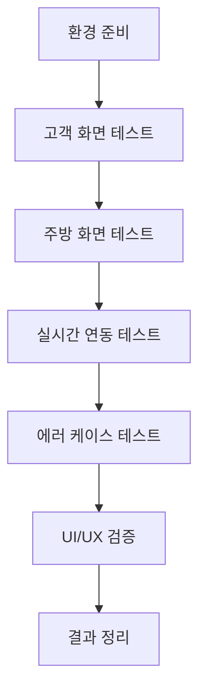

# TSK-05-01 - E2E 플로우 테스트 설계 문서

## 문서 정보

| 항목 | 내용 |
|------|------|
| Task ID | TSK-05-01 |
| 문서 버전 | 1.0 |
| 작성일 | 2026-01-02 |
| 상태 | 작성중 |
| 카테고리 | development |

---

## 1. 개요

### 1.1 배경 및 문제 정의

**현재 상황:**
- WP-00 ~ WP-04까지 개별 모듈 구현이 완료됨
- 고객 화면, 주방 화면, API, WebSocket 등 개별 컴포넌트는 단위 테스트/통합 테스트 진행됨
- 전체 시스템을 연결한 End-to-End 검증이 필요함

**해결하려는 문제:**
- 개별 모듈이 통합되었을 때 예상대로 동작하는지 검증
- 고객 → 주방 → 고객 실시간 연동이 정상 동작하는지 확인
- MVP 완료 기준 충족 여부 확인

### 1.2 목적 및 기대 효과

**목적:**
- 테이블 오더 MVP의 핵심 플로우를 End-to-End로 검증
- PRD 섹션 8 MVP 완료 기준 달성 여부 확인
- 발견된 버그 수정 및 UI 개선 진행

**기대 효과:**
- MVP 품질 보증
- 실제 사용 시나리오에서의 시스템 안정성 확인
- 릴리스 준비 완료

### 1.3 범위

**포함:**
- 전체 E2E 플로우 수동 테스트
- 고객 → 주방 → 고객 실시간 연동 확인
- 발견된 버그 수정 및 UI 개선

**제외:**
- 자동화된 E2E 테스트 (향후 과제)
- 성능/부하 테스트
- 다중 동시 사용자 테스트

### 1.4 참조 문서

| 문서 | 경로 | 관련 섹션 |
|------|------|----------|
| PRD | `.orchay/projects/table-order/prd.md` | 섹션 8 MVP 완료 기준 |
| TRD | `.orchay/projects/table-order/trd.md` | 전체 |

---

## 2. 테스트 대상 분석

### 2.1 MVP 완료 기준 (PRD 섹션 8)

| 기준 ID | 완료 기준 | 검증 방법 |
|---------|----------|----------|
| MVP-01 | 고객이 QR 코드로 메뉴 화면에 접속 가능 | `/order?table={id}` 접속 확인 |
| MVP-02 | 고객이 메뉴를 장바구니에 담고 주문 가능 | 장바구니 추가 → 주문 전송 테스트 |
| MVP-03 | 주문이 주방 화면에 실시간으로 표시 | 고객 주문 후 주방 화면 확인 |
| MVP-04 | 주방에서 조리 상태를 변경할 수 있음 | 조리시작/완료 버튼 테스트 |
| MVP-05 | 상태 변경이 고객 화면에 실시간 반영 | 상태 변경 후 고객 화면 확인 |

### 2.2 테스트 환경

| 구성 요소 | 설명 |
|----------|------|
| 서버 | Next.js Custom Server (Socket.io 통합) |
| 클라이언트 | 크롬 브라우저 2개 이상 (고객/주방) |
| 데이터베이스 | SQLite (`./data/database.db`) |
| 시드 데이터 | 테이블 5개, 카테고리 3개, 메뉴 10개 |

---

## 3. 테스트 시나리오

### 3.1 E2E 테스트 흐름도



### 3.2 테스트 케이스 상세

#### TC-01: 고객 메뉴 화면 접속

| 항목 | 내용 |
|------|------|
| 테스트 ID | TC-01 |
| MVP 기준 | MVP-01 |
| 사전 조건 | 서버 실행 중, 시드 데이터 존재 |
| 테스트 단계 | 1. 브라우저에서 `/order?table=5` 접속<br/>2. 테이블 번호 표시 확인<br/>3. 카테고리 목록 확인<br/>4. 메뉴 목록 확인 |
| 예상 결과 | - 상단에 "테이블 5" 표시<br/>- 3개 카테고리 표시<br/>- 10개 메뉴 표시 |
| 합격 기준 | 모든 데이터 정상 표시 |

#### TC-02: 장바구니 기능

| 항목 | 내용 |
|------|------|
| 테스트 ID | TC-02 |
| MVP 기준 | MVP-02 |
| 사전 조건 | TC-01 완료 |
| 테스트 단계 | 1. 메뉴 카드 클릭<br/>2. 장바구니 패널 확인<br/>3. +/- 버튼으로 수량 조절<br/>4. 총 금액 확인 |
| 예상 결과 | - 메뉴 장바구니에 추가<br/>- 수량 조절 가능<br/>- 총 금액 실시간 계산 |
| 합격 기준 | 장바구니 모든 기능 동작 |

#### TC-03: 주문 전송

| 항목 | 내용 |
|------|------|
| 테스트 ID | TC-03 |
| MVP 기준 | MVP-02 |
| 사전 조건 | TC-02 완료 (장바구니에 메뉴 있음) |
| 테스트 단계 | 1. "주문하기" 버튼 클릭<br/>2. 주문 완료 확인<br/>3. 주문 상태 페이지 이동 확인 |
| 예상 결과 | - 주문 성공 메시지<br/>- `/status?table=5` 이동<br/>- 주문 목록에 방금 주문 표시 |
| 합격 기준 | 주문 생성 및 페이지 이동 성공 |

#### TC-04: 주방 화면 실시간 수신

| 항목 | 내용 |
|------|------|
| 테스트 ID | TC-04 |
| MVP 기준 | MVP-03 |
| 사전 조건 | 주방 브라우저에서 `/kitchen` 접속 |
| 테스트 단계 | 1. 고객 브라우저에서 새 주문 전송<br/>2. 주방 화면에서 주문 카드 확인<br/>3. 알림음 재생 확인 |
| 예상 결과 | - 새 주문 카드 즉시 추가<br/>- 테이블 번호, 메뉴, 수량 표시<br/>- 알림음 재생 |
| 합격 기준 | 실시간 주문 수신 및 알림 동작 |

#### TC-05: 조리 상태 변경

| 항목 | 내용 |
|------|------|
| 테스트 ID | TC-05 |
| MVP 기준 | MVP-04 |
| 사전 조건 | TC-04 완료 (주방에 주문 카드 있음) |
| 테스트 단계 | 1. "조리시작" 버튼 클릭<br/>2. 카드 UI 변화 확인<br/>3. "조리완료" 버튼 클릭<br/>4. 카드 처리 확인 |
| 예상 결과 | - pending → cooking 상태 변경<br/>- 카드 배경색 변경<br/>- cooking → completed 상태 변경<br/>- 완료 카드 숨김/별도 표시 |
| 합격 기준 | 상태 변경 모든 단계 동작 |

#### TC-06: 고객 실시간 상태 반영

| 항목 | 내용 |
|------|------|
| 테스트 ID | TC-06 |
| MVP 기준 | MVP-05 |
| 사전 조건 | 고객 `/status` 페이지 접속, TC-05 진행 |
| 테스트 단계 | 1. 주방에서 "조리시작" 클릭<br/>2. 고객 화면 상태 배지 확인<br/>3. 주방에서 "조리완료" 클릭<br/>4. 고객 화면 상태 배지 확인 |
| 예상 결과 | - 접수됨 → 조리중 즉시 반영<br/>- 조리중 → 완료 즉시 반영 |
| 합격 기준 | WebSocket 통한 실시간 UI 업데이트 |

#### TC-07: 품절 메뉴 처리

| 항목 | 내용 |
|------|------|
| 테스트 ID | TC-07 |
| MVP 기준 | C-012 |
| 사전 조건 | DB에 품절 메뉴 존재 |
| 테스트 단계 | 1. 고객 메뉴 화면 접속<br/>2. 품절 메뉴 카드 확인<br/>3. 품절 메뉴 클릭 시도 |
| 예상 결과 | - 품절 메뉴 회색 처리<br/>- 클릭 불가 또는 무반응 |
| 합격 기준 | 품절 메뉴 비활성화 동작 |

#### TC-08: 추가 주문 플로우

| 항목 | 내용 |
|------|------|
| 테스트 ID | TC-08 |
| MVP 기준 | PRD 고객 화면 흐름 |
| 사전 조건 | TC-03 완료 (주문 상태 페이지) |
| 테스트 단계 | 1. "추가 주문" 버튼 클릭<br/>2. 메뉴 화면 이동 확인<br/>3. 새 메뉴 추가 후 주문<br/>4. 주문 상태 페이지에서 두 주문 모두 표시 확인 |
| 예상 결과 | - 메뉴 화면 이동<br/>- 새 주문 생성<br/>- 기존/신규 주문 모두 표시 |
| 합격 기준 | 추가 주문 전체 플로우 동작 |

---

## 4. 에러 케이스 테스트

### 4.1 네트워크 에러

| 테스트 ID | 상황 | 예상 동작 |
|----------|------|----------|
| ERR-01 | 서버 연결 끊김 | 재연결 시도 또는 에러 메시지 |
| ERR-02 | API 요청 실패 | 에러 메시지 표시 |
| ERR-03 | WebSocket 연결 끊김 | 자동 재연결 |

### 4.2 데이터 에러

| 테스트 ID | 상황 | 예상 동작 |
|----------|------|----------|
| ERR-04 | 잘못된 테이블 번호 | 에러 페이지 또는 메시지 |
| ERR-05 | 빈 장바구니로 주문 시도 | 주문 버튼 비활성화 또는 경고 |
| ERR-06 | 존재하지 않는 주문 조회 | 빈 목록 또는 에러 메시지 |

---

## 5. UI/UX 검증

### 5.1 글래스모피즘 디자인 확인

| 확인 항목 | 체크 기준 |
|----------|----------|
| 카드 디자인 | backdrop-blur, bg-white/25, border-white/30 |
| 버튼 디자인 | Primary 그라데이션, 호버 효과 |
| 배경 | 그라데이션 배경 (E8DFFF → F3E8FF → FFE4F3) |
| 그림자 | 보라색 톤 그림자 |

### 5.2 반응형 동작

| 화면 크기 | 확인 항목 |
|----------|----------|
| 데스크톱 | 그리드 레이아웃, 충분한 여백 |
| 태블릿 | 2-3열 그리드 |
| 모바일 | 1-2열 그리드, 터치 친화적 버튼 크기 |

### 5.3 접근성 확인

| 확인 항목 | 체크 기준 |
|----------|----------|
| 색상 대비 | 텍스트 가독성 |
| 버튼 크기 | 최소 터치 영역 44x44px |
| 포커스 표시 | 키보드 탐색 시 포커스 링 |

---

## 6. 테스트 실행 계획

### 6.1 테스트 순서

| 순서 | 단계 | 테스트 케이스 |
|------|------|-------------|
| 1 | 환경 준비 | 서버 시작, 시드 데이터 확인 |
| 2 | 고객 화면 기본 | TC-01, TC-02, TC-07 |
| 3 | 주문 플로우 | TC-03 |
| 4 | 주방 화면 | TC-04, TC-05 |
| 5 | 실시간 연동 | TC-06 |
| 6 | 추가 플로우 | TC-08 |
| 7 | 에러 케이스 | ERR-01 ~ ERR-06 |
| 8 | UI/UX 검증 | 글래스모피즘, 반응형 |

### 6.2 테스트 도구

| 도구 | 용도 |
|------|------|
| Chrome DevTools | 네트워크, 콘솔 모니터링 |
| 다중 브라우저/탭 | 고객/주방 동시 테스트 |
| 모바일 시뮬레이터 | 반응형 테스트 |

---

## 7. 버그 수정 및 개선 사항

### 7.1 버그 분류

| 심각도 | 설명 | 처리 |
|--------|------|------|
| Critical | 핵심 플로우 차단 | 즉시 수정 |
| Major | 주요 기능 오동작 | 수정 후 재테스트 |
| Minor | 사소한 UI 이슈 | 시간 허용 시 수정 |

### 7.2 버그 리포트 형식

```
[버그 ID] 제목
- 심각도: Critical/Major/Minor
- 재현 단계:
  1. ...
  2. ...
- 예상 결과:
- 실제 결과:
- 스크린샷: (있으면)
```

---

## 8. 수용 기준 (Acceptance Criteria)

### 8.1 테스트 통과 기준

| 기준 | 상세 |
|------|------|
| MVP 완료 기준 | MVP-01 ~ MVP-05 모두 통과 |
| 핵심 테스트 | TC-01 ~ TC-08 모두 통과 |
| Critical 버그 | 0건 |
| Major 버그 | 0건 (또는 수정 완료) |

### 8.2 체크리스트

- [ ] 고객이 QR 코드로 메뉴 화면에 접속 가능
- [ ] 고객이 메뉴를 장바구니에 담고 주문 가능
- [ ] 주문이 주방 화면에 실시간으로 표시
- [ ] 주방에서 조리 상태를 변경할 수 있음
- [ ] 상태 변경이 고객 화면에 실시간으로 반영
- [ ] 글래스모피즘 UI 적용 확인
- [ ] 품절 메뉴 비활성화 동작
- [ ] 추가 주문 플로우 동작
- [ ] 에러 케이스 적절한 처리
- [ ] 반응형 레이아웃 동작

---

## 9. 연관 문서

| 문서 | 경로 | 용도 |
|------|------|------|
| 요구사항 추적 매트릭스 | `025-traceability-matrix.md` | PRD → 테스트 추적 |
| 테스트 명세서 | `026-test-specification.md` | 상세 테스트 케이스 |

---

## 변경 이력

| 버전 | 일자 | 작성자 | 변경 내용 |
|------|------|--------|----------|
| 1.0 | 2026-01-02 | Claude | 최초 작성 |
