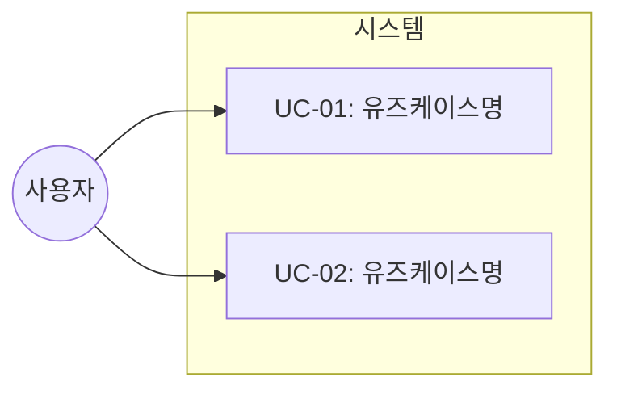
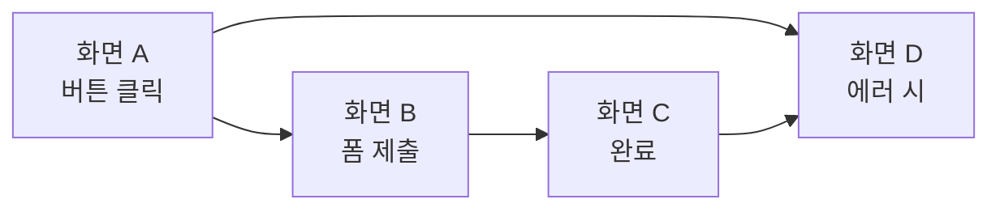
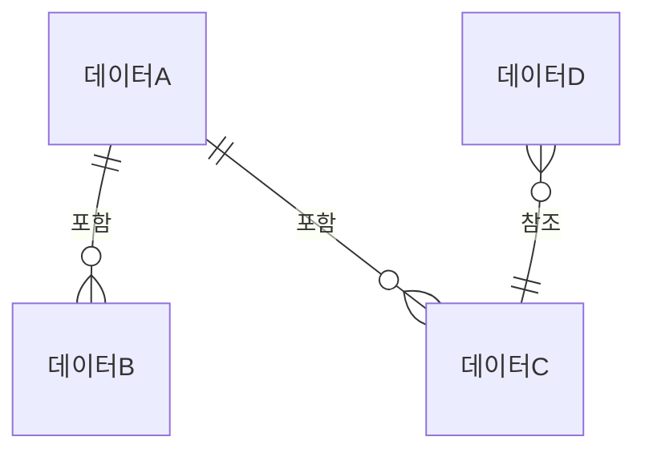

# {Task ID} - {Task Title} 설계 문서

## 문서 정보

| 항목 | 내용 |
|------|------|
| Task ID | {TSK-XX-XX} |
| 문서 버전 | 1.0 |
| 작성일 | {YYYY-MM-DD} |
| 상태 | 작성중 \| 리뷰중 \| 승인됨 |
| 카테고리 | development \| defect \| infrastructure |

---

## 1. 개요

### 1.1 배경 및 문제 정의

{현재 상황에서 어떤 문제가 있는지, 왜 이 기능이 필요한지 설명}

**현재 상황:**
- {현재 어떻게 동작하는지}
- {사용자가 겪는 불편함}

**해결하려는 문제:**
- {구체적인 문제점}
- {개선이 필요한 이유}

### 1.2 목적 및 기대 효과

**목적:**
- {이 Task가 달성하려는 목표}

**기대 효과:**
- {사용자 관점의 개선점}
- {비즈니스 관점의 이점}

### 1.3 범위

**포함:**
- {구현할 기능}
- {영향받는 화면/모듈}

**제외:**
- {이번에 다루지 않는 항목}
- {향후 과제로 남기는 항목}

### 1.4 참조 문서

| 문서 | 경로 | 관련 섹션 |
|------|------|----------|
| PRD | `.orchay/projects/{project}/prd.md` | {관련 섹션} |
| TRD | `.orchay/projects/{project}/trd.md` | {관련 섹션} |

---

## 2. 사용자 분석

### 2.1 대상 사용자

| 사용자 유형 | 특성 | 주요 니즈 |
|------------|------|----------|
| {사용자 A} | {역할, 기술 수준} | {무엇을 원하는가} |
| {사용자 B} | {역할, 기술 수준} | {무엇을 원하는가} |

### 2.2 사용자 페르소나

**페르소나 1: {이름}**
- 역할: {직책/역할}
- 목표: {달성하고자 하는 것}
- 불만: {현재 겪는 어려움}
- 시나리오: {일반적인 사용 상황}

---

## 3. 유즈케이스

### 3.1 유즈케이스 다이어그램



### 3.2 유즈케이스 상세

#### UC-01: {유즈케이스명}

| 항목 | 내용 |
|------|------|
| 액터 | {누가 사용하는가} |
| 목적 | {무엇을 달성하려 하는가} |
| 사전 조건 | {시작 전에 필요한 상태} |
| 사후 조건 | {완료 후의 상태} |
| 트리거 | {언제 시작되는가} |

**기본 흐름:**
1. 사용자가 {액션}을 수행한다
2. 시스템이 {응답}을 보여준다
3. 사용자가 {다음 액션}을 수행한다
4. 시스템이 {결과}를 처리한다
5. 사용자에게 {최종 결과}가 표시된다

**대안 흐름:**
- 2a. 만약 {조건}이면:
  - 시스템이 {다른 응답}을 보여준다
  - 사용자가 {대안 액션}을 수행한다

**예외 흐름:**
- 3a. 만약 {오류 상황}이 발생하면:
  - 시스템이 {에러 메시지}를 표시한다
  - 사용자가 {복구 액션}을 수행할 수 있다

#### UC-02: {유즈케이스명}

| 항목 | 내용 |
|------|------|
| 액터 | {누가 사용하는가} |
| 목적 | {무엇을 달성하려 하는가} |
| 사전 조건 | {시작 전에 필요한 상태} |
| 사후 조건 | {완료 후의 상태} |
| 트리거 | {언제 시작되는가} |

**기본 흐름:**
1. {단계별 설명}

---

## 4. 사용자 시나리오

### 4.1 시나리오 1: {시나리오명}

**상황 설명:**
{사용자가 어떤 상황에서 이 기능을 사용하게 되는지 스토리텔링}

**단계별 진행:**

| 단계 | 사용자 행동 | 시스템 반응 | 사용자 기대 |
|------|-----------|------------|------------|
| 1 | {무엇을 하는가} | {어떻게 반응하는가} | {무엇을 기대하는가} |
| 2 | {무엇을 하는가} | {어떻게 반응하는가} | {무엇을 기대하는가} |
| 3 | {무엇을 하는가} | {어떻게 반응하는가} | {무엇을 기대하는가} |

**성공 조건:**
- {시나리오가 성공했다고 판단하는 기준}

### 4.2 시나리오 2: {에러 상황 시나리오}

**상황 설명:**
{오류가 발생하는 상황 설명}

**단계별 진행:**

| 단계 | 사용자 행동 | 시스템 반응 | 복구 방법 |
|------|-----------|------------|----------|
| 1 | {무엇을 하는가} | {에러 발생} | {어떻게 복구하는가} |

---

## 5. 화면 설계

### 5.1 화면 흐름도



### 5.2 화면별 상세

#### 화면 1: {화면명}

**화면 목적:**
{이 화면이 왜 필요한지, 사용자가 무엇을 하는 곳인지}

**진입 경로:**
- {메뉴에서 어떻게 접근하는지}
- {어떤 상황에서 이 화면을 보게 되는지}

**와이어프레임:**
```
┌─────────────────────────────────────────────────────────┐
│  ┌─────────────────────────────────────────────────┐   │
│  │                    헤더 영역                     │   │
│  │  로고          검색창             사용자 메뉴   │   │
│  └─────────────────────────────────────────────────┘   │
│                                                         │
│  ┌───────────────────────────────────────────────────┐ │
│  │                                                   │ │
│  │                  주요 콘텐츠 영역                  │ │
│  │                                                   │ │
│  │   {이 영역에서 사용자가 보게 될 내용 설명}        │ │
│  │                                                   │ │
│  │   [액션 버튼 1]    [액션 버튼 2]                  │ │
│  │                                                   │ │
│  └───────────────────────────────────────────────────┘ │
│                                                         │
└─────────────────────────────────────────────────────────┘
```

**화면 요소 설명:**

| 영역 | 설명 | 사용자 인터랙션 |
|------|------|----------------|
| 헤더 | {역할 설명} | {클릭 시 동작} |
| 주요 콘텐츠 | {표시할 정보} | {편집/선택 등} |
| 액션 버튼 1 | {버튼 역할} | {클릭 시 결과} |
| 액션 버튼 2 | {버튼 역할} | {클릭 시 결과} |

**사용자 행동 시나리오:**
1. 사용자가 화면에 진입하면 {무엇}을 본다
2. {영역}을 클릭하면 {결과}가 나타난다
3. {버튼}을 누르면 {화면/동작}으로 이동한다

#### 화면 2: {화면명}

**화면 목적:**
{설명}

**와이어프레임:**
```
{레이아웃}
```

### 5.3 반응형 동작

| 화면 크기 | 레이아웃 변화 | 사용자 경험 |
|----------|--------------|------------|
| 데스크톱 (1024px+) | {레이아웃 설명} | {UX 설명} |
| 태블릿 (768-1023px) | {레이아웃 설명} | {UX 설명} |
| 모바일 (767px-) | {레이아웃 설명} | {UX 설명} |

---

## 6. 인터랙션 설계

### 6.1 사용자 액션과 피드백

| 사용자 액션 | 즉각 피드백 | 결과 피드백 | 에러 피드백 |
|------------|-----------|------------|------------|
| 버튼 클릭 | 버튼 눌림 효과 | 성공 메시지 | 에러 메시지 |
| 폼 입력 | 입력 중 표시 | 유효성 체크 | 필드별 오류 |
| 드래그 | 드래그 중 시각화 | 위치 변경 | 불가 영역 표시 |

### 6.2 상태별 화면 변화

| 상태 | 화면 표시 | 사용자 안내 |
|------|----------|------------|
| 초기 로딩 | 로딩 인디케이터 | "불러오는 중..." |
| 데이터 없음 | 빈 상태 이미지 | "항목이 없습니다. 추가해보세요." |
| 에러 발생 | 에러 메시지 박스 | "문제가 발생했습니다. 다시 시도해주세요." |
| 성공 완료 | 성공 토스트 | "저장되었습니다." |

### 6.3 키보드/접근성

| 기능 | 키보드 단축키 | 스크린 리더 안내 |
|------|-------------|-----------------|
| 저장 | Ctrl+S | "저장 버튼" |
| 취소 | Esc | "취소하고 이전으로" |
| 다음 항목 | Tab | "{항목명}으로 이동" |

---

## 7. 데이터 요구사항

### 7.1 필요한 데이터

| 데이터 | 설명 | 출처 | 용도 |
|--------|------|------|------|
| {데이터 A} | {무엇인지} | {어디서 오는지} | {왜 필요한지} |
| {데이터 B} | {무엇인지} | {어디서 오는지} | {왜 필요한지} |

### 7.2 데이터 관계



**관계 설명:**
- {데이터 A}는 여러 개의 {데이터 B}를 포함한다
- {데이터 D}는 {데이터 C}를 참조한다
- {추가 설명}

### 7.3 데이터 유효성 규칙

| 데이터 필드 | 규칙 | 위반 시 메시지 |
|------------|------|---------------|
| 이름 | 필수, 2-50자 | "이름은 2-50자 사이로 입력해주세요" |
| 이메일 | 이메일 형식 | "올바른 이메일 형식이 아닙니다" |
| 날짜 | 오늘 이후 | "과거 날짜는 선택할 수 없습니다" |

---

## 8. 비즈니스 규칙

### 8.1 핵심 규칙

| 규칙 ID | 규칙 설명 | 적용 상황 | 예외 |
|---------|----------|----------|------|
| BR-01 | {규칙 내용} | {언제 적용} | {예외 상황} |
| BR-02 | {규칙 내용} | {언제 적용} | {예외 상황} |

### 8.2 규칙 상세 설명

**BR-01: {규칙명}**

설명: {규칙이 왜 필요한지, 어떤 상황에서 적용되는지 자세히 설명}

예시:
- 상황 A일 때: {어떻게 동작}
- 상황 B일 때: {어떻게 동작}

**BR-02: {규칙명}**

설명: {상세 설명}

---

## 9. 에러 처리

### 9.1 예상 에러 상황

| 상황 | 원인 | 사용자 메시지 | 복구 방법 |
|------|------|--------------|----------|
| 입력 오류 | 필수 값 누락 | "필수 항목을 입력해주세요" | 필드 포커스 이동 |
| 중복 데이터 | 이미 존재 | "이미 등록된 항목입니다" | 수정 또는 취소 |
| 권한 없음 | 접근 불가 | "권한이 없습니다" | 관리자 문의 안내 |
| 연결 오류 | 네트워크 | "연결 상태를 확인해주세요" | 재시도 버튼 |

### 9.2 에러 표시 방식

| 에러 유형 | 표시 위치 | 표시 방법 |
|----------|----------|----------|
| 필드 오류 | 해당 필드 하단 | 빨간색 텍스트 |
| 폼 전체 오류 | 폼 상단 | 경고 박스 |
| 시스템 오류 | 화면 상단 | 토스트 알림 |

---

## 10. 연관 문서

> 상세 테스트 명세 및 요구사항 추적은 별도 문서에서 관리합니다.

| 문서 | 경로 | 용도 |
|------|------|------|
| 요구사항 추적 매트릭스 | `025-traceability-matrix.md` | PRD → 설계 → 테스트 양방향 추적 |
| 테스트 명세서 | `026-test-specification.md` | 단위/E2E/매뉴얼 테스트 상세 정의 |

---

## 11. 구현 범위

### 11.1 영향받는 영역

| 영역 | 변경 내용 | 영향도 |
|------|----------|--------|
| {화면/모듈 A} | {무엇이 바뀌는지} | 높음/중간/낮음 |
| {화면/모듈 B} | {무엇이 바뀌는지} | 높음/중간/낮음 |

### 11.2 의존성

| 의존 항목 | 이유 | 상태 |
|----------|------|------|
| {Task/기능} | {왜 의존하는지} | 완료/진행중/대기 |

### 11.3 제약 사항

| 제약 | 설명 | 대응 방안 |
|------|------|----------|
| {제약 1} | {상세 설명} | {어떻게 대응할지} |

---

## 12. 체크리스트

### 12.1 설계 완료 확인

- [ ] 문제 정의 및 목적 명확화
- [ ] 사용자 분석 완료
- [ ] 유즈케이스 정의 완료
- [ ] 사용자 시나리오 작성 완료
- [ ] 화면 설계 완료 (와이어프레임)
- [ ] 인터랙션 설계 완료
- [ ] 데이터 요구사항 정의 완료
- [ ] 비즈니스 규칙 정의 완료
- [ ] 에러 처리 정의 완료

### 12.2 연관 문서 작성

- [ ] 요구사항 추적 매트릭스 작성 (→ `025-traceability-matrix.md`)
- [ ] 테스트 명세서 작성 (→ `026-test-specification.md`)

### 12.3 구현 준비

- [ ] 구현 우선순위 결정
- [ ] 의존성 확인 완료
- [ ] 제약 사항 검토 완료

---

## 변경 이력

| 버전 | 일자 | 작성자 | 변경 내용 |
|------|------|--------|----------|
| 1.0 | {YYYY-MM-DD} | {작성자} | 최초 작성 |
