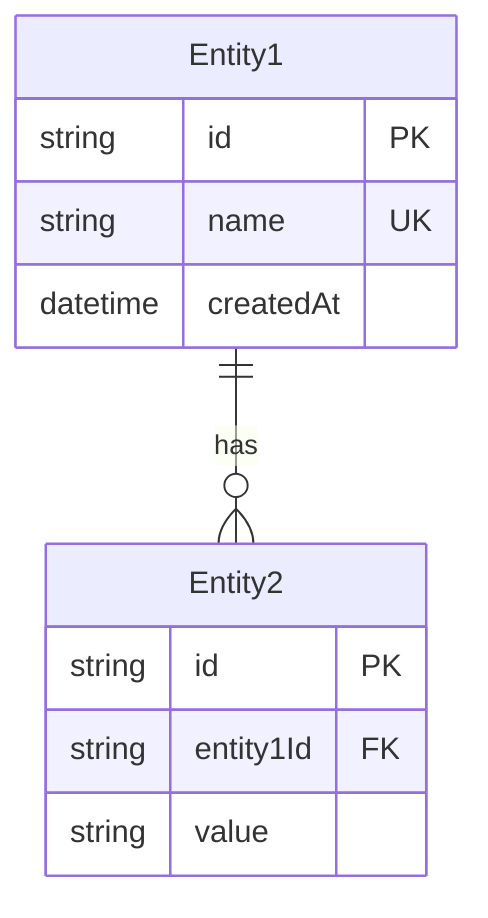
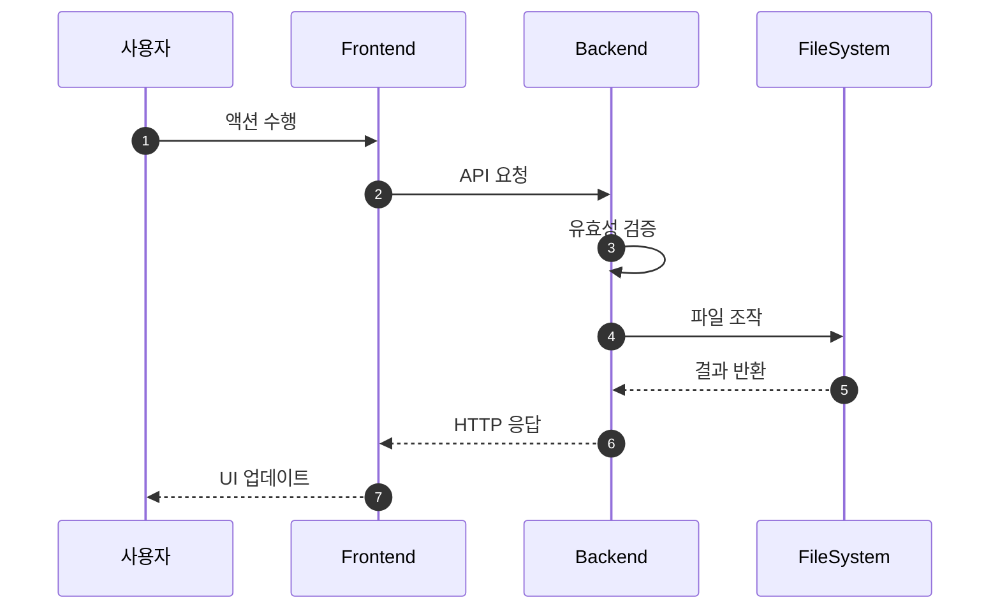
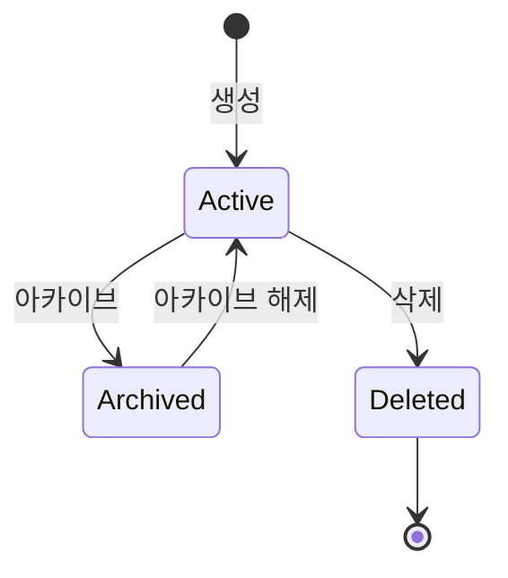

# 상세설계 템플릿 (020-detail-design.md)

**Template Version:** 3.0.0 — **Last Updated:** 2025-12-10

> **설계 규칙**
> * *기능 중심 설계*에 집중한다.
> * 실제 소스코드(전체 또는 일부)는 **절대 포함하지 않는다**.
> * 작성 후 **상위 문서(PRD, TRD, 기본설계)와 비교**하여 차이가 있으면 **즉시 중단 → 차이 설명 → 지시 대기**.
> * **다이어그램 규칙**
>   * 프로세스: **Mermaid**만 사용
>   * UI 레이아웃: **Text Art(ASCII)** → 바로 아래 **SVG 개념도**를 순차 배치
>
> **분할 문서**
> * 요구사항 추적성: `025-traceability-matrix.md`
> * 테스트 명세: `026-test-specification.md`

---

## 0. 문서 메타데이터

| 항목 | 내용 |
|------|------|
| Task ID | [Task-ID] |
| Task명 | [Task명] |
| Category | development |
| 상태 | [dd] 상세설계 |
| 작성일 | [오늘 날짜] |
| 작성자 | [작성자] |

### 상위 문서 참조

| 문서 유형 | 경로 | 참조 섹션 |
|----------|------|----------|
| PRD | `.orchay/[project]/prd.md` | 섹션 [번호] |
| TRD | `.orchay/[project]/trd.md` | 전체 |
| 기본설계 | `010-basic-design.md` | 전체 |
| 상위 Activity | [ACT-ID]: [Activity 이름] | - |
| 상위 Work Package | [WP-ID]: [Work Package 이름] | - |

### 분할 문서 참조

| 문서 유형 | 파일명 | 목적 |
|----------|--------|------|
| 추적성 매트릭스 | `025-traceability-matrix.md` | 요구사항 ↔ 설계 ↔ 테스트 추적 |
| 테스트 명세 | `026-test-specification.md` | 테스트 시나리오, 데이터, data-testid |

---

## 1. 일관성 검증 결과

> 상위 문서와의 일관성 검증 결과를 기록합니다.

### 1.1 검증 요약

| 구분 | 통과 | 경고 | 실패 |
|------|------|------|------|
| PRD ↔ 기본설계 | X개 | Y개 | Z개 |
| 기본설계 ↔ 상세설계 | X개 | Y개 | Z개 |
| TRD ↔ 상세설계 | X개 | Y개 | Z개 |

### 1.2 검증 상세

| 검증 ID | 검증 항목 | 결과 | 비고 |
|---------|----------|------|------|
| CHK-PRD-01 | 기능 요구사항 완전성 | ✅ PASS | - |
| CHK-PRD-02 | 비즈니스 규칙 일치성 | ✅ PASS | - |
| CHK-PRD-03 | 용어 일관성 | ⚠️ WARN | [세부 내용] |
| CHK-BD-01 | 기능 요구사항 완전성 | ✅ PASS | - |
| CHK-BD-02 | 비즈니스 규칙 구현 명세 | ✅ PASS | - |
| CHK-BD-03 | 데이터 모델 일치성 | ✅ PASS | - |
| CHK-TRD-01 | 기술 스택 준수 | ✅ PASS | - |
| CHK-TRD-02 | 아키텍처 패턴 준수 | ✅ PASS | - |

---

## 2. 목적 및 범위

### 2.1 목적
[Task 기술 목표 - 기본설계 기반]

### 2.2 범위

**포함 범위** (기본설계 구현 범위의 기술적 구현 사항):
- [기술 구현 항목 1]
- [기술 구현 항목 2]

**제외 범위** (다른 Task에서 구현):
- [제외 항목 1] → [다른 Task-ID]

---

## 3. 기술 스택

> TRD 기준, 이 Task에서 사용하는 기술만 명시

| 구분 | 기술 | 버전 | 용도 |
|------|------|------|------|
| Frontend | Vue 3 + Nuxt 3 | 3.5.x / 3.18.x | UI 렌더링 |
| UI Framework | PrimeVue | 4.x | 컴포넌트 라이브러리 |
| Styling | TailwindCSS | 3.4.x | 유틸리티 CSS |
| Backend | Nuxt Server Routes | - | API 서버 |
| Data | JSON 파일 (.orchay/) | - | 데이터 저장 |
| Testing | Vitest + Playwright | 2.x / 1.49.x | 테스트 |

---

## 4. 용어/가정/제약

### 4.1 용어 정의
| 용어 | 정의 |
|------|------|
| [용어1] | [정의] |

### 4.2 가정 (Assumptions)
- [가정 1]

### 4.3 제약 (Constraints)
- [제약 1]

---

## 5. 시스템/모듈 구조

> **규칙**: 구현 코드가 아닌 **구조/역할/책임**만 표현

### 5.1 모듈 역할 및 책임

| 모듈 | 역할 | 책임 |
|------|------|------|
| [모듈명] | [역할] | [책임] |

### 5.2 모듈 구조도 (개념)

```
[구조 개념도 - 텍스트로 표현]
예:
├── pages/[resource]/
├── components/[resource]/
├── composables/
├── stores/
└── server/api/[resource]/
```

### 5.3 외부 의존성

| 의존성 | 유형 | 용도 |
|--------|------|------|
| [서비스/라이브러리명] | [API/Library] | [용도] |

---

## 6. 데이터 모델 (개념 수준)

> **규칙**: 코드가 아닌 **개념 수준 ERD와 필드 정의**만 기술

### 6.1 엔티티 정의

#### Entity: [엔티티명]

| 필드명 | 타입 | 필수 | 설명 | 제약조건 |
|--------|------|------|------|----------|
| id | String | Y | 고유 식별자 | PK, CUID |
| name | String | Y | 이름 | 1-100자, Unique |
| description | String | N | 설명 | 최대 1000자 |
| status | Enum | Y | 상태 | active/archived |
| createdAt | DateTime | Y | 생성일시 | 자동생성 |
| updatedAt | DateTime | Y | 수정일시 | 자동갱신 |

### 6.2 관계 다이어그램



### 6.3 인덱스 및 제약조건

| 엔티티 | 인덱스/제약 | 필드 | 목적 |
|--------|------------|------|------|
| [엔티티명] | Unique | [field1, field2] | 복합 유니크 |
| [엔티티명] | Index | [field1] | 조회 성능 |

---

## 7. 인터페이스 계약 (API Contract)

> **규칙**: TypeScript 코드가 아닌 **표 형태의 계약 정의**

### 7.1 엔드포인트 목록

| Method | Endpoint | 설명 | 요구사항 |
|--------|----------|------|----------|
| GET | /api/[resources] | 목록 조회 | FR-001 |
| GET | /api/[resources]/:id | 단건 조회 | FR-002 |
| POST | /api/[resources] | 생성 | FR-003 |
| PUT | /api/[resources]/:id | 수정 | FR-004 |
| DELETE | /api/[resources]/:id | 삭제 | FR-005 |

### 7.2 API 상세: [API명]

**요구사항**: [FR-XXX]

#### 요청 (Request)

| 구분 | 파라미터 | 타입 | 필수 | 설명 | 기본값 |
|------|----------|------|------|------|--------|
| Query | page | number | N | 페이지 번호 | 1 |
| Query | limit | number | N | 페이지 크기 | 20 |
| Body | name | string | Y | 이름 | - |
| Body | description | string | N | 설명 | - |

#### 응답 (Response)

**성공 응답 (200/201)**:

| 필드 | 타입 | 설명 |
|------|------|------|
| data | Object/Array | 응답 데이터 |
| meta | Object | 페이지네이션 정보 (목록 조회 시) |

**에러 응답**:

| 코드 | 에러 코드 | 설명 | 비즈니스 규칙 |
|------|----------|------|--------------|
| 400 | VALIDATION_ERROR | 유효성 검증 실패 | - |
| 404 | NOT_FOUND | 리소스 없음 | - |
| 409 | DUPLICATE_NAME | 중복 이름 | BR-001 |

#### 유효성 검증

| 필드 | 규칙 | 에러 메시지 | 비즈니스 규칙 |
|------|------|------------|--------------|
| name | required, 1-100자 | 이름은 필수이며 1-100자여야 합니다 | - |
| name | unique | 이미 사용 중인 이름입니다 | BR-001 |

---

## 8. 프로세스 흐름

### 8.1 프로세스 설명

> 각 단계에 관련 요구사항 태그 `[FR-XXX]` 병기

1. **단계 1** [FR-001]: [설명]
2. **단계 2** [FR-002]: [설명]
3. **단계 3** [BR-001]: [설명]

### 8.2 시퀀스 다이어그램



### 8.3 상태 다이어그램 (필요 시)



---

## 9. UI 설계

> **규칙**: Text Art(ASCII)로 영역 구성 → SVG 개념도로 시각 배치

### 9.1 화면 목록

| 화면 | 경로 | 목적 | 주요 기능 |
|------|------|------|----------|
| 목록 | /[resource] | 전체 목록 조회 | 검색, 필터, 페이지네이션 |
| 상세 | /[resource]/:id | 상세 정보 확인 | 편집, 삭제, 아카이브 |

### 9.2 목록 화면 레이아웃

```
┌─────────────────────────────────────────────────────────────┐
│ Header                                                       │
├───────────┬─────────────────────────────────────────────────┤
│           │ 페이지 제목                      [+ 생성 버튼]   │
│           ├─────────────────────────────────────────────────┤
│           │ [검색] [필터 드롭다운]                           │
│ Sidebar   ├─────────────────────────────────────────────────┤
│           │ ┌─────────────────────────────────────────────┐ │
│           │ │ 테이블/카드 목록                            │ │
│           │ │                                              │ │
│           │ └─────────────────────────────────────────────┘ │
│           ├─────────────────────────────────────────────────┤
│           │ [< 이전] 페이지 정보 [다음 >]                   │
└───────────┴─────────────────────────────────────────────────┘
```

### 9.3 컴포넌트 구조 (개념)

| 컴포넌트 | 역할 | Props (개념) | Events (개념) |
|----------|------|--------------|---------------|
| List | 목록 표시 | items, loading | select, edit, delete |
| Form | 생성/수정 폼 | initialData, mode | submit, cancel |
| Filter | 검색/필터 | filters | change |

### 9.4 상태 관리 (개념)

| Store | 상태 | Actions |
|-------|------|---------|
| [resource]Store | items, currentItem, loading, pagination, filters | fetchItems, createItem, updateItem, deleteItem |

### 9.5 반응형/접근성 가이드

* **반응형**:
  * `≥ Desktop`: 사이드바 고정, 테이블 전체 표시
  * `Tablet`: 사이드바 축소/토글
  * `Mobile`: 사이드바 오버레이, 카드 뷰 전환

* **접근성**: 포커스 순서, 키보드 내비게이션, ARIA 라벨

---

## 10. 비즈니스 규칙 구현 명세

> 기본설계 BR-XXX 규칙의 구현 방안

| 규칙 ID | 규칙 설명 | 구현 위치(개념) | 구현 방식(개념) | 검증 방법 |
|---------|----------|-----------------|-----------------|-----------|
| BR-001 | 이름 고유성 | Service Layer | 파일 조회 후 예외 발생 | 단위 테스트 |
| BR-002 | 삭제 조건 | Controller | 조건 검증 로직 | E2E 테스트 |

---

## 11. 오류/예외 처리

### 11.1 예상 오류 상황

| 오류 상황 | 오류 코드 | 사용자 메시지 | 복구 전략 |
|----------|----------|--------------|----------|
| 중복 이름 | DUPLICATE_NAME | 이미 사용 중인 이름입니다 | 다른 이름 입력 안내 |
| 리소스 없음 | NOT_FOUND | 요청한 항목을 찾을 수 없습니다 | 목록으로 이동 |
| 파일 접근 오류 | FILE_ACCESS_ERROR | 데이터 접근에 실패했습니다 | 재시도 버튼 제공 |

### 11.2 경계 조건

| 조건 | 처리 방안 |
|------|----------|
| 빈 목록 | Empty State UI 표시 |
| 대량 데이터 | 페이지네이션 적용, 가상 스크롤 검토 |

---

## 12. 구현 체크리스트

### Backend
- [ ] API 엔드포인트 구현
- [ ] 파일 서비스 구현
- [ ] 유효성 검증 로직
- [ ] 에러 핸들링
- [ ] 단위 테스트

### Frontend
- [ ] 페이지 컴포넌트
- [ ] UI 컴포넌트
- [ ] Pinia 스토어
- [ ] Composable
- [ ] API 연동
- [ ] 폼 유효성 검증
- [ ] 로딩/에러 상태 처리
- [ ] E2E 테스트

### 품질
- [ ] 요구사항 추적성 검증 완료 (`025-traceability-matrix.md`)
- [ ] 테스트 명세 작성 완료 (`026-test-specification.md`)
- [ ] 비즈니스 규칙 구현 완료
- [ ] 일관성 검증 통과

---

## 13. 다음 단계

- `/wf:review` 명령어로 설계리뷰 진행

---

## 관련 문서

- 기본설계: `010-basic-design.md`
- 추적성 매트릭스: `025-traceability-matrix.md`
- 테스트 명세: `026-test-specification.md`
- PRD: `.orchay/[project]/prd.md`
- TRD: `.orchay/[project]/trd.md`

---

<!--
author: 장종익 
Template Version History:
- v3.0.0 (2025-12-10): 문서 분할
  - 섹션 2 (요구사항 추적성 매트릭스) → 025-traceability-matrix.md로 분리
  - 섹션 13 (테스트 계획) → 026-test-specification.md로 분리
  - 분할 문서 참조 섹션 추가
  - 섹션 번호 재정렬 (2→목적/범위, 이후 순차 조정)
  - 관련 문서 섹션에 분할 문서 추가

- v2.0.0 (2026-12-07): 신규 생성
  - 기존 detail_design_template.md와 draft.md 템플릿 병합
  - 일관성 검증 결과 섹션 추가
  - 3단계 추적성 매트릭스 (PRD → 기본설계 → 상세설계)
  - 코드 예시 제거, 개념 중심 설계로 전환
  - 상위 문서 참조 섹션 추가
-->
