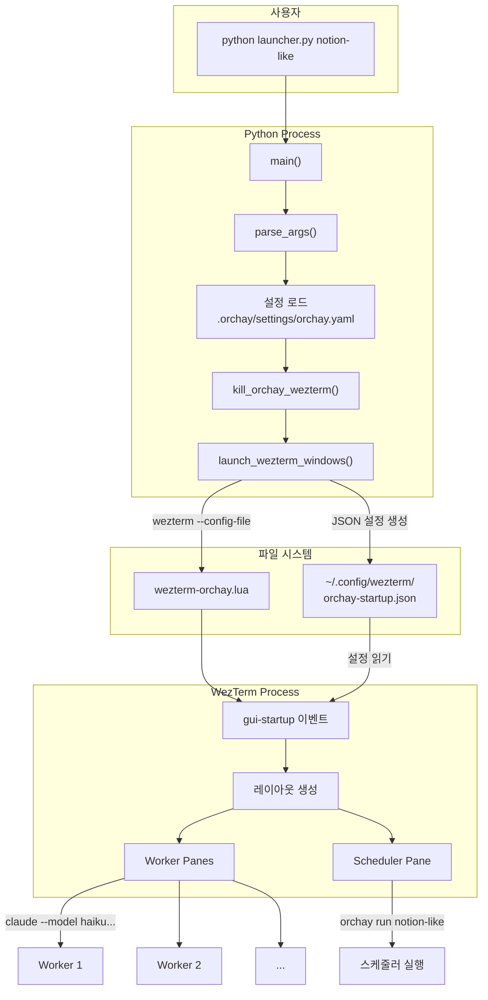
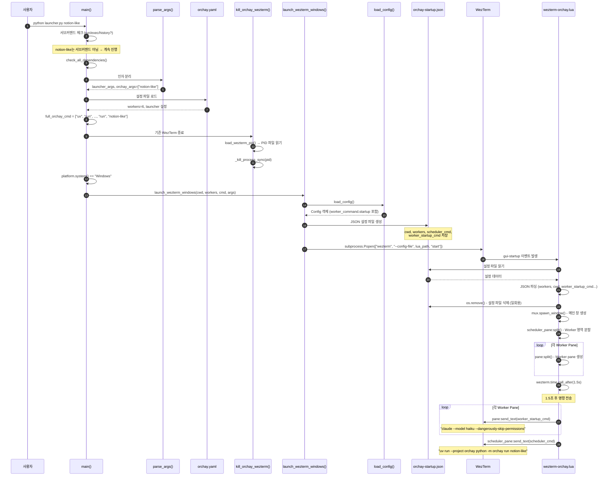
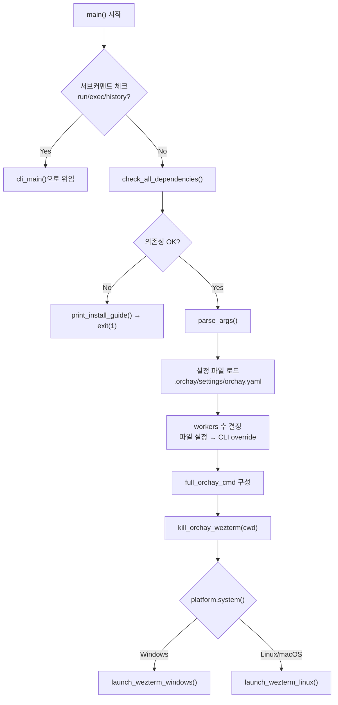
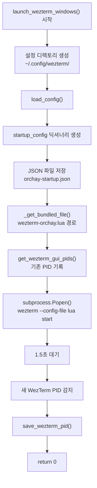
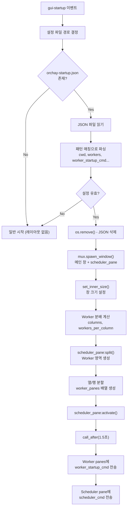
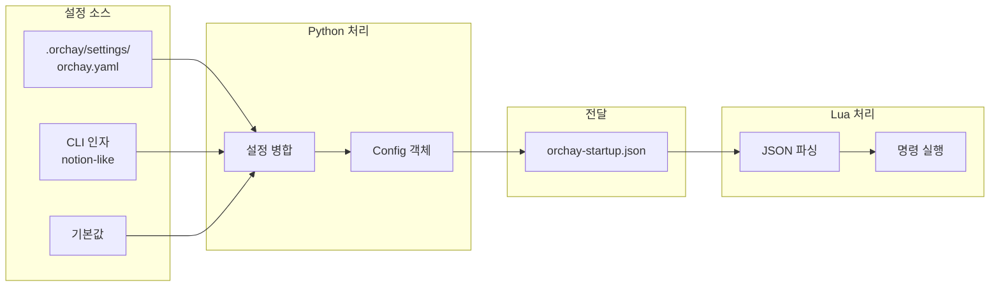
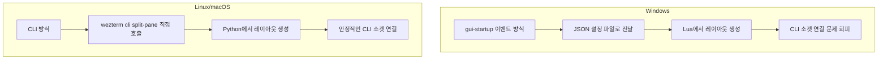

# Launcher 실행 흐름 분석

## 개요

`python launcher.py notion-like` 명령 실행 시 내부 동작을 설명합니다.

---

## 1. 전체 실행 흐름 (High-Level)



---

## 2. 함수 호출 순서 (Sequence Diagram)



---

## 3. 함수별 상세 설명

### 3.1 `main()` (launcher.py:650)



### 3.2 `launch_wezterm_windows()` (launcher.py:308)



### 3.3 `wezterm-orchay.lua` gui-startup 이벤트



---

## 4. 데이터 흐름

### 4.1 설정 데이터 흐름



### 4.2 orchay-startup.json 구조

```json
{
  "cwd": "C:\\project\\orchay",
  "workers": 6,
  "scheduler_cmd": "uv run --project orchay python -m orchay run notion-like",
  "width": 1920,
  "height": 1080,
  "max_rows": 3,
  "scheduler_ratio": 0.45,
  "font_size": 9,
  "worker_startup_cmd": "claude --model haiku --dangerously-skip-permissions"
}
```

---

## 5. 주요 함수 참조

| 함수 | 파일:라인 | 역할 |
|------|-----------|------|
| `main()` | launcher.py:650 | 진입점, 전체 흐름 제어 |
| `parse_args()` | launcher.py:598 | launcher/orchay 인자 분리 |
| `check_all_dependencies()` | launcher.py:100+ | wezterm 등 의존성 체크 |
| `kill_orchay_wezterm()` | launcher.py:268 | 기존 WezTerm 종료 |
| `launch_wezterm_windows()` | launcher.py:308 | Windows 레이아웃 생성 |
| `launch_wezterm_linux()` | launcher.py:418 | Linux/macOS 레이아웃 생성 |
| `load_config()` | utils/config.py:34 | orchay.yaml 로드 |
| `_create_layout_config()` | launcher.py:218 | Worker 수 → 열/행 배치 |

---

## 6. 플랫폼별 차이



**Windows에서 gui-startup 방식을 사용하는 이유:**
- WezTerm CLI 소켓 연결 문제 ([GitHub Issue #4456](https://github.com/wezterm/wezterm/issues/4456))
- Windows에서 `wezterm cli send-text` 등이 불안정

---

## 7. 실행 타임라인

```mermaid
gantt
    title Launcher 실행 타임라인
    dateFormat X
    axisFormat %Ls

    section Python
    main() 시작           :a1, 0, 50ms
    설정 로드             :a2, after a1, 100ms
    kill_orchay_wezterm() :a3, after a2, 500ms
    JSON 생성             :a4, after a3, 50ms
    WezTerm 시작          :a5, after a4, 100ms

    section WezTerm
    프로세스 초기화       :b1, after a5, 500ms
    gui-startup 이벤트    :b2, after b1, 100ms
    레이아웃 생성         :b3, after b2, 300ms
    1.5초 대기            :b4, after b3, 1500ms
    명령 전송             :b5, after b4, 200ms

    section Workers
    Claude 시작           :c1, after b5, 2000ms
    프롬프트 대기         :c2, after c1, 500ms
```



---

## 8. 디버깅 팁

### 로그 파일 위치
```
.orchay/logs/launcher.log
```

### 설정 파일 확인 (Windows)
```powershell
# JSON 설정 파일 (생성 직후 삭제됨)
cat ~/.config/wezterm/orchay-startup.json

# Lua 설정 파일
cat (python -c "from orchay.launcher import _get_bundled_file; print(_get_bundled_file('wezterm-orchay.lua'))")
```

### 환경변수로 상세 로그
```powershell
$env:WEZTERM_LOG='debug'
python launcher.py notion-like
```
